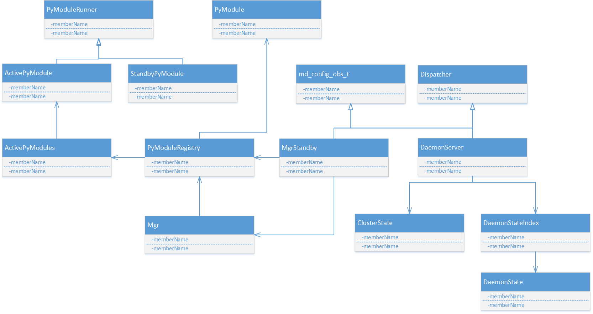
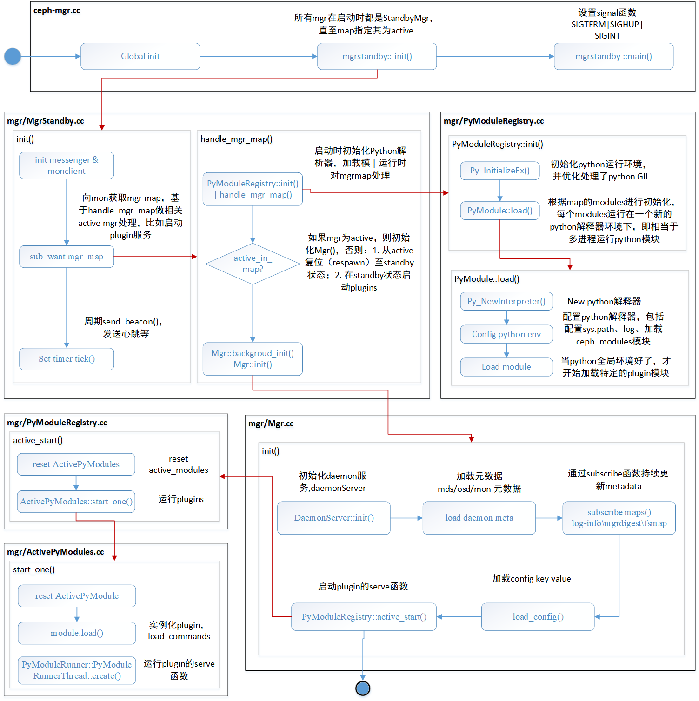
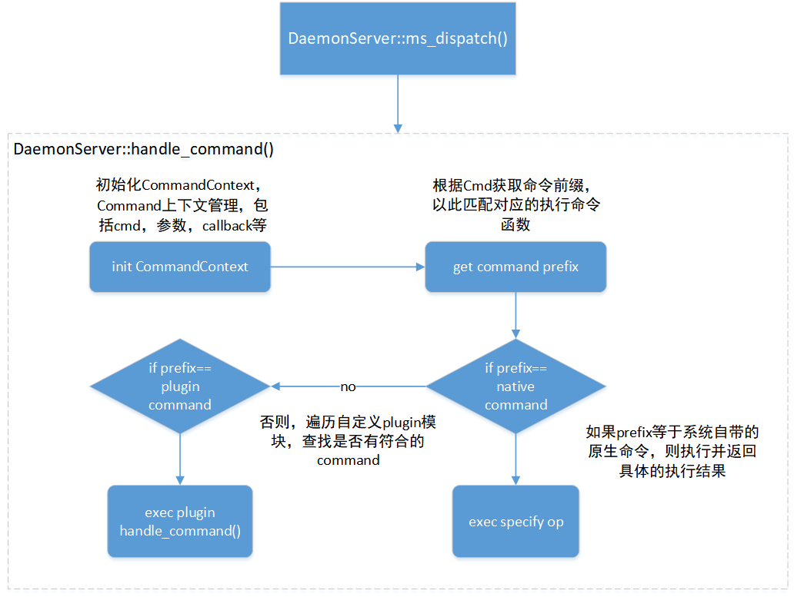

# Ceph Luminous 新组件 Mgr 简介

> ### 导读
>  ceph luminous版本中新增加了一个组件： Ceph Manager Daemon，简称ceph-mgr。 该组件的主要作用是分担和扩展monitor的部分功能，减轻monitor的负担，让更好地管理ceph存储系统。
> 本文档基于luminous版本简单介绍ceph-mgr的源码实现。由于ceph-mgr还在开发完善，可能最新版与本文档部分内容有所出入，但是大体框架上应该是没什么变化的。
> 本文档不介绍ceph-mgr的安装部署与使用，具体请参照官网：[Ceph Manager Daemon](http://docs.ceph.com/docs/master/mgr/)
> 本文档代码基于Luminous 12.2版本进行解析，由于社区存在代码变动，其它版本有可能对不上号，但是整体架构应该不会有太大的变化。

## mgr的实现与用途
ceph-mgr是由C/C++、python以及Cpython等共同编写完成的，mgr的实现使用了大量的[Extending Python with C or C++](https://docs.python.org/2/extending/extending.html)的语法，不熟悉这块的可以先在python官网中科普一下。
由ceph-mgr的实现其实大概可以猜到，其将ceph的部分C/C++实现的接口python化（即以前只能通过调用c/c++接口发送msg获取比如osdmap、monmap等集群状态，现通过mgr可以很方便地拿到。同时，ceph-mgr支持用户自定义的plugin（插件纯python开发，特别方便），用以实现特殊功能。
截至目前为止，ceph-mgr的官方plugins包括：

- Dashboard（WEB界面的管理）、
- Restful API（API方式获取ceph信息，应该与之前的ceph-rest-api功能一致）、
- Zabbix、Prometheus、Influx（这三个实现了ceph的数据收集、监控等功能）

## mgr组件
ceph-mgr的重要类或模块包括：MgrStandy、Mgr、DaemonServer、PyModules、ClusterState、DaemonState等。其主要功能描述如下：

**MgrStandby**
所有mgr服务启动时身份都是standby，唯一作用是包含一个mgr的client端，获取mgrmap及相关msg。在获取了mgr-map发现自己为当前active时，才会初始化mgr主服务进程。当mgrmap中变为非active状态，则shutdown mgr主服务进程，释放资源。

**Mgr**
主要工作是初始化daemonserver、pymodules、clusterstate等主要功能类，并handle standby mgr client的非mgrmap的消息（osdmap、pgmap、fsmap等）。执行了monc->sub_want()函数，注册了定期获取数据操作。

**DaemonServer**
为mgr主要的服务进程，和osd、mds等类似，初始化了一个mgr类型的Messenger，监听有关mgr消息，主要是MSG_PGSTATS、MSG_MGR_REPORT、MSG_MGR_OPEN、MSG_COMMAND。比如执行‘ceph tell mgr {command}’时就被发送到daemonserver中handle_command函数进行处理（包括了native命令和plugin的commands）

**PyModules**
包含ActivePyModule、StandbyPyModules、ActivePyModules、BaseMgrModules、BaseMgrStandbyModules、PyModulesRegistry、PyModuleRunner等类，分别处理mgr处于active和standby时对plugins的处理，并在active时初始化python的运行环境，将plugin模块初始化并加载运行。该类大量使用了python的c++扩展接口。

**ClusterState**
保存了cluster的状态，部分状态在monc中，由mgr类定期更新状态（ms_dispatch）

**DaemonState**
保存了DaemonServer的状态信息

这些类之间的关系如下图所示：

##### 

## Ceph-Mgr 启动过程


图片已经很详细了，文字就不多说了。
mgr基于Active-Standby模式，大体流程就是mgr进程启动时先以MgrStandby身份启动，即所有mgr启动时都是standby，然后通过map知道自己是Active的mgr后，才会启动实际处理程序初始化DaemonServer，监听有关mgr的消息，加载并运行modules（一部分为用户自定义plugins）。

## Mgr的一些功能介绍
mgr提供了常用的几种函数接口，只要重载这些接口，就能开发plugin实现特定功能。以下是官方的介绍，即实现服务器、消息通知、自定义命令等功能：
> **serve:**  member function for server-type modules. This function should block forever.
> **notify:** member function if your module needs to take action when new cluster data is available.
> **handle_command:**  member function if your module exposes CLI commands.

### 编写自定义plugin
下面以简单的自定义命令为例，描述如何编写mgr的plugin。其他功能可自行参考源码中的ceph plugin，自行学习模仿编写。

- 步骤一：在src/pybind/mgr/ 目录下新建一个plugin，名字为hello，然后在hello目录下新建一个名为__init__.py和module.py（名字必须是module.py，这是mgr程序识别这个plugin的核心文件）。两个文件内容如下所示：
```python
# __init__.py
from module import *  # NOQA
```

```python
# module.py
from mgr_module import MgrModule

class Module(MgrModule):
    COMMANDS = [
        {
            "cmd": "hello",
            "desc": "Say Hello",
            "perm": "r"
        }
    ]

    def handle_hello(self, cmd):
        return 0, "", "Hello World"

    def handle_command(self, cmd):
        self.log.error("handle_command")

        if cmd['prefix'] == "hello":
            return self.handle_hello(cmd)
        else:
            raise NotImplementedError(cmd['prefix'])
```
- 步骤二：配置ceph.conf文件，让ceph-mgr启动时加载hello这个plugin，修改如下：
```txt
[mgr]
        mgr modules = restful dashboard hello
        mgr data = /home/hhd/github/ceph/build/dev/mgr.$id
        mgr module path = /home/hhd/github/ceph/src/pybind/mgr
```
- 步骤三：重启ceph-mgr，然后执行hello命令：`ceph tell mgr hello` ，那么，CLI就会执行并返回“Hello World”

### handle_command 处理流程
只需要重载handle_command
通常情况下，我们都是使用ceph官方自带的命令，如`ceph -s`、`rbd create`等等，通过ceph-mgr，我们可以自定义命令了。运行命令如下所示：
`ceph tell mgr <command | help>`
该CLI命令最终会将请求Message发送到DaemonServer中进行处理。DaemonServer根据Comand的类型调用对应native函数或者plugin的handle_command函数进行处理。其handle_command的处理流程如下所示：

CommandContext为handle_command()函数内部定义的一个内部类，主要作用是管理执行command的上下文管理。
如下为DaemonServer的dispatch实现，发现MSG类型为COMMAND时转到handle_command函数进行处理。
```C++
bool DaemonServer::ms_dispatch(Message *m)
{
  // Note that we do *not* take ::lock here, in order to avoid
  // serializing all message handling.  It's up to each handler
  // to take whatever locks it needs.
  switch (m->get_type()) {
    case MSG_PGSTATS:
      cluster_state.ingest_pgstats(static_cast<MPGStats*>(m));
      maybe_ready(m->get_source().num());
      m->put();
      return true;
    case MSG_MGR_REPORT:
      return handle_report(static_cast<MMgrReport*>(m));
    case MSG_MGR_OPEN:
      return handle_open(static_cast<MMgrOpen*>(m));
    case MSG_COMMAND:
      return handle_command(static_cast<MCommand*>(m));
    default:
      dout(1) << "Unhandled message type " << m->get_type() << dendl;
      return false;
  };
}
```
在handle_command()中，大量代码是检索prefix对应的command prefix，然后做处理。如果没有找到native command，才搜寻用户自定义的plugin command。
```C++
bool DaemonServer::handle_command(MCommand *m)
{
  ...
  // None of the special native commands, 
  ActivePyModule *handler = nullptr;
  auto py_commands = py_modules.get_py_commands();
  for (const auto &pyc : py_commands) {
    auto pyc_prefix = cmddesc_get_prefix(pyc.cmdstring);
    dout(1) << "pyc_prefix: '" << pyc_prefix << "'" << dendl;
    if (pyc_prefix == prefix) {
      handler = pyc.handler;
      break;
    }
  }

  if (handler == nullptr) {
    ss << "No handler found for '" << prefix << "'";
    dout(4) << "No handler found for '" << prefix << "'" << dendl;
    cmdctx->reply(-EINVAL, ss);
    return true;
  } else {
    // Okay, now we have a handler to call, but we must not call it
    // in this thread, because the python handlers can do anything,
    // including blocking, and including calling back into mgr.
    dout(4) << "passing through " << cmdctx->cmdmap.size() << dendl;
    finisher.queue(new FunctionContext([cmdctx, handler](int r_) {
      std::stringstream ds;
      std::stringstream ss;
      int r = handler->handle_command(cmdctx->cmdmap, &ds, &ss);
      cmdctx->odata.append(ds);
      cmdctx->reply(r, ss);
    }));
    return true;
  }
```
### 处理notify流程
编写plugin时，也可以重载notify函数，目的是当cluster状态有变化时，可以通知plugin做相应的处理操作。其操作流程如下图所示：
`Mgr::ms_dispatch() -->  PyModules::notify_all() --> PyMgrModules::motify()`
Mgr定时获取fsmap、osdmap等数据，当数据来临时，一方面更新clusterState值，一方面调用notify_all函数通知所有的Plugin模块；notify_all函数会遍历每个plugin，调用plugin的notify函数，以便plugin做相应处理。    
其代码实现如下，根据cluster状态变化进行notify：
```C++
bool Mgr::ms_dispatch(Message *m)
{
  dout(4) << *m << dendl;
  Mutex::Locker l(lock);

  switch (m->get_type()) {
    case MSG_MGR_DIGEST:
      handle_mgr_digest(static_cast<MMgrDigest*>(m));
      break;
    case CEPH_MSG_MON_MAP:
      py_module_registry->notify_all("mon_map", "");
      m->put();
      break;
    case CEPH_MSG_FS_MAP:
      py_module_registry->notify_all("fs_map", "");
      handle_fs_map((MFSMap*)m);
      return false; // I shall let this pass through for Client
      break;
    case CEPH_MSG_OSD_MAP:
      handle_osd_map();

      py_module_registry->notify_all("osd_map", "");

      // Continuous subscribe, so that we can generate notifications
      // for our MgrPyModules
      objecter->maybe_request_map();
      m->put();
      break;
    case MSG_SERVICE_MAP:
      handle_service_map((MServiceMap*)m);
      py_module_registry->notify_all("service_map", "");
      m->put();
      break;
    case MSG_LOG:
      handle_log(static_cast<MLog *>(m));
      break;

    default:
      return false;
  }
  return true;
}
```
根据消息向注册的plugin进行通知。
```C++
void ActivePyModules::notify_all(const std::string &notify_type,
                     const std::string &notify_id)
{
  Mutex::Locker l(lock);

  dout(10) << __func__ << ": notify_all " << notify_type << dendl;
  for (auto& i : modules) {
    auto module = i.second.get();
    // Send all python calls down a Finisher to avoid blocking
    // C++ code, and avoid any potential lock cycles.
    finisher.queue(new FunctionContext([module, notify_type, notify_id](int r){
      module->notify(notify_type, notify_id);
    }));
  }
}
```
### ceph集群状态处理
在写Mgr的plugin时，经常会导入ceph_module这个模块，通过ceph_module获取cluster的状态，具体操作如下：
```python
import ceph_module

fsmap = ceph_module.get("fs_map")

# MgrModule包含了ceph_state，集成它可以入func这样使用
class Module(MgrModule):

    def func():
        ....
        self.get("fs_map")
        .... 
```

其原理如下所示：
1.  定义BaseMgrModule，BaseMgrModule结构体是python用户接口的 plugin的基类，定义在mgr_module.py中。
```C++
// mgr/BaseMgrModule.cc 
typedef struct {
  PyObject_HEAD
  ActivePyModules *py_modules;
  ActivePyModule *this_module;
} BaseMgrModule;
````
python类MgrModule继承于BaseMgrModule，而所有的用户plugin Module都需要继承MgrModule，其定义如下：
```python
# pybind/mgr/mgr_module.py
class MgrModule(ceph_module.BaseMgrModule):
    ...
```
而BaseMgrModule的方法定义在此：
```C++
// mgr/BaseMgrModule.cc 
PyMethodDef BaseMgrModule_methods[] = {
  {"_ceph_get", (PyCFunction)ceph_state_get, METH_VARARGS,
   "Get a cluster object"},
  {"_ceph_get_server", (PyCFunction)ceph_get_server, METH_VARARGS,
   "Get a server object"},
  {"_ceph_get_metadata", (PyCFunction)get_metadata, METH_VARARGS,
   "Get a service's metadata"},
  ...
```

   以我们经常会使用到的get方法为例，其调用过程为：
   `MgrModule::get()-->BaseMgrModule::_ceph_get() --> ActiveModules::get_python()`
   在get_python()函数，基于参数值进行判断，调用相应的ceph C++库函数向mon进行数据获取。其处理程序如下：
```C++
// ActiveModules.cc
PyObject *ActivePyModules::get_python(const std::string &what)
{
  ...
  if (what == "fs_map") {
    PyFormatter f;
    cluster_state.with_fsmap([&f](const FSMap &fsmap) {
      fsmap.dump(&f);
    });
    return f.get();
  } else if (what == "osdmap_crush_map_text") {
  ...  
  }
  
// ClusterState.h
template<typename Callback, typename...Args>
  void with_fsmap(Callback&& cb, Args&&...args) const
  {
    Mutex::Locker l(lock);
    std::forward<Callback>(cb)(fsmap, std::forward<Args>(args)...);
  }
```
上述大量使用了C++ 11的特性，包括lamda表达式、模板、decltype、forward、尾置返回等语言特性。
PyFormatter类控制格式化输出，fsmap为ClusterState的成员变量，由Mgr在每次处理ms_dispatch时进行更新。
