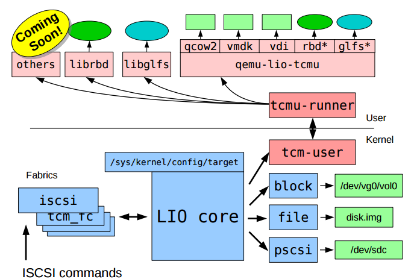
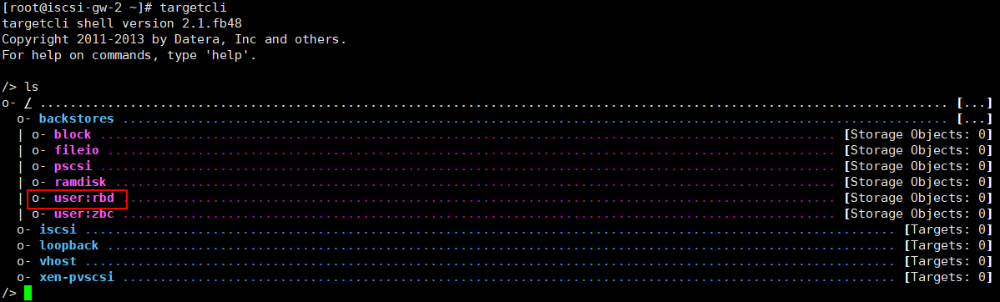
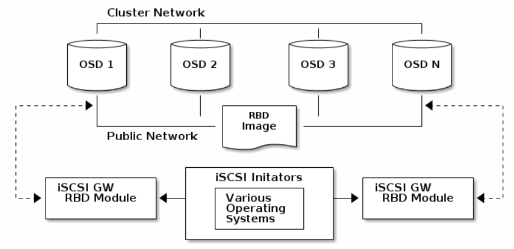
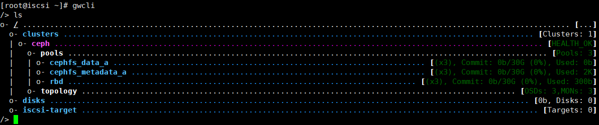
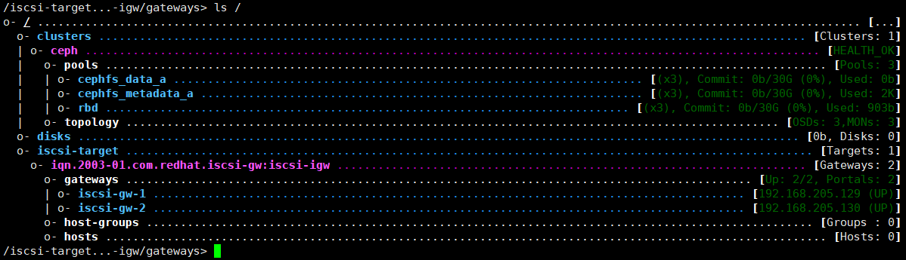
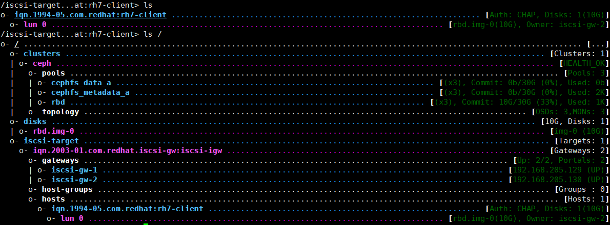
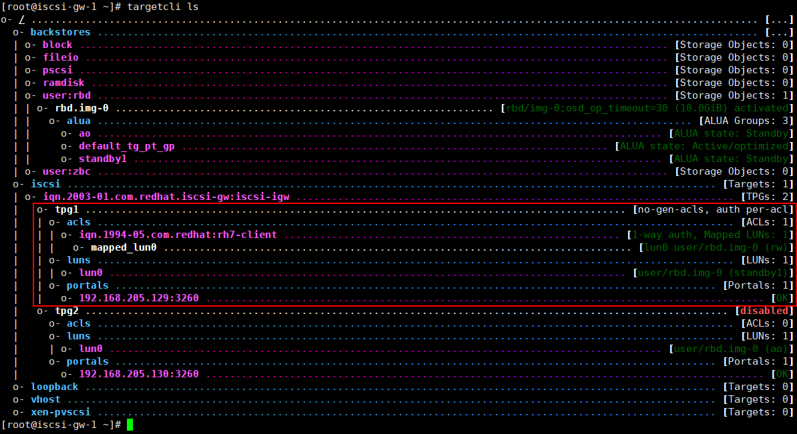
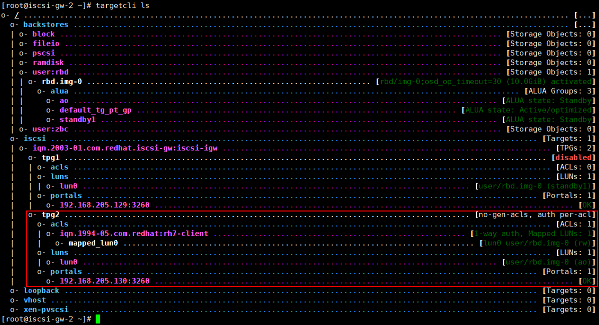

# ceph iscsi gateway with LIO安装配置

基于tcmu-runner工具和系统内核的升级开发，ISCSI终于实现支持librbd的配合使用。由于之前研究实现过ISCSI和CEPH的高可用（基于consul+ceph+iscsi），这次听说CEPH提供了高可用网关工具，因此，基于官方文档的介绍自己也搭建了一下。在搭建的过程中，遇到了一些小坑，特地写篇博文记录一下。

> 基于Centos or RHEL 7.5以上的版本，本次使用的是Centos7.5的系统，具体参考了 [RHEL：USING ISCSI GATEWAY](https://access.redhat.com/documentation/en-us/red_hat_ceph_storage/3/html/block_device_guide/using_an_iscsi_gateway) 和 [CEPH 官方文档](http://docs.ceph.com/docs/master/rbd/iscsi-overview/)；ceph基于Luminous v12.2.5版本，如果读者没有接触过ISCSI，强烈建议先熟悉下ISCSI的基本配置，这方面的博客有很多。


## 部署前须知

系统需要先安装以下一些基础的rpm包，一般直接yum install命令就可以：

```txt
libnl3		rpm包对应 libnl3 、libnl3-devel
libkmod		rpm包对应 kmod、kmod-devel
librbd1
pyparsing
python-kmod
python-pyudev
python-gobject
python-urwid
python-pyparsing
python-rados
python-rbd
python-netaddr
python-netifaces
python-crypto
python-requests
python-flask
pyOpenSSL
```


安装关键的rpm包，请注意rpm版本。

```txt
targetcli-2.1.fb47 or newer package
python-rtslib-2.1.fb64 or newer package
tcmu-runner-1.3.0 or newer package
ceph-iscsi-config-2.4 or newer package
ceph-iscsi-cli-2.5 or newer package
```

当前，我没有找到对应的rpm包，所以上面的包都是通过编译安装的。


**安装tcmu-runner**

```bash
# download
git clone https://github.com/open-iscsi/tcmu-runner
cd tcmu-runner

# compile
cmake -Dwith-glfs=false -Dwith-qcow=false -DSUPPORT_SYSTEMD=ON -DCMAKE_INSTALL_PREFIX=/usr
make install

# start service
systemctl daemon-reload
systemctl enable tcmu-runner
systemctl start tcmu-runner
```

**安装rtslib-fb**

```bash
git clone https://github.com/open-iscsi/rtslib-fb.git
cd rtslib-fb
python setup.py install
```

**安装targetcli-fb**

```bash
git clone https://github.com/open-iscsi/targetcli-fb.git
cd targetcli-fb
python setup.py install
mkdir /etc/target
mkdir /var/target
```

**安装ceph-iscsi-config**

```bash
# install
git clone https://github.com/ceph/ceph-iscsi-config.git
cd ceph-iscsi-config
python setup.py install --install-scripts=/usr/bin
cp usr/lib/systemd/system/rbd-target-gw.service /lib/systemd/system

# start service
systemctl daemon-reload
systemctl enable rbd-target-gw
systemctl start rbd-target-gw
```

**安装ceph-iscsi-cli**

```bash
git clone https://github.com/ceph/ceph-iscsi-cli.git
cd ceph-iscsi-cli
python setup.py install --install-scripts=/usr/bin
cp usr/lib/systemd/system/rbd-target-api.service /lib/systemd/system
```

至此，如果能够连接internet的话，这些关键的包安装很快就能够完成。如果还有依赖包，就按提示安装就好，应该不会太难。在配置iscsi server端，最好该服务器节点都能够正常访问ceph，比如能够正常执行`ceph -s`什么的，可以免去很多麻烦。


## 非高可用部署 -- 使用tcmu-runner配置ISCSI

### tcmu-runner简介

在配置tcmu-runner之前，先回顾一下tcmu-runner的实现方式，其是基于内核与用户态的通信将内核读写操作转移到用户态的层面上，tcmu-runner支持众多的插件，包括ceph的rbd、glusterfs等等。如下图所示：



在安装完tcmu-runner后，在`/usr/lib64/tcmu-runner/`目录下多了几个\*\.so文件，这表明tcmu能够支持targetcli的模块。handler_rbd\.so表示安装完tcmu-runner后，targetcli已经支持配置ceph的librbd了。进入targetcli的配置管理shell上，看到backstores里多了user:rbd目录，这个目录就是用来配置ceph rbd的连接的。更详细的说明，请参考[GITHUB-TCMU-RUNNER](https://github.com/open-iscsi/tcmu-runner)




### 实践配置 - 创建一个rbd的iscsi后端

步骤如下：

1. 创建一个存储池：`ceph osd pool create p-iscsi 64 64`，并将该存储池设为rbd专用池：`rbd pool init iscsi`

2. 创建一个rbd image：`rbd create iscsi/img-0 --size 10G`

3. 运行`targetcli`，进入到iscsi server配置界面

4. 执行`cd /backstores/user:rbd`，进入到rbd的配置层级，执行如下命令：

```bash
/backstores/user:rbd> create cfgstring=iscsi/img-0 name=diak0 size=10G

# 其中，cfgstring可写：pool_name/image_name[;osd_op_timeout=N;conf=N;id=N] 
# osd_op_timeout is optional and N is in seconds
# conf is optional and N is the path to the conf file
# id is optional and N is the id to connect to the cluster
```

**需要注意是：user:rbd/内并不会自动创建rbd image，只能基于已经存在的image进行iscsi后端存储的关联，所以需要手动执行`rbd create`命令创建images，size大小要与image保持一致。**

配置完成后，其余的操作和普通的iscsi配置完全一样，这里就不多说了。


## 高可用部署 -- 使用ceph-iscsi-gateway

> 配置前需知：
> 1. iscsi的高可用仍然是依赖initiator的multipath配置，只不过是iscsi server端使用了gateway的方式提供了iscsi配置的同步等
> 2. ceph-iscsi-gateway完全接管了targetcli的iscsi配置管理，因此，在配置HA iscsi gateway时，先清空targetcli的配置内容。
> 3. 只有在高可用情况下，即配置多个iscsi gateway时才能配置，如果只是单节点，是不能使用的，因为程序默认写死了要两个以上gateway。


先拿出ceph官网的`iscsi gateway`架构图：




### 部署前配置

在配置前，务必确定在tcmu-runner基础上安装了**ceph-iscsi-config** 和 **ceph-iscsi-cli**这两个包。安装完毕后，进行如下配置：

1. 配置ceph集群，确保集群的故障能够快速检测，防止iscsi客户端io业务中断太久而造成initiator超时；然后重启所有的osd和mon，也可以通过在线更改配置的方式：`ceph daemon <daemon_type>.<id> config set <parameter_name> <new_value>`，其配置如下所示：

```txt
[osd]
    osd client watch timeout = 15
    osd heartbeat grace = 20
    osd heartbeat interval = 5
```


2. 创建一个名称为 `rbd` 的存储池，因为 ceph iscsi gateway 的所有元数据信息都指定存储在名称为rbd的pool内，对应的object为`gateway.conf`，可以通过`rados get -p rbd gateway.conf tmp-gateway`获取元数据信息。

3. 在`/etc/ceph/`目录下创建一个名为`iscsi-gateway.cfg`配置文件，并加入如下内容，**这个文件在所有gateway服务节点需要完全一致**：

```txt
touch /etc/ceph/iscsi-gateway.cfg
```


内容为：
```txt
[config]
	# Name of the Ceph storage cluster. A suitable Ceph configuration file allowing
	# access to the Ceph storage cluster from the gateway node is required, if not
	# colocated on an OSD node.
	cluster_name = ceph
	
	# Place a copy of the ceph cluster's admin keyring in the gateway's /etc/ceph
	# drectory and reference the filename here
	gateway_keyring = ceph.client.admin.keyring
	
	# API settings.
	# The API supports a number of options that allow you to tailor it to your
	# local environment. If you want to run the API under https, you will need to
	# create cert/key files that are compatible for each iSCSI gateway node, that is
	# not locked to a specific node. SSL cert and key files *must* be called
	# 'iscsi-gateway.crt' and 'iscsi-gateway.key' and placed in the '/etc/ceph/' 
	# directory on *each* gateway node. With the SSL files in place, you can use 
	# 'api_secure = true' to switch to https mode.
	# To support the API, the bear minimum settings are:
	api_secure = false

	# Additional API configuration options are as follows, defaults shown.
	# api_user = admin
	# api_password = admin
	# api_port = 5001
	# trusted_ip_list = 192.168.205.129,192.168.205.130
	
```

`trushed_ip_list`填写要作为gateway节点的服务IP地址，只有在这个列表内的ip，才能成为ceph iscsi gateway服务节点。


4. 完成配置，启动服务，命令如下：


```txt
systemctl daemon-reload
systemctl enable rbd-target-api
systemctl start rbd-target-api
```


### 配置iscsi server端

1. 执行`gwcli`，进入到gateway的配置管理界面。需要注意的是，gwcli相当于ceph版的targetcli，其配置管理会同步到targetcli上，相当于targetcli的基础上封装的另一个iscsi管理工具，其界面如下所示：



2. 在 `/iscsi-target`层级下，创建一个iscsi iqn：

```bash
/> cd /iscsi-target
/iscsi-target>  create iqn.2003-01.com.redhat.iscsi-gw:iscsi-igw
```


3. 在`/iscsi-target/iqn.2003-01.com.redhat.iscsi-gw:iscsi-igw/gateways`层级下，创建两个以上的网关。一定要两个以上，否则不能创建disks资源。**这里有两点需要注意的： 1. create时，如上所示的ceph-gw-1为节点的hostname，ip地址为该节点的ip，同时也是配置在`/etc/ceph/iscsi-gateway.cfg` 里trusted_ip_list的地址，否则创建均会失败； 2. skipchecks不是必要的，它为true时会跳过检查环境是否符合条件。它会检测rtslib-fb和tcmu-runner的版本，我这里跳过检查是因为我的rtslib-fb版本号为2.1.67，而程序检测要求rtslib-fb版本号大于2.1.fb64。明显地，直接字符串比较的话 2.1.fb64 > 2.1.67，导致我虽然版本是最新的，但是检查一直不通过，所以只能忽略检查了 。**其命令和执行完后 gwcli 的树形结构如下所示：

```bash
/iscsi-target> cd iqn.2003-01.com.redhat.iscsi-gw:iscsi-igw/gateways
/iscsi-target...-igw/gateways>  create ceph-gw-1 192.168.205.129 skipchecks=true
/iscsi-target...-igw/gateways>  create ceph-gw-2 192.168.205.130 skipchecks=true
```




4. 在`/disks`层级下，创建rbd存储后端（在gwcli里，是会直接在pool内创建image的），执行命令 `/disks> create pool=rbd image=img-0 size=10G`，pool不一定非要rbd，rbd只是存储元数据，pool可以是任意的存储池。

5. 配置initiator的连接权限，即targetcli中的acls权限，配置层级在：`/iscsi-target/iqn.2003-01.com.redhat.iscsi-gw:iscsi-igw/hosts`下。

```txt
# 创建intiator client
/disks> cd /iscsi-target/iqn.2003-01.com.redhat.iscsi-gw:iscsi-igw/hosts
/iscsi-target...eph-igw/hosts>  create iqn.1994-05.com.redhat:rh7-client

# 配置auth, CHAP密码要求在12~16位之间，用户名的字符长度在8位以上
/iscsi-target...eph-igw/hosts> cd iqn.1994-05.com.redhat:rh7-client
/iscsi-target...at:rh7-client>  auth chap=myiscsiusername/myiscsipassword
```

6. 最后，将lun和之前创建的/disks下的image进行关联，执行`/iscsi-target...at:rh7-client> disk add rbd.img-0`。

最后，看一下配置完后的gwcli整体层级结构：



与gwcli对应的targetcli配置信息如下：

节点 iscsi-gw-1：



节点 iscsi-gw-2：



如果信息和文中图的差不多，表明配置成功了，剩下的就是客户点initiator的配置。


### 配置initiator

> 需要安装的软件：
> yum install iscsi-initiator-utils
> yum install device-mapper-multipath


device-mapper-multipath是iscsi的多路径配置，即一个gateway服务失效的话，initiator会自动通过另一个gateway继续io操作。需要配置一些device-mappper的配置，执行`mpathconf --enable --with_multipathd y`命令，会生成一个配置文件：`/etc/multipath.conf`，在配置文件中添加内容：

```txt
devices {
    device {
        vendor                 "LIO-ORG"
        hardware_handler       "1 alua"
        path_grouping_policy   "failover"
        path_selector          "queue-length 0"
        failback               60
        path_checker           tur
        prio                   alua
        prio_args              exclusive_pref_bit
        fast_io_fail_tmo       25
        no_path_retry          queue
    }
}
```

然后重启服务，命令为`systemctl reload multipathd`。因为我们之前在iscsi server中配置了acls和CHAP，所以在连接时需要做一些配置，以确保有权限访问iSCSI服务端，其步骤如下：

1. 在`/etc/iscsi/initiatorname.iscsi`文件上，修改initiator名字为：`InitiatorName=iqn.1994-05.com.redhat:rh7-client`，即是配置iscsi server端中所描述的步骤4-创建initiator client acls的那个iqn名称。


2. 在`/etc/iscsi/iscsid.conf`中，设置initiator的CHAP权限，找到CHAP的配置位置，修改如下：

```txt
# *************
# CHAP Settings
# *************
# To enable CHAP authentication set node.session.auth.authmethod
# to CHAP. The default is None.
node.session.auth.authmethod = CHAP

# To set a CHAP username and password for initiator
# authentication by the target(s), uncomment the following lines:
node.session.auth.username = myiscsiusername
node.session.auth.password = myiscsipassword
```

3. 使用iscsiadm发现服务：

```txt
[root@iscsi-gw-2 ~]# iscsiadm -m discovery -t st -p 192.168.205.129
192.168.205.129:3260,1 iqn.2003-01.com.redhat.iscsi-gw:iscsi-igw
192.168.205.130:3260,2 iqn.2003-01.com.redhat.iscsi-gw:iscsi-igw
```


4. 连接服务：

```txt
[root@iscsi-gw-2 ~]# iscsiadm -m node -T iqn.2003-01.com.redhat.iscsi-gw:iscsi-igw -l
Logging in to [iface: default, target: iqn.2003-01.com.redhat.iscsi-gw:iscsi-igw, portal: 192.168.205.129,3260] (multiple)
Logging in to [iface: default, target: iqn.2003-01.com.redhat.iscsi-gw:iscsi-igw, portal: 192.168.205.130,3260] (multiple)
Login to [iface: default, target: iqn.2003-01.com.redhat.iscsi-gw:iscsi-igw, portal: 192.168.205.129,3260] successful.
Login to [iface: default, target: iqn.2003-01.com.redhat.iscsi-gw:iscsi-igw, portal: 192.168.205.130,3260] successful.
```

5. 通过`multipath -ll`查看磁盘

```txt
[root@iscsi-gw-2 ~]# multipath -ll
mpatha (360014056ee176c8a7064c019320f7beb) dm-3 LIO-ORG ,TCMU device     
size=10G features='1 queue_if_no_path' hwhandler='1 alua' wp=rw
|-+- policy='queue-length 0' prio=130 status=active
| `- 8:0:0:0 sdb 8:16 active ready running
`-+- policy='queue-length 0' prio=1 status=enabled
`- 7:0:0:0 sdc 8:32 active ghost running
```

至此，配置完毕。   
