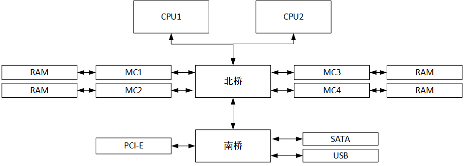
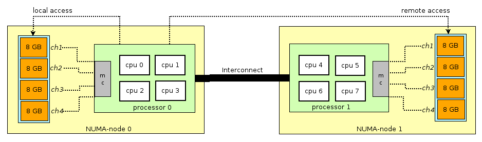
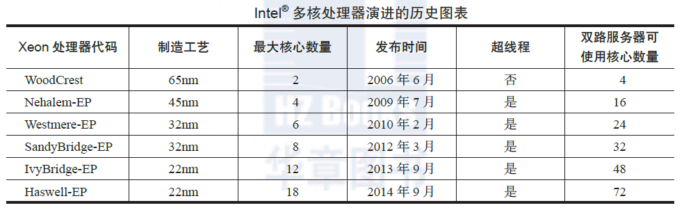
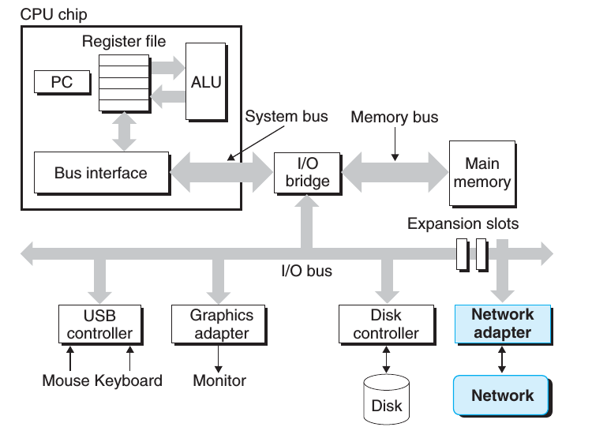
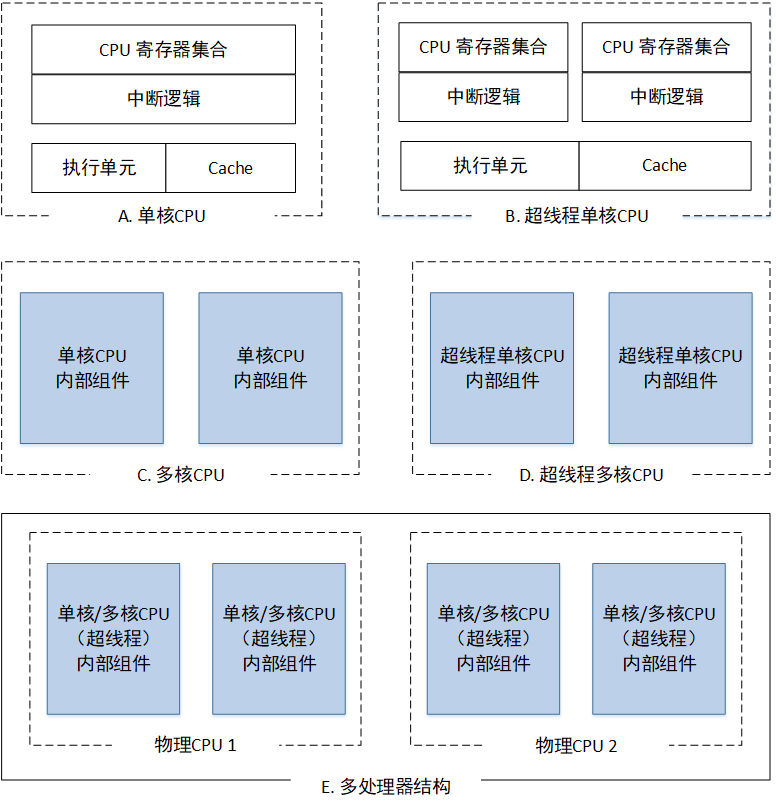

# CPU 绑定技术

本章节主要介绍 CPU Affinity 及相关操作。通过了解 CPU 绑定技术，令读者可以自行根据程序的实际运行环境，合理利用 CPU 多核的特性，达到优化/加速程序的目的。


## 前提知识须知

### 服务器体系架构

如果希望提高程序的性能，了解服务器多 CPU 体系下访问内存的架构是非常有必要的。

访问存储器的方式可以分为两种：

- **统一存储器访问**（Uniform Memory Access，UMA），各CPU共享相同的物理内存，每个 CPU访问内存中的任何地址所需时间是相同的；
- **非统一存储器访问**（Non-Uniform Memory Access，NUMA），相对 UMA 来说，各CPU可访问所有的物理内存，但每个 CPU访问内存中的任何地址所需时间是不相同的。

多 CPU 共同工作主要有3中架构：

- **SMP**，（Symmetric Multi-Processor，对称多处理器架构）；  SMP 多个 CPU 通过一个总线访问存储器，SMP 系统也被称为一致内存访问（UMA）结构体系；在SMP系统上，所有的 CPU 对共享内存控制器拥有相同的访问权限。CPU 之间同时访问某个特定共享资源会导致拥塞等待。SMP服务器的主要特征是共享，系统中所有资源(CPU、内存、I/O等)都是共享的。也正是由于这种特征，导致了 SMP 服务器的主要问题，那就是它的扩展能力非常有限。如下，为SMP的资源共享架构：



- **MPP**，（Massive Parallel Processing，海量并行处理结构）；针对 SMP 的扩展性问题，MPP 提供了一种系统扩展的解决方式。它由多个 SMP 服务器通过网络进行连接，协同工作，完成相同的任务，从用户的角度来看是一个服务器系统。其基本特征是由多个 SMP 服务器通过网络连接而成，每个节点只访问自己的本地资源(内存、存储等)，是一种完全无共享(Share Nothing)结构，因而扩展能力最好，理论上其扩展无限制，目前的技术可实现512个节点互联，数千个CPU。目前业界对节点互联网络暂无标准，如 NCR的 Bynet，IBM 的 SPSwitch，它们都采用了不同的内部实现机制。但节点互联网仅供 MPP 服务器内部使用，对用户而言是透明的。

- **NUMA**，（Non-Uniform Memory Access， 非统一存储访问结构），综合了 SMP 和 MPP 优点的折中方案（即解决 SMP 的低扩展性和 MPP 的资源共享问题），主要为了解决多CPU下内存访问冲突。每个CPU 具有自己的本地内存空间，但是也能远程访问其他CPU的内存空间。在这种架构下，在一个配有四核的机器中，不需要一个复杂的北桥就能将内存带宽增加到以前的四倍。当然，这样的架构也存在缺点。该系统中，访问内存所花的时间和处理器相关。这是因为 CPU 访问本地内存的时间很短，而访问远程内存（remote memory，即其他处理器的本地内存）需要通过额外的系统总线。对于某个处理器来说，当其要访问其他的内存时，轻者要经过另外一个处理器，重者要经过2 个处理器，才能达到访问非本地内存的目的，因此内存与处理器的“距离”不同，访问的时间也有所差异，其速度大致相差好几倍，所以 NUMA 调优的目的就是让处理器尽量访问自己的存储器，以提高访问速度。NUMA 体系结构如下所示：

  


目前基本所有的服务器都会支持 NUMA 架构（只要主板能够插入多个CPU的机子），而 NUMA 架构的特性使得性能调整成为一项比较重要的工作。下面具体说明一下。

在 NUMA 架构出现前，CPU 朝着频率越来越高的方向发展。在受到物理极限的挑战，又转为核数越来越多的方向发展。如果每个core的工作性质都是share-nothing，就不需要 NUMA 体系。因为 CPU Core 都是通过共享一个北桥来读取内存，随着 CPU 核数越多，北桥在响应时间上的性能瓶颈越来越明显。于是，硬件设计师把内存控制器（原本北桥中读取内存的部分）做了拆分，平分到了每个Die上，这就是 NUMA 体系架构。

> Die或者CPU Die指的是处理器在生产过程中，从晶圆（Silicon Wafer）上切割下来的一个个小方块，在切割下来之前，每个小方块（Die）都需要经过各种加工，将电路逻辑刻到该Die上面。

因为 NUMA 架构下 CPU 访问自己本地内存的时间较短，访问远端内存的时间较长。因此，Linux 系统在识别 NUMA 架构后，默认的内存分配方案是：**优先尝试分配在请求线程当前所在的 CPU 的 Local 内存**，如果 local 内存不足，则优先淘汰 local 内存中无用的 Page，即先进行内存swap操作。

> Linux NUMA 下的内存分配带来一个问题：假设 NUMA 有 node0 和 node1 两个节点，其内存使用状态如下：
>
> 
>
> 那么，现有进程 P 启动在 node0 上，那么 Linux 系统就会优先置换 node0 上的内存（buffer等可回收的内存），然后分配给进程 P，而不会使用 node1 上未使用的内存空间。这样做会导致 node0 上内存频繁置换，影响其他进程的性能（比如有些进程需要大量的buffer空间已提高效率）。
>
> 比较典型的例子如下，均是由于 NUMA 导致的性能不稳定：
>
> - [MySQL – The MySQL “swap insanity” problem and the effects of the NUMA architecture](http://blog.jcole.us/2010/09/28/mysql-swap-insanity-and-the-numa-architecture/)
> - [PostgreSQL – PostgreSQL, NUMA and zone reclaim mode on linux](http://frosty-postgres.blogspot.com/2012/08/postgresql-numa-and-zone-reclaim-mode.html)
> - [Oracle – Non-Uniform Memory Access (NUMA) architecture with Oracle database by examples](http://blog.yannickjaquier.com/hpux/non-uniform-memory-access-numa-architecture-with-oracle-database-by-examples.html)
> - [Java – Optimizing Linux Memory Management for Low-latency / High-throughput Databases](http://engineering.linkedin.com/performance/optimizing-linux-memory-management-low-latency-high-throughput-databases)

那么，如何识别服务器是否开启了 NUMA 呢？通过如下命令，如果有关于 NUMA 字样，一般表明开启了。

```txt
grep -i numa /var/log/dmesg
```

Linux 可通过 numactl 命令去管理 NUMA 的相关配置。具体如下：

```txt
# 安装 numactl
[root@develop ~]# yum install -y numactl

# 查看系统的 NUMA 拓扑， distances 表示本地和远端访问内存的开销
[root@develop ~]# numactl --hardware
available: 2 nodes (0-1)
node 0 size: 32276 MB
node 0 free: 26856 MB
node 1 size: 32320 MB
node 1 free: 26897 MB
node distances:
node   0   1 
  0:  10  21 
  1:  21  10 
  
# 查看 numa 节点的性能，如果 numa_miss 太多，就需要考虑进行调整
[root@develop ~]# numastat
                           node0
numa_hit               296960186
numa_miss                      0
numa_foreign                   0
interleave_hit             22884
local_node             296960186
other_node                     0

# 查看当前进程所在节点的 numa 情况
[root@develop ~]# numactl --show
policy: default
preferred node: current
physcpubind: 0 1 
cpubind: 0 
nodebind: 0 
membind: 0 

# 更多操作，可 man 查看
[root@develop ~]# man numactl
```

要查看 NUMA 节点的CPU分配情况，可通过 `lscpu` 命令查看，具体如：

```txt
[root@develop ~]# lscpu | grep NUMA
NUMA node(s):          1
NUMA node0 CPU(s):     0,1
```

NUMA 节点可在 `/sys/devices/system/node`目录下找到，每个node记录了具体分配的cpu、内存等信息。

```
[root@develop test.slice]# ll /sys/devices/system/node/
total 0
drwxr-xr-x. 4 root root    0 Feb 27 13:13 node0
drwxr-xr-x. 4 root root    0 Feb 27 13:13 node1

[root@develop test.slice]# ll /sys/devices/system/node/node0
total 0
--w-------. 1 root root 4096 Feb 27 13:13 compact
lrwxrwxrwx. 1 root root    0 Feb 27 13:13 cpu0 -> ../../cpu/cpu0
lrwxrwxrwx. 1 root root    0 Feb 27 13:13 cpu1 -> ../../cpu/cpu1
-r--r--r--. 1 root root 4096 Feb 27 13:13 cpulist
-r--r--r--. 1 root root 4096 Feb 27 13:13 cpumap
-r--r--r--. 1 root root 4096 Feb 27 13:13 distance
drwxr-xr-x. 4 root root    0 Feb 27 13:13 hugepages
-r--r--r--. 1 root root 4096 Feb 27 13:13 meminfo
lrwxrwxrwx. 1 root root    0 Feb 27 13:13 memory0 -> ../../memory/memory0
lrwxrwxrwx. 1 root root    0 Feb 27 13:13 memory1 -> ../../memory/memory1
lrwxrwxrwx. 1 root root    0 Feb 27 13:13 memory9 -> ../../memory/memoryN   // 多个memory片段
-r--r--r--. 1 root root 4096 Feb 27 13:13 numastat
drwxr-xr-x. 2 root root    0 Feb 27 13:13 power
lrwxrwxrwx. 1 root root    0 Feb 19 18:23 subsystem -> ../../../../bus/node
-rw-r--r--. 1 root root 4096 Feb 27 13:13 uevent
-r--r--r--. 1 root root 4096 Feb 27 13:13 vmstat
```


### CPU 架构

> 本文主要描述 Intel 架构的 CPU，其他架构如 AMD、MISPS、POWER 以及各种国产 CPU 不在描述范围之内。具体配置可参考不同产商CPU的特性文档。

处理器性能提升主要有两个途径，一个是提高 IPC（每个时钟周期内可以执行的指令条数），另一个是提高处理器主频率。每一代微架构的调整可以伴随着对 IPC 的提高，从而提高处理器性能，只是幅度有限，而提高处理器主频率对于性能的提升作用是明显而直接的。在整个 CPU 的发展历程，是由不断提升芯片运算频率核心向多核多线程CPU方向的发展。对于单线程的软件来说，仅仅通过提高芯片的处理频率，就能够让软件性能有很大的提升。但是，CPU 核心运算频率不会无限提高，这涉及功耗墙（处理器的功耗正比于 CPU 主频的三次方）、架构设计等原因。垂直扩展总是有限，因此CPU转向横行发展，即支持多核处理器（提高 IPC），而上层软件在设计时也从单线程转向多线程并发运行。下面是 Intel 的一些 CPU 架构的历史发展进程，如下图所示：



**多核处理器**是指在一个处理器中集成两个或者多个完整的内核（及计算引擎），使原本在单核上顺序执行的任务，得以按逻辑划分成若干子任务，分别在不同的核上并行执行。在任务粒度上，使指令执行的并行度得到提升。Amdahl 定律告诉我们，假设一个任务的工作量不变，**多核并行计算理论时延加速上限取决于那些不能并行处理部分的比例**。换句话说，多核并行计算下时延不能随着核数增加而趋于无限小。在多核处理器上，有几个概念需要先知道：

- **超线程技术(Hyper-Threading)**：利用特殊的硬件指令控制，让单个 CPU core 能使用线程级并行计算。减少CPU 核心的闲置时间，提高的CPU的运行效率。超线程技术一般会将一个物理核心“虚拟”成两个逻辑CPU。我们常听到的双核四线程/四核八线程指的就是支持超线程技术的CPU。

- **物理CPU**：物理服务器上安装的实际CPU, 比如说主板上安装了一个8核 CPU，那么物理CPU个数就是1个。
- **CPU核心**：CPU的核心，可以独立完成所有的计算、接受/存储命令、处理数据等核心工作，是一个完整的执行单元。由于制程工艺的改进，可以将多个核心集成到一个物理CPU内，从而出现多核CPU的概念。

- **逻辑CPU**：一般情况，一颗 CPU 可以是单核或多核，加上 Intel 的超线程技术（HT）构造的线程总数，就是系统层面上的逻辑 CPU，其计算方式为：`逻辑CPU数量 = 物理CPU数量 x CPU cores x 2(如果支持并开启HT)`


如果对上述概念还有些不清楚，那么，下面将详细介绍单核CPU、多核以及超线程的概念。

CPU 其实就是计算机内部的一个电子电路。根据一些具体的指令它可以执行基本的逻辑运算，控制和 IO 操作等。CPU的主要组件包括：

- 算术逻辑单元（ALU），它主要执行一些算术和逻辑操作
- CPU 寄存器（processor registers），它主要的作用是给ALU提供操作数并存储ALU操作的结果
- 控制器（control unit），通过协调ALU，寄存器和其它组件之间的操作，从主存中取得并执行相应的指令等。



上图为常见的一种CPU与其他组件的交互架构。

单核CPU是最简单的处理器架构，为了方便描述，将CPU的核心组件简化为：CPU 寄存器集合、中断逻辑（Local APIC）、执行单元和Cache。



**单核处理器**结构如上图 A 所示，一个完整的物理 CPU 核需要拥有这样的整套资源，提供一个指令执行线程。

**超线程处理器**结构如图 B 所示，通过使用超线程（Hyper-Threading）技术以及特殊硬件支持，使一个处理器核中提供两个逻辑执行线程，逻辑线程共享流水线、执行单元和缓存。该技术的本质是复用单处理器中的超标量流水线的多路执行单元，降低多路执行单元中因指令依赖造成的执行单元闲置。对于每个逻辑线程，拥有完整独立的寄存器集合和本地中断逻辑，从软件的角度看，与单线程物理核并没有差异。例如，8 核心的处理器使用超线程技术之后，可以得到16 个逻辑线程。采用超线程，在单核上可以同时进行多线程处理，使整体性能得到一定程度提升。但由于其毕竟是共享执行单元的，对 IPC（每周期执行指令数）越高的应用，带来的帮助越有限。（怎么理解呢？比如CPU指令执行到跳转，即代码的 if-else，需要根据条件获取对应的代码指令，此时CPU指令流水线是断开了，在等待过程中，这段时间CPU 的 ALU 处于空闲状态，可执行其他指令，诸如此类）。

**多核CPU**结构如图 C 和 D 所示，超线程技术是在一个核内部以资源切分的方式构成多个执行线程，多核体系结构则是在一个CPU 封装里放入了多个对等的物理核，每个物理核可以独立构成一个执行线程，当然也可以进一步分割成多个执行线程（采用超线程技术）。多核之间的通信使用芯片内部总线来完成，多核之间共享更低一级缓存（LLC，三级缓存）和内存。随着CPU 制造工艺的提升，每个CPU 封装中放入的物理核数也在不断提高。

> 一般来说，当前 CPU 会有三级缓存（LLC）。对于多核 CPU，一级缓存和二级缓存是独占的，三级缓存是共享的。如果只有二级缓存，那么一般最外层的缓存是共享的。

**多处理器**结构如图 E 所示，指的是多颗单独封装的物理 CPU 通过外部总线连接，构成的统一计算平台。每个 CPU 都需要独立的电路支持，有自己的 Cache，物理 CPU 之间的通信通过主板上的总线。在此架构上，若一个多线程的程序运行在不同 CPU 的某个核上，跨 CPU 的线程间协作都要走总线，而共享的数据还会付出因 Cache 一致性产生的开销。从内存子系统的角度，多处理器结构进一步衍生出了非一致内存访问（NUMA）。

### CPU 相关的Linux命令

因为有了超线程技术，所以衍生出了物理CPU、CPU核数、逻辑CPU等概念，这些概念前面已经介绍过了。下面介绍下在Linux 系统下查看 CPU 的相关信息的具体命令（CPU的信息主要都在`/proc/cpuinfo`中）：

```txt
# 查看物理CPU个数
cat /proc/cpuinfo | grep "physical id" | sort -u | wc -l 或 lscpu | grep "Socket"

# 查看每个物理CPU中core的个数(即核数)
cat /proc/cpuinfo | grep "cpu cores" | uniq

# 查看逻辑CPU的个数
# 在 cat /proc/cpuinfo 中， 查看 siblings 参数，如果和cpu cores 一致，表明没有开启超线程
# 如果是两倍 cpu cores，表明开启了超线程
cat /proc/cpuinfo | grep "processor" | wc -l

# 查看CPU的名称型号
cat /proc/cpuinfo | grep "name" | cut -f2 -d: | uniq
```

 查看进程运行在 Linux 系统的逻辑CPU位置的命令 `ps -eo pid,args,psr`，具体描述如下：

```
# pid  - 进程ID
# args - 该进程执行时传入的命令行参数
# psr  - 分配给进程的逻辑CPU

[~]# ps -eo pid,args,psr | grep nginx
9073 nginx: master process /usr/   1
9074 nginx: worker process         0
9075 nginx: worker process         1
9076 nginx: worker process         2
9077 nginx: worker process         3
13857 grep nginx                   3
```

查看进程的线程运行的逻辑CPU位置（替换 {PID} 的值为进程id号）：

```txt
[~]# ps -To 'pid,lwp,psr,cmd' -p {PID}
```


## CPU Affinity （亲和性）

CPU Affinity 就是进程要在指定的 CPU 上尽量长时间地运行而不被迁移到其他处理器，也称为 CPU 关联性；在多核运行的机器上，每个 CPU 本身会有自己的 Cache，缓存着进程的信息。随着运行推移，进程可能会被OS调度到其他 CPU 上，如此，CPU cache 命中率就低了。当绑定CPU后，程序就会一直在指定的 CPU 跑，尽可能确保Cache的一致性，增加 Cache 命中率，从而使性能得到提高。CPU Affinity是进程的一个属性，进程调度器（scheduler）根据其配置决定进程指定运行的某个或某组 CPU。在 Linux 系统中，CPU Affinity 分为两种：

- **soft affinity**，进程在指定的 CPU 上尽量长时间地运行而不被迁移到其他 CPU 核。Linux 内核进程调度器天生就具有被称为软 CPU 亲和性（affinity） 的特性，这意味着进程通常不会在处理器之间频繁迁移。但是不可避免，调度器还是可能会把进程调度到其它的 CPU 上；
- **hard affinity**，调度器必须遵守的规则，利用 Linux 内核提供给用户的API，强行将进程或者线程绑定到某一个指定的 CPU 核运行

通常 Linux 内核都可以很好地对进程进行调度，在可用的处理器上运行并获得很好的整体性能。内核包含了一些用来检测 CPU 之间任务负载迁移的算法，可以启用进程迁移来降低繁忙的处理器的压力。一般情况下，在应用程序中只需使用缺省的调度器行为。然而，用户可能会希望修改这些缺省行为以实现性能的优化，毕竟程序开发者比调度器更懂应用程序的运行情况。这就需要使用 hard affinity 的 API 接口。**进行CPU绑定的主要目的，是为了减少进程在CPU之间切换的开销，主要是提高 CPU 缓存的命中率。**CPU 之间是不共享缓存的，如果进程频繁的在各个 CPU 间进行切换，CPU 的 Cache 就会频繁失效。如果进程只在某个CPU上执行，则不会出现失效的情况。在多个线程操作相同数据的情况下，如果把这些线程调度到同一个处理器上，就能够大大的增加了 CPU 缓存的命中率。但是可能会导致并发性能的降低。如果这些线程是串行的，则没有这个影响。一般有以下需求时，可以绑定 CPU 核：

- **强计算型应用**；基于大量计算的情形通常出现在科学和理论计算中，但是通用领域的计算也可能出现这种情况。一个常见的标志是自己的应用程序要在多处理器的机器上花费大量的计算时间。

- **测试复杂的应用程序**；测试复杂软件是我们对 CPU Affinity 技术感兴趣的另外一个原因。考虑一个需要进行线性可伸缩性测试的应用程序。有些产品声明可以在使用更多硬件时执行得更好。作为购买多台机器（为每种处理器配置都购买一台机器）的替代方法，可以通过：

  1. 购买一台多处理器的机器；

  2. 不断增加分配的处理器；

  3. 测量每秒的事务数；

  4. 评估结果的可伸缩性。

  如果应用程序随着CPU 的增加可以线性地伸缩，那么每秒事务数和CPU 个数之间应该会是线性的关系。这样建模可以确定应用程序是否可以有效地使用底层硬件。如果一个给定的线程迁移到其他地方去了，那么它就失去了利用CPU 缓存的优势。实际上，如果正在使用的CPU 需要为自己缓存一些特殊的数据，那么所有其他CPU 都会使这些数据在自己的缓存中失效。因此，如果有多个线程都需要相同的数据，那么将这些线程绑定到一个特定的CPU 上是非常有意义的，这样就确保它们可以访问相同的缓存数据（或者至少可以提高缓存的命中率）。

- **正在运行时间敏感的、决定性的进程**；比如实时系统运行。通常把系统进程绑定到某些CPU上，把应用进程绑定到剩余的CPU上。这样，能够保证实时性任务不需要竞争CPU，实时进行处理。


### Taskset 命令

Taskset 工具提供检索/设置一个进程指定运行的 CPU 集合，同时，也可以在指定的CPU集合运行一个新的任务。在这里，CPU 指的是系统上的逻辑 CPU，如非特别指明，在这小节中的 CPU 均指逻辑 CPU。

> 之所以 Linux 系统使用逻辑 CPU 而不是物理核 CPU 作为分配的单元，是因为能够同时进行多线程的物理内核的每个执行线程都作为独立的处理单元呈现给操作系统。因此，具有两个执行线程的物理内核被操作系统视为两个(逻辑)内核，这意味着可以将进程调度在单个逻辑内核上运行，或者在它们的任意组合上运行。具体参考上面的 CPU 架构章节。

Taskset 使用**位掩码**（bitmask）来表示一个 CPU 的逻辑 id 号，bitmask 使用 16 进制表示，如下：

```txt
0x00000001 表示 logic cpu 0；
0x00000003 表示 logic cpu 集合 0 和 1；
0xFFFFFFFF 表示 logic cpu 集合 0 ~ 31；
```

在绑定 CPU 时，如果传入的掩码没有对应的 CPU，那么就会报错，提示 “Invalid argument”。该命令的具体参数如下：

```txt
Usage: taskset [options] [mask | cpu-list] [pid|cmd [args...]]

OPTIONS
    -a, --all-tasks
          Set or retrieve the CPU affinity of all the tasks (threads) for a given PID.
          （这是指将设置应用到给定的pid下的所有线程）
    -p, --pid
          Operate on an existing PID and do not launch a new task.
          （指定作用的进程pid）
    -c, --cpu-list
          Specify a numerical list of processors instead of a bitmask.  The numbers are separated by commas and may include ranges.  For example: 0,5,7,9-11.
          （设置绑定的CPU集合，相对mask，通过设置 cpu 的 id 号进行绑定，--cpu-list 支持多种表示方式，如
          -c 0,5,7,9-11 表示CPU集合 {0,5,7,9,10,11}，其mask为"b0111 0101 0001"，即 0x0751
          -c 0-16:2 冒号后接步长，这里表示mask为 "b0101 0101 0101 0101", 即 0x5555
          ）
```
下面，通过一些具体的例子，直观地感受下 taskset 命令的用法。

首先，编写一个计算型的无限循环小程序，这样，正常情况下 CPU 会是 100% 占用，如下：

```python
# file: test.py
i = 0
while True:
    i = i + 1
    if i > 1000000000:
        i=0
```

使用 taskset 绑定，受限测试机子，只有逻辑 cpu0 和 cpu1，如下：

```txt
# EXP1：运行 test.py，并指定其可运行的CPU集合为 0 和 1；mask = 0x03 ==  b00000011
[root@develop ~]# taskset 0x03 python test.py &
[1] 2870

# EXP2: 查看 test.py 进程绑定的 CPU 集合
[root@develop ~]# taskset -p 2870
pid 2870's current affinity mask: 3

# EXP3: 将 pid=2870 的进程重新绑定到 cpu1 上，有多种使用方式：
[root@develop ~]# taskset -p 0x02 2870
pid 2870's current affinity mask: 3
pid 2870's new affinity mask: 2

[root@develop ~]# taskset -pc 1  2870
pid 2870's current affinity list: 0,1
pid 2870's new affinity list: 1
```

通过 top 命令，可以查看 CPU 的利用率，（如果需要查看每个CPU的利用率，只需要在top后按下数字`1`），如下：

```txt
// 可用 CPU set = {1}
[root@develop py-prj]# top -p 2870
Tasks:   1 total,   1 running,   0 sleeping,   0 stopped,   0 zombie
%Cpu0  : 20.1 us, 12.4 sy,  0.0 ni, 67.4 id,  0.0 wa,  0.0 hi,  0.0 si,  0.0 st
%Cpu1  : 99.3 us,  0.7 sy,  0.0 ni,  0.0 id,  0.0 wa,  0.0 hi,  0.0 si,  0.0 st

  PID USER      PR  NI    VIRT    RES    SHR S  %CPU %MEM     TIME+ COMMAND
  2870 root      20   0  125432   4584   2012 R  98.3  0.1  23:35.96 python

// 可用 CPU set = {0, 1}
[root@develop py-prj]# top -p 2870
Tasks:   1 total,   1 running,   0 sleeping,   0 stopped,   0 zombie
%Cpu0  : 44.8 us,  8.4 sy,  0.0 ni, 46.8 id,  0.0 wa,  0.0 hi,  0.0 si,  0.0 st
%Cpu1  : 69.0 us,  6.3 sy,  0.0 ni, 24.7 id,  0.0 wa,  0.0 hi,  0.0 si,  0.0 st

  PID USER      PR  NI    VIRT    RES    SHR S  %CPU %MEM     TIME+ COMMAND
  2870 root      20   0  125432   4584   2012 R 100.0  0.1  25:45.60 python
```

由上述例子，可以发现，当绑定`CPU=1`时，cpu1 的利用率为100%，而 cpu0 处于空闲，如果不绑定 CPU ，那么进程将会在 cpu0 和 cpu1之间来回切换。

上面介绍了 taskset 为进程指定运行 CPU 的具体操作。通过这种方法，CPU 可以绑定到某个具体的 CPU 中运行。但是，这种方式无法限制该 CPU 上的线程切换（分时系统内核对线程的切换调度）。如果希望减少其他进程对特定进程的影响，在设置 cpu affinity 的基础上，可以采取把逻辑 CPU 从内核调度系统中剥离的方式。

> isolcpus 功能存在已久，在内核 kernel-v2.6.11（2005年）就已经存在。isolcpus 功能用于在 SMP 均衡调度算法中将一个或多个 CPU 独立出来。同时可通过 cpu affinity 设置将进程置于 “独立CPU” 运行，isolcpus 可设置CPU个数范围为 `[0, maxcpu-1]` 个。与手动设置每个任务的 cpu affinity 相比，isolcpus 降低了调度器的性能。
>
> isolcpus 带来的好处是有效地提高了独立 cpu 上任务运行的实时性。但是该功能减少了其他任务可以运行的 cpu 资源，在使用前需要对 cpu 资源进行仔细规划。

Linux 系统内核提供了启动参数 `isolcpus` 。对于有4 个CPU 的服务器，在启动的时候加入启动参数 `isolcpus=2,3`。那么系统启动后将不使用 cpu3 和 cpu4。注意，不使用指的是内核不把进程调度到这些核里运行，但系统启动后仍然可以通过 taskset 命令指定进程在这些逻辑 cpu 中运行。在 Linux kernel 启动参数里面添加 `isolcpus` 参数，配置如下所示：

```
[root@develop py-prj]# cat /etc/grub2.cfg | grep isolcpu
	linux16 /vmlinuz-3.10.0-862.el7.x86_64 root=/dev/mapper/centos-root ro crashkernel=auto rd.lvm.lv=centos/root rd.lvm.lv=centos/swap rhgb quiet LANG=en_US.UTF-8 namespace.unpriv_enable=1 user_namespace.enable=1 isolcpu=2,3
```

继续前面的例子，因为测试环境只有 cpu0 和 cpu1，因此，设置`isolcpu=1`，重启系统后，运行 `test.py`，执行`top`命令，发下进程的 bitmask 虽然是 3，但是仅调度到 cpu0 中运行。使用 taskset 命令将其调度到 cpu1 中，则仍然可以在 cpu1 中运行。如下所示：

```txt
[root@develop ~]# python test.py &
[1] 3371

[root@develop ~]# taskset -p 3371
pid 3371's current affinity mask: 3

[root@develop py-prj]# top -p 3371
Tasks:   1 total,   1 running,   0 sleeping,   0 stopped,   0 zombie
%Cpu0  :100.0 us,  0.0 sy,  0.0 ni,  0.0 id,  0.0 wa,  0.0 hi,  0.0 si,  0.0 st
%Cpu1  :  1.3 us,  0.0 sy,  0.0 ni, 98.7 id,  0.0 wa,  0.0 hi,  0.0 si,  0.0 st

  PID USER      PR  NI    VIRT    RES    SHR S  %CPU %MEM     TIME+ COMMAND
  3371 root      20   0  123360   4528   1968 R 100.0  0.1   0:37.57 python

[root@develop py-prj]# taskset -p 2 3371
pid 3371's current affinity mask: 3
pid 3371's new affinity mask: 2

[root@develop py-prj]# top -p 3371
Tasks:   1 total,   1 running,   0 sleeping,   0 stopped,   0 zombie
%Cpu0  :  4.4 us,  0.6 sy,  0.0 ni, 95.0 id,  0.0 wa,  0.0 hi,  0.0 si,  0.0 st
%Cpu1  :100.0 us,  0.0 sy,  0.0 ni,  0.0 id,  0.0 wa,  0.0 hi,  0.0 si,  0.0 st

   PID USER      PR  NI    VIRT    RES    SHR S  %CPU %MEM     TIME+ COMMAND
  3371 root      20   0  123360   4528   1968 R  99.4  0.1   7:19.20 python 
```

通过查看系统的启动命令，可以知道是否开启 isolcpus 特性。如下：

```txt
[root@develop py-prj]# cat /proc/cmdline 
BOOT_IMAGE=/vmlinuz-3.10.0-862.el7.x86_64 root=/dev/mapper/centos-root ro crashkernel=auto rd.lvm.lv=centos/root rd.lvm.lv=centos/swap rhgb quiet LANG=en_US.UTF-8 namespace.unpriv_enable=1 user_namespace.enable=1 isolcpu=1
```


### 系统调用 API 接口

Linux 系统提供如下两个接口的系统调用，使开发者可以在程序运行中设置 CPU Affinity。如下：

- sched_setaffinity，用来修改位掩码
- sched_getaffinity，用来查看当前的位掩码

其定义如下：

```c
#define _GNU_SOURCE             /* See feature_test_macros(7) */
#include <sched.h>
int sched_setaffinity(pid_t pid, size_t cpusetsize, cpu_set_t *mask);
int sched_getaffinity(pid_t pid, size_t cpusetsize, cpu_set_t *mask);
```

Linux提供一系列的宏，以方便设置 `cpu_set_t`的结构体，具体可参照如下地址：[CPU Affinity Macro](http://www.man7.org/linux/man-pages/man3/CPU_SET.3.html)。其常用几个宏如：

- CPU_SET(int value, cpu_set_t mask)，设置cpu affinity 掩码
- CPU_ZERO(cpu_set_t mask)，清除mask的值
- CPU_ISSET(int val, cpu_set_t mask)，判断该位置的cpu是否存在集合内。

获取进程当前的 cpu affinity 如下：

```c
#define _GNU_SOURCE
#include <sched.h>
#include <stdio.h>
#include <unistd.h>

int main(){
    /* get number of cpu cores in system */
    int num = sysconf(_SC_NPROCESSORS_CONF);
    int bitmask = 1;
    cpu_set_t mask;
    CPU_ZERO(&mask);          // 置空
    CPU_SET(bitmask, &mask);   // 设置 cpu affinity

    if (sched_setaffinity(0, sizeof(mask), &mask) < 0) {
        perror("sched_setaffinity");
        return -1;
    }
}
```

获取进程当前的 cpu affinity 如下：

```c
#define _GNU_SOURCE
#include <sched.h>
#include <stdio.h>
#include <unistd.h>

int main(){
    // get number of cpu cores in system
    int num = sysconf(_SC_NPROCESSORS_CONF);
    cpu_set_t mask;
    if (sched_getaffinity(0, sizeof(mask), &mask) < 0) {
        perror("sched_getaffinity");
        return -1;
    }

    printf("this process's cpu list is: ");
    int i;
    for (i = 0; i < num; i++) {
        if (CPU_ISSET(i, &mask))  // 判断 CPU affinity 集合
            printf("%d ", i);
    }
    printf("\n");
}
```

其运行结果为：

``` txt
[root@develop cpu_affinity]# ./getaffinity 
this process's cpu list is: 0 1 
```


需要注意的是，由**父进程创建的子进程会自动继承父进程的cpu affinity属性**，因此，在进行 CPU 绑定配置时，需要格外的留意，不要一不小心将重要的进程进程绑定到某个CPU下，使所有子进程都在竞争同一个 CPU 内。当然，在进程运行后使用 taskset 是不会影响子进程的。示例如下：

```c
#define _GNU_SOURCE
#include <sched.h>
#include <stdio.h>
#include <unistd.h>
#include <sys/wait.h>

int set_affinity(bitmask) {
    cpu_set_t mask;
    CPU_ZERO(&mask);           //置空
    CPU_SET(bitmask, &mask);   //设置 cpu affinity 值

    if (sched_setaffinity(0, sizeof(mask), &mask) < 0) {
        return -1;
    }
    printf("set process[ %d ] affinity: %x \n", getpid(), bitmask);
    return 0;
}

void print_affinity() {
    int num = sysconf(_SC_NPROCESSORS_CONF);
    cpu_set_t mask;
    if (sched_getaffinity(0, sizeof(mask), &mask) < 0) {
        perror("sched_getaffinity");
    }

    printf("process[ %d ] cpu list is: ", getpid());
    int i;
    for (i = 0; i < num; i++) {
        if (CPU_ISSET(i, &mask))  // 判断线程与哪个CPU有亲和力
            printf("%d ", i);
    }
    printf("\n");
}

void before_parent_modify() {
    printf("before_parent_modify ... \n"); 
    print_affinity();
}

void after_parent_modify() {
    printf("after_parent_modify ... \n"); 
    print_affinity();
    /* set and print child cpu affinity */
    int bitmask = 1;
    if (set_affinity(bitmask) == -1) {
        printf("warning: could not set CPU affinity...\n");
    }
    print_affinity();
}

int main(int argc, char* argv[])
{
    pid_t fpid = fork();   
    if (fpid < 0) {
        printf("error in fork! \n"); 
    } 
    if (fpid == 0) {
        printf("child processid is %d \n", getpid()); 
        before_parent_modify();
        sleep(2);
        after_parent_modify();
    } else {  
        printf("parent process id is %d \n", getpid()); 
        print_affinity();
        sleep(1);
        /* 设置父进程的 cpu affinity */
        int bitmask = 0;
        if (set_affinity(bitmask) == -1) {
            printf("Error: could not set CPU affinity...\n");
        }
        print_affinity();
        waitpid(fpid, NULL, 0);
    }
    return 0;
}
```

其输出如下：

```txt
[root@develop ~]# ./a.out 
parent process id is 9696 
child processid is 9697 
process[ 9696 ] cpu list is: 0 1   // parent cpu [0, 1]

before_parent_modify ...           // before parent modify, child cpu [0, 1]
process[ 9697 ] cpu list is: 0 1 

set process[ 9696 ] affinity: 0    // parent set cpu to [0]
process[ 9696 ] cpu list is: 0 

after_parent_modify ...            // parent change, but child cpu to [0, 1]
process[ 9697 ] cpu list is: 0 1

set process[ 9697 ] affinity: 1    // child set cpu to [1]
process[ 9697 ] cpu list is: 1 
```


### Python API 接口

>  `psutil`对应的接口文档为：[psutil 官方接口文档](https://psutil.readthedocs.io/en/latest/)
>
> 在很久前，有一个 affinity 的 python package，提供设置 cpu affinity 的函数。但该包已经不维护，且仅支持 python2 的环境，在 python3 中不支持。既然 psutil 包已经有实现，就通过该函数使用即可。

python 提供了对应的接口以设置 cpu affinity，其背后实际也是调用了 Linux 提供的系统调用函数，例子如下：

```python
>>> import psutil
>>> psutil.cpu_count()
4
>>> p = psutil.Process()
>>> # get
>>> p.cpu_affinity()
[0, 1, 2, 3]
>>> # set; from now on, process will run on CPU #0 and #1 only
>>> p.cpu_affinity([0, 1])
>>> p.cpu_affinity()
[0, 1]
>>> # reset affinity against all eligible CPUs
>>> p.cpu_affinity([])
```


## openstack nova 绑定 CPU

> 本文涉及两类型cpu，分别表示为：
>
> - vCPU ：虚拟机上的CPU，virtual CPU 缩写
> - pCPU ：物理机上的CPU，physical CPU 缩写

对于一个已经在运行的虚拟机，可以通过 `virsh` 命令进行 vCPU 到 pCPU 的绑定。具体命令如下：

```txt
virsh vcpupin [vm_name] [vcpu_id] [pcpu_id, [...]]

# 具体例子如：将guest1虚拟机的vcpu=4 绑定到 pcpu=[0,1,2,3,8,9,10,11] 中
vcpupin guest1 4 0,1,2,3,8,9,10,11
```


如果希望配置更加灵活方便，可以通过修改虚拟机的 libvrit xml 配置文件的方式。

首先，我们通过 `virsh nodeinfo` 命令查看物理节点的物理拓扑结构：

```
[root@develop ~]# virsh nodeinfo 
CPU model:           x86_64
CPU(s):              2
CPU frequency:       1800 MHz
CPU socket(s):       1
Core(s) per socket:  2
Thread(s) per core:  1
NUMA cell(s):        1
Memory size:         8388020 KiB
```

然后，通过 `virsh capabilities` 命令，查看具体的物理 cpu 拓扑。具体查看 `<topology>` 部分。``cells` 代表 NUMA 节点，`cpus` 表示每个 NUMA 节点的物理 CPU 信息。

```
[root@develop ~]# virsh capabilities 
<capabilities>
  <host>
    <uuid>4b0b4d56-7ddb-0290-3a23-14fcc981d6b8</uuid>
    <cpu>
      <arch>x86_64</arch>
      <model>Broadwell-noTSX-IBRS</model>
      <vendor>Intel</vendor>
      <topology sockets='1' cores='2' threads='1'/>
    </cpu>
    <topology>
      <cells num='1'>
        <cell id='0'>
          <memory unit='KiB'>8388020</memory>
          <pages unit='KiB' size='4'>2097005</pages>
          <pages unit='KiB' size='2048'>0</pages>
          <pages unit='KiB' size='1048576'>0</pages>
          <distances>
            <sibling id='0' value='10'/>
          </distances>
          <cpus num='2'>
            <cpu id='0' socket_id='0' core_id='0' siblings='0'/>
            <cpu id='1' socket_id='0' core_id='1' siblings='1'/>
          </cpus>
        </cell>
      </cells>
    </topology>
    <cache>
      <bank id='0' level='3' type='both' size='6' unit='MiB' cpus='0-1'/>
    </cache>
  </host>
</capabilities>
```

针对某个虚拟机，可以使用 `virsh edit` 命令修改其配置文件（注意，虚拟机处于 offline 状态）。找到 vcpus 对应的配置，增加 cpuset 属性，如下：

```txt
将 4 个 vcpus 关联到物理 cpu 4-7 上
<vcpus>4</vcpus>  ==>  <vcpus cpuset='4-7'>4</vcpus>
```

最后保存配置，虚拟机系统就会运行在上述配置的物理 CPU 中。


除了`virsh`方式外，也可通过 `flavor` 或者 `image metadata` 方式配置实现，这些配置可以改善虚拟机实例的精确度与性能。但这种方式更多地是影响虚拟机的 CPU 拓扑，暂没有发现可以直接绑定特定核的配置。具体参考：

- [nova cpu pinning](https://specs.openstack.org/openstack/nova-specs/specs/juno/approved/virt-driver-cpu-pinning.html)。
- [nova cpu topology](https://docs.openstack.org/nova/queens/admin/cpu-topologies.html)

> 注意：
>
> 默认情况下，vCPU 是不会绑定到某个物理 CPU 核上，这样做是为了取得整个系统的最大性能而牺牲了单个 instance 的性能和延迟为代价。在实现CPU绑定方案时，应该使用物理主机组（host aggregates）来区分隔离绑核虚拟机与非绑核虚拟机。这是因为非绑核虚拟机不会顾及绑核虚拟机的资源需求，即没有绑定的虚拟机有可能分配并抢占到某个绑定的CPU上。

```txt
$ openstack flavor set FLAVOR-NAME \
    --property hw:cpu_policy=CPU-POLICY \
    --property hw:cpu_thread_policy=CPU-THREAD-POLICY
```

有效的 `CPU-POLICY` 值为：

- **shared**: （默认值） 虚拟机的 vCPU 允许在主机 pCPU 上自由浮动，尽管可能受到 NUMA 策略的限制。
- **dedicated**：虚拟机 vCPU 被严格绑定到一组物理 pCPU 上。当 CPU 绑定生效时，虚拟机 CPU 拓扑会和绑定的CPU拓扑策略一致。例如，如果虚拟机的2个 vCPU 绑定到有两个线程的物理 CPU 核，那么虚拟机的CPU拓扑为一个 socket、一个核、两线程。

> 同步多线程（SMT， simultaneous multi-threading）是一种在一个CPU 的时钟周期内能够执行来自多个线程的指令的硬件多线程技术。本质上，同步多线程是一种将线程级并行处理（多CPU）转化为指令级并行处理（同一CPU）的方法。 同步多线程是单个物理处理器从多个硬件线程上下文同时分派指令的能力。同步多线程用于在商用环境中及为周期/指令（CPI）计数较高的工作负载创造性能优势。 处理器采用超标量结构，最适于以并行方式读取及运行指令。同步多线程使您可在同一处理器上同时调度两个应用程序，从而利用处理器的超标量结构性质。
>
> SMT 是物理服务器架构，是SMP架构的一种补充。**SMT 也可以理解为CPU架构中的 Hyper-Threading 技术。**它把 CPU 看成是可用的线程。

 `CPU-THREAD-POLICY` 用于控制调度器/virt驱动如何关联物理CPU，只有在 `CPU-POLICY=dedicated` 时才生效，其可能的取值为：

- **prefer**：（默认值） 如果物理主机是 SMT 架构，则优先选用兄弟线程（thread silblings）。
- **isolate**：如果物理主机是 SMT 架构，那么虚拟机上的每一个 vCPU 将会分配绑定到不同的物理核心上，并且，其他虚拟机的 vCPU 不能绑定到同一个核心上。这相当于关闭 CPU 的超线程技术，一个 vCPU 对应一个物理核心。
- **require**：物理主机必须是 SMT 架构。每个 vCPU 将被分配在兄弟线程上。如果物理主机非 SMT 架构，或者没有足够的空闲 CPU 线程，那么 nova 调度则忽略该物理主机。


### 当服务器架构为 NUMA 时

Libvirt 驱动可以配置虚拟机的NUMA拓扑，将分配的 vCPU 和 memory 指定到特定虚拟机的 NUMA 架构上。虚拟机的 NUMA 架构一般称之为 NUMA 拓扑。对于虚拟机所使用的 RAM 与 vCPU 超过物理计算节点单个 NUMA节点的容量的 flavor，自定义的NUMA 拓扑可允许虚拟机更好地利用物理机 NUMA 架构，从而提高虚拟机的性能。

> 一些工作负载对内存访问延迟或带宽有非常高的要求，但是可能超过了单个 NUMA 节点可用的内存带宽。对于这样的工作负载，将虚拟机实例的资源分散到多个物理主机 NUMA 节点是有益的，即使该实例的 RAM/vCPU 理论上可以适合于单个NUMA节点。

```bash
$ openstack flavor set FLAVOR-NAME \
    --property hw:numa_nodes=FLAVOR-NODES \
    --property hw:numa_cpus.N=FLAVOR-CORES \
    --property hw:numa_mem.N=FLAVOR-MEMORY
```

- **FLAVOR-NODES**：（整数） 限制虚拟机 vCPU 线程可运行的物理主机上 NUMA 节点数量。如果不指定，则 vCPU 线程可以运行在任意可用的物理主机 NUMA 节点上。
- hw:numa_xxx.**N**：（整数）N指特定的虚拟机 NUMA 节点，取值范围为：[0, FLAVOR-NODES - 1]。
- **FLAVOR-CORES**：（逗号分隔，如 “0,1,2”)， 虚拟机的某个 NUMA 节点对应的虚拟机 vCPU 号。如果不指定， vCPU 在可用虚拟机 NUMA 节点之间平均分配。
- **FLAVOR-MEMORY**：(整数，单位MB) 该虚拟机的某个 NUMA 节点对应的虚拟机内存大小。如果不指定，则内存平均分配到可用NUMA节点。

比如，设置 flavor 的虚拟机 NUMA 拓扑的配置如下，表示虚拟机配置了两个 NUMA 节点，vCPU 共 6 个，其中2 个 vCPU 分配到虚拟 node0 上，4个 vCPU 分配到虚拟 node1 上，内存分配类似。

> **注意：**
>
> N是虚拟机NUMA节点的索引，并不一定对应主机NUMA节点。例如，在两个 NUMA 节点的物理平台，根据 hw:numa_mem.0，调度会选择虚拟机 NUMA 节点0，但是却是在物理主机 NUMA 节点1上，反之亦然。类似的，FLAVOR-CORES 也是虚拟机 vCPU 的编号，并不对应物理主机 CPU。因此，**这个特性不能用来约束虚拟机所处的主机CPU与NUMA节点。**
>
> 
>
> **警告：**
> 如果 `hw:numa_cpus.N` 或 `hw:numa_mem.N` 的值比可用CPU或内存大，则会引发错误。

```bash
$ openstack flavor set m1.large --property hw:numa_nodes=2
$ openstack flavor set m1.large \  # configure guest node 0
  --property hw:numa_cpus.0=0,1 \
  --property hw:numa_mem.0=2048
$ openstack flavor set m1.large \  # configure guest node 1
  --property hw:numa_cpus.1=2,3,4,5 \
  --property hw:numa_mem.1=4096
```