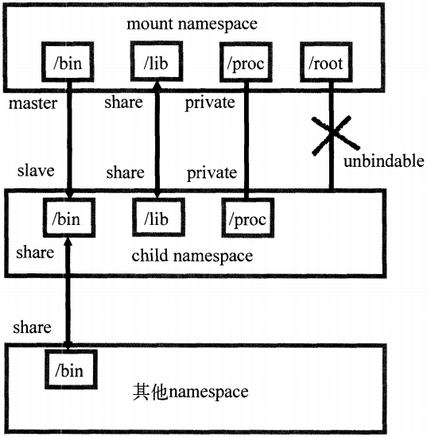
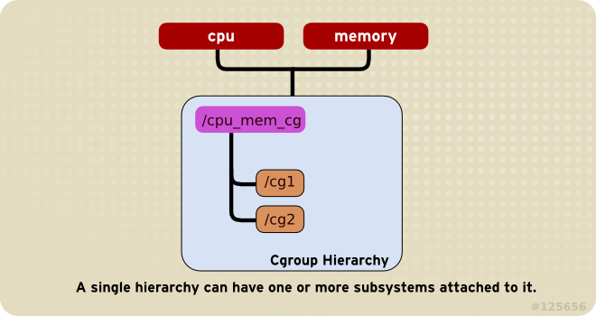
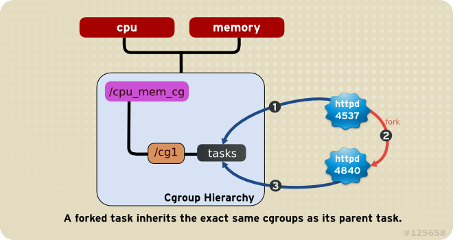

# Linux Namespace and Cgroups

Namespace 和 Cgroups 是Linux系统提供的主要用于虚拟化或者容器的底层基础。通过下面介绍，使读者对虚拟化的实现基础有更加深刻的理解，并能够基于实际情况自行设置资源分配。

## linux namespace

> 关于linux namespace的介绍，可简单查看官方文档：[Linux Namespace in Operations](https://lwn.net/Articles/531114/)

`Linux Namespace`是 Linux 提供的一种内核级别**环境隔离**的技术方案。它从内核版本（kernel-2.6.23）开始引入实现，经过约 5 年的时间逐步趋向稳定。当前，`linux Namespace`一共支持 6 类资源的隔离，其分别如下：

| 名称    | 系统调用参数  | 引入版本      | 说明                                                         |
| ------- | ------------- | ------------- | ------------------------------------------------------------ |
| Mount   | CLONE_NEWNS   | 2.4.19        | 文件系统的挂载/卸载点，类似chroot的系统调用，但是这种方式下更加安全和灵活，比如一个NS下的挂载，可出现到另一个NS上； |
| UTS     | CLONE_NEWUTS  | 2.6.19        | 主要隔离两种系统标志，node_name和domain_name;可应用于 uname、sethostname、setdomainname等系统调用；用于网络信息服务（NIS） |
| IPC     | CLONE_NEWIPC  | 2.6.19        | 隔离进程间通信，Linux 下 IPC 主要方式包括：共享内存、信号量、消息队列。每个IPC NS有特定的System V IPC identifiers 和 POSIX Message Queue filesystem； |
| PID     | CLONE_NEWPID  | 2.6.24        | 隔离进程 ID 号的空间，不同NS下的PID可以相同。PID的NS是可以嵌套的，比如宿主机下的container 创建一个NS。 |
| Network | CLONE_NEWNET  | 2.6.24~2.6.29 | 隔离网络资源，每个NS下具有独立的network devices, IP addresses, IP routing tables, `/proc/net` directory, port numbers等等； |
| User    | CLONE_NEWUSER | 2.6.23~3.8    | 隔离用户/用户组的ID空间；                                    |


系统环境资源隔离的目的是通过抽象封装全局的系统资源，使同一种系统资源在不同namespace的封装下，其所属进程的看到的系统资源空间是独立的。

> 上述翻译上有些拗口，可细细体会下原话：
>
> The purpose of each namespace is to wrap a particular global system resource in an abstraction that makes it appear to the processes within the namespace that they have their own isolated instance of the global resource. 

怎么理解呢，比如对于UTS资源，也就是hostname/domain的系统资源。正常情况下，我们在 /etc/hostname 下配置域名即可，这样，所有的进程在获取 hostname 时，都会取得同样的配置值。但是如果引入 namespace 的话，在不同的 namespace 下，都可以设置 hostname 的值（可以不相同）。这样，对于在某个 namespace 下的进程来说，它只能取到 namespace 下配置的 hostname，而不能获取其他 namespace 的 hostname，从而达到进程间的系统资源隔离。如下图所示：


所有系统资源的 namespace 都是独立的，即一个进程可以同时属于多个不同系统资源的 namespace 定义。（备注：在上图中 `NS=Global`的盒子并不一定是这样架构，还是看具体的实现，这里只是为了更好的描述而画成这样。）

namespace 是支持实现容器技术的基础，同时也是轻量级虚拟化技术的基础。通过namespace的环境隔离，就能够实现某个进程是系统中的唯一进程，并且能够修改控制^全局系统资源^假象，这个进程在虚拟下就是虚拟机或者容器在宿主机环境中的主进程。


### Linux 支持的 NS 类型

namespace 和 cgroups 技术是容器的基石，其中衍生出来的 LXC 和 docker 实际上就是对 NS 和 Cgroups 的配置管理，以实现容器运行管理的配套工具。下面，我们通过这些 namespace 的使用例子，简单描绘下容器对系统资源的利用和管理套路。在虚拟化容器流程中，关键的几个系统调用如下：

- clone()，用来创建一个新的进程，并可以通过上面的CLONE_NEWxxx参数（参照上表）实现 NS 隔离；
- unshare()，使某个进程脱离某个 NS；
- setns()，将某进程加入到某个 NS 中。

#### UTS NS

UTC Namespace 主要目的是独立出主机名和网络信息服务（NIS， Network Information Service）。

```c
// file : utc_ns.c
#define _GNU_SOURCE 
#include <sys/types.h>
#include <sys/wait.h>
#include <stdio.h>
#include <sched.h>
#include <signal.h>
#include <unistd.h>

/* 定义一个给 clone 用的栈，栈大小1M */
#define STACK_SIZE (1024 * 1024) 
static char container_stack[STACK_SIZE];

char* const container_args[] = {
    "/bin/bash",
    NULL
};

/* 与uts有关的代码:此处只演示主机名的隔离 */
int container_main(void* arg) 
{ 
    printf("Container - inside the container!\n"); 
    sethostname("container",10); /* 设置hostname */ 
    execv(container_args[0], container_args); 
    printf("Something's wrong!\n"); 
    return 1; 
} 
 
int main() 
{ 
    printf("Parent - start a container!\n"); 
    int container_pid = clone(container_main, container_stack+STACK_SIZE,  
            CLONE_NEWUTS | SIGCHLD, NULL); /*启用CLONE_NEWUTS Namespace隔离 */ 
    waitpid(container_pid, NULL, 0); 
    printf("Parent - container stopped!\n"); 
    return 0; 
}
```

将上述代码进行 gcc 编译后运行，可以发现，在子bash进程中，其 NS 空间下的 hostname 已变成 container。如下：

```txt
[root@develop linux_ns]# hostname
develop
[root@develop linux_ns]# gcc utc_ns.c  -o utc.ns
[root@develop linux_ns]# ./utc.ns 
Parent - start a container!
Container - inside the container!
[root@container linux_ns]# hostname
container
[root@container linux_ns]# uname -n
container
```


#### PID NS

pid 是 linux 系统进程的 ID 号。每个进程都会分配一个唯一的pid，而 linux 系统的 init 超级进程 id 为 1。init进程是Linux系统的初始化进程，其所有的进程都是通过 init 进程 fork 出来的。

```c
// file: pid_ns.c
#define _GNU_SOURCE 
#include <sys/types.h>
#include <sys/wait.h>
#include <stdio.h>
#include <sched.h>
#include <signal.h>
#include <unistd.h>

/* 定义一个给 clone 用的栈，栈大小1M */
#define STACK_SIZE (1024 * 1024) 
static char container_stack[STACK_SIZE];

char* const container_args[] = {
    "/bin/bash",
    NULL
};


int container_main(void* arg) 
{ 
    /* 此处的getpid()是为了获取容器的初始进程(init)的pid */
    printf("Container [%5d] - inside the container!\n",getpid()); 
    sethostname("container",10); /* 设置hostname */ 
    execv(container_args[0], container_args); 
    printf("Something's wrong!\n"); 
    return 1; 
} 
 
int main() 
{ 
    /* 此处的getpid()则是为了获取父进程的pid */ 
    printf("Parent [%5d] - start a container!\n",getpid()); 
    int container_pid = clone(container_main, container_stack+STACK_SIZE,  
            CLONE_NEWUTS | CLONE_NEWPID | SIGCHLD, NULL); 
    waitpid(container_pid, NULL, 0); 
    printf("Parent - container stopped!\n"); 
    return 0; 
}
```

可以发现，编译运行程序后，container进程是一个`pid=1`的进程。这表明，这是一个全新的PID NS，进程号由 1 开始。同时，由 pid=1 在 Unix/Linux 系统中的特殊性表明，container这个初始进程将管控这个 NS 空间中的所有子进程。

```txt
[root@container linux_ns]# gcc pid_ns.c -o pid_ns
[root@container linux_ns]# ./pid_ns
Parent [33785] - start a container!
Container [    1] - inside the container!
```


#### IPC NS

IPC（Inter-Process Communication），是Unix/Linux下进程间通信的一种方式，IPC有共享内存、信号量、消息队列等方法。只有在同一个Namespace下的进程才能相互通信。

```c
// file : ipc_ns.c
#define _GNU_SOURCE 
#include <sys/types.h>
#include <sys/wait.h>
#include <stdio.h>
#include <sched.h>
#include <signal.h>
#include <unistd.h>

/* 定义一个给 clone 用的栈，栈大小1M */
#define STACK_SIZE (1024 * 1024) 
static char container_stack[STACK_SIZE];

char* const container_args[] = {
    "/bin/bash",
    NULL
};


/* 与uts有关的代码:此处只演示主机名的隔离 */
int container_main(void* arg) 
{ 
    printf("Container - inside the container!\n"); 
    sethostname("container",10); /* 设置hostname */ 
    execv(container_args[0], container_args); 
    printf("Something's wrong!\n"); 
    return 1; 
} 
 
int main() 
{ 
    printf("Parent - start a container!\n"); 
    int container_pid = clone(container_main, container_stack+STACK_SIZE,  
            CLONE_NEWUTS | CLONE_NEWIPC | SIGCHLD, NULL); /*新增CLONE_NEWIPC就可以了 */ 
    waitpid(container_pid, NULL, 0); 
    printf("Parent - container stopped!\n"); 
    return 0; 
}
```

编译运行该程序，运行前后对比，宿主机 ipc 消息队列，key值为：0x696efc28，新建 ipc ns后，没有 ipc，手动创建一个 ipc 消息队列，其 key 值为：0xd0848bbc。宿主机和container进程中的 ipc 相互独立。

```txt
[root@develop linux_ns]# ipcs -q

------ Message Queues --------
key        msqid      owner      perms      used-bytes   messages    
0x696efc28 0          root       644        0            0           

[root@develop linux_ns]# gcc ipc_ns.c -o ipc_ns
[root@develop linux_ns]# ./ipc_ns 
Parent - start a container!
Container - inside the container!
[root@container linux_ns]# ipcs -q

------ Message Queues --------
key        msqid      owner      perms      used-bytes   messages    

[root@container linux_ns]# ipcmk -Q
Message queue id: 0
[root@container linux_ns]# ipcs -q

------ Message Queues --------
key        msqid      owner      perms      used-bytes   messages    
0xd0848bbc 0          root       644        0            0           
```


#### Mount NS

挂载点是一个系统非常重要的一部分，我们访问的所有数据，都是通过根文件系统的目录`/` （rootfs）进行的。而其他所有的设备，都是基于此进行挂载形成目录树的。在前面的例子中，如果没有新建 Mount NS，我们对目录的访问（如执行 ls），其得到的结果仍然是宿主机的目录树结构。

进程在创建mount namespace时，会把当前的文件结构复制给新的namespace。新namespace中的所有mount操作都只影响自身的文件系统，对外界不会产生任何影响。这样做法非常严格地实现了隔离，但对某些情况可能并不适用。比如父节点namespace中的进程挂载了一张CD-ROM，这时子节点namespace复制的目录结构是无法自动挂载上这张CD-ROM，因为这种操作会影响到父节点的文件系统。

挂载传播（mount propagation）就是为了解决这个问题。挂载传播定义了挂载对象（mount object）之间的关系，这样的关系包括共享关系和从属关系，系统用这些关系决定任何挂载对象中的挂载事件如何传播到其他挂载对象。所谓传播事件，是指由一个挂载对象的状态变化导致的其它挂载对象的挂载与解除挂载动作的事件。

- 共享关系（share relationship）。如果两个挂载对象具有共享关系，那么一个挂载对象中的挂载事件会传播到另一个挂载对象，反之亦然。
- 从属关系（slave relationship）。如果两个挂载对象形成从属关系，那么一个挂载对象中的挂载事件会传播到另一个挂载对象，但是反过来不行；在这种关系中，从属对象是事件的接收者。

一个挂载状态可能为如下的其中一种：

- 共享挂载（shared），就是传播事件的挂载对象；
- 从属挂载（slave），接收传播时间的挂载对象；
- 共享/从属挂载（shared and slave），同时兼顾上述两种的；
- 私有挂载（private），既不传播也不接收传播事件的挂载对象；
- 不可绑定挂载（unbindable），即创建mount namespace时这块文件对象不可被复制




最上层的mount namespace下的/bin目录与child namespace通过master slave方式进行挂载传播，当mount namespace中的/bin目录发生变化时，发生的挂载事件能够自动传播到child namespace中；/lib目录使用完全的共享挂载传播，各namespace之间发生的变化都会互相影响；/proc目录使用私有挂载传播方式，各mount namespace之间互相隔离；最后的/root目录一般都是管理员所有，不能让其他mount namespace挂载绑定。

默认情况下，所有挂载都是私有的。设置为共享挂载的命令如下。

```
mount --make-shared <mount-object>
mount --make-slave <mount-object>
mount --make-private <mount-object>
mount --make-unbindable <mount-object>
```


如果想做成类似容器的形式，则需要重构整个目录树，即对根目录进行重新挂载。首先，我们需要先构造一个类似的目录结构 `./rootfs`（因为是测试，部分目录可为空）。如果是希望如 docker 镜像一般能实际使用，则需要构建一个完全的系统目录，包括运行的命令和so链接库等，如下所示：

```txt
[root@container linux_ns]# ls rootfs/
bin  dev  etc  home  lib  lib64  mnt  opt  proc  root  run  sbin  sys  tmp  usr  var
```

为了完整模拟系统的运行，我们还需要一些关键的命令和库（简单从宿主机上拷贝一下即可）如下：

```txt
[root@develop rootfs]# ls bin usr/bin
bin:
bash  cat  chgrp  chown  cp  echo  gzip  hostname  less  ln  mount  mountpoint  netstat  ping  rm  sed  tabs  tac  tee  test  top  touch  tty  umount

usr/bin:
awk  env  groups  head  id  mesg  sort  strace  tail  top  uniq  vi  wc  xargs
```

然后通过 `ldd xxx` 命令将其依赖的所有 so 文件拷贝到相应的地方。因为这步骤很繁琐，因此我们仅拷贝`ls|id|bash`这几个基本命令。 如 bash 则为：

```txt
[root@develop rootfs]# ldd /bin/bash
	linux-vdso.so.1 =>  (0x00007ffc9ac85000)
	libtinfo.so.5 => /lib64/libtinfo.so.5 (0x00007f68f6f08000)
	libdl.so.2 => /lib64/libdl.so.2 (0x00007f68f6d04000)
	libc.so.6 => /lib64/libc.so.6 (0x00007f68f6937000)
	/lib64/ld-linux-x86-64.so.2 (0x00007f68f7132000)
```

如果我们希望增加一些定制性的配置，而不是每次都硬编码（如docker 中的 -v 指定挂载目录，或者启动容器时定制化hostname等），我们可以再定义一些文件或目录，在 container 启动时挂载进去即可。如：

```txt
# set hostname to ct_node1
[root@container linux_ns] ls ./conf
hostname
```

完整代码如下：

```c
// file: mount_ns.c
#define _GNU_SOURCE
#include <sys/types.h>
#include <sys/wait.h>
#include <sys/mount.h>
#include <stdio.h>
#include <sched.h>
#include <signal.h>
#include <unistd.h>
 
#define STACK_SIZE (1024 * 1024)
 
static char container_stack[STACK_SIZE];
char* const container_args[] = {
    "/bin/bash",
    "-l",
    NULL
};
 
int container_main(void* arg)
{
    printf("Container [%5d] - inside the container!\n", getpid());
 
    sethostname("container",10); /* 设置hostname */
 
    if (mount("proc", "rootfs/proc", "proc", 0, NULL) !=0 ) {
        perror("proc");
    }
    if (mount("sysfs", "rootfs/sys", "sysfs", 0, NULL)!=0) {
        perror("sys");
    }
    if (mount("none", "rootfs/tmp", "tmpfs", 0, NULL)!=0) {
        perror("tmp");
    }
    if (mount("udev", "rootfs/dev", "devtmpfs", 0, NULL)!=0) {
        perror("dev");
    }
    if (mount("devpts", "rootfs/dev/pts", "devpts", 0, NULL)!=0) {
        perror("dev/pts");
    }
    if (mount("shm", "rootfs/dev/shm", "tmpfs", 0, NULL)!=0) {
        perror("dev/shm");
    }
    if (mount("tmpfs", "rootfs/run", "tmpfs", 0, NULL)!=0) {
        perror("run");
    }
    /* 
     * 模仿Docker的从外向容器里mount相关的配置文件 
     * 你可以查看：/var/lib/docker/containers/<container_id>/目录，
     * 你会看到docker的这些文件的。
     */
    if (mount("conf/hostname", "rootfs/etc/hostname", "none", MS_BIND, NULL)!=0) {
        perror("conf");
    }
    /* 模仿docker run命令中的 -v, --volume=[] 参数干的事 */
    if (mount("/tmp/t1", "rootfs/mnt", "none", MS_BIND, NULL)!=0) {
        perror("mnt");
    }
 
    /* chroot 将 rootfs 作为根目录 */
    if ( chdir("./rootfs") != 0 || chroot("./") != 0 ){
        perror("chdir/chroot");
    }
 
    execv(container_args[0], container_args);
    printf("Something's wrong!\n");
    return 1;
}
 
int main()
{
    printf("Parent [%5d] - start a container!\n", getpid());
    int container_pid = clone(container_main, container_stack+STACK_SIZE, 
            CLONE_NEWUTS | CLONE_NEWIPC | CLONE_NEWPID | CLONE_NEWNS | SIGCHLD, NULL);
    waitpid(container_pid, NULL, 0);
    printf("Parent - container stopped!\n");
    return 0;
}
```

最终执行的结果如下：

```txt
[root@container linux_ns]# ./mount_ns
Parent [ 4517] - start a container!
Container [    1] - inside the container!
root@container:/# mount
proc on /proc type proc (rw,relatime)
sysfs on /sys type sysfs (rw,relatime)
none on /tmp type tmpfs (rw,relatime)
udev on /dev type devtmpfs (rw,relatime,size=493976k,nr_inodes=123494,mode=755)
devpts on /dev/pts type devpts (rw,relatime,mode=600,ptmxmode=000)
tmpfs on /run type tmpfs (rw,relatime)
/dev/disk/by-uuid/18086e3b-d805-4515-9e91-7efb2fe5c0e2 on /etc/hostname type ext4 (rw,relatime,errors=remount-ro,data=ordered)d)
 
[root@container /]# ls /bin /usr/bin
/bin:
bash  cat  chgrp  chown  cp  echo  gzip  hostname  less  ln  mount  mountpoint  netstat  ping  rm  sed  tabs  tac  tee  test  top  touch  tty  umount

/usr/bin:
awk  env  groups  head  id  mesg  sort  strace  tail  top  uniq  vi  wc  xargs
```


#### Network NS

Network NS 主要提供了关于网络资源的隔离，包括网络设备、IPv4 和 IPv6 协议栈、IP路由表、防火墙、socket套接字、/proc/net 目录、/sys/class/net 目录等。一个物理的网络设备最多存在一个network namespace中，通过 `veth pair` 在不同的 Network NS 间创建通道，以此达到通信的目的。

一般情况下，物理网络设备都分配在最初的 root NS（系统默认的NS）中。如果有多块物理网卡，也可以把其中一块或多块分配给新创建的 network NS。

> **注意**
>
> 当新创建的network namespace被释放时（namespace文件没有被挂载或打开），在这个 NS 中的物理网卡会返回到 root NS 上，而非创建该进程的父进程所在的 network NS。

为了达到用户在 network NS 中使用网络是独占感受的目的，典型的做法就是创建一个 veth pair，一端放在新的NS 中，另一端放在原先的 NS 中连接物理网络设备，再通过把多个设备接入网桥或者进行路由转发，来实现通信的目的。


下面命令介绍如何创建一个network NS 以及 veth pair。

```shell
## 首先，创建一个网桥 bridge，比如叫 docker0
brctl addbr docker0
brctl stp docker0 off
ifconfig docker0 172.168.10.1/24 up # 为网桥设置 IP 地址
 
## 然后，创建一个network namespace - ns1
ip netns add ns1 
 
# 激活namespace中的loopback，即127.0.0.1（使用ip netns exec ns1来操作ns1中的命令）
ip netns exec ns1 ip link set dev lo up 
 
# 然后，创建一个 veth pair，veth 就是系统层面上的网络设备，名称（veth-ns1，docker0-v1）
ip link add veth-ns1 type veth peer name docker0-v1
 
# 把 veth-ns1 设置到 namespace ns1中，这样容器中就会有一个新的网卡了
ip link set veth-ns1 netns ns1
 
# 把容器里的 veth-ns1 改名为 eth0 （容器外会冲突，容器内就不会了）
ip netns exec ns1 ip link set dev veth-ns1 name eth0 
 
# 为容器中的网卡分配一个IP地址，并激活它
ip netns exec ns1 ip addr add 172.168.10.11/24 dev eth0
ip netns exec ns1 ip link set dev eth0 up
 
# 把veth pair的另一端 docker0-v1 添加上网桥上
ip link set dev docker0-v1 master docker0
ip link set dev docker0-v1 up
 
# 为容器增加一个路由规则，让容器可以访问外面的网络
ip netns exec ns1 ip route add default via 172.168.10.1
```

上述命令中，`ip netns exec ns1`表示在 ns1 的NS空间下执行后接的命令。通过这些命令，就能够完成容器和宿主机之间的正常通信。这就是虚拟化的网络基础。


#### User NS

`user namespace` 主要隔离了安全相关的标识符（identifiers）和属性（attributes），包括用户ID、用户组ID、root目录、key（指密钥）以及特殊权限。这意味着，通过 `clone()` 创建的新进程在新 user NS 中可以拥有不同的用户和用户组。同时，一个进程在容器外属于一个没有特权的普通用户，但是他创建的容器进程却属于拥有所有权限的超级用户，这个技术为容器提供了极大的自由。

> 在 Linux 中，特权用户 root的 UID 就是 0。在一个新的 User NS 中，可以将容器外的普通用户映射为容器内的特权用户。

要把容器内外的 user-id 和 group-id 进行映射，通过修改 `/proc/{pid}/uid_map` 和 `/proc/{pid}/gid_map ` 的文件达成。该文件格式如下：

```txt 
     ID-inside-ns ID-outside-ns length
如：        0         1000         1       # 表示将用户id 1000 映射为容器内用户id 0
```

length字段表示映射范围，一般来说，length 都填 1，表示一一对应。如果大于 1，则按起始顺序建立一一映射关系。为了达到映射关系，我们首先需要建立一个新的用户 -- bar，同时将bar用户加入到root用户组，如下：

```txt
[root@develop linux_ns]# groupadd -g 1500 bar
[root@develop linux_ns]# useradd -u 1500 bar -g bar
[root@develop linux_ns]# usermod -a -G root bar
[root@develop linux_ns]# su bar
[bar@develop linux_ns]$ id
uid=1500(bar) gid=1500(bar) groups=1500(bar),0(root)
```

> User NS 在内核3.8后支持，在 Centos7 中该特性默认是关闭的，需要重新打开：
>
> ```txt
> grubby --args="namespace.unpriv_enable=1 user_namespace.enable=1" --update-kernel="$(grubby --default-kernel)"
> 
> echo "user.max_user_namespaces=15076" >> /etc/sysctl.conf
> 
> reboot
> ```

然后编译执行如下程序：

```c
#define _GNU_SOURCE
#include <sys/types.h>
#include <sys/wait.h>
#include <stdio.h>
#include <sched.h>
#include <signal.h>
#include <unistd.h>
#include <sys/capability.h>  // 需要安装 libcap-devel 包
 
/* 定义一个给 clone 用的栈，栈大小1M */
#define STACK_SIZE (1024 * 1024) 
static char container_stack[STACK_SIZE];

char* const container_args[] = {
    "/bin/bash",
    NULL
};

void set_uid_map(pid_t pid, int inside_id, int outside_id, int length)
{
    char path[256];
    sprintf(path, "/proc/%d/uid_map", getpid());
    FILE *uid_map = fopen(path, "w");
    fprintf(uid_map, "%d %d %d", inside_id, outside_id, length);
    fclose(uid_map);
}
 
void set_gid_map(pid_t pid, int inside_id, int outside_id, int length)
{
    char path[256];
    sprintf(path, "/proc/%d/gid_map", getpid());
    FILE *gid_map = fopen(path, "w");
    fprintf(gid_map, "%d %d %d", inside_id, outside_id, length);
    fclose(gid_map);
}
 
int container_main(void *args)
{
    const int gid=getgid(), uid=getuid();
    printf("Container [%5d] - inside the container!\n", getpid());
    
    sethostname("container",10); /* 设置hostname */ 
    set_uid_map(getpid(), 0, uid, 1);
    set_gid_map(getpid(), 0, gid, 1);
    
    execv(container_args[0], container_args);
    printf("something wrong.\n");
    return 1;
}

int main()
{
    printf("Parent [%5d] - start a container!\n", getpid());
    int container_pid = clone(container_main, container_stack+STACK_SIZE,  
            CLONE_NEWUSER | CLONE_NEWUTS | SIGCHLD, NULL);
    waitpid(container_pid, NULL, 0); 
    printf("Parent - container stopped!\n"); 
}
```

运行后如下：

```txt
[root@container linux_ns]# gcc -lcap user_ns.c -o user_ns
[root@develop linux_ns]# su bar
[bar@develop linux_ns]$ id
uid=1500(bar) gid=1500(bar) groups=1500(bar),0(root)
[bar@develop linux_ns]$ ./user_ns 
Parent - start a container!
Container - inside the container!
eUID = 0;  eGID = 65534;  capabilities: = cap_chown,cap_dac_override,...
[root@container linux_ns]# id
uid=0(root) gid=65534(nfsnobody) groups=65534(nfsnobody)
```

> 在container内，用户bar由1500的id变为 0。但是不知道为什么group-id没有预期变化。可能是遇到一些权限上的问题吧，或者是系统支持不太好。如果在运行后通过 container id 手动设置，那么gid还是可以成功设置进去的。

从 Linux-kernel 3.8开始，非特权进程可以创建 user NS，使得非特权进程能够在新的 user NS 中拥有 root 特权（而其他的五类 NS 都是需要 root 权限），所以无特权应用程序现在可以访问以前仅限于 root 权限的功能。虽然开发者Eric Biederman 花费大量精力以保证 user NS 功能的正确性和安全性，但是可能会有一些暂未发现的隐患。

同时，User NS 通常是以普通用户创建运行，但是别的Namespace需要root权限。为了能够同时使用多个 NS，一般的做法是先创建 User NS，然后把这个用户映射成root，在容器内用 root 来创建其它的 namespace。


## linux control groups（cgroups）

### cgroups 简介

> 不同系统发行版本对 cgroups 的用法可能有些微差异，相关的使用操作主要针对 redhat-7 版本的系统进行描述，但是 cgroups 的概念本质上是一致的。
>
> 在RHEL官方文档中，有详细的介绍。因为cgroups是rhel-6引入的，其很多原型描述都在 [RHEL-6-cgroups](https://access.redhat.com/documentation/en-us/red_hat_enterprise_linux/6/html/resource_management_guide) 中，而 rhel-7 在此基础上做了优化，最主要是引入 systemd 进行 cgroups 的服务管理，可查阅：[RHEL-7-cgroups](https://access.redhat.com/documentation/en-us/red_hat_enterprise_linux/7/html/resource_management_guide)。


**Control Groups ** 是 linux kernel 提供的一种机制，根据需求把一系列系统任务及其子任务整合(或分隔)到按资源划分等级的不同组内，从而为系统资源管理提供一个统一的框架。本质上来说，cgroups 是内核附加在程序上的一系列钩子(hook)，通过程序运行时对资源的调度触发相应的钩子以达到资源追踪和限制的目的。

实现 cgroups 的主要目的是为不同用户层面的资源管理提供一个统一化的接口。从单个任务的资源控制到操作系统层面的虚拟化，cgroups 提供了四大功能：

- **资源限制（Resource limitation）**：cgroups 可以对任务是要的资源总额进行限制。比如设定任务运行时使用的内存上限，一旦超出就发 OOM。
- **优先级分配（Prioritization）**：通过分配的 CPU 时间片数量和磁盘 IO 带宽，实际上就等同于控制了任务运行的优先级。
- **资源统计（Accounting）**：cgroups 可以统计系统的资源使用量，比如 CPU 使用时长、内存用量等。这个功能非常适合当前云端产品按使用量计费的方式。
- **任务控制（Control）**：cgroups 可以对任务执行挂起、恢复等操作。


在 RHEL-7 中，可用的 cgroups 资源控制类型包括：

- `blkio` — sets limits on input/output access to and from block devices;
- `cpu` — uses the CPU scheduler to provide cgroup tasks access to the CPU. It is mounted together with the `cpuacct` controller on the same mount;
- `cpuacct` — creates automatic reports on CPU resources used by tasks in a cgroup. It is mounted together with the `cpu` controller on the same mount;
- `cpuset` — assigns individual CPUs (on a multicore system) and memory nodes to tasks in a cgroup;
- `devices` — allows or denies access to devices for tasks in a cgroup;
- `freezer` — suspends or resumes tasks in a cgroup;
- `memory` — sets limits on memory use by tasks in a cgroup and generates automatic reports on memory resources used by those tasks;
- `net_cls` — tags network packets with a class identifier (**classid**) that allows the Linux traffic controller (the `tc` command) to identify packets originating from a particular cgroup task. A subsystem of `net_cls`, the `net_filter` (iptables) can also use this tag to perform actions on such packets. The `net_filter` tags network sockets with a firewall identifier (**fwid**) that allows the Linux firewall (the `iptables` command) to identify packets (skb->sk) originating from a particular cgroup task;
- `perf_event` — enables monitoring cgroups with the **perf** tool;
- `hugetlb` — allows to use virtual memory pages of large sizes and to enforce resource limits on these pages.

我们可以通过 `mount` 命令查看系统中正在使用的 `cgroups` ，如下：


是的，cgroups 提供了一个 **cgroup** 虚拟文件系统，作为进行分组管理和各子系统设置的用户接口。要使用 cgroup，必须挂载类型为 cgroup 文件系统，通过挂载选项指定使用哪个 subsystem。每个挂载的 subsystem 具有一些共同的 cgroup 特性文件和该资源的限制文件，其共同配置文件如下：

| 文件名                | R/W  | 用途                                                         |
| --------------------- | ---- | ------------------------------------------------------------ |
| release_agent         | RW   | 指定release agent执行脚本的文件路径（该文件在最顶层cgroup目录中存在），在这个脚本通常用于自动化`umount`无用的cgroup |
| notify_on_release     | RW   | 填0或1，表示是否在cgroup中最后一个task退出时通知运行`release agent`，默认情况下是0，表示不运行。 |
| tasks                 | RW   | 这个文件中罗列了所有在该cgroup中task的PID。该文件并不保证task的PID有序，把一个task的PID写到这个文件中就意味着把这个task加入这个cgroup中。 |
| cgroup.procs          | R    | 这个文件罗列所有在该cgroup中的线程组ID。该文件并不保证线程组ID有序和无重复。写一个线程组ID到这个文件就意味着把这个组中所有的线程加到这个cgroup中。 |
| cgroup.event_control  | RW   | 监视状态变化和分组删除事件的配置文件                         |
| cgroup.clone_children | RW   | 如果这个值是 1，子 cgroup 才会继承父 cgroup 的配置           |
| cgroup.sane_behavior  | R    | 在kernel 3.16 引入 [unified hierarchy](https://lwn.net/Articles/601840/) 设计，所有subsystem都挂载到根层级下，只有叶子节点可以存在tasks，非叶子节点只进行资源控制。 |


如何理解 cgroups ？顾名思义，cgroups 是控制进程使用系统资源的组。因此，它必有**系统资源管理**的功能和**进程组管理**的功能。为了灵活方便的使用，在设计中往往需要增加父子cgroups 继承的关系（层次关系）。在现实中，我们更多的是针对原有的cgroups进行微调，以适配实际使用情况。如果没有层次关系，那么每个 cgroups 都需要全部配置一遍限制条件，就会非常繁琐了。

综上，在介绍 cgroups 前，先简单理解一些 cgroups 的概念：

- **task（任务）**：在 cgroups 中，task 就表示系统的一个进程。cgroups 会通过一个文件（tasks）记录所有使用了该 cgroups 的进程 id 号；
- **cgroup（控制组）**：cgroups 中的资源控制都以 cgroup 为单位实现。cgroup表示按某种资源控制标准划分而成的任务组，包含一个或多个子系统。一个任务可以加入某个 cgroup，也可以从某个 cgroup 迁移到另外一个 cgroup。
- **subsystem（子系统）**：subsystem 就是一个资源调度控制器（Resource Controller），配置了该cgroup 下的进程组使用该资源的限制。比如 cpu subsystem 可以控制CPU时间分配，mem subsystem 可以限制内存使用量。
- **hierarchy（层级树）**：hierarchy 由一系列 cgroup 以一个树状结构排列而成。hierarchy 中的 cgroup 节点可以包含零或多个子节点，子节点继承父节点的属性。整个系统可以有多个hierarchy。

其之间的关系图如下所示：


> 有些值得注意的是，虽然cgroup、subsystem、hierarchy的架构从属关系如上图所示，但由于其通过挂载subsystem 的 cgroup 文件系统方式进行使用，使得这种层次结构在文件系统上的展示组织起来特别怪（非常容易把 subsystem 和 cgroup 搞混，使得本身清晰的概念变得难以理解）

cgroups 的模型架构其实和进程模型类似。我们知道，Linux 系统启动时只有一个初始进程：**init 进程**。其他所有的进程都是通过 `init` 进程 fork 出来的子进程，然后子进程再创建自己的子进程，形成了一个具有层次关系的目录树结构。相对进程树结构而言，cgroups 拥有多个层级树，组成森林结构。森林结构是有意义的，因为同一个层级树下的 cgroups 具有继承父 cgroups 的特性，使用多个 hierarchy 结构能够使进程自由选择资源的限制条件。它们之间具有一些规则：

- **规则1：** 同一个hierarchy可以 attach 一个或多个subsystem。如下图，cpu 和 memory 的 subsystem 加到了同一个hierarchy。

  

- **规则2：** 一个 subsystem 可以 attach 到多个 hierarchy，但如果某个 hierarchy 已经存在了其他类型的 subsystem 则不行。如下图，小圈中的数字表示subsystem attach 的时间顺序；


- **规则3：** 系统新建一个 hierarchy，那么该系统上的所有 task 默认构成了这个新建的 hierarchy 的初始化cgroup，这个 cgroup 也称为 root cgroup。一个 task 不能存在于同一个 hierarchy 的不同 cgroup 中，但是可以存在在不同 hierarchy 中的 cgroup 中。如果操作时把一个 task 添加到同一个 hierarchy 中的另一个 cgroup 中，则会从第一个cgroup中移除。这样做的主要目的是防止出现矛盾，如 CPU subsystem 为`/cg1`分配了30%，而为`/cg2`分配了50%，此时如果`httpd`在这两个cgroup中，就会出现矛盾。


- **规则4：** 进程（task）在 fork 自身时创建的子任务（child task）默认与原task在同一个 cgroup 中，但是child task 允许被移动到不同的 cgroup 中。总结起来就是：初始化时子任务与父任务在同一个cgroup，但是这种关系随后可以改变。



前面描述的是 cgroups 的一般性概念，下面描述在 RHEL-7 中，对于 cgroups 的管理。


### cgroups的官方文档

cgroups 具有`blkio`、`memory`、`cpu` 等多达 10 种的资源控制管理，每个资源都具有很多的配置项，难以在一篇文档内完全描述。本节介绍如何获取官方描述，以针对自己实际情况进行配置。

```txt
~]# yum install kernel-doc
```

通过上述命令，可以获取 kernel 的介绍文档，和cgroups相关的章节如下（路径：`/usr/share/doc/kernel-doc-<kernel_version>/Documentation/cgroups/`）：

- `blkio` subsystem — `blkio-controller.txt`
- `cpuacct` subsystem — `cpuacct.txt`
- `cpuset` subsystem — `cpusets.txt`
- `devices` subsystem — `devices.txt`
- `freezer` subsystem — `freezer-subsystem.txt`
- `memory` subsystem — `memory.txt`
- `net_cls` subsystem — `net_cls.txt`


与cpu相关的章节在：

- Real-Time scheduling — `/usr/share/doc/kernel-doc-<kernel_version>/Documentation/scheduler/sched-rt-group.txt`
- CFS scheduling — `/usr/share/doc/kernel-doc-<kernel_version>/Documentation/scheduler/sched-bwc.txt`


### RHEL-7 cgroups 管理

> 在 RHEL-6 的时候，默认是使用基于 libcgroup 库的 cgconfig 工具进行挂载和管理 cgroups。但是 systemd 不兼容此种方式。因此，不要使用任意由 libcgroup 开发的工具去管理 systemd 挂载的 hierarchy。否则会产生意想不到的后果。

在 RHEL-7 中，系统使用了 systemd 来对 cgroups 进行管理使用。通过将 cgroup 层级系统与 systemd unit 树绑定，systemd 可以把资源管理的设置从进程级别移至应用程序级别。因此，我们可以使用 systemctl 指令，或者通过修改 systemd unit 的配置文件来管理 unit 相关的资源。

#### systemd

首先，我们先了解下 systemd 组织方式。任意运行在系统中的进程都是 systemd init 服务的子进程。在默认情况下，systemd 自动创建 *slice*, *scope* 和 *service* 的层级结构，以进行系统资源的控制管理。这三种 unit 类型说明如下：

- **Service**，一个或一组进程，由 systemd 依据 unit 配置文件启动。service 对指定进程进行封装，这样进程可以作为一个整体被启动或终止。其命名规则一般为：`name.service`。
- **Scope**，外部创建的进程。这些进程通过 `fork()` 函数由任意进程启动和停止，然后在运行时（runtime）由 systemd 进行注册。例如：用户会话、 容器和虚拟机被认为是 scope。其命名规则一般为：`name.scope`。
- **Slice**， 一组按层级排列的 unit。slice 并不包含进程，但是会基于 scope 和 service 进程组织成层级结构。在某个hierarchy层次中，每一个 slice unit 对应了层级中一个位置的路径。破折号(“-”)字符充当路径组件的分隔符。如果一个 slice 命名为 `parent-name.slice`，那么表示它的父 slice 为 `parent-slice`。可以有层次的 slice 结构，比如 `parent-name-name2.slice` 诸如此类。根 slice 可表示为 `-.slice`。

service、scope 和 slice unit 被直接映射到 cgroup 树中的对象。通过使用 systemctl 命令，可以创建自定义 slice 来进一步修改这个结构。另外，systemd 会自动将系统中重要的 cgroups 内核资源挂载到 /sys/fs/cgroup/ 目录中。当这些 unit 被触发运行时，会直接映射到由 unit 名建立的 cgroup 路径中。例如，驻留在 test-waldo.slice 中的 exe .service 服务，其 slice 映射到 **systemd cgroup** 中 `systemd.slice/test.slice/test-waldo.slice/exe.service/`目录中。需要注意，所有的用户会话、虚拟机和容器进程会被自动放置在一个单独的 scope 单元中。管理员用户可以定义一个新的 slice 并配置 service 和 scope。

默认情况下，系统会创建四种类型的 slice，如下：

- **-.slice**：根 slice
- **system.slice**：所有系统 service 的默认位置
- **user.slice**：所有用户会话的默认位置
- **machine.slice**：所有虚拟机和 Linux 容器的默认位置

> 为了展示`machine.service` 的情景，可以通过安装 docker 运行一个容器或者使用 virt 工具创建一个虚拟机进行观察。

通过 `systemd-cgls` 命令可以看到所有的 slice 层次结构，如下：

```txt
[root@develop ~]# systemd-cgls
├─1 /usr/lib/systemd/systemd --switched-root --system --deserialize 20  
├─user.slice
│ └─user-1000.slice
│   └─session-1.scope
│     ├─11459 gdm-session-worker [pam/gdm-password]
│     ├─11471 gnome-session --session gnome-classic
│     ...
│     
└─system.slice
  ├─systemd-journald.service
  │ └─422 /usr/lib/systemd/systemd-journald
  ├─colord.service
  │ └─5001 /usr/libexec/colord
  ├─sshd.service
  │ └─1191 /usr/sbin/sshd -D
  │ 
  ...
```

正如您所看到的，service 和 scope 包含进程，并且被放置在 slice 形成的层次结构中。唯一一个例外是被标记为 `-.slice` 的 systemd 的 PID=1 的 init 进程。还要注意 `-.slice` 没有显示出来，因为它被隐式地标识为整个树的根。

前面我们说过，service、scope 和 slice 被一一映射到 cgroups 的资源管理目录。如下所示：

```txt
[root@develop ~]# ll /sys/fs/cgroup/systemd/user.slice/user-1000.slice/session-1.scope/
total 0
-rw-r--r--. 1 root root 0 Feb 19 18:23 cgroup.clone_children
--w--w--w-. 1 root root 0 Feb 19 18:23 cgroup.event_control
-rw-r--r--. 1 root root 0 Feb 19 18:23 cgroup.procs
-rw-r--r--. 1 root root 0 Feb 19 18:23 notify_on_release
-rw-r--r--. 1 root root 0 Feb 19 18:23 tasks
```

`/sys/fs/cgroup/systemd` 是一个子 cgroup。可以发现，其目录结构与上面 `systemd-cgls` 的执行结构是一致的。


#### 配置使用 cgroups

RHEL-7 使用 systemd 来对资源管理进行设置，该生成的配置可以是 transient(临时的)，也可以是 persistent (永久的)。所有被 systemd 监管的 persistent cgroup (持久的 cgroup) 都在 /usr/lib/systemd/system/ 目录中有一个 unit 配置文件。比如我们常见的 service 类型 unit 的配置文件。我们可以通过设置 unit 配置文件来控制应用程序的资源，persistent cgroup 的特点是即便系统重启，相关配置也会被保留。需要注意的是，scope unit 不能以此方式创建。


##### 创建 cgroups

使用 **systemd-run** 命令可以创建一个临时的 cgroup，它可以创建并启动临时的 service 或 scope unit，并在此 unit 中运行程序。其命令规则如下（管理员 root 运行）：

```txt
[~]# systemd-run --unit=name --scope --slice=slice_name command
```

- The *name* stands for the name you want the unit to be known under. If `--unit` is not specified, a unit name will be generated automatically. It is recommended to choose a descriptive name, since it will represent the unit in the `systemctl` output. The name has to be unique during runtime of the unit.
- Use the optional `--scope` parameter to create a transient *scope* unit instead of *service* unit that is created by default.
- With the `--slice` option, you can make your newly created *service* or *scope* unit a member of a specified slice. Replace *slice_name* with the name of an existing slice (as shown in the output of `systemctl -t slice`), or create a new slice by passing a unique name. By default, services and scopes are created as members of the **system.slice**.
- Replace *command* with the command you wish to execute in the service unit. Place this command at the very end of the `systemd-run` syntax, so that the parameters of this command are not confused for parameters of `systemd-run`.

比如，创建一个 slice 为 test 服务，运行 `top` 命令：

```txt
[root@develop ~]# systemd-run --unit=toptest --slice=test top -b
Running as unit toptest.service.

[root@develop ~]# systemd-cgls
├─1 /usr/lib/systemd/systemd --system --deserialize 96
├─test.slice
│ └─toptest.service
│   └─23854 /usr/bin/top -b
```

使用 `systemd-cgls` 就自动将 test.slice 加入到 systemd 的 cgroups 中。这样，就可以使用 systemctl 监控或配置 cgroups，限制 toptest.service 服务的资源使用。


##### 删除 cgroups

临时（Transient）的 cgroup 在进程退出时自动清除。在 `system-run` 时加入 `--remain‑after-exit` 可以保留该配置，以便收集运行时的信息。

通常情况下，可使用如下命令退出：

```txt
# 停止一个 service 进程组
systemctl stop name.service

# 停止 service cgroup 下的某一个或者多个进程，通过 kill-who 指定， signal默认为SIGTERM
# 这常用在一个service有多个进程的情况，比如 httpd.service
systemctl kill name.service --kill-who=PID,... --signal=signal

# 对于 persistent 的 cgroup，可以 diable 以清除配置
systemctl disable name.service
```


##### 修改 cgroups

systemd 将所有持久化（persistent）的 unit 的配置文件放置在`/usr/lib/systemd/system/`目录里。我们可以通过修改这些配置文件的参数，或者通过 `systemctl set-property` 命令手工修改 cgroups 的配置。其命令规则如下（管理员root运行）：

```txt
~]# systemctl set-property name parameter=value
```

一般地， 执行后配置就会马上生效，并且配置会写入到 unit 配置文件中，以防止重启后丢失。如果不希望永久配置，可加入`--runtime` 参数，使配置临时改变，如下：

```txt
~]# systemctl set-property --runtime name property=value
```

虽然并不是所有的 cgroups 配置都可以在 runtime 时进行修改，但是大部分都是可以的。其常用的参数列表如下：

| cgroup resource | name                                    | description                                                  |
| --------------- | --------------------------------------- | ------------------------------------------------------------ |
| cpu             | CPUShares=value                         | cpu使用的时间片，类似于使用权重，默认值 1024.相当于修改cgroups中的cpu.shares。可使用 systemd-cgtop 进行查看。 |
|                 | CPUQuota=value                          | value是一个百分比值，表示cpu分配给进程的最大使用配额，如果超过 100%，表示使用多个 cpu。 |
| memory          | MemoryLimit=value                       | 最大可分配的内存；后缀支持 K、M、G、T。                      |
| blkio           | BlockIOWeight=value                     | block io 权重，即io使用的优先级，取值[10, 1000]，默认1000，相当于平等读写磁盘 |
|                 | BlockIODeviceWeight=device_name value   | 设置某个设备的权重，如 xxx= /home/hhd 500                    |
|                 | BlockIOReadBandwidth=device_name value  | 设置读带宽，value 可取 K, M, G, T的后缀。                    |
|                 | BlockIOWriteBandwidth=device_name value | 设置写带宽，value 可取 K, M, G, T的后缀。                    |
| devices         | DeviceAllow=device_name options         | device_name可以是设备路径名称，或者是定义在/proc/devices的名称。options可以是 r\w\m 的组合，表示 读/写/创建 device节点。 |
|                 | DevicePolicy=value                      | *value* is one of: *strict* (only allows the types of access explicitly specified with `DeviceAllow`), *closed* (allows access to standard pseudo devices including /dev/null, /dev/zero, /dev/full, /dev/random, and /dev/urandom) or *auto* (allows access to all devices if no explicit `DeviceAllow` is present, which is the default behavior) |
| others          | Slice=slice_name                        | 配置slice的名称，默认是 system.slice，scope不能通过此进行配置，因为scope关联了parent-slice |
|                 | ExecStartPost=command                   | 当前，systemd仅支持 cgroups 的一个子集特性，但作为一个解决方案，可使用 ExecStartPost 进行配置。如运行该 command 以设置具体的 cgroup配置文件。 |

其示例如下：

```txt
[Service]
CPUShares=1500
CPUQuota=20%
MemoryLimit=1G

BlockIODeviceWeight=/home/jdoe 750
BlockIOReadBandwidth=/var/log 5M

ExecStartPost=/bin/bash -c "echo 1G > /sys/fs/cgroup/memory/system.slice/example.service/memory.memsw.limit_in_bytes"
```

要使其配置生效，需要重启服务，如下：

```txt
~]# systemctl daemon-reload
~]# systemctl restart example.service
```


下面通过前面的 toptest 例子，以加深理解。在修改前，先观察限制前的 toptest 服务相关资源：

```txt
[root@develop ~]# systemctl status toptest
● toptest.service - /usr/bin/top -b
   Loaded: loaded (/run/systemd/system/toptest.service; static; vendor preset: disabled)
  Drop-In: /run/systemd/system/toptest.service.d
           └─50-Description.conf, 50-ExecStart.conf, 50-Slice.conf
   Active: active (running) since Mon 2020-02-24 15:55:19 CST; 10min ago
 Main PID: 23854 (top)
   CGroup: /test.slice/toptest.service
           └─23854 /usr/bin/top -b

[root@develop ~]# cat /proc/23854/cgroup 
11:hugetlb:/
10:perf_event:/
9:freezer:/
8:memory:/
7:cpuset:/
6:blkio:/
5:devices:/test.slice
4:cpuacct,cpu:/
3:pids:/test.slice
2:net_prio,net_cls:/
1:name=systemd:/test.slice/toptest.service
```

可以发现，默认情况下，只有 devices 和 pids 资源会新建一个 test.slice 的子 cgroup 限制，其余应用了 root cgroup 的配置。现限制 toptest.service 的 CPUShares 为 600，可用内存的上限为 550M：

```txt
systemctl set-property toptest.service CPUShares=600 MemoryLimit=500M
```

再次查看其 cgroup 信息：

```txt
[root@develop yum.repos.d]# cat /proc/23854/cgroup 
11:hugetlb:/
10:perf_event:/
9:freezer:/
8:memory:/test.slice/toptest.service
7:cpuset:/
6:blkio:/
5:devices:/
4:cpuacct,cpu:/test.slice/toptest.service
3:pids:/test.slice
2:net_prio,net_cls:/
1:name=systemd:/test.slice/toptest.service
```

在 CPU 和 memory 子系统中都出现了 toptest.service 的名字。查看 **/sys/fs/cgroup/memory/test.slice** 和 **/sys/fs/cgroup/cpu/test.slice** 目录，这两个目录下都多出了一个 toptest.service 目录。我们设置的 CPUShares=600 MemoryLimit=500M 被分别写入了这些目录下的对应文件中。


##### 获取cgoups信息的命令


###### 查看 systemd unit

命令如下：

```
~]# systemctl list-units
```

`list-units` 是默认加上的，也就是说，仅使用 `systemctl` 得到的效果是一致的。

```
~]$systemctl
UNIT                     LOAD   ACTIVE SUB     DESCRIPTION
abrt-ccpp.service        loaded active exited  Install ABRT coredump hook
abrt-oops.service        loaded active running ABRT kernel log watcher
abrt-vmcore.service      loaded active exited  Harvest vmcores for ABRT
abrt-xorg.service        loaded active running ABRT Xorg log watcher
...
```

其输出的各列说明如下:

- *UNIT* — the name of the unit that also reflects the unit's position in the cgroup tree.  Three unit types are relevant for resource control: *slice*, *scope*, and *service*. 
- *LOAD* — indicates whether the unit configuration file was properly loaded. If the unit file failed to load, the field contains the state *error* instead of *loaded*. Other unit load states are: *stub*, *merged*, and *masked*.
- *ACTIVE* — the high-level unit activation state, which is a generalization of SUB.
- *SUB* — the low-level unit activation state. The range of possible values depends on the unit type.
- *DESCRIPTION* — the description of the unit's content and functionality.

该命令默认显示所有的 systemd 管理的active的unit。可以通过 `--all` 显示所有的，也可以通过 `--type | -t` 参数筛选符合条件的 unit。如：

```txt
# 获取 slice 的unit
systemctl -t slice

# 获取 active masked service
systemctl -t service,masked

# 显示所有 unit 的文件和状态
systemctl list-unit-files
```


###### 查看 cgroup 层次结构

命令如下：

```txt
# 显示所有
systemd-cgls

# 显示特定， 那么为目录名称，如 cpu\memory等
systemd-cgls name

# 如果要显示 cgroup 特定 service
systemctl status name
```

其结果如下：

```txt
├─system
│ ├─1 /usr/lib/systemd/systemd --switched-root --system --deserialize 20  
│ ...
│      
├─user
│ ├─user-1000
│ │ └─ ...
│ ├─user-2000
│ │ └─ ...
│ ...
│     
└─machine  
  ├─machine-1000
  │ └─ ...
  ...
```


###### 查看具体进程的cgroups

前面的只能看到 cgroups 的层次结构，但是无法看到具体进程应用了哪些 cgroups。可通过如下命令查看：

```txt
~]# cat proc/PID/cgroup
```


###### 监控cgroups资源情况

动态查看各 cgroups 层次架构下的资源使用情况，命令如下：

```txt
~]# systemd-cgtop
```


#### 一个例子

以 CPU 使用 quota 为例，描述具体的层级关系以及如何配置cgroups。

首先，准备好一个无限循环的小程序，如下：

```python
i = 0
while True:
    i = i+1
    if i > 1000000000:
        i = 0
```

然后创建cgroup形式，跑两个进程，分别为 `looptest1` 和 `looptest2`，它们均属于 test.slice 的cgroups。具体命令如下：

```txt
systemd-run --unit=looptest1 --slice=test python /opt/work/py-prj/test.py 
systemd-run --unit=looptest2 --slice=test python /opt/work/py-prj/test.py
```

查看它们的运行状态：

```txt
[root@develop ~]# systemctl status looptest1
● looptest1.service - /usr/bin/python /opt/work/py-prj/test.py
   Loaded: loaded (/run/systemd/system/looptest1.service; static; ...)
  Drop-In: /run/systemd/system/looptest1.service.d
           └─50-CPUQuota.conf, 50-Description.conf, 50-ExecStart.conf, 50-Slice.conf
   Active: active (running) since Tue 2020-02-25 15:27:17 CST; 25min ago
 Main PID: 112068 (python)
   CGroup: /test.slice/looptest1.service
           └─112068 /usr/bin/python /opt/work/py-prj/test.py

[root@develop ~]# systemctl status looptest2
● looptest2.service - /usr/bin/python /opt/work/py-prj/test.py
   Loaded: loaded (/run/systemd/system/looptest3.service; static; ...)
  Drop-In: /run/systemd/system/looptest2.service.d
           └─50-Description.conf, 50-ExecStart.conf, 50-Slice.conf
   Active: active (running) since Tue 2020-02-25 15:41:12 CST; 11min ago
 Main PID: 8090 (python)
   CGroup: /test.slice/looptest2.service
           └─8090 /usr/bin/python /opt/work/py-prj/test.py
```

可通过 `/sys/fs/cgroup/cpu/test.slice` 路径查看，发现多了两个子 cgroups，如下：

```txt
[root@develop test.slice]# pwd
/sys/fs/cgroup/cpu/test.slice
[root@develop test.slice]# ll
total 0
-rw-r--r--. 1 root root 0 Feb 25 15:22 cgroup.clone_children
--w--w--w-. 1 root root 0 Feb 25 15:22 cgroup.event_control
-rw-r--r--. 1 root root 0 Feb 25 15:22 cgroup.procs
-r--r--r--. 1 root root 0 Feb 25 15:22 cpuacct.stat
-rw-r--r--. 1 root root 0 Feb 25 15:22 cpuacct.usage
-r--r--r--. 1 root root 0 Feb 25 15:22 cpuacct.usage_percpu
-rw-r--r--. 1 root root 0 Feb 25 15:22 cpu.cfs_period_us
-rw-r--r--. 1 root root 0 Feb 25 15:43 cpu.cfs_quota_us
-rw-r--r--. 1 root root 0 Feb 25 15:22 cpu.rt_period_us
-rw-r--r--. 1 root root 0 Feb 25 15:22 cpu.rt_runtime_us
-rw-r--r--. 1 root root 0 Feb 25 15:22 cpu.shares
-r--r--r--. 1 root root 0 Feb 25 15:22 cpu.stat
drwxr-xr-x. 2 root root 0 Feb 25 15:27 looptest1.service
drwxr-xr-x. 2 root root 0 Feb 25 15:41 looptest2.service
-rw-r--r--. 1 root root 0 Feb 25 15:22 notify_on_release
-rw-r--r--. 1 root root 0 Feb 25 15:22 tasks
```

如果不限制 cpu quota，那么其默认值为 -1，即任意使用，其使用权重由 cpu.shares 进行判断。这怎么理解呢。前面说过，systemd 有三种slice，是启动时默认创建的：

- **system.slice** —— 所有系统 service 的默认位置
- **user.slice** —— 所有用户会话的默认位置。每个用户会话都会在该 slice 下面创建一个子 slice，如果同一个用户多次登录该系统，仍然会使用相同的子 slice。
- **machine.slice** —— 所有虚拟机和 Linux 容器的默认位置

控制 CPU 资源使用的其中一种方法是 `shares`。shares 用来设置 CPU 的相对值（可以理解为权重），并且是针对所有的 CPU（内核），默认值是 1024。因此，System, User 和 Machine 的 CPU shares 也是 `1024`。这表明，其三个slice均等地使用 cpu 时间。

假设该系统上运行了 `4` 个 service，登录了两个用户，还运行了一个虚拟机。**同时假设每个进程都要求使用尽可能多的 CPU 资源（每个进程都很繁忙）**，那么：

- `system.slice` 会获得 `33.333%` 的 CPU 使用时间，其中每个 service 都会从 system.slice 分配的资源中获得 `1/4` 的 CPU 使用时间，即 `8.25%` 的 CPU 使用时间。
- `user.slice` 会获得 `33.333%` 的 CPU 使用时间，其中每个登录的用户都会获得 `16.5%` 的 CPU 使用时间。假设有两个用户：`tom` 和 `jack`，如果 tom 注销登录或者杀死该用户会话下的所有进程，jack 就能够使用 `33.333%`的 CPU 使用时间。
- `machine.slice` 会获得 `33.333%` 的 CPU 使用时间，如果虚拟机被关闭或处于 idle 状态，那么 system.slice 和 user.slice 就会从这 `33.333%` 的 CPU 资源里分别获得 `50%` 的 CPU 资源，然后均分给它们的子 slice。

如果想严格控制 CPU 资源，设置 CPU 资源的使用上限，即不管 CPU 是否繁忙，对 CPU 资源的使用都不能超过这个上限。可以通过以下两个参数来设置：

```bash
cpu.cfs_period_us = 统计CPU使用时间的周期，单位是微秒（us） 
cpu.cfs_quota_us = 周期内允许占用的CPU时间(指单核的时间，多核则需要在设置时累加) 
```

回到例子中，比如我们设置 test.slice 的quota 为 50%，looptest1 的 cpu quota 为 40%， looptest2 的 cpu quota 为 30%，那么，我们看下会怎么利用 cpu：

> 注意，子 cgroup 的配置依赖 父 cgroup，即子 cgroup 的数值不能超过父的配置。如上， test.slice 的 cpu quota 为 50%，那么 looptest1 和 looptest2 的 cpu quota 不能超过 50% 的设置。

```txt
[root@develop test.slice]# echo 50000 > cpu.cfs_quota_us 
[root@develop looptest1.service]# echo 40000 > cpu.cfs_quota_us 
[root@develop looptest2.service]# echo 30000 > cpu.cfs_quota_us 
[root@develop ~]# systemd-cgtop
Path                            Tasks   %CPU   Memory  Input/s Output/s

/                                 180   92.8     3.2G        -        -
/test.slice                         -   49.4        -        -        -
/system.slice                      53   27.4     1.1G        -        -
/test.slice/looptest1.service       1   24.8        -        -        -
/test.slice/looptest2.service       1   24.6 
```

可以发现，looptest1 和 looptest2 两个进程均分了 test.slice 的cpu 配额，均是 25%。此时，如果将looptest2的cpu 配额设置成 20%，那么，looptest2 的实际占比就是极限值 20%， 而 looptest1 的占比就是剩余的 30%。如下：

```txt
[root@develop looptest1.service]# echo 40000 > cpu.cfs_quota_us 
[root@develop looptest2.service]# echo 20000 > cpu.cfs_quota_us 
[root@develop ~]# systemd-cgtop
Path                            Tasks   %CPU   Memory  Input/s Output/s
/                                 179   89.5     3.2G        -        -
/test.slice                         -   49.6        -        -        -
/test.slice/looptest1.service       1   29.8        -        -        -
/system.slice                      55   26.9     1.1G        -        -
/test.slice/looptest2.service       1   19.8        -        -        -
```

出现这种情形的原因，是因为每个进程使用 cpu 权重默认是一样的。所以进程会在cpu均分的条件下，再去限制每个进程使用 cpu 额度。


## 总结

Linux namespace 主要限制的是进程运行的系统环境视图，比如进程获取的 hostname、文件系统视图、访问的网络范围等；而 control groups（简称为 cgroups，后面有时使用 CG 替代） 则是用来限制进程的资源配给，比如：磁盘IO读写速率、内存使用限制、CPU时间限制等，从而避免进程间的争抢和挤压。简单点理解，就是 NS 类似一个沙盒，提供系统环境隔离，CG 是控制系统资源本身，主要是物理资源使用上的分组控制。

