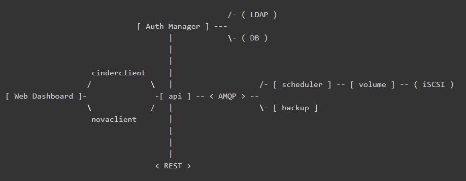

# cinder volume启动流程解析

> 基于openstack stable queens版本阅读解析
> 基于 centos7.5 的linux系统

## 架构

如下所示，为cinder的官方架构说明：


各个组件介绍如下：
- DB: sql database for data storage. Used by all components.
- Web Dashboard: potential external component that talks to the api.
- api: component that receives http requests, converts commands and communicates with other components via the queue or http.
- Auth Manager: component responsible for users/projects/and roles. Can backend to DB or LDAP. This is not a separate binary, but rather a python class that is used by most components in the system.
- scheduler: decides which host gets each volume.
- volume: manages dynamically attachable block devices.
- backup: manages backups of block storage devices.

本文档主要基于volume这组件进行解析，来描述cinder如何使用后端存储，而其提供的api和scheduler问题，可能会少量涉及。

代码可以直接通过github获取：`git clone https://git.openstack.org/openstack/cinder.git`

cinder主要的实现代码在cinder目录下，其service组件的入口位置均在cinder/cmd/{service}.py，{service}为cinder的各个service组件，如api、scheduler、volume等等。由于都是python代码，可读性比较强，知道main函数后，后面的一步步追踪就好了。


## cinder volume service
cinder-volume服务是Cinder最关键的服务，负责对接后端存储驱动，管理volume数据卷生命周期。
在openstack中，所有服务组件都是使用eventlet和greenlet库实现非阻塞的任务线程切换处理，以实现服务的并发功能，该线程模型被openstack称为Green Thread，也就是协程。Green Thread 的上下文切换只会发生在eventlet或者greenlet库调用的时候（比如sleep, certain I/O calls)。
```python
from eventlet import greenthread
...
greenthread.sleep(0)
```

也就是说，从OS的角度来看，openstack service只有一个运行线程。如果某个green thread运行task时被阻塞了，即task调用的接口是阻塞，从而阻塞了thread，那么，service就会一直等待该线程执行结束，其它服务线程就无法进行切换。这会造成一个问题：cinder-volume服务会定时向数据库上报自己的状态，此时，如果volume服务调用比如ceph接口执行flatten操作（flatten操作时间可能会很长，是阻塞操作），导致thread一直阻塞，那么volume就不能及时上报自己的状态，导致集群认为volume服务挂了，执行HA的服务切换。基于此，需要确保volume的所有调用都是非阻塞的接口，即是（green）绿色安全接口，如果是阻塞性的接口，需要与tpool库一起使用。


### cinder-volume启动流程

其main函数如下：

```python
@@ file: cinder/cmd/volume.py

def main():
    objects.register_all()    # import cinder/objects目录下的所有模块
    gmr_opts.set_defaults(CONF)    # oslo_reports模块，用于生成错误报告，如内存泄漏等
    CONF(sys.argv[1:], project='cinder',
         version=version.version_string())
    logging.setup(CONF, "cinder")
    python_logging.captureWarnings(True)
    priv_context.init(root_helper=shlex.split(utils.get_root_helper()))    # oslo_privsep，service的执行权限设置
    utils.monkey_patch()    # monkey-patch，替换库比如socket、thread等，不改变import的行为，改变的是操作的指向函数
    gmr.TextGuruMeditation.setup_autorun(version, conf=CONF)
    global LOG
    LOG = logging.getLogger(__name__)

    ...
    # 基于系统类型启动服务
    if os.name == 'nt':
        # We cannot use oslo.service to spawn multiple services on Windows.
        # It relies on forking, which is not available on Windows.
        # Furthermore, service objects are unmarshallable objects that are
        # passed to subprocesses.
        _launch_services_win32()
    else:
        _launch_services_posix()
```


什么是monkey-patch？ monkey-patch指的是在执行时动态替换模块,而且通常是在startup的时候做，一般用于改变函数行为但不影响调用方式，比如在测试用例打桩调用过程、使用gevent时替换某些标准库使函数变成非阻塞等等。
举一个简单的例子，有两个模块 A 和 B，它们功能相同，但是B使用了另一种实现方式，使之性能要远远优于A模块。但是某个项目大量使用了模块A，如果要完全使用B来替换A的话，需要花费大量的精力。这时，monkey-patch就排上用场了。此时，可以在服务初始化时执行 monkey-patch如下：

```python
    def monkey_patch(m_source, m_decorator):
        a = __import__(m_source)
        b = __import__(m_decorator)
        a.func = b.func
```

当然实际使用时肯定不会那么傻的一个个函数去替换，一般会使用循环加setattr进行替换，具体可以参照cinder的monkey-patch写法。monkey-patch的原理其实是活用了python的模块在同一进程空间中只会import一次，其余import其实只是引用sys.modules的特性。所以如果程序中有用到module reload，那么，monkey-patch就会失效。

好了，言归正传，我们使用的时linux系统，因此重点关注`_launch_services_posix()`函数的处理，看看它到底做了什么东西。服务创建启动的流程如下：`_launch_services_posix() --> _launch_service()`，在`_launch_service()`中，首先创建服务，然后启动服务，并通知服务启动成功，其代码简化如下：

```python
def _launch_services_posix():

	# cinder.service
	# 继续追踪，会发现get_launcher会返回一个oslo_service.service.ProcessLauncher的实例
	# 关于oslo_service，具体可参照：https://docs.openstack.org/oslo.service/latest/reference/service.html
    launcher = service.get_launcher()

    # 基于backend启动后端存储服务，backend指配置文件中：
    # [DEFAULT]
    # enabled_backends = rbd0, rbd1
    #
    # [rbd0]
    # volume_dirver = cinder.volume.drivers.rbd.RBDDriver
    # backend_host = rbd:volume_pool
    # ...
    for backend in filter(None, CONF.enabled_backends):
        _launch_service(launcher, backend)

    _ensure_service_started()    # 需要确保至少有一个backend service启动成功

    launcher.wait()    # Wait until all services have been stopped, and then return.

def _launch_service(launcher, backend):
    ...
    try:
        # 创建service服务
        server = service.Service.create(host=host,
                                        service_name=backend,
                                        binary=constants.VOLUME_BINARY,
                                        coordination=True,
                                        cluster=cluster)
    except Exception:
        LOG.exception('Volume service %s failed to start.', host)
    else:
        # Dispose of the whole DB connection pool here before
        # starting another process.  Otherwise we run into cases where
        # child processes share DB connections which results in errors.
		# 完成 DB 连接池的处理
        session.dispose_engine()

		# posix: oslo_service.service.ProcessLauncher.launch_service()
        launcher.launch_service(server)    # 启动service
        _notify_service_started()          # 修改标志位，表明至少一个service已经成功启动
```

`ProcessLauncher.launch_service(service, workers=1)`会基于workers的数量，fork多个子进程，每个子进程调用`oslo_serivce.service.Launcher.launch_serivce()`启动service服务。层层追踪，最后launcher_service会调用我们前面创建的`server.start()`函数，正式启动service。

在此之前，先看看create函数做了什么。在`service.Service.create`中，生成了一个service对象，在初始化了rpc、manager等，详细介绍如下代码所示(非关键地方省略)：
```python
class Service(service.Service):
    """Service object for binaries running on hosts.

    A service takes a manager and enables rpc by listening to queues based
    on topic. It also periodically runs tasks on the manager and reports
    it state to the database services table.
    """

    @classmethod
    def create(cls, host=None, binary=None, topic=None, manager=None,
               report_interval=None, periodic_interval=None,
               periodic_fuzzy_delay=None, service_name=None,
               coordination=False, cluster=None):
        """Instantiates class and passes back application object."""
        ...
        # 类方法，直接创建一个Service的对象，然后返回
        service_obj = cls(host, binary, topic, manager,
                          report_interval=report_interval,
                          periodic_interval=periodic_interval,
                          periodic_fuzzy_delay=periodic_fuzzy_delay,
                          service_name=service_name,
                          coordination=coordination,
                          cluster=cluster)

        return service_obj

    def __init__(self, host, binary, topic, manager, report_interval=None,
                 periodic_interval=None, periodic_fuzzy_delay=None,
                 service_name=None, coordination=False, cluster=None, *args,
                 **kwargs):
        super(Service, self).__init__()

		# 初始化 rpc server
        if not rpc.initialized():
            rpc.init(CONF)
        ...

        # manager：配置文件中的 volume_manager = cinder.volume.manager.VolumeManager
        self.manager_class_name = manager
        manager_class = importutils.import_class(self.manager_class_name)

        self.service = None
        self.manager = manager_class(host=self.host,
                                     cluster=self.cluster,
                                     service_name=service_name,
                                     *args, **kwargs)

        # 做了一些标加入集群的标志：self.add_to_cluster，sercvice_ref等等，具体用途不知道
        # 猜测是确保service启动时与集群数据保持一致之类的，因为cinder服务的状态信息是上报到数据库的
        ctxt = context.get_admin_context()
        try:
            service_ref = objects.Service.get_by_args(ctxt, host, binary)
            service_ref.rpc_current_version = manager_class.RPC_API_VERSION
            obj_version = objects_base.OBJ_VERSIONS.get_current()
            service_ref.object_current_version = obj_version

            self.added_to_cluster = (not service_ref.cluster_name and cluster)

            if service_ref.cluster_name != cluster:
                LOG.info(...)

            if self.added_to_cluster:
                # We pass copy service's disable status in the cluster if we
                # have to create it.
                self._ensure_cluster_exists(ctxt, service_ref)
                service_ref.cluster_name = cluster
            service_ref.save()
            Service.service_id = service_ref.id
        except exception.NotFound:
            # We don't want to include cluster information on the service or
            # create the cluster entry if we are upgrading.
            self._create_service_ref(ctxt, manager_class.RPC_API_VERSION)
            # We don't want to include resources in the cluster during the
            # start while we are still doing the rolling upgrade.
            self.added_to_cluster = True

        setup_profiler(binary, host)
        ...
```

在launch service时，最终调用了service的`start()`函数，该函数做了如下的事情(非必要部分代码省略)：

```python
class Service(service.Service):

    def start(self):

        self.model_disconnected = False

        # 这是Tooz的python项目，是openstack为了解决分布式问题开发的一个灵活通用框架
		# 主要解决分布式系统的通用问题，比如节点管理、主节点选举以及分布式锁等
		# 在N版之前，cinder-volume都是基于文件锁的，只能Active-Passive部署HA模式，但还是有很多缺陷的
		# 于是，开发使用Tooz库，让cinder支持分布式锁，使volume支持Active-Active模式
		# 具体描述可参考博客：http://zhuanlan.51cto.com/art/201703/534778.htm
        if self.coordination:
            coordination.COORDINATOR.start()

        self.manager.init_host(added_to_cluster=self.added_to_cluster,
                               service_id=Service.service_id)

        # 启动rpc server服务
        ctxt = context.get_admin_context()
        endpoints = [self.manager]
        endpoints.extend(self.manager.additional_endpoints)
        obj_version_cap = objects.Service.get_minimum_obj_version(ctxt)

        serializer = objects_base.CinderObjectSerializer(obj_version_cap)

        target = messaging.Target(topic=self.topic, server=self.host)
        self.rpcserver = rpc.get_server(target, endpoints, serializer)
        self.rpcserver.start()
		...

        self.manager.init_host_with_rpc()

        # 设置服务状态上报周期任务，这是集群判断cinder-volume服务是否正常运行的关键
        if self.report_interval:
            pulse = loopingcall.FixedIntervalLoopingCall(
                self.report_state)
            pulse.start(interval=self.report_interval,
                        initial_delay=self.report_interval)
            self.timers.append(pulse)

        # 设置周期性定时任务
		# 其详细介绍具体参考博文：http://gtcsq.readthedocs.io/en/latest/openstack/periodic_task.html
        if self.periodic_interval:
            if self.periodic_fuzzy_delay:
                initial_delay = random.randint(0, self.periodic_fuzzy_delay)
            else:
                initial_delay = None

            periodic = loopingcall.FixedIntervalLoopingCall(
                self.periodic_tasks)
            periodic.start(interval=self.periodic_interval,
                           initial_delay=initial_delay)
            self.timers.append(periodic)

```

此时，cinder-volume服务已经启动并正常运行，只有在收到所有service都stop后(`launch.wait()`), cinder-volume才退出。

大的启动流程就是这样，现在我们看看在service create时，是如何创建VolumeManager的，以及它是如何关联到特定的存储后端backend的。

```python
class VolumeManager(manager.CleanableManager,
                    manager.SchedulerDependentManager):
    """Manages attachable block storage devices."""

    def __init__(self, volume_driver=None, service_name=None,
                 *args, **kwargs):

        # service_name: 即配置文件中enabled_backends = xxx1, xxx2 的值
        # 因此，self.configuration即[xxx1]的section定义的配置
        # 前面说过，[xxx]中定义了如下所示：
        # [rbd0]
        # volume_dirver = cinder.volume.drivers.rbd.RBDDriver
        # backend_host = rbd:volume_pool
        # ...
        service_name = service_name or 'backend_defaults'
        self.configuration = config.Configuration(volume_backend_opts,
                                                  config_group=service_name)
        self._set_tpool_size(
            self.configuration.backend_native_threads_pool_size)

        if not volume_driver:
            # Get from configuration, which will get the default
            # if its not using the multi backend
            volume_driver = self.configuration.volume_driver

        vol_db_empty = self._set_voldb_empty_at_startup_indicator(
            context.get_admin_context())
        ...

        # import volume driver, like cinder.volume.drivers.rbd.RBDDriver
        # import_object会import class 并返回一个class的实例，第一个参数是类名，其它是类初始化实例参数
        self.driver = importutils.import_object(
            volume_driver,
            configuration=self.configuration,
            db=self.db,
            host=self.host,
            cluster_name=self.cluster,
            is_vol_db_empty=vol_db_empty,
            active_backend_id=curr_active_backend_id)
        ...
```

在初始化完VolumeManager后，也关联了其特定的存储后端驱动driver，此后的操作，都是通过driver去调相应的处理函数接口进行的。


### Volume-Driver: ceph rbd

基于openstack和ceph rbd的完美结合，这里简单介绍一下openstack的`cinder.volume.drivers.rbd.RBDDriver`。`RBDDriver`是在ceph的python-rbd和python-rados接口的基础上，基于上层服务需求，定制化封装的一个接口驱动，其实际对rbd的管理操作还是通过调用ceph原生接口操作的。
`RBDDriver`这个文件主要包含三个类定义实现：`RBDVolumeProxy`,`RADOSClient`,`RBDDriver`。`RBDDriver`是最重要的，涵盖了所有的rbd管理操作，其余两个是辅助类，供driver调用的。比如`RADOSClient`方便client连接rados，open ioctx的功能；`RBDVolumeProxy`就是个rbd代理。
在这里科普一下，（懂ceph接口开发的可以略过），ceph分为rados和rbd两个python库，它们做的事情是不一样的。rados提供连接ceph存储系统的一些操作，一般是针对某个存储pool来操作的；rbd提供的则是如何操作特定image的功能。

```python
# rados和rbd库的简单使用
import rados, rbd

#Examples.
cluster = rados.Rados(conffile='ceph.conf')
cluster.connect()    # 连接rados
ioctx = cluster.open_ioctx('rbd')    # 打开特定pool如'rbd'的io，所有对ceph pool的io操作都是需要ioctx的
image = rbd.Image(ioctx, 'myimage')    # 打开具体的image
image.copy(...)    # 调用image的具体操作方法
```

`RBDDriver`类其实就是image操作的封装，然后基于其业务考虑了很多，做了一些健壮性的处理，细看其实都差不多，就不一一描述了。这里简单描述下`RBDVolumeProxy`，其就是rbd代理，但做了一些额外的工作。
使用过ceph的都知道，rbd的部分管理命令运行时间是很长的，比如copy、flatten、delete操作等，基于块设备的大小，由几秒到几小时的跨度都是常见的。前面我们说过，openstack的服务都是使用eventlet和greenlet协程处理的，当driver调用copy或者flatten操作时，RBDDriver调用了ceph原生copy或flatten接口，由于ceph接口是非eventlet实现的（接口是阻塞的），那么cidner-volume服务就会一直卡在rbdDriver操作线程里，等待ceph返回操作结果。此时，cinder-volume的其它周期性任务如心跳上报等等便不能运行，导致整个cinder-volume服务不能使用。`RBDVolumeProxy`在一定程度上解决了这个问题，方法也很简单，将所有的rbd操作丢到tpool里。

tpool和eventlet的结合也是很常用的一种手段，tpool将阻塞的方法调用转变成`green`的方法调用，非常适合使用c写的python接口。
```python
class RBDVolumeProxy(object):
    """Context manager for dealing with an existing rbd volume.

    This handles connecting to rados and opening an ioctx automatically, and
    otherwise acts like a librbd Image object.

    Also this may reuse an external connection (client and ioctx args), but
    note, that caller will be responsible for opening/closing connection.
    Also `pool`, `remote`, `timeout` args will be ignored in that case.

    The underlying librados client and ioctx can be accessed as the attributes
    'client' and 'ioctx'.
    """
    def __init__(self, driver, name, pool=None, snapshot=None,
                 read_only=False, remote=None, timeout=None,
                 client=None, ioctx=None):
        ...
        try:
            self.volume = driver.rbd.Image(rados_ioctx,
                                           utils.convert_str(name),
                                           snapshot=snapshot,
                                           read_only=read_only)
            # 将rbd.Image丢到tpool里，那么所有的Image调用将变成green调用，即安全的
            self.volume = tpool.Proxy(self.volume)
        except driver.rbd.Error:
            LOG.exception("error opening rbd image %s", name)
            if self._close_conn:
                driver._disconnect_from_rados(rados_client, rados_ioctx)
            raise
        ...

	# __getattr__是python的高级用法(参考python描述符介绍)，
    # 如果找不到对应的属性（方法），则查找self.volume的属性，即Image属性方法
    # 因此，只要生成RBDVolumeProxy实例，就可以调用Ceph原生Image的所有操作方法
    def __getattr__(self, attrib):
        return getattr(self.volume, attrib)
```


