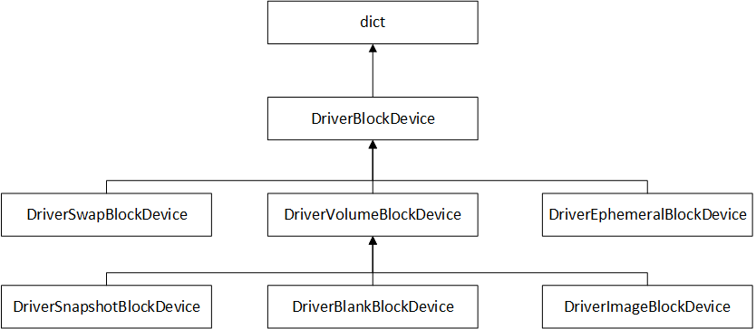
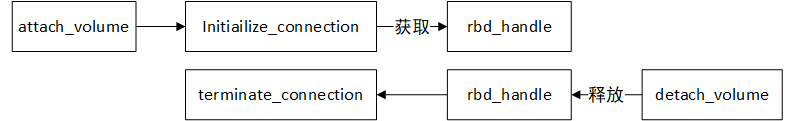
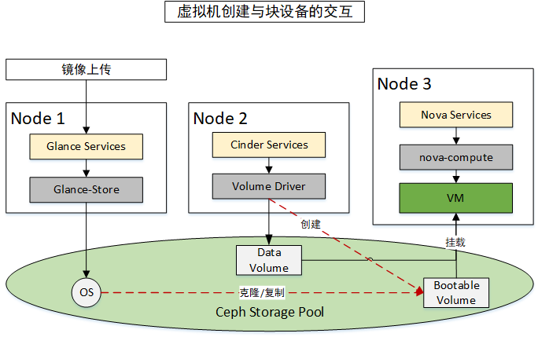

# Nova 与 Cinder的交互


## 背景知识

Nova主要是对虚拟机整个生命周期的管理操作，而Cinder主要是对数据存储的管理。这是OpenStack独立的两个子组件，因此他们之间的交互是通过API接口（REST API）。Nova涉及到存储的操作主要有虚拟机创建、虚拟机快照创建、从快照创建虚拟机、云硬盘的挂载/卸载等操作，对应的Cinder存储管理操作为云硬盘的创建、快照、克隆、数据访问通道的创建和删除等。同时，nova针对系统镜像也有些相关的存储操作，主要是和glance组件进行互动。


### Glance

Glance管理的核心实体是image，为OpenStack提供镜像服务，主要负责OpenStack镜像以及镜像元数据的生命周期管理、检索、下载等功能。Glance支持将镜像保存到后端存储系统中。后端存储系统称为store，访问镜像的地址称为location（location可以是一个http地址，也可以是一个rbd协议地址）。只要实现store的driver就可以作为Glance的存储后端。

为了便于维护，glance store目前已经作为独立的库从Glance代码中分离出来，由项目glance_store维护。目前社区支持的store列表如下:

- **filesystem**：保存到本地文件系统，默认保存/var/lib/glance/images到目录下。

- **cinder**: 保存到Cinder中。

- **rbd**：保存到Ceph中。

- **sheepdog**：保存到sheepdog中。

- **swift**: 保存到Swift对象存储中。

- **vmware datastore**: 保存到Vmware datastore中。

- **http**: http store比较特殊，它不保存镜像的任何数据，它仅仅保存镜像的URL地址，启动虚拟机时由计算节点从指定的http地址中下载镜像。


### Nova

Nova管理的核心实体为server，为OpenStack提供计算服务。注意Nova中的server不只是指虚拟机，它可以是任何计算资源的抽象，除了虚拟机以外，也有可能是裸机（baremetal）、容器等。下文说的server仅指虚拟机。

创建虚拟机需要使用image，或者是类似image的bootable的块设备。Nova使用的块设备支持本地磁盘、Cinder(即boot from volume形式)等形式。image通过image type决定其使用的存储后端。如下：

- 本地磁盘支持是raw、qcow2、ploop等镜像格式；
- ceph 的 image type 为 rbd，即将镜像存储到 ceph 集群中，只支持格式为raw的镜像格式。

不同的image type由不同的image backend负责，其中rbd的backend为nova/virt/libvirt/imageackend中的rbd类中实现。


### Cinder

Cinder是OpenStack的块存储服务，主要管理块存储设备。Cinder本身不提供存储功能，仅负责管理各中存储系统的块设备，比如Ceph、LVM等，支持块设备的创建、快照、备份等功能。只要实现了cinder/volume/driver.py中VolumeDriver类定义的接口，Cinder就可以对接该存储系统。

Cinder不仅支持本地volume的管理，还能把本地volume备份到远端存储系统中，比如备份到另一个Ceph集群或者Swift对象存储系统中，这可以通过子服务 cinder-backup完成。


## 虚拟机的块设备

虚拟机和物理机一样，包括几个重要的部分：CPU、内存、磁盘设备、网络设备等。本章主要针对虚拟机块设备进行相关知识总结。

> 在这里，除非特别指出，默认配置的后端存储是Ceph分布式存储，即RBD的设备类型。

虚拟机是Nova管控的主要实体，Nova与Cinder交互的所有操作都是为虚拟机服务的。而在虚拟机的生命周期管理中，涉及到Nova与Cinder交互的基本操作有：

- **虚拟机的创建**：涉及块设备的创建、挂载等操作，其中创建操作基于具体实现会采用克隆、复制等方式；
- **虚拟机的删除**：涉及块设备的卸载、删除等操作；
- **虚拟机的迁移**：与创建操作类似，只是将启动盘从一个节点卸载，然后挂载到另一个节点上；
- **虚拟机的快照**：涉及块设备的快照创建、删除等操作；
- **虚拟机数据盘挂载/卸载**：涉及块设备的挂载、卸载，主要是虚拟机如何与Cinder的块设备通信的问题；

因为虚拟机的创建以及数据盘的挂载/卸载功能基本涵盖了nova对cinder的各种核心的存储操作，因此下面主要通过这两方面，简单描述Nova与Cinder的存储设备交互细节。


### 虚拟机的创建

虚拟机的创建涉及到网络、CPU、内存、存储设备等多方面的配置，这里只介绍与存储相关的内容。Nova 启动（launch）一个虚拟机需要一个`bootable`的块设备，也就是前面说的根块设备。这个`bootable`的块设备一般可从以下途径创建：

- **Boot from volume**：直接从现有的 bootable volume 启动；

- **Boot from image (create a new volume)**：创建一个新的 volume，将系统镜像 image 的数据 copy 到 volume，然后从该 volume 启动；

- **Boot from volume snapshot (create a new volume)**：通过指定的 volume snapshot 创建 volume，然后从该 volume 启动（前提是该snapshot 对应的源 volume 是 bootable 的）；
- **Boot from blank（create a new volume）**：通过空白盘启动，主要用于系统镜像的制作

在获取到一个`bootable`的块设备后，加上其他参数，就可以正式启动一个虚拟机并完成初始化操作。


#### 虚拟机创建的接口参数

通过虚拟机创建的接口参数，我们可以清楚地了解，虚拟机创建时可能提供一个或多个如下存储参数：

```txt
nova boot [--image <image>] //boot from image with id
          [--image-with <key=value>] //image metadata properties
          [--boot-volume <volume_id>]
          [--snapshot <snapshot_id>] 
          [--block-device-mapping <dev-name=mapping>]
          [--block-device key1=value1[,key2=value2...]]
          [--swap <swap_size>]
          [--ephemeral size=<size>[,format=<format>]]
          <name>
其中，--block-device 基本涵盖了--boot-volume，--snapshot，--block-device-mapping，--swap，--ephemeral 这几个参数的功能
```

而 `--block-deivce` 参数可使用一下这些 Key-Value 值：

- **source**=image|snapshot|volume|blank
- **dest**=volume|local
- **id**=(a volume |image|snapshot UUID if using source=volume|snapshot|image)
- **format**=swap|ext4|...|none (to format the image/volume/ephemeral file; defaults to 'none' if omitted)
- **bus**=ide|usb|virtio|scsi (hypervisor driver chooses a suitable default if omitted)
- **device**=the desired device name (e.g. /dev/vda, /dev/xda, ...)
- **type**=disk|cdrom|floppy|mmc (defaults to 'disk' if omitted)
- **bootindex**=N (where N is any number >= 0, controls the order in which disks are looked at for booting)
- **size**=NN (where NN is number of GB to create type=emphemeral image, or the size to re-size to for type=glance|cinder)
- **shutdown**=preserve|remove

novaclient 的参数最终会转化为 REST API 接口参数，关于存储设备接口参数示例如下，具体的参数及详细描述可查看 nova-api 接口文档：

```python
# POST /servers
{
    ...
    "block_device_mapping_v2": [{
        "boot_index": "0",
        "uuid": "ac408821-c95a-448f-9292-73986c790911",
        "source_type": "image",
        "volume_size": "25",
        "destination_type": "volume",
        "delete_on_termination": true,
        "tag": "disk1",
        "disk_bus": "scsi"
    }]
}
```

其中，需要注意的有两个参数：`source_type` 和 `destination_type`。`source_type`表示待创建的块设备的初始数据来源，这一般用于将系统镜像数据拷贝到具体新块设备中，如果不需要数据，则标记类型为blank，创建一块空白块设备；`destination_type`只支持volume和local两种形式。volume表示块设备由cinder提供，local表示通过计算节点（hypervisor所在节点）开辟一块空间提供。其总结如下：

| dest type | source type | 说明                                                         |
| --------- | ----------- | ------------------------------------------------------------ |
| volume    | volume      | 可直接挂载到虚拟机中。当 boot_index = 0， 相当于boot from volume |
|           | snapshot    | 调用 cinder 依据快照创建新卷，并挂载到虚拟机中。当 boot_index = 0， 相当于boot from snapshot |
|           | image       | 调用cinder依据镜像创建新卷，将glance image的数据拷贝到新建卷中（由cinder访问glance完成），然后挂载到虚拟机中。当 boot_index = 0， 相当于boot from image |
|           | blank       | 调用cinder依大小创建一个空卷并挂载到虚拟机中                 |
| local     | image       | 在计算节点特定位置创建 ephemeral 分区，将 glance 的image 数据拷贝新建的分区中，并启动虚拟机 |
|           | blank       | guest_format=swap 时，创建 swap 分区，否则创建 ephemeral  分区，并挂载到虚拟机中 |

`block_device_mapping_v2`是一个数组，这表明虚拟机创建时可以接收多个块设备。一般地，hypervisors会基于boot_index的大小依次尝试启动虚拟机系统。但是也会存在某些不支持多个设备启动 hypervisor 或者仅支持不同类型的设备，如 disk 和 cdrom 。因此，一般建议作为启动盘的块设备的boot_index设置为 0 。


#### 虚拟机的本地磁盘空间

在 OpenStack 中， 一个虚机涉及到的存储空间， 主要有以下几类：

- **root disk**，根分区 (/ ,root分区)，提供boot loader
- **swap disk**，linux用于物理内存交换的磁盘分区
- **ephemeral disk**，根据提供的资源状况提供的额外的临时存储。ephemeral  空间会随着 instance 的生命周期创建和消亡。广义上的 ephemeral disk 可包括 root 分区和 swap 分区。
- **Block storage** ，原则上指的是 Cinder 提供的块存储设备（或者能够替代cinder的其他块存储方案），是一种持久性的存储空间。


**ephemeral disk**是nova基于本地计算节点基于需求创建的临时盘，在虚拟机生命周期结束时由nova自动销毁，只支持`destination_type`为 local 类型的情况。Nova 提供了 `flavor` 或`创建时指定`两种方式来指定虚拟机的磁盘类型。创建时指定在接口参数介绍中过（即dest_type=local, source_type=blank的形式），这里不再描述。

> 注意：“nova boot”时设置swap和ephemeral分区一定要小于指定的flavor中的值，如果创建时不指定，则会按照 flavor 的默认值创建。
>
> 在实际使用中，建议通过 Flavor 的方式来使用 Ephemeral 和 Swap 磁盘，因为 创建时指定的 ephemeral size 和 swap size 不能大于 Flavor 设定的值，很容易造成冲突。

nova flavor可以定义虚拟机磁盘分区的大小，如下所示：

```txt
# 命令如下：
# nova flavor-create --ephemeral <ephemeral> --swap <swap> ....
# nova boot --flavor FLAVOR --image IMAGE_ID [--swap 512 --ephemeral size=2] NAME

# 示例：
# 创建一个flavor
[root@ ~]# nova flavor-create --ephemeral 20 --swap 512 test1 7 512 1 1
+----+-------+-----------+------+-----------+------+-------+-------------+-----------+
| ID | Name  | Memory_MB | Disk | Ephemeral | Swap | VCPUs | RXTX_Factor | Is_Public |
+----+-------+-----------+------+-----------+------+-------+-------------+-----------+
| 7  | test1 | 512       | 1    | 20        | 512  | 1     | 1.0         | True      |
+----+-------+-----------+------+-----------+------+-------+-------------+-----------+

# 创建一个本地虚拟机
[root@ ~]# nova boot --image cirros --flavor 7 --swap 512 --ephemeral size=20 test

[root@ ~]# cd /var/lib/nova/instances/3d6f79f4-4240-4a24-a21e-90f63a40c544
[root@ 3d6f79f4-4240-4a24-a21e-90f63a40c544]# ls -al
total 11768
drwxr-xr-x. 2 nova nova     4096 May 29 02:16 .
drwxr-xr-x. 5 nova nova     4096 May 29 02:15 ..
-rw-rw----. 1 qemu qemu    23270 May 29 02:21 console.log
-rw-r--r--. 1 qemu qemu 11665408 May 29 02:23 disk
<strong>-rw-r--r--. 1 qemu qemu   197120 May 29 02:16 disk.eph0</strong>
-rw-r--r--. 1 nova nova      245 May 29 02:16 disk.info
<strong>-rw-r--r--. 1 qemu qemu   197120 May 29 02:16 disk.swap</strong>
-rw-r--r--. 1 nova nova     1971 May 29 02:16 libvirt.xml
```

> 如果指定创建了 swap和ephemeral（或flavor中存在对应配置），则虚拟机创建成功时多了disk.eph0 和disk.swap。注意， boot时参数ephemeral不设置， disk.eph0 的命名会是 disk.local。这是通过nova boot命令得到的，如果直接调用 REST API，则依据 block_device_mapping_v2 的参数决定。

从上面的例子可以看到，本地虚拟机的磁盘文件是放在`instances_path`中的。如果我们使用 **Boot from Volume **的方式（相对**Boot from Local**，比如使用ceph rbd），那么虚拟机的磁盘文件不再存放到计算节点本地，虚拟机的数据通过 rbd 协议写入 Ceph 块存储中。此时的 `instances_path` 目录作为 `console.log`、`disk.info`、`Ephemeral file`、`Swap file` 的存放路径。可见 Ephemeral file、Swap file 总是 Local 的，会随着虚拟机的删除而完全销毁（实例目录被删除），除非特殊需求，否则不建议使用。以 Volume 作为 Root Disk 的话，Volume 不会随着虚拟机删除而销毁（只要在创建虚拟机时指定`delete_on_termination=False`即可，下次有需要时还可以重新基于Volume创建虚拟机）。**Boot from Volume **有着更高的数据安全性，是大多数企业级产品提供的默认选项。


#### 虚拟机实例的目录文件

以`image_type`为 qcow2 时为例，nova compute 会在计算节点本地创建文件夹，并生成虚机系统镜像文件。

对于 libvirt 的虚机来说，当虚机是基于镜像启动的时候，虚机的每个磁盘在 nova compute 节点上都有一个磁盘镜像文件，默认是在 /var/lib/nova/instances/<instance_id> 目录中：

```
root@compute1:/var/lib/nova/instances/eddc46a8-e026-4b2c-af51-dfaa436fcc7b# ls -l
total 2476
-rw-r--r-- 1 libvirt-qemu kvm  2031616 Jun 10 18:19 disk
-rw-r--r-- 1 libvirt-qemu kvm   393216 Jun 10 18:12 disk.local
-rw-r--r-- 1 libvirt-qemu kvm   197120 Jun 10 07:42 disk.swap
```

每个文件默认都是 qcow2 格式，都使用 backing 文件。下面分别介绍每个文件的用处。

**disk 文件对应的是虚机的 root 分区：**

```txt
[root@ ~]# qemu-img info disk
image: disk
file format: qcow2
virtual size: 1.0G (1073741824 bytes) #受 flavor 指定的大小
disk size: 1.9M
cluster_size: 65536
backing file: /var/lib/nova/instances/_base/fbad3d96a1727069346073e51d5bbb1824e76e34
Format specific information:
    compat: 1.1
    lazy refcounts: false
```

**backing file 是个 raw 类型的镜像文件：**

```
[root@ ~]# qemu-img info /var/lib/nova/instances/_base/fbad3d96a1727069346073e51d5bbb1824e76e34
image: /var/lib/nova/instances/_base/fbad3d96a1727069346073e51d5bbb1824e76e34
file format: raw
virtual size: 39M (41126400 bytes)
disk size: 17M
```

**disk.local 是虚机的 ephemeral 分区的镜像文件，默认是 qcow2 类型：**

```
[root@ ~]# qemu-img info disk.local
image: disk.local
file format: qcow2
virtual size: 1.0G (1073741824 bytes)
disk size: 324K
cluster_size: 65536
backing file: /var/lib/nova/instances/_base/ephemeral_1_default
Format specific information:
    compat: 1.1
    lazy refcounts: false
```

**disk.swap 是虚机的 swap 分区的镜像文件：**

```
[root@ ~]# qemu-img info disk.swap
image: disk.swap
file format: qcow2
virtual size: 30M (31457280 bytes)
disk size: 196K
cluster_size: 65536
backing file: /var/lib/nova/instances/_base/swap_30
Format specific information:
    compat: 1.1
    lazy refcounts: false
```

**libvirt.xml 文件定义了磁盘的镜像文件和磁盘的对应关系：**

```
<disk type="file" device="disk">
  <driver name="qemu" type="qcow2" cache="none"/>
  <source file="/var/lib/nova/instances/<instance_id>/disk"/>
  <target bus="virtio" dev="vda"/>
</disk>

<disk type="file" device="disk">
  <driver name="qemu" type="qcow2" cache="none"/>
  <source file="/var/lib/nova/instances/<instance_id>/disk.local"/>
  <target bus="virtio" dev="vdb"/>
</disk>

<disk type="file" device="disk">
  <driver name="qemu" type="qcow2" cache="none"/>
  <source file="/var/lib/nova/instances/<instance_id>/disk.swap"/>
  <target bus="virtio" dev="vdc"/>
</disk> 
```

上述这些文件在启动虚拟机的过程中创建的，由nova配置文件中`[nova.config]` 的配置项 `instances_path` 指定；镜像文件的 backing 文件的目录由 `image_cache_subdirectory_name` 配置项指定，其默认值为 “ _base” 。


#### 虚拟机创建源代码流程

虚拟机的创建步骤涉及CPU、内存、网络、存储多个方面，在这里，重点描述虚拟机创建过程中对存储的处理，其余会进行忽略。

##### nova-api阶段 -- 接收请求，验证参数

nova-api 主要处理请求的参数，对参数进行验证、格式化等处理，然后通过 AMQP 队列与其他子服务进程进行通信，进行具体的虚拟机创建操作（异步处理），并将最后结果反馈给用户。其具体实现如下：

```python
# file： nova/api/openstack/compute/servers.py

# 存储相关的操作步骤
# step1： 处理req参数，构造 block_device_mapping 结构体
# step2： 验证 nova-api对磁盘挂载和一些属性的支持，如tag标签，multi-attach功能等
# step3： 调用 self.compute_api.create 执行创建
class ServersController(wsgi.Controller):
    # (hhd) 下面的 self._create_by_func_list 会遍历执行下述的函数定义
    server_create_func_list = [
        block_device_mapping.server_create,    # 这是 block_device_mapping_v2 的处理
        block_device_mapping_v1.server_create, # 这是 block_device_mapping_v1 的处理
        ...
    ]
    
    def create(self, req, body):
        """Creates a new server for a given user."""
        context = req.environ['nova.context']
        server_dict = body['server']

        # Arguments to be passed to instance create function
        create_kwargs = {}
		
        # (hhd) 用于处理request的请求参数，存储在 create_kwargs 里
        self._create_by_func_list(server_dict, create_kwargs, body)

        # (hhd) check and validate available zone and others

        block_device_mapping = create_kwargs.get("block_device_mapping")
        # TODO(Shao He, Feng) move this policy check to os-block-device-mapping
        # extension after refactor it.
        if block_device_mapping:
            # 检查 policy 权限是否允许 create:attach_volume 的操作
            context.can(server_policies.SERVERS % 'create:attach_volume', target)
            
            # 检查该版本的block_device_mapping是否支持 tag 属性
            for bdm in block_device_mapping:
                if bdm.get('tag', None) and not supports_device_tagging:
                    msg = _('Block device tags are not yet supported.')
                    raise exc.HTTPBadRequest(explanation=msg)

       # (by hhd) ignore others args handle ...
        try:
			# 该版本是否支持 multiattach-volume，即共享盘挂载，需要 api version >= 2.60
            supports_multiattach = common.supports_multiattach_volume(req)
            (instances, resv_id) = self.compute_api.create(context,
                            inst_type,
                            image_uuid,
                            display_name=name,
                            display_description=description,
                            availability_zone=availability_zone,
                            forced_host=host, forced_node=node,
                            metadata=server_dict.get('metadata', {}),
                            admin_password=password,
                            requested_networks=requested_networks,
                            check_server_group_quota=True,
                            supports_multiattach=supports_multiattach,
                            **create_kwargs)
        except exception.XXX as error:
            # (hhd) a bunch of exception catch and reraise
            raise ...
```

在 `server_create_func_list` 中定义的函数是用于处理 req body 的请求参数的。在上面定义了块设备处理的函数，分别有 v2 和 v1 两个版本的处理。但是在同一个请求中，不能同时存在 v1 和 v2 两个定义，否则会报错。下面以 v2 版本的处理函数为例进行具体描述：

```python
# file： nova/api/openstack/compute/block_device_mapping.py

# v1 rest api req body key: block_device_mapping    (已经处于 deprecate 状态)
# v2 rest api req body key: block_device_mapping_v2
# 无论版本号是多少，在代码中都以 block_device_mapping 作为最新版本号的变量，不要被迷惑了
ATTRIBUTE_NAME = "block_device_mapping_v2"
LEGACY_ATTRIBUTE_NAME = "block_device_mapping"

def server_create(server_dict, create_kwargs, body_deprecated_param):

    # Have to check whether --image is given, see bug 1433609
    image_href = server_dict.get('imageRef')
    image_uuid_specified = image_href is not None

    bdm = server_dict.get(ATTRIBUTE_NAME, [])
    legacy_bdm = server_dict.get(LEGACY_ATTRIBUTE_NAME, [])

    # (hhd) v1 和 v2 不能同时存在 req 请求体中
    if bdm and legacy_bdm:
        raise exc.HTTPBadRequest(explanation=expl)

    try:
        block_device_mapping = [
            # (hhd) from_api 主要是对 bdm_dict 进行关键参数验证，并构造 BlockDeviceDict 类型
            # BlockDeviceDict 是dict的子类，并没有对 bdm_dict 做实际修改，key-value维持不变
            # 但是 bdm_dict 参数列表可能不完整（用户传参），此时会为其赋予默认值，以构造覆盖所有
            # 的 block_device_mapping 参数。 就不再展开描述了，有兴趣可自己阅读源码。
            block_device.BlockDeviceDict.from_api(bdm_dict,
                image_uuid_specified)
            for bdm_dict in bdm]
    except exception.InvalidBDMFormat as e:
        raise exc.HTTPBadRequest(explanation=e.format_message())

    if block_device_mapping:
        # (hhd) block_device_mapping 是一个 [BlockDeviceDict, ...] 的列表
        create_kwargs['block_device_mapping'] = block_device_mapping
        # Unset the legacy_bdm flag if we got a block device mapping.
        # (hhd) 这个标志位代表 create_kwargs['block_device_mapping'] 是通过v2还是v1的
        # 处理函数得到的. 在这个函数中为 False， 在v1函数中则为 True.
        create_kwargs['legacy_bdm'] = False
```

> `BlockDeviceDict `是 python dict 的子类，其默认key值定义如下：
>
> ```python
> bdm_new_fields = set(['source_type', 'destination_type',
>                      'guest_format', 'device_type', 'disk_bus', 'boot_index',
>                      'device_name', 'delete_on_termination', 'snapshot_id',
>                      'volume_id', 'volume_size', 'image_id', 'no_device',
>                      'connection_info', 'tag'])
> ```
>
> 注意一点，在REST的request body中，`block_device_mapping_v2.uuid` 值在构造 `BlockDeviceDict` 时，会构造`[{source_type}_id] = uuid`，即为上述的`volume_id`、`image_id`、`snapshot_id`其中一个进行赋值。

在create请求函数的最后，调用了 `self.compute_api.create`函数进行进一步的处理。这个函数将待创建的虚拟机实例信息发送到调度器中（nova-scheduler），由调度器决定虚拟机创建的计算节点，以及更新数据库等操作。如没有特殊配置，`compute_api`一般是 `nova.compute.api.API` 这个类的实例。 create函数主要逻辑实现定义在`_create_instance`方法内，其具体的逻辑如下：

```python
# file: nova/compute/api.py

@profiler.trace_cls("compute_api")
class API(base.Base):
    
    def _create_instance(self, context, instance_type, ...):
        """ 验证所有的输入参数，但不包括检查配额以及调度是否满足条件 """

        if image_href:   # (hhd) 根据 image-id 获取系统镜像信息，boot from volume外所有形式
            image_id, boot_meta = self._get_image(context, image_href)
        else:            # (hhd) 通过cinder获取启动系统盘信息，boot from volume形式
            image_id = None
            # (hhd) 如果 source_type为image，则调用self.image_api.get(context, image_id)；
            # source_type=[snapshot|volume], 则self.volume_api.get(context, volume_id)
            # snapshot调用的是快照关联的volume-id，这是因为snapshot依赖于volume的元数据信息。
            # 获取到的volume信息需要通过转换成需要的image元数据信息。
            boot_meta = self._get_bdm_image_metadata(
                context, block_device_mapping, legacy_bdm)

        # (hhd) base_option 和块存储相关的字段有(instance_type指flavor的配置): 
        # base_options = {
        #     'image_ref': image_href,
        #     'root_gb': instance_type['root_gb'],
        #     'ephemeral_gb': instance_type['ephemeral_gb'],
        #     'root_device_name': root_device_name}
        base_options, max_net_count, key_pair, security_groups = \
                self._validate_and_build_base_options(
                    context, instance_type, boot_meta, image_href, image_id,
                    kernel_id, ramdisk_id, display_name, display_description,
                    key_name, key_data, security_groups, availability_zone,
                    user_data, metadata, access_ip_v4, access_ip_v6,
                    requested_networks, config_drive, auto_disk_config,
                    reservation_id, max_count)

        # (hhd) 验证并转换 block_device_mapping 的结构，用于构建待创建的虚拟机参数列表
        block_device_mapping = self._check_and_transform_bdm(context,
            base_options, instance_type, boot_meta, min_count, max_count,
            block_device_mapping, legacy_bdm)

        # (hhd) 两者最后调用的 compute_task_api 接口不同，compute_task_api对应conductor服务
        # 定义是： self.compute_task_api = conductor.ComputeTaskAPI() 
        # 两边都调用了 conduct 的rpcapi接口，将请求发送到conductor组件进行下一步处理。
        if CONF.cells.enable:
            # (hhd) 在处理上与elae语句大致相同，先忽略cell的用法
            self.compute_task_api.build_instances(context,
                instances=instances, image=boot_meta,
                filter_properties=filter_properties,
                admin_password=admin_password,
                injected_files=injected_files,
                requested_networks=requested_networks,
                security_groups=security_groups,
                block_device_mapping=block_device_mapping,
                legacy_bdm=False)
        else:
            self.compute_task_api.schedule_and_build_instances(
                context,
                build_requests=build_requests,
                request_spec=request_specs,
                image=boot_meta,
                admin_password=admin_password,
                injected_files=injected_files,
                requested_networks=requested_networks,
                block_device_mapping=block_device_mapping,
                tags=tags)

        return instances, reservation_id
```

注意，之前`block_device_mapping`是一个 dict 的数据结构，在经过`self._check_and_transform_bdm`的转换后，变成了`BlockDeviceMapping`的nova对象组成的列表`BlockDeviceMappingList`。这些object是对应数据库表字段的对象模型，其定义如下：

```python
@base.NovaObjectRegistry.register
class BlockDeviceMapping(base.NovaPersistentObject, base.NovaObject,
                         base.NovaObjectDictCompat):
    VERSION = '1.19'

    fields = {
        'id': fields.IntegerField(),
        'uuid': fields.UUIDField(),
        'instance_uuid': fields.UUIDField(),
        'instance': fields.ObjectField('Instance', nullable=True),
        'source_type': fields.BlockDeviceSourceTypeField(nullable=True),
        'destination_type': fields.BlockDeviceDestinationTypeField(
                                nullable=True),
        'guest_format': fields.StringField(nullable=True),
        'device_type': fields.BlockDeviceTypeField(nullable=True),
        'disk_bus': fields.StringField(nullable=True),
        'boot_index': fields.IntegerField(nullable=True),
        'device_name': fields.StringField(nullable=True),
        'delete_on_termination': fields.BooleanField(default=False),
        'snapshot_id': fields.StringField(nullable=True),
        'volume_id': fields.StringField(nullable=True),
        'volume_size': fields.IntegerField(nullable=True),
        'image_id': fields.StringField(nullable=True),
        'no_device': fields.BooleanField(default=False),
        'connection_info': fields.SensitiveStringField(nullable=True),
        'tag': fields.StringField(nullable=True),
        'attachment_id': fields.UUIDField(nullable=True),
    }

@base.NovaObjectRegistry.register
class BlockDeviceMappingList(base.ObjectListBase, base.NovaObject):
    VERSION = '1.17'

    fields = {
        'objects': fields.ListOfObjectsField('BlockDeviceMapping'),
    }
```


> **nova cell 结构**
>
> 主要是为了降低数据库和消息队列的访问瓶颈。
>
> OpenStack 在控制平面上的性能瓶颈主要在 Message Queue 和 Database 。尤其是 Message Queue , 随着计算节点的增加 ，性能变的越来越差 。通常情况下，当集群规模扩展到200个节点，一个消息可能要在十几秒后才会响应，集群的整体性能大大下降。为了应对这种情况 ， Nova 很早之前提出来 nova-cell ( 以下以 cellv1 代替 ) 的解决方案 。目的是在把大的 OpenStack 集群分成小的单元 ，每个单元有自己的 Message Queue 和 Database。 以此来解决规模增加时引起的性能问题 ，而且不会向 Region 那样 ，把各个集群独立运行。在 cell 里面 ，Keystone、Neutron、Cinder、Glance 等资源还是共享的 。
>
> 受限于早期nova架构，在cellv1时，被设计为树形结构，nova-cells之间进行消息通信，非常复杂，已不建议使用。Cellv2自Newton版本引入，采取扁平化的组织方式，更加直观简单。其架构如下所示：
>
> 


##### nova-conduct阶段 -- 数据库访问控制

客户端通过conductor rpcapi接口发送请求（AMQP队列，远程调用），由conductor服务组件接收，然后进行对应的处理。主要是对api发送过来的待创建虚拟机进行计算节点的选择以及将虚拟机的信息写入数据库中进行维护。这样，如果nova-compute创建失败时，可以根据数据库的信息进行重新调度或者让用户进行清理。

```python
@profiler.trace_cls("rpc")
class ComputeTaskManager(base.Base):
    
    # (hhd) 主要步骤有：
    # step1：通过rpcapi发送请求到 nova-scheduler，获取待创建虚拟机的计算节点列表
    # step2：通过rpcapi发送请求到 nova-compute，进行实际的虚拟机创建操作
    def schedule_and_build_instances(self, context, build_requests,
                                     request_specs, image,
                                     admin_password, injected_files,
                                     requested_networks, block_device_mapping,
                                     tags=None):
        # Add all the UUIDs for the instances
        instance_uuids = [spec.instance_uuid for spec in request_specs]
        try:
            # (hhd) 根据rpc-client发送的虚拟机参数，由scheduler组件进行计算判断，选择最终节点
            # _schedule_instances发送rpc请求到scheduler.manager的select_destinations方法
            host_lists = self._schedule_instances(context, request_specs[0],
                    instance_uuids, return_alternates=True)
        except Exception as exc:
            return

        zipped = six.moves.zip(build_requests, request_specs, host_lists, instances)
        for (build_request, request_spec, host_list, instance) in zipped:

            with obj_target_cell(instance, cell) as cctxt:
                # (hhd) 将bdm相关信息更新到数据库，具体方法定义参照下面
                instance_bdms = self._create_block_device_mapping(
                    cell, instance.flavor, instance.uuid, block_device_mapping)
                
            with obj_target_cell(instance, cell) as cctxt:
                # (hhd) 对于每一个虚拟机，发送请求到特定host节点的nova-compute进行创建运行
                self.compute_rpcapi.build_and_run_instance(
                    cctxt, instance=instance, image=image,
                    request_spec=request_spec,
                    filter_properties=filter_props,
                    admin_password=admin_password,
                    injected_files=injected_files,
                    requested_networks=requested_networks,
                    security_groups=legacy_secgroups,
                    block_device_mapping=instance_bdms,
                    host=host.service_host, node=host.nodename,
                    limits=host.limits, host_list=host_list)
  
    def _create_block_device_mapping(self, cell, instance_type, instance_uuid,
                                     block_device_mapping):
        """Create the BlockDeviceMapping objects in the db.

        This method makes a copy of the list in order to avoid using the same
        id field in case this is called for multiple instances.
        """
        instance_block_device_mapping = copy.deepcopy(block_device_mapping)
        for bdm in instance_block_device_mapping:
            bdm.volume_size = self._volume_size(instance_type, bdm)
            bdm.instance_uuid = instance_uuid
            with obj_target_cell(bdm, cell):
                # (hhd) bdm是一个 BlockDeviceMapping 的数据库对象模型，此处就是写入数据库意思
                bdm.update_or_create()
        return instance_block_device_mapping
```


##### nova-scheduler阶段 -- 计算节点调度

nova-scheduler主要是基于nova.conf文件中配置的filter以及其他条件进行过滤，选择其中一个符合的计算节点，作为虚拟机待创建的节点。因为一般使用分布式存储作为后端，在调度阶段块设备的存储空间条件一般都能通过，如果是使用 local 方式创建虚拟机，就需要看计算节点的磁盘空间是否足够。调度策略不是本文的重点，因此在这里略过。


##### nova-compute阶段 -- 创建启动虚拟机

在conductor完成虚拟机信息的数据库记录后，通过rpcapi调用了nova-compute的接口，真正地执行虚拟机的创建和启动工作。入口函数如下：

```python
# file: nova/compute/manager.py

class ComputeManager(manager.Manager):

    def build_and_run_instance(self, context, instance, image, request_spec,
                     filter_properties, admin_password=None,
                     injected_files=None, requested_networks=None,
                     security_groups=None, block_device_mapping=None,
                     node=None, limits=None, host_list=None):

        @utils.synchronized(instance.uuid)
        def _locked_do_build_and_run_instance(*args, **kwargs):
            # (hhd) 使用信号量锁定这个instance实例，在创建完成前不允许对instance做其他操作
            with self._build_semaphore:
                try:
                    # (hhd) 虚拟机创建实际执行操作
                    result = self._do_build_and_run_instance(*args, **kwargs)
                except Exception:
                    result = build_results.FAILED
                    raise
                finally:
                    if result == build_results.FAILED:
                        self._delete_allocation_for_instance(context, instance.uuid)

        # (hhd) 使用eventlet.spawn_n启用多线程异步方式进行处理。原因是rpc worker调用这个方法
        # 等待执行结果。而创建虚拟机需要等待一段时间，使用异步这样rpc worker就可以不用等待，释放资源
        utils.spawn_n(_locked_do_build_and_run_instance,
                      context, instance, image, request_spec,
                      filter_properties, admin_password, injected_files,
                      requested_networks, security_groups,
                      block_device_mapping, node, limits, host_list)
```

下面简单介绍`_do_build_and_run_instance`的处理流程。

```python
# file: nova/compute/manager.py

class ComputeManager(manager.Manager):
    
    # 这个函数主要设置虚拟机和任务的状态，进行逻辑控制，关键步骤为
    # step1：执行 self._build_and_run_instance 方法进行具体资源创建
    # step2：如果虚拟机创建失败，重新conductor调度，否则清理各种已创建的资源
    def _do_build_and_run_instance(self, context, instance, image,
            request_spec, filter_properties, admin_password, injected_files,
            requested_networks, security_groups, block_device_mapping,
            node=None, limits=None, host_list=None):

        try:
            with timeutils.StopWatch() as timer:
                # (hhd) 在这里会根据参数需求进行网络、块设备等资源的创建
                # 如果异常失败，会进行资源的清理操作
                self._build_and_run_instance(context, instance, image,
                        decoded_files, admin_password, requested_networks,
                        security_groups, block_device_mapping, node, limits,
                        filter_properties, request_spec)
            return build_results.ACTIVE
        except exception.RescheduledException as e:
            retry = filter_properties.get('retry')
            if not retry:
                # no retry information, do not reschedule.
                self._cleanup_volumes(context, instance,
                    block_device_mapping, raise_exc=False)
                return build_results.FAILED

            # (hhd) 重新执行调度，需要将已经分配给host资源unclaimed
            # 这样，调度到另一个合适节点时，这些已经创建的资源可以复用（资源如网络、存储等）。
            self._delete_allocation_for_instance(context, instance.uuid)

            # (hhd) 重新调用conductor 的rpcapi进行创建调度
            self.compute_task_api.build_instances(context, [instance],
                    image, filter_properties, admin_password,
                    injected_files, requested_networks, security_groups,
                    block_device_mapping, request_spec=request_spec,
                    host_lists=[host_list])
            return build_results.RESCHEDULED
        except Exception as e:
            # (hhd) 清理各种资源
            self._cleanup_volumes(context, instance,
                    block_device_mapping, raise_exc=False)
            
            return build_results.FAILED
```

而`self._build_and_run_instance`方法的处理流程如下：

```python
# file: nova/compute/manager.py

class ComputeManager(manager.Manager):   
    def _build_and_run_instance(self, context, instance, image, injected_files,
            admin_password, requested_networks, security_groups,
            block_device_mapping, node, limits, filter_properties,
            request_spec=None):

        try:
            rt = self._get_resource_tracker()
            with rt.instance_claim(context, instance, node, limits):
                image_meta = objects.ImageMeta.from_dict(image)
                # (hhd) 这里，创建虚拟机所需要的所有资源
                with self._build_resources(context, instance,
                        requested_networks, security_groups, image_meta,
                        block_device_mapping) as resources:

                    # (hhd) block_device_info, 非常重要的一个数据结构，在后面介绍
                    block_device_info = resources['block_device_info']
                    
                    with timeutils.StopWatch() as timer:
                        # (hhd) driver是compute的虚拟化驱动，重用如 libvirt、xen、hyperv 等
                        # 在这里以使用 libvirt 为例进行说明，通过driver创建虚拟机
                        self.driver.spawn(context, instance, image_meta,
                                          injected_files, admin_password,
                                          allocs, network_info=network_info,
                                          block_device_info=block_device_info)
        except:
            ...
    
    # (hhd) 这是个上下文管理器，主要用于为libvirt准备虚拟机资源，并转换为virt要求的数据格式
    @contextlib.contextmanager
    def _build_resources(self, context, instance, requested_networks,
                         security_groups, image_meta, block_device_mapping):
        resources = {}

        try:
            # Verify that all the BDMs have a device_name set and assign a
            # default to the ones missing it with the help of the driver.
            # (hhd) device name 就是 /dev/sda /dev/sdb 这种
            self._default_block_device_names(instance, image_meta,
                                             block_device_mapping)

            block_device_info = self._prep_block_device(context, instance,
                    block_device_mapping)
            resources['block_device_info'] = block_device_info
        except:
            ...
        
        try:
            # (hhd) placement client
            resources['allocations'] = (
                self.reportclient.get_allocations_for_consumer(context, instance.uuid))
        except:
            ...

        try:
            yield resources
        except Exception as exc:
            ...
    
    # (hhd) 这是处理 block_device_mapping 的关键函数，主要操作有：
    # step1：将格式为 BlockDeviceMappingList 的 bdms 转换为DriverBlockDevice类型的格式
    # step2：attach所有cinder提供的块设备
    def _prep_block_device(self, context, instance, bdms):
        """Set up the block device for an instance with error logging."""
        try:
            self._add_missing_dev_names(bdms, instance)
            block_device_info = driver.get_block_device_info(instance, bdms)
            mapping = driver.block_device_info_get_mapping(block_device_info)
            driver_block_device.attach_block_devices(
                mapping, context, instance, self.volume_api, self.driver,
                wait_func=self._await_block_device_map_created)

            self._block_device_info_to_legacy(block_device_info)
            return block_device_info
```

`_prep_block_device`方法将`bdms`转换成 `block_device_info`数据结构后（简称BDI），对BDI中的所有cinder提供的`block_device_mapping`元素进行attach操作，也就是常用的挂载云硬盘操作（挂载/卸载云硬盘后面专门有一章节进行描述，这里先忽略）。

`_build_resources` 执行完毕后，表示创建虚拟机时所需要的资源已经准备完成，此时只要调用nova配置文件中的具体virt驱动进行虚拟机的创建。比如libvirt驱动，通过提供的信息生成虚拟机的 XML 格式的配置文件，然后创建虚拟机。虚拟机的创建过程至此为止，libvirt阶段的不详细描述。


### 虚拟机数据盘挂载/卸载

与虚拟机创建时类似，虚拟机数据盘的挂载和卸载操作，在经过api以及conduct等组件的参数处理后，最终都会变成`block_device_info`的相关数据结构，然后通过调用`block_device_info`中的每个块设备元素的类实例中的attach 方法，打通virt驱动与cinder的通信信道。这里以libvirt为例进行详细说明。

#### virt 驱动的块设备的数据结构

首先解释以下`block_device_info`的数据结构。该数据结构是 Nova 中一个重要的数据结构，它的内容包括您机的所有磁盘和被附加的所有卷。一个示例如下：

```python
# file: nova/virt/driver.py

# block_device_info 是虚拟机virt中需要的块设备的信息
# 包含 root_device_name\swap\ephemerals\block_device_mapping 四种信息
# 除 root_device_name 是字符串外，其他的每个元素都是一个 DriverXXXBlockDevice 的类实例
# 这些 xxxBlockDevice 类定义在 nova/virt/blcok_device.py 文件内
# 它们大致的数据内容如下：
block_device_info = {
    # root分区
    "root_device_name": "/dev/sda",
    
    # swap 分区，元素对应类为 DriverSwapBlockDevice
    "swap": {
        "device_name": "/dev/sdb", 
        "swap_size": 5, 
        "disk_bus": "ide",
    } 
    
    # ephemerals 分区，0或多个，元素对应类为 DriverEphemeralBlockDevice
    "ephemerals": [{
        "device_type": "disk", 
        "disk_bus": "ide", 
        "device_name": "/dev/sdc", 
        "guest_format": "xfs",
        "size": 5}, ...],

    # cinder volume device，0或多个，即destination_type=volume
    # 基于source_type='image|volume|snapshot|blank'有不同的子类实现
    # 元素对应的父类为 DriverVolumeBlockDevice
    "block_device_mapping": [{
        "connection_info": None,
        "guest_format": None,  # 只针对 ephemerals 类型
        "device_type": "disk",
        "disk_bus": "virtio",
        "boot_index": 0,
        "attachment_id": None,
        "mount_device": "/dev/sdd", 
        "delete_on_termination": True 
    }, ...], 
} 
```

`block_device_mapping` 的信息是由 Nova 在数据库中维护的，数据表是 block_device_mapping。它们类图之间的继承关系如下所示：



`DriverSwapBlockDevice`和`DriverEphemeralBlockDevice`因为是本地节点的存储空间，并没有实现attach和detach的方法。这两种类型的块设备不需要做其他操作，virt 层就可以基于它的属性进行块设备的创建。由于通过cinder 提供的块设备，其存储后端涉及多种存储系统，如iSCSI、ceph、NFS等多种类型。针对这些不同的存储后端，基于不同的存储特性，有些可能需要先将远端的块设备进行访问的初始化，然后再提供给 virt 层做相应的处理。下面我们重点看下`DriverVolumeBlockDevice`的 attach 和 detach 方法。


#### 云硬盘挂载 attach 操作

首先，看下`DriverVolumeBlockDevice`的三个子类实现：

```python
# file: nova/virt/block_device.py

class DriverSnapshotBlockDevice(DriverVolumeBlockDevice):

    _valid_source = 'snapshot'
    _proxy_as_attr_inherited = set(['snapshot_id'])

    # (hhd) source_type=snapshot，其attach步骤为：
    # step1：根据snapshot_id获取快照信息（cinder get_snapshot 接口）
    # step2：调用cinder volume create 创建新云硬盘（基于snapshot创建）
    #        这样，新建盘的数据和快照就是一样的（具体实现看cinder驱动，可以是复制或者克隆方式）
    # step3：根据新创建的 volume-id 调用父类的 attach 方法
    def attach(self, context, instance, volume_api, virt_driver, wait_func=None):

        if not self.volume_id:
            av_zone = _get_volume_create_az_value(instance)
            snapshot = volume_api.get_snapshot(context, self.snapshot_id)
            vol = volume_api.create(context, self.volume_size, '', '',
                                    snapshot, availability_zone=av_zone)
            self.volume_id = vol['id']

        # Call the volume attach now
        super(DriverSnapshotBlockDevice, self).attach(
            context, instance, volume_api, virt_driver)

class DriverImageBlockDevice(DriverVolumeBlockDevice):

    _valid_source = 'image'
    _proxy_as_attr_inherited = set(['image_id'])

    # (hhd) source_type=image，其attach步骤为：
    # step1：调用cinder volume create 创建新云硬盘（传递image-id），这样，cinder会
    #        调用glance接口获取镜像数据，创建云硬盘（可通过glance下载拷贝或者克隆）
    # step2：根据新创建的 volume-id 调用父类的 attach 方法
    def attach(self, context, instance, volume_api, virt_driver, wait_func=None):
        if not self.volume_id:
            av_zone = _get_volume_create_az_value(instance)
            vol = volume_api.create(context, self.volume_size,
                                    '', '', image_id=self.image_id,
                                    availability_zone=av_zone)
            if wait_func:
                self._call_wait_func(context, wait_func, volume_api, vol['id'])
            self.volume_id = vol['id']

        super(DriverImageBlockDevice, self).attach(
            context, instance, volume_api, virt_driver)


class DriverBlankBlockDevice(DriverVolumeBlockDevice):

    _valid_source = 'blank'
    _proxy_as_attr_inherited = set(['image_id'])

    # (hhd) source_type=blank，其attach步骤为：
    # step1：调用cinder volume create 创建一块空白的新云硬盘
    # step2：根据新创建的 volume-id 调用父类的 attach 方法
    def attach(self, context, instance, volume_api, virt_driver, wait_func=None):
        if not self.volume_id:
            vol_name = instance.uuid + '-blank-vol'
            av_zone = _get_volume_create_az_value(instance)
            vol = volume_api.create(context, self.volume_size, vol_name, '',
                                    availability_zone=av_zone)
            if wait_func:
                self._call_wait_func(context, wait_func, volume_api, vol['id'])
            self.volume_id = vol['id']

        super(DriverBlankBlockDevice, self).attach(
            context, instance, volume_api, virt_driver)
```

这三个子类基于最开始nova-api接收的`block_device_mapping_v2`的参数，在attach时创建一块新的云硬盘上有些细微的区别。当volume创建成功后，它们的操作和`source_type=volume`是一致的，这创建操作过后，相当于存在一块待挂载的云硬盘了。因此，这些子类不需要重载detach操作，直接调用父类即可。

下面，详细描述`DriverVolumeBlockDevice`的attach操作。

```python
# file: nova/virt/block_device.py
class DriverVolumeBlockDevice(DriverBlockDevice):
    
    _valid_source = 'volume'
    _valid_destination = 'volume'
    _proxy_as_attr_inherited = set(['volume_size', 'volume_id'])
    
    # (hhd) source_type=volume，其attach步骤为：
    # step1：调用cinder get volume 方法根据volume-id获取相关信息
    # step2：调用self._do_attach 方法，这是实际进行attach的实现
    @update_db
    def attach(self, context, instance, volume_api, virt_driver,
               do_driver_attach=False, **kwargs):
        volume = self._get_volume(context, volume_api, self.volume_id)
        volume_api.check_availability_zone(context, volume, instance=instance)

        if volume.get('shared_targets', False):
            # (hhd) 由 _get_volume 方法发现，shared_targets应该是 cinder 3.48 版本特有的
            # 一些属性实现，这场情况下，不需要进行lock操作。
            # Lock the attach call using the provided service_uuid.
            @utils.synchronized(volume['service_uuid'])
            def _do_locked_attach(*args, **_kwargs):
                self._do_attach(*args, **_kwargs)

            _do_locked_attach(context, instance, volume, volume_api,
                              virt_driver, do_driver_attach)
        else:
            # We don't need to (or don't know if we need to) lock.
            self._do_attach(context, instance, volume, volume_api,
                            virt_driver, do_driver_attach)
    @staticmethod
    def _get_volume(context, volume_api, volume_id):
        # First try to get the volume at microversion 3.48 so we can get the
        # shared_targets parameter exposed in that version. If that API version
        # is not available, we just fallback.
        try:
            return volume_api.get(context, volume_id, microversion='3.48')
        except exception.CinderAPIVersionNotAvailable:
            return volume_api.get(context, volume_id)
```

具体attach方法实现如下：

```python
# file: nova/virt/block_device.py
class DriverVolumeBlockDevice(DriverBlockDevice):
    def _do_attach(self, context, instance, volume, volume_api, virt_driver,
                   do_driver_attach):

        context = context.elevated()
        # (hhd) 这里connector是计算节点的一些客户端信息，基于不同存储协议（Ceph、NFS、iSCSI）
        # 比如iSCSI存储方式，则 connector 扮演的是initiator客户端，则返回信息如下：
        # {
        #     'initiator': 'iqn.1994-05.com.redhat:7ba5ee6c3180',
        #     'ip': '192.169.36.207',
        #     'platform': 'x86_64',
        #     'host': 'node3',
        #     'do_local_attach': False,
        #     'mountpoint': '/dev/vdb',
        #     'os_type': 'linux2',
        #     'multipath': False
        # }
        connector = virt_driver.get_volume_connector(instance)
        
        # (hhd) 这里 attachment_id，比如虚拟机所在节点重启、迁移等，要重新挂载 volume 等情况
        # 在 cinder 的 volume_attachments 表中已经有记录的，不需要重新访问存储后端重新建立连接
        # 只需要通过 attachment_id 从数据库中获取或者更新一下
        # 在虚拟机创建阶段，没有volume曾经attach过，attachment_id=None，因此需要调用cinder
        # 的 initial_connection 方法，cinder会在volume_attachments上创建一条记录的。
        if not self['attachment_id']:
            self._legacy_volume_attach(context, volume, connector, instance,
                                       volume_api, virt_driver, do_driver_attach)
        else:
            self._volume_attach(context, volume, connector, instance,
                                volume_api, virt_driver,
                                self['attachment_id'],  do_driver_attach)
```

下面重点查看下在没有attachment_id的情况下，`self._legacy_volume_attach`的流程。另一个attach方法其实类似，就不多讲了。

```python
# file: nova/virt/block_device.py
class DriverVolumeBlockDevice(DriverBlockDevice):
    
    def _legacy_volume_attach(self, context, volume, connector, instance,
                              volume_api, virt_driver, do_driver_attach=False):
        volume_id = volume['id']

        # (hhd) 这里调用了 cinder 的initialize_connection，该方法的主要功能是为云主机实例
        # 提供挂载云硬盘所需要的一切信息。比如，使用 ceph rbd 协议的话，则返回
        # {
        #     'driver_volume_type': 'rbd',
        #     'data': {
        #         'name': '%s/%s' % (rbd_pool, volume_name),
        #         'hosts': hosts,
        #         'ports': ports,
        #         'cluster_name': rbd_cluster_name,
        #         'auth_enabled': (rbd_user is not None),
        #         'auth_username': rbd_user,
        #         'secret_type': 'ceph',
        #         'secret_uuid': rbd_secret_uuid,
        #         'volume_id': volume.id,
        #         "discard": True,
        #         'keyring': rbd_user keyring_contents
        #     }
        # }
        connection_info = volume_api.initialize_connection(context,
                                                           volume_id,
                                                           connector)
        if 'serial' not in connection_info:
            connection_info['serial'] = self.volume_id
        # (hhd) 多路径访问的一些设置，比如iSCSI的multipath access配置
        self._preserve_multipath_id(connection_info)

        # do_driver_attach=False，表示虚拟机启动时才由driver进行挂载
        # 在虚拟机创建阶段，一般为 False，如果主动执行挂载硬盘操作，则为 True
        if do_driver_attach:
            encryption = encryptors.get_encryption_metadata(
                context, volume_api, volume_id, connection_info)

            try:
                # (hhd) 其实最终都会执行这个函数，依赖配置的virt driver 执行attach操作
                virt_driver.attach_volume(
                        context, connection_info, instance,
                        self['mount_device'], disk_bus=self['disk_bus'],
                        device_type=self['device_type'], encryption=encryption)
            except Exception:
                ...
                volume_api.terminate_connection(context, volume_id,
                                                    connector)
        self['connection_info'] = connection_info

        mode = 'rw'
        if 'data' in connection_info:
            mode = connection_info['data'].get('access_mode', 'rw')
        if volume['attach_status'] == "detached":
            # NOTE(mriedem): save our current state so connection_info is in
            # the database before the volume status goes to 'in-use' because
            # after that we can detach and connection_info is required for
            # detach.
            self.save()
            try:
                # (hhd) 这里指 nova 已经完成 attach 操作，由 cinder 修改自己volume状态记录
                volume_api.attach(context, volume_id, instance.uuid,
                                  self['mount_device'], mode=mode)
            except Exception:
                with excutils.save_and_reraise_exception():
                    if do_driver_attach:
                        virt_driver.detach_volume(context, connection_info, instance,
                                                  self['mount_device'],
                                                  encryption=encryption)
                        
                    volume_api.terminate_connection(context, volume_id, connector)

                    # Cinder-volume might have completed volume attach. So
                    # we should detach the volume. If the attach did not
                    # happen, the detach request will be ignored.
                    volume_api.detach(context, volume_id)
```

这里的关键操作是 `virt_driver.attach_volume`，即调用nova配置的虚拟化驱动执行attach volume的操作，该操作主要完成以下事情（以libvirt驱动为例说明）：

```python
# file：nova/virt/libvirt/driver.py
class LibvirtDriver(driver.ComputeDriver):
    
    # (hhd) 这个方法主要操作有两部：
    # step1：self._connect_volume，即libvirt连接后端存储
    # step2：guest.attach_device，即将块设备虚拟化到guest虚拟机内
    def attach_volume(self, context, connection_info, instance, mountpoint,
                      disk_bus=None, device_type=None, encryption=None):
        guest = self._host.get_guest(instance)
        
        # (hhd) 基于connection_info连接后端存储，不同存储协议有不同的实现，比如rbd、iSCSI等
        self._connect_volume(context, connection_info, instance,
                             encryption=encryption)
        
        # (hhd) 获取volume信息，生成volume相关的xml文件
        conf = self._get_volume_config(connection_info, disk_info)
        try:           
            # (hhd) 这主要涉及虚拟化的技术，调用virsh attach-device命令把卷挂载到虚拟机中
            guest.attach_device(conf, persistent=True, live=live)
        except:
            with excutils.save_and_reraise_exception():
                self._disconnect_volume(context, connection_info, instance,
                                        encryption=encryption)
       
    def _connect_volume(self, context, connection_info, instance,
                        encryption=None, allow_native_luks=True):
        # (hhd) 根据 connection_info 中的 driver_volume_type 加载对应的存储协议
        vol_driver = self._get_volume_driver(connection_info)
        vol_driver.connect_volume(connection_info, instance)
        try:
            self._attach_encryptor(
                context, connection_info, encryption, allow_native_luks)
        except:
            # Encryption failed so rollback the volume connection.
            with excutils.save_and_reraise_exception(logger=LOG):
                vol_driver.disconnect_volume(connection_info, instance)
```

以 Ceph RBD为例，讲述`self._connect_volume`执行的操作。

```python
# file: os_brick/initiator/connectors/rbd.py
class RBDConnector(base.BaseLinuxConnector):
    @utils.trace
    def connect_volume(self, connection_properties):
        do_local_attach = connection_properties.get('do_local_attach',
                                                    self.do_local_attach)

        # (hhd) local attach, 相当于执行 rbd map 将设备转为计算节点的本地块设备，再执行操作
        # 因为 qemu 或者 kvm 是支持 ceph rbd协议的，因此一般不需要 local attach
        if do_local_attach:
            # NOTE(e0ne): map volume to a block device
            # via the rbd kernel module.
            pool, volume = connection_properties['name'].split('/')
            rbd_dev_path = RBDConnector.get_rbd_device_name(pool, volume)
            if (not os.path.islink(rbd_dev_path) or
                    not os.path.exists(os.path.realpath(rbd_dev_path))):
                cmd = ['rbd', 'map', volume, '--pool', pool]
                cmd += self._get_rbd_args(connection_properties)
                self._execute(*cmd, root_helper=self._root_helper,
                              run_as_root=True)
            else:
                # do some log

            return {'path': rbd_dev_path, 'type': 'block'}

        # (hhd) 否则，通过librbd 获取一个能够访问 rbd I/O的client句柄
        rbd_handle = self._get_rbd_handle(connection_properties)
        return {'path': rbd_handle}
    
    # (hhd) 这个函数显而易见，虽然做了一些封装，但原则上其实就是调用了 librbd 中open命令：
    # 参照 rbd 使用手册，相当于访问存储集群，获取rbd image 的I/O实例，执行 read/write 操作
    # cluster = rados.Rados(conffile='my_ceph.conf')
    # cluster.connect()
    # ioctx = cluster.open_ioctx('mypool')
    # image = rbd.Image(ioctx, 'myimage')
    # image.write(data, 0)
    def _get_rbd_handle(self, connection_properties):
        try:
            user = connection_properties['auth_username']
            pool, volume = connection_properties['name'].split('/')
            cluster_name = connection_properties['cluster_name']
            monitor_ips = connection_properties['hosts']
            monitor_ports = connection_properties['ports']
            keyring = connection_properties.get('keyring')
        except (KeyError, ValueError):
            msg = _("Connect volume failed, malformed connection properties.")
            raise exception.BrickException(msg=msg)

        conf = self._create_ceph_conf(monitor_ips, monitor_ports,
                                      str(cluster_name), user,
                                      keyring)
        try:
            rbd_client = linuxrbd.RBDClient(user, pool, conffile=conf,
                                            rbd_cluster_name=str(cluster_name))
            rbd_volume = linuxrbd.RBDVolume(rbd_client, volume)
            rbd_handle = linuxrbd.RBDVolumeIOWrapper(
                linuxrbd.RBDImageMetadata(rbd_volume, pool, user, conf))
        except Exception:
            fileutils.delete_if_exists(conf)
            raise

        return rbd_handle
```

这样，KVM或者QEMU进程获取到这个rbd的实例对象，就可以调用其 read/write 方法进行实际的数据读写操作。


#### 云硬盘挂载 detach 操作

云硬盘的detach操作其实就是attach的反向操作，如下图所示：




其具体实现如下，不再详细进行描述，可参照attach的描述：

```python
# file：nova/virt/libvirt/driver.py
class LibvirtDriver(driver.ComputeDriver):
    def _do_detach(self, context, instance, volume_api, virt_driver,
                   attachment_id=None, destroy_bdm=False):
        
        volume_id = self.volume_id

        # Only attempt to detach and disconnect from the volume if the instance
        # is currently associated with the local compute host.
        if CONF.host == instance.host:
            self.driver_detach(context, instance, volume_api, virt_driver)
        elif ...

        # NOTE(jdg): For now we need to actually inspect the bdm for an
        # attachment_id as opposed to relying on what may have been passed
        # in, we want to force usage of the old detach flow for now and only
        # use the new flow when we explicitly used it for the attach.
        if not self['attachment_id']:
            connector = virt_driver.get_volume_connector(instance)
            connection_info = self['connection_info']
            if connection_info and not destroy_bdm and (
               connector.get('host') != instance.host):
                # If the volume is attached to another host (evacuate) then
                # this connector is for the wrong host. Use the connector that
                # was stored in connection_info instead (if we have one, and it
                # is for the expected host).
                stashed_connector = connection_info.get('connector')
                if not stashed_connector:
                    # Volume was attached before we began stashing connectors
                    LOG.warning(..)
                elif stashed_connector.get('host') != instance.host:
                    LOG.error(...)
                else:
                    connector = stashed_connector

            volume_api.terminate_connection(context, volume_id, connector)
            volume_api.detach(context.elevated(), volume_id, instance.uuid,
                              attachment_id)
        else:
            volume_api.attachment_delete(context, self['attachment_id'])

    def detach(self, context, instance, volume_api, virt_driver,
               attachment_id=None, destroy_bdm=False):
        volume = self._get_volume(context, volume_api, self.volume_id)

        if volume.get('shared_targets', False):
            # Lock the detach call using the provided service_uuid.
            @utils.synchronized(volume['service_uuid'])
            def _do_locked_detach(*args, **_kwargs):
                self._do_detach(*args, **_kwargs)

            _do_locked_detach(context, instance, volume_api, virt_driver,
                              attachment_id, destroy_bdm)
        else:
            # We don't need to (or don't know if we need to) lock.
            self._do_detach(context, instance, volume_api, virt_driver,
                            attachment_id, destroy_bdm)
```


### 总结

在glance、cinder、nova均使用Ceph作为后端存储的基础上，其三个组件之间的交互架构可如下所示：



当然，glance服务与cinder服务交互时，因为是两个组件，它们可能不知道都是用了同一套存储后端。因此在虚拟机创建时，cinder有可能会通过glance接口把系统镜像下载到本地，然后再将数据拷贝到cinder新建的块设备中，而不是直接调用ceph的rbd copy/clone 的操作。但是，可以通过改写这部分的逻辑，加快虚拟机创建时间。

由上述代码流程得到，在虚拟机根据不同的存储后端将块设备挂载到虚拟机后，其最终的访问类似下图所示：


具体的I/O访问是需要虚拟化基础组件 kvm/qemu 的支持的。如果虚拟化不支持，那么需要做些额外的操作，比如把远端的块设备磁盘通过iSCSI或者NFS挂载到计算节点本地，然后kvm/qemu通过访问本地的块设备进行I/O操作。