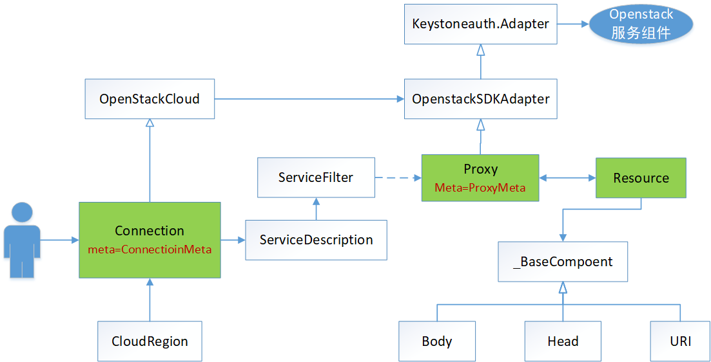

# OpenstackSDK 详解

> - 前段时间一直在做openstacksdk的二次开发工作，对openstacksdk源码了解得比较深入，现趁着国庆假期，好好总结一下。毕竟记忆不好，过段时间可能就忘得差不多了，哈哈。
> - openstacksdk是基于当前最新版openstacksdk-0.17.2版本，可从 [GitHub：OpenstackSDK](https://github.com/openstack/openstacksdk) 获取到最新的源码。openstacksdk的官方使用手册为：[SDK 文档](https://docs.openstack.org/openstacksdk/latest/)
> - 实验使用的openstack是Queen版本。


## SDK 的历史背景

据官方文档介绍，openstacksdk项目是由**shade**、**os-client-config**、**python-openstacksdk**三个子项目合并而成的。由于我对这三个项目不太熟悉，所以也没什么好说的，感兴趣的读者可以自行查看每个项目的主要用途。为什么合并三个项目，我理解的原因有几个吧：

- 方便开发者使用，虽然openstack的子项目都会有restful api的调用接口，但对于开发者来说，调用sdk比使用rest方便，也不需要处理形形色色的各种突发情况；
- 方便维护，访问openstack服务的client端底层都需要配置session（即config配置）以及处理python-request，而这三个项目提供的服务接口都有着几乎相同的底层处理，部分服务接口也雷同，维护起来麻烦；
- 项目功能重复，比如shade和python-openstacksdk虽然实现方式有所不同，但是提供的功能类似，没必要维护多个相同的服务组件。


不管如何，上面说的都不是重点。由于openstacksdk融合了三个子项目，为了向下兼容，也导致了openstacksdk项目的复杂度。第一次看源码的人可能会很纳闷，明明是有个具体的框架，但有些模块偏偏却脱离在框架之外，让人摸不着头脑。说白了就是代码的组织架构不够清晰，但也没办法，毕竟sdk还在开发过程中，后续应该会变得更好吧。

## SDK 的使用
> SDK使用不是这篇文章的重点，因此只会简单的描述一下。具体的可参考官文的 **User Guides**。

总的来说，使用sdk很简单，其支持三种形式的配置方式，分别是*配置文件*、*函数传参*、*系统环境变量*三种。这三种可以混合使用，如果有重复配置，则优先顺序应该是：函数传参 > 系统环境变量 > 配置文件。同时，使用sdk不仅支持user/password方式，也支持传入token形式使用，但是两种认证方式的配置有些许不同，token和password有某些关于auth的配置是冲突的。

1. 配置文件方式
	sdk会默认寻找名称为 `clouds.yaml` 的配置文件，其搜寻顺序为：`当前目录`、 `~/.config/openstack`、 `/etc/openstack`。只要找到符合的配置文件，就会读取并解析内容。
    clouds.yaml的配置文件写法为：
    ```yaml
	clouds:
  mordred:
        region_name: RegionOne
        auth_type: password
        auth:
          username: 'mordred'
          password: XXXXXXX
          project_name: 'shade'
          auth_url: 'https://identity.example.com'
	 ```

	```python
	import openstack

	# Initialize cloud
	conn = openstack.connect(cloud='mordred')

	for server in conn.compute.servers():
	    print(server.to_dict())
	```

2. 函数传参方式

	```python
	import openstack

	# Initialize cloud
    auth_type = "token"
    auth = {
    	"project_id": "xxxxx",
        "user_domain_id": "default",
        "token": "xxxxxx"
        "auth_url": "https://identity.example.com"
    }
	conn = openstack.connect(auth=auth, auth_type=auth_type)

	for server in conn.compute.servers():
	    print(server.to_dict())
	```

3. 系统环境变量方式

	`admin-openrc.sh`文件设置如下：

	```
	export OS_PROJECT_DOMAIN_ID=default
	export OS_USER_DOMAIN_ID=default
	export OS_PROJECT_NAME=admin
	export OS_TENANT_NAME=admin
	export OS_USERNAME=admin
	export OS_PASSWORD=ADMIN_PASS
	export OS_AUTH_URL=http://controller:35357/v3
	export OS_IDENTITY_API_VERSION=3
	```

	在shell中执行 `source admin-openrc.sh`，然后执行如下代码即可：
	```python
    import openstack

	# Initialize cloud
	conn = openstack.connect()

	for server in conn.compute.servers():
	    print(server.to_dict())
   ```

## SDK 的源码解析

从上面的使用例子我们可以看到，openstacksdk的入口函数是`openstack.connect(*args, **kwargs)`。这个函数基于传入的参数，生成了连接openstack服务的实例，然后我们就可以使用该实例访问openstack各组件服务了，具体的调用方式就是：`conn.{service}.{operator}`。其中`service`就是openstack的组件，比如常用的compute（nova）、image（glance）、identity（keystone） 和 block_storage(cinder)等等了。

循例的，要了解SDK的源码实现，首先还是先介绍下源码目录结构吧。

### 源码目录结构

先不多说，呈上源码目录结构的缩减版：
```txt
openstack/
|--_meta/            # 存放框架中的metaclass类的实现
|--config/           # os-client-config项目代码主要存放在此
|--|--cloud/         # shade项目代码主要存放在此
|--|--{services}/    # 各个服务组件的代码，应该是python-openstacksdk项目代码，以identity为例
|--|--identity/
|--|--|--v2/
|--|--|--|--_proxy.py             # v2版本的proxy接口
|--|--|--|--{resources}           # v2版本resource类，比如role资源
|--|--|--v3/
|--|--|--|--_proxy.py             # v3版本的proxy接口
|--|--|--|--{resources}           # v3版本的role资源类
|--|--|--identity_service.py      # identity的服务入口
|--resource.py                    # 定义资源类的基类
|--proxy.py                       # 定义proxy接口的基类
|--connection.py                  # 管理各openstack服务的类，暴露给用户使用
|--service_description.py         # 服务的描述类，conn通过该类找到对应的组件服务接口
|--service_filter.py              # 划分并路由到组件服务的不同版本的类
|--task_manager.py                # 管理组件服务的rest请求处理
```

前面说了，openstacksdk是由三个子项目合并而来的。由目录结构就可以看出，三个项目的代码都扁平地放在`openstack`目录下。而其余的`*.py`文件就是负责整合这三个项目的框架代码。其中，框架中比较重要的类有三个，其分别为：
- **Connection** 类是负责建立用户层到服务层的服务连接，即如何组织这三个子项目，将其功能提供给上层用户调用，就是Connection类要做的事情。
- **Proxy** 类是代理各组件的服务，为用户提供该组件服务的可使用接口的类，其子类由各个组件进行定义。Proxy类继承了`keystoneauth.adapter`，其是openstack用于认证和访问组件rest服务的通用库。同样以identity为例，其`identity/v2/_proxy.py`里定义了所有keystone v2版本的可使用服务接口。
- **Resource** 类代表的是组件的远程资源，比如identity有role、project、user等资源类型，其定义在`identity/v2/{name}.py`中。一般地，用户调用proxy接口的方法，proxy调用resource构建 rest 请求中需要的所有东西，如header、url、data等等，然后resource调用proxy中的keystoneauth里的request方法与远程服务组件进行交互，然后resource处理其返回response，获取与该资源类相关的属性值，然后proxy返回特定resource类的实例给用户。

### 源码的架构组织

通过目录结构的介绍，我们对sdk源码已经有了大致的认识了。下面通过架构图，能够更好地了解其框架组织结构：



其中，CloudRegion为Connection相关的配置（由原os-client-config模块进行适配），用于处理使用openstacksdk的各种配置；OpenstackCloud为一种形式的接口调用（原shade项目模块），其提供所有的服务接口都放在一个类里实现了，即实例化该类，就可以调用各组件的服务处理接口了；各种Proxy我猜是原python-openstacksdk的接口，它是上面所说的以组件区分服务的一种组织形式，是区别OpenstackCloud的另一种服务使用方式。但是，不管是OpenStackCloud方式，还是Proxy的调用方式，最终都是通过keystoneauth库去调用openstack组件服务的Restful API接口进行处理的。


### 源码的详细解析

在了解SDK项目的组织架构后，下面我们详细地对SDK源码进行解读分析。

首先，OpenstackCloud定义在 `openstack/cloud`目录下，其就是一个类里面定义了一堆关于network、images、compute等的函数方法，就是在一个大类里填充了所有关于openstack操作的函数，非常暴力简单，没什么好说的，直接用就好，本文章也不会对其进行过多的解析，有兴趣的自己看看代码吧。
CloudRegion类定义并解析了openstack的客户端配置，比如前面所说的用户密码，连接方式，服务组件的接口的API版本等等。虽然很复杂，但是也没什么好讲的。其实是太复杂了，不好把握，哈哈哈。无论如何，这里配置其实只是和keystoneauth库session需要用到的配置相关，和框架服务倒没什么关系。
个人觉得sdk的精华部分大概也就剩Connection-->Proxy-->Resource这条线了哈。 Connection到Proxy这条路径经过了ServiceDescription这个类，而不是直接Connection里初始化Proxy的原因，是为了在使用时才初始化对应组件的proxy实例。大家都知道，openstack组件有很多，如果client只是使用了image服务，但是却要实例化上百个proxy，其性能是很低下的，也没有必要。而ServiceDescription就是用来解决这种情况的，其就是相当于Connection只是维护了所有服务组件的指针数组，在真正使用某个服务组件的接口时，才实例化该proxy服务，并将指针数组中的特定一个指针指向该实例。那么，后续又用到该服务时就不用重新初始化一遍了，直接返回该实例引用就行了。

#### Connection类

**Connection** 是用户使用时接触到的最上层的类了。正如上面用户使用的例子所介绍，一般会使用`openstack.connnect()`方法生成**Conenction**实例。`connect()`方法做了两件事情，一是解析配置，并生成一个CloudRegion的实例，一是生成Connection实例。代码如下所示：

```python
def connect(*agrs， **kwargs):
    cloud_region = openstack.config.get_cloud_region(
        cloud=cloud,
        app_name=app_name, app_version=app_version,
        load_yaml_config=load_yaml_config,
        load_envvars=load_envvars,
        options=options, **kwargs)
    return openstack.connection.Connection(config=cloud_region)
```

下面，我们看看**Connection**类内部都做了什么事情。首先，看看它类实现的代码，这里做了些调整，为了减少代码篇幅，把profile及一些不太重要的内容给去掉了，profile后续应该会deprecate了：

```python
from openstack._meta import connection as _meta
from openstack import cloud as _cloud

# 类定义其实相当于是这样的，即继承了OpenstackCloud类，拥有OpentackCloud的所有方法：
# class Connection（_cloud.OpenStackCloud):
#     __metaclass__ = _meta.ConnectionMeta
class Connection(six.with_metaclass(_meta.ConnectionMeta,
                                    _cloud.OpenStackCloud)):

    def __init__(self, cloud=None, config=None, session=None,
                 app_name=None, app_version=None,
                 extra_services=None,
                 strict=False,
                 use_direct_get=False,
                 task_manager=None,
                 **kwargs):
        """Create a connection to a cloud."""
        # config即上面我们传进来的CloudRegion实例，负责管理连接配置的内容的
        # 如果没有，后续会创建，但是默认是不读取配置文件和系统环境变量
        self.config = config
        self._extra_services = {}

        # 即允许注册额外的services
        if extra_services:
            for service in extra_services:
                self._extra_services[service.service_type] = service

		# if not self.config: do something , pass these part

        self.task_manager = task_manager or _task_manager.TaskManager(
            self.config.full_name)

        # 这里的_proxy就是记录指向具体service组件的proxy，具体版本由配置指定
        # 如_proxy["identity"] 即是获取 identity.{v3/v2}._proxy的实例
        self._proxies = {}

		# 初始化父类
        _cloud.OpenStackCloud.__init__(self)

    def authorize(self):
        """Authorize this Connection, Get Token"""
        pass
```

我们都知道，metaclass是创建类的类，即Connection这类的类属性和类方法都是由metaclass来确定的。（对metaclass不熟悉的可以自行搜索相关知识，这里不作具体介绍），直接看看**ConnectionMeta**这个类做了什么事情。
```python
import os_service_types
from openstack import proxy
from openstack import service_description

# os_serivce_types库可获取到所有openstack组件服务列表
# 但是并不是所有服务sdk当前都支持，所以不支持的服务忽略，直接使用Proxy基类
_service_type_manager = os_service_types.ServiceTypes()

class ConnectionMeta(type):
    def __new__(meta, name, bases, dct):
    	# 可以打印出 service的内容，那大家可能就清楚其是什么东西了。
        for service in _service_type_manager.services:
            service_type = service['service_type']
            # 引用ServiceDescription类，其实例为Connection的一个数据描述符，这是很关键的一点
            # 由于它是描述符，才能实现使用到对应proxy时才实例化对象
            desc_class = service_description.ServiceDescription

            # 基于某些定义规则，通过service_type获取service_filter类
            # 如 identity.identity_service.IdentityService
            service_filter_class = _find_service_filter_class(service_type)
            descriptor_args = {'service_type': service_type}

            # 如果找到特定的service_filter子类，则表明这是sdk支持的组件服务
            # 否则，忽略并直接使用Proxy基类
            if service_filter_class:
                # OpenStackServiceDescription 继承 ServiceDescription
                desc_class = service_description.OpenStackServiceDescription
                descriptor_args['service_filter_class'] = service_filter_class

                # 配置docsting thing， pass these part
            else:
                descriptor_args['proxy_class'] = proxy.Proxy

            # 实例化ServiceDescription or OpenStackServiceDescription
            descriptor = desc_class(**descriptor_args)
            st = service_type.replace('-', '_')
            dct[st] = descriptor

        return super(ConnectionMeta, meta).__new__(meta, name, bases, dct)
```

**ServiceDescription**是Connection类的关键属性，其经过**ConnectionMeta**的构造后，**Connection**类定义实际上已经变成这样的了：
```python
from openstack.identity.identity_service import IdentityService
from openstack.image.image_service import ImageService
from openstack.block_storage.block_storage_service import BlockStorageService
class Connection(_cloud.OpenStackCloud):

    identity = OpenStackServiceDescription(service_filter_class=IdentityService)
    image = OpenStackServiceDescription(service_filter_class=ImageService)
    block_storage = OpenStackServiceDescription(service_filter_class=BlockStorageService)
    xxx = OpenStackServiceDescription(yy)
    yyy = openstack.proxy.Proxy(kkkk)

    def __init__(self, *args, **kwargs): pass
    def authorize(self): pass
    def xxxx(self): pass
```

读者可以通过实例化Connection后，通过执行 `print conn.__class__.__dict__`获取Connection的属性值，看看是否是这样的。当我们执行`conn.identity`这样的调用时，实际上获取的是一个`identity.v3._proxy.Proxy`的实例，并不是`OpenStackServiceDescription`啊。那是因为**ServiceDescription**类实例是Connection实例的一个数据描述符。python中的描述符是一个很底层的概念，涉及到类getattr索引顺序，有些难理解，这里也不会详细地进行描述哦，好学的朋友自行google吧。

简单地来说，python描述符是一个“绑定行为”的对象属性，在描述符协议中，如果一个类重写了`__get__()`,`__set__()`,`__delete__()`中一个或多个方法，那么其实例化的对象就是一个描述符。从名字其实就可以看出，其分别对应了获取、赋值、删除的操作。当我们执行`conn.identity`时，就会自动调用`identity`实例的`__get__`方法，然后在`__get__`方法中实现了实例化`identity.v3._proxy.Proxy`的操作。

了解这个后，我们来看看`ServiceDescription`的`__get__`方法做了什么东西。下看代码：

```python
class ServiceDescription(object):

    def __get__(self, instance, owner):
        # instance: 指Connection实例
        if instance is None:
            return self
        if self.service_type not in instance._proxies:
            # instance.config：Connection.config，即CloudRegion实例
            config = instance.config
            # 调用了OpenStackServiceDescription的get_proxy_class方法
            # 获取到指定的{service}.{version}._proxy.Proxy类
            proxy_class = self.get_proxy_class(config)
            # 通过cloudRegion和proxy_class构造出对应的proxy实例
            # 这里就是前面所说的self._proxies记录的实例化后的对象
            instance._proxies[self.service_type] = config.get_session_client(
                self.service_type,
                constructor=proxy_class,
                task_manager=instance.task_manager,
                allow_version_hack=True,
            )
            instance._proxies[self.service_type]._connection = instance
        return instance._proxies[self.service_type]
```

至此，从`Connection --> Servcices Proxy`这路径就已经讲完了。


#### Service Proxy类

**Proxy** 类是openstack组件的服务接口代理，是client能够使用到的实际接口方法。**Proxy**基类定义在`openstack.proxy.Proxy`里，主要实现一些通用方法如`_list`、`_head`、`_get`、`_find`、`_delete`、`_update`等方法。那么，我们简单地看看**Porxy**类的定义：

```python
# 同样地，Proxy的metaclass为：_meta.ProxyMeta
# 相当于：
# class Proxy(_adapter.OpenStackSDKAdapter):
#     __metaclass__ = _meta.ProxyMeta
class Proxy(six.with_metaclass(_meta.ProxyMeta, _adapter.OpenStackSDKAdapter)):
    """Represents a service."""

    def _get_resource(self, resource_type, value, **attrs):
        """Get a resource object to work on"""
        if value is None:
            # Create a bare resource
            res = resource_type.new(**attrs)
        elif isinstance(value, dict):
            res = resource_type._from_munch(value)
            res._update(**attrs)
        elif not isinstance(value, resource_type):
            # Create from an ID
            res = resource_type.new(id=value, **attrs)
        else:
            # An existing resource instance
            res = value
            res._update(**attrs)

        return res

    def _find(self, resource_type, name_or_id, ignore_missing=True,
              **attrs):
        """Find a resource"""
        return resource_type.find(self, name_or_id,
                                  ignore_missing=ignore_missing,
                                  **attrs)

    @_check_resource(strict=False)
    def _delete(self, resource_type, value, ignore_missing=True, **attrs):
        """Delete a resource"""
        res = self._get_resource(resource_type, value, **attrs)

        try:
            rv = res.delete(self)
        except exceptions.NotFoundException:
            if ignore_missing:
                return None
            raise

        return rv

    @_check_resource(strict=False)
    def _update(self, resource_type, value, **attrs):
        """Update a resource"""
        res = self._get_resource(resource_type, value, **attrs)
        return res.update(self)

    def _create(self, resource_type, **attrs):
        """Create a resource from attributes"""
        res = resource_type.new(**attrs)
        return res.create(self)

    @_check_resource(strict=False)
    def _get(self, resource_type, value=None, requires_id=True, **attrs):
        """Get a resource"""
        res = self._get_resource(resource_type, value, **attrs)

        return res.get(
            self, requires_id=requires_id,
            error_message="No {resource_type} found for {value}".format(
                resource_type=resource_type.__name__, value=value))

    def _list(self, resource_type, value=None, paginated=False, **attrs):
        """List a resource"""
        res = self._get_resource(resource_type, value, **attrs)
        return res.list(self, paginated=paginated, **attrs)

    def _head(self, resource_type, value=None, **attrs):
        """Retrieve a resource's header"""
        res = self._get_resource(resource_type, value, **attrs)
        return res.head(self)
```

从代码中可以看到，所有的操作方法其实就是获取一个`Resource`子类，然后执行`Resource`类的各种方法。所以，这里资源类做了什么处理，我们在介绍`Resource`时再说。从`Proxy`类定义可知，它和`Connection`类是一样的，由**ProxyMeta**进行构造。下面我们看看`ProxyMeta`做了什么东西。

```python
def compile_function(evaldict, action, module, **kwargs):
    "Make a new functions"
    pass
    return func

def add_function(dct, func, action, args, name_template='{action}_{name}'):
    func_name = name_template.format(action=action, **args)
    # If the class has the function already, don't override it
    if func_name in dct:
        func_name = '_generated_' + func_name
    pass
    dct[func_name] = func

def expand_classname(res):
    return '{module}.{name}'.format(module=res.__module__, name=res.__name__)

class ProxyMeta(type):
    """Metaclass that generates standard methods based on Resources."""
    def __new__(meta, name, bases, dct):
        # Build up a list of resource classes attached to the Proxy
        resources = {}
        details = {}
        # 获取 Reousrce 列表
        for k, v in dct.items():
            if isinstance(v, type) and issubclass(v, resource.Resource):
                if v.detail_for:
                    details[v.detail_for.__name__] = v
                else:
                    resources[v.__name__] = v

		# 对每一个Resource， 基于规则生成function
        for resource_name, res in resources.items():
            pass

            for action in ('create', 'get', 'update', 'delete'):
                if getattr(res, 'allow_{action}'.format(action=action)):
                    func = compile_function(dct.copy(), action, **args)
                    add_function(dct, func, action, args)
            if res.allow_list:
                func = compile_function(dct.copy(), 'find', **args)
                add_function(dct, func, 'find', args)
                func = compile_function(dct.copy(), 'list', **args)
                add_function(dct, func, 'list', args, plural_name)

        return super(ProxyMeta, meta).__new__(meta, name, bases, dct)
```

光看这段代码，你可能不知道在干嘛。下面举一个例子就很清晰了。比如在`openstack.compute.v2._proxy.Proxy`类里，其定义如下：
```python
class Proxy(proxy.Proxy):

	# Resources
    Server = _server.Server

    def delete_image(self, image, ignore_missing=True):
        """Delete an image"""
        self._delete(_image.Image, image, ignore_missing=ignore_missing)
    ...
```

在**compute**的Proxy类实现中，类属性包含了几个**Resource**类，那么在构造这个**Proxy**时，`ProxyMeta`会发现这些资源类，然后基于**Resource**是否允许`'create', 'get', 'update', 'delete', 'find', 'list'`等方法，基于定义好的模板（在`openstacn._meta._proxy_templates`定义），自动生成`create_server(), get_server(), servers()`等方法；如果已经在compute的Proxy中人为定义了`create_server()`方法时，则不会覆盖该方法，而是生成`_generate_create_server()`方法。嗯，这样做的好处是不需要人工写太多的代码吧，其实不嫌麻烦，不使用`ProxyMeta`，全部自己在compute的Proxy里定义，也是可以的。

其是否生成特定方法的规则是，在**Resource**内是否允许生成。比如在`compute.v2.server.Server`资源类里，其定义如下：
```python
class Server(resource.Resource, metadata.MetadataMixin):
    # capabilities
    allow_create = True
    allow_get = True
    allow_update = True
    allow_delete = True
    allow_list = True
```
`ProxyMeta`就是根据allow_{op}是否为True来决定是否生成特定的方法的。

所以，如果你发现在某些services的Proxy里，找不到使用的部分方法的定义，不要大惊小怪，秘密就隐藏在这里。


#### Resource 类

前面我们说了，**Proxy**类的方法其实是生成了**Resource**类实例，并调用**Resource**类方法。为什么呢？因为**Resource**类是定义远程服务资源的，只有**Resource**本身才知道远程资源的url、需要的参数、以及该资源包含的所有属性值等等。因此，**Resource**类有两层作用，一是构造可以访问rest接口，即调用http请求的url、header、params、data等变量值，然后又重新调用了Proxy中的HTTP请求方法，即`GET, POST, PUT, DELETE`等HTTP原语；另一个作用就是解析返回的Response，将获取的header、body属性值返回给用户。

**Resource**的基类实现是很复杂的，很难说得通透。下面我们先简单看看其子类的构造，以`identity.v3.user.User`为例：

```python
class User(resource.Resource):

	# key： 与解析 response 内容有关
    resource_key = 'user'
    resources_key = 'users'

    # uri前缀
    base_path = '/users'
    # 根据service找到这个资源对应的 URL， 即 http://ip:port/v3 这种
    service = identity_service.IdentityService()

    # capabilities
    allow_create = True
    allow_get = True
    allow_update = True
    allow_delete = True
    allow_list = True
    update_method = 'PATCH'

	# 即只查询某个值，而不是全部property
    _query_mapping = resource.QueryParameters(
        'domain_id',
        'name',
        'password_expires_at',
        is_enabled='enabled',
    )

	# 下面都是这个资源的property，是专门给client使用的返回值
    # Resource.Body 表示该值从 response 的 body 获取，json的key值为'xxx'
    # 同理，还有 Resource.URI、 Resource.Header 这些
    default_project_id = resource.Body('default_project_id')
    description = resource.Body('description')
    domain_id = resource.Body('domain_id')
    email = resource.Body('email')
    is_enabled = resource.Body('enabled', type=bool)
    links = resource.Body('links')
    name = resource.Body('name')
    password = resource.Body('password')
    password_expires_at = resource.Body('password_expires_at')
```

继续说下client的请求处理这快，当某个**Proxy**子类创建了资源，并执行`create, update, get`等方法时，调用了`Resource`基类的`create, update, get`方法。这些方法部分处理可能有些区别，但本质就是构建一个可以http request的请求，其本质操作大同小异：

```python
class Resource(object):

	def get/create/update/delete(self, session, **kwargs):
        request = self._prepare_request(requires_id=requires_id)
        # 这个session就是创建这个resource的Proxy子类实例
        session = self._get_session(session)
        # session 的 GET/PUT/POST/DELETE 方法即 keystoneauth的方法
        # 其最终是调用了 request 方法
        response = session.get/post/put/delete/head(request.url,
        											headers=request.headers,
                                                    json=request.body)
        # 处理 response 结果
        self._translate_response(response)
        # 返回资源本身
        return self
```

如上，其最终调用了session的request方法。从架构图上知道，session即`Proxy`继承了`OpenstackSDKAdapter`， `OpenstackSDKAdapter`则继承了 `keystoneauth.Adapter`。后者是调用处理 openstack rest api 的通用库。而`OpenstackSDKAdapter`的主要作用就是重写了 `keystoneauth.Adapter` 的 **__init__ , request** 方法，增加了task_manager的执行方式。这个task_manager没有进行太深入研究，其实就是将请求变成多线程任务运行进行管理吧。如下所示：

```python
class OpenStackSDKAdapter(adapter.Adapter):
    """Wrapper around keystoneauth1.adapter.Adapter.

    Uses task_manager to run tasks rather than executing them directly.
    This allows using the nodepool MultiThreaded Rate Limiting TaskManager.
    """

    def __init__(self, session=None, task_manager=None, *args, **kwargs):
        super(OpenStackSDKAdapter, self).__init__(
            session=session, *args, **kwargs)
        if not task_manager:
            task_manager = _task_manager.TaskManager(name=self.service_type)

        self.task_manager = task_manager

    def request(
            self, url, method, run_async=False, error_message=None,
            raise_exc=False, connect_retries=1, *args, **kwargs):
        request_method = functools.partial(
            super(OpenStackSDKAdapter, self).request, url, method)

        return self.task_manager.submit_function(
            request_method, run_async=run_async, name=name,
            connect_retries=connect_retries, raise_exc=raise_exc,
            **kwargs)
```

而keystonauth的请求熟悉openstack的应该都知道吧，这里简单地说一下，一般分为以下几步：
1. 通过 user/password 验证身份，获取token
2. 基于 token 获取注册到keystone中的service endpoint
3. 基于 endpoint 的 url地址 以及 resource类的资源路径，请求特定的资源操作
4. resource 类基于 response 值进行解析，获取数据

如何发送请求，我们前面已经说过了。下面介绍下如何获取资源，以及_BaseComponent的子类`Body,URI,Header`的作用。一般地，对于有数据返回，需要处理的，都会经过 `self._translate_response(response)` 这个方法。我们一起看看它做了什么：

```python
def _translate_response(self, response, has_body=None, error_message=None):
        if has_body is None:
            has_body = self.has_body
        # 如果执行出错，则抛出异常
        exceptions.raise_from_response(response, error_message=error_message)
        # 解析 response body 值
        if has_body:
            body = response.json()
            if self.resource_key and self.resource_key in body:
                body = body[self.resource_key]

            body = self._consume_body_attrs(body)
            self._body.attributes.update(body)
            self._body.clean()
		# 获取 response header 值
        headers = self._consume_header_attrs(response.headers)
        self._header.attributes.update(headers)
        self._header.clean()
```

关键的是`self._consume_body_attrs(body), self._consume_header_attrs(response.headers)`方法。进行追踪，其最终是基于方法`_get_mapping`获取该资源类的有关property属性，即类型是_BaseComponent类型的类属性，然后再通过这些key调用`self._consume_attrs(mapping, attrs)`提取并更新value值。其实现如下所示：
```python
    @classmethod
    def _get_mapping(cls, component):
        """Return a dict of attributes of a given component on the class"""
        # 这里的component指 Body 、 URI 、Header，是调它的函数传进来的
        mapping = component._map_cls()
        ret = component._map_cls()
        # Since we're looking at class definitions we need to include
        # subclasses, so check the whole MRO.
        for klass in cls.__mro__:
            for key, value in klass.__dict__.items():
                if isinstance(value, component):
                    # Make sure base classes don't end up overwriting
                    # mappings we've found previously in subclasses.
                    if key not in mapping:
                        # Make it this way first, to get MRO stuff correct.
                        mapping[key] = value.name
        for k, v in mapping.items():
            ret[v] = k
        return ret
```

然后，在获取这些值后，更新到Reosurce实例属性`self._body | self._header`这些dict中。至此，**Resource**子类获取了所有与请求相关的属性值，那么，client如何获取这些值呢，毕竟获取的话应该是如`user.id`这样的形式，但从上面的`_translate_response`看来，返回值都是存放在`self._body`中的啊。

此时，我们看看_BaseComponent的定义，你会发现，Resource类中的属性值这又是一个数据描述符对象。
```python
class _BaseComponent(object):

    # The name this component is being tracked as in the Resource
    key = None
    # The class to be used for mappings
    _map_cls = dict

    def __init__(self, name, type=None, default=None, alias=None,
                 alternate_id=False, list_type=None, **kwargs):
        """A typed descriptor for a component that makes up a Resource"""
        # 即 Resource.Body('xxxx')的 name
        self.name = name
        self.type = type

    def __get__(self, instance, owner):
        if instance is None:
            return None
        # self.key , Body是 key='_body', Header是 key='_header'
        # instance是资源类自己，所以这里返回的是Resource._body or Resource._header
        attributes = getattr(instance, self.key)

        try:
            value = attributes[self.name]
        except KeyError:
            if self.alias:
                return getattr(instance, self.alias)
            return self.default

        # self.type() should not be called on None objects.
        if value is None:
            return None

        return _convert_type(value, self.type, self.list_type)
```
因此，就这么简单地，返回client希望得到的结果。

## 结语
好吧，这次内容就说这么多吧，码字也是很累的。虽然openstacksdk内容还有很多，包括很复杂的CloudRegion，还有OpenstackCloud这个大类没说，还有些边边角角也没有详细描述，但是个人认为其最主要部分应该讲得差不多了，后续的代码应该都能够靠自己看懂了吧。
文章篇幅有点长，感谢花了这么多精力看到这里的读者，如果内容有错，请不遗余力的指出，谢谢！！

