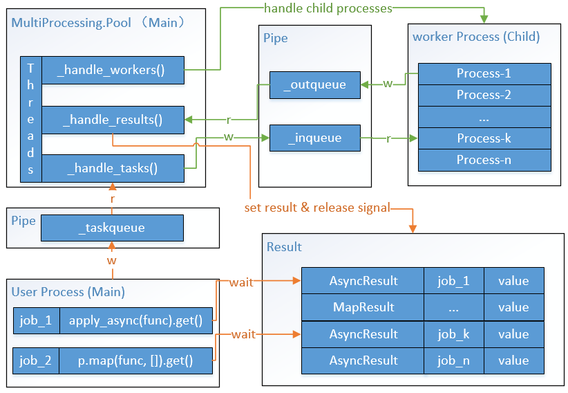

# multiprocessing.Pool 异常处理问题

> multiprocessing.Pool开发多进程程序时，在某个子进程执行函数使用了mysql-python连接数据库，
> 由于程序设计问题，没有捕获到所有异常，导致某个异常错误直接抛到Pool中，导致整个Pool挂了，其异常错误如下所示：
>
> ```shell
> Exception in thread Thread-3:
> Traceback (most recent call last):
> File "/usr/lib64/python2.7/threading.py", line 812, in __bootstrap_inner
> self.run()
> File "/usr/lib64/python2.7/threading.py", line 765, in run
> self.__target(*self.__args, **self.__kwargs)
> File "/usr/lib64/python2.7/multiprocessing/pool.py", line 376, in _handle_results
> task = get()
> File "/usr/lib/python2.7/site-packages/mysql/connector/errors.py", line 194, in __init__
> 'msg': self.msg.encode('utf8') if PY2 else self.msg
> AttributeError: ("'int' object has no attribute 'encode'", <class 'mysql.connector.errors.Error'>, (2055, "2055: Lost Connection to MySQL '192.169.36.189:3306', system error: timed out", None))
> ```
```python
本文档基于以上问题对multiprocessing.Pool以及python-mysql-connector的源码实现进行分析，以定位具体的错误原因。解决方法其实很简单，不要让异常抛到Pool里就行。

## 问题产生场景
> python 版本centos7.3自带的2.7.5版本，或者最新的python-2.7.14
> mysql-connector库，版本是2.0及以上，可到官网下载最新版：[mysql-connector](https://dev.mysql.com/downloads/connector/python/2.1.html)


问题发生的code其实可以简化为如下所示：
​```python
from multiprocessing import Pool, log_to_stderr
import logging
import mysql.connector

# open multiprocessing lib log
log_to_stderr(level=logging.DEBUG)

def func():
    raise mysql.connector.Error("demo test", 100)

if __name__ == "__main__":
    p = Pool(3)
    res = p.apply_async(func)
    res.get()
```

所以解决问题很简单，在func里加个try-except就可以了。但是如果你好奇为什么为出现AttributeError的异常，那么可以继续往下看。


## Multiprocessing.Pool的实现


通过查看源码，大致上multiprocess.Pool的实现如下图所示：



当我们执行以下语句时，主进程会创建三个子线程：_handle_workers、_handle_results、_handle_tasks；同时会创建`Pool(n)`个数的worker子进程。主进程与各个worker子进程间的通信使用内部定义的Queue，其实就是Pipe管道通信，如上图的_taskqueue、_inqueue和_outqueue。


```python
p = Pool(3)
res = p.apply_async(func)
res.get()
```

这三个子线程的作用是：
1. handle_workers线程管理worker进程，使进程池维持`Pool(n)`个worker进程数；
2. handle_tasks线程将用户的任务（包括job_id, 处理函数func等信息）传递到_inqueue中，子进程们竞争获取任务，然后运行相关函数，将结果放在_outqueue中，然后继续监听tasksqueue的任务列表。其实就是典型的生产消费问题。
3. handle_results线程监听_outQqueue的内容，有就拿到，通过字典_cache找到对应的job，将结果存储在\*Result对象中，释放该job的信号量，表明job执行完毕。此后，就可以通过\*Result.get()函数获取执行结果。

当我们调用p.apply_async 或者p.map时，其实就是创建了AsyncResult或者MapResult对象，然后将task放到_taskqueue中；调用\*Result.get()方法等待task被worker子进程执行完成，获取执行结果。

在知道了multprocess.Pool的实现逻辑后，现在我们来探索下，当func将异常抛出时，Pool的worker是怎么处理的。下面的代码是pool.worker工作子进程的核心执行函数的简化版。

```python
def worker(inqueue, outqueue, initializer=None, initargs=(), maxtasks=None):

    ...
    while xxx:
        try:
            task = get()
        except:
            ...

        job, i, func, args, kwds = task
        try:
            result = (True, func(*args, **kwds))
        except Exception, e:
            result = (False, e)
        ...
        try:
            put((job, i, result))
        except Exception, e:
            ...
```

从代码中可以看到，在执行func时，如果func抛出异常，那么worker会将异常对象直接放入到_outqueue中，然后等待下一个task。也就是说，worker是可以处理异常的。
那么接下来看看_handle_result线程是怎么处理worker发过来的结果的。如下所示：

```python
@staticmethod
def _handle_results(outqueue, get, cache):
    while 1:
        try:
            task = get()
        except (IOError, EOFError):
            return
        ...
```

上述代码为handle_result的主要处理逻辑，可以看到，它只对 IOError, EOFError进行了处理，也就是说，如果在get()时发生了其它异常错误，将导致handle_result这个线程直接退出（而事实上的确如此）。既然handle_result退出了，那么就没有动作来触发_cache中\*Result对象释放信号量，则用户的执行流程就一直处于wait状态。这样，用户主进程就会一直卡在get()中，导致主流程执行不下去。


如何证明？我们通过打开multiprocessing库的日志（`log_to_stderr(level=logging.DEBUG)`），然后修改multiprocessing.Pool中_handel_result的代码，加上一个`except Exception`，然后运行文章一开始的的异常代码，如下所示：

```python
# multiprocessing : pool.py
#
class Pool(object):
    @staticmethod
    def _handle_results(outqueue, get, cache):
        while 1:
            try:
                task = get()
            except (IOError, EOFError):
                return
            except Exception:
                debug("handle_result not catch Exceptions.")
                return
        ...
```

控制台如果输出`"handle_result not catch Exceptions."`，表明handle_results没有catch到所有的异常。而实际上，真的是由于`task = get()`这句话抛异常了。


那么，_outqueue.get()方法做了什么。深入查看源码，发现get()方法其实就是os.pipe的read/write方法，但是做了一些处理吧。其内部实现大致如下：

```python
def Pipe(duplex=True):
    ...
    fd1, fd2 = os.pipe()
    c1 = _multiprocessing.Connection(fd1, writable=False)  # get
    c2 = _multiprocessing.Connection(fd2, readable=False)  # put
    return c1, c2
```
_multiprocessing.Connection内部使用了C的实现，就不再深入了。否则会就越来越复杂了。它内部应该使用了pickle库，在put时将对象实例pickle（也就是序列化吧），然后在get时将实例unpikcle，重新生成实例对象。具体可查看python官方文档关于pickle的介绍（包括object可pickle的条件以及在unpickle时调用的方法等）。不管如何，就是实例在get，即unpickle的过程出错了。

从错误日志中可以看到，` 'msg': self.msg.encode('utf8') if PY2 else self.msg；'int' object has no attribute 'encode'`，表明在重构时msg参数传入了int类型变量。就是说在unpickle阶段，Mysql Error重新实例化时执行了\_\_init\_\_()方法，但是传参错误了。为了验证这一现象，我将MySql Error的\_\_init\_\_()进行简化，最终确认到self.args的赋值上，即Exception及其子类在unpickle时会调用\_\_init\_\_()方法，并将self.args作为参数列表传递给\_\_init\_\_()。

通过以下代码可以简单的验证问题：
```python
import os
from multiprocessing import Pipe

class DemoError(Exception):

    def __init__(msg, errno):
        print "msg: %s, errno: %s" % (msg, errno)
        self.args = ("aa", "bb")

def func():
    raise DemoError("demo test", 100)


r, w = Pipe(duplex=False)
try:
    result = (True, func(1))
except Exception, e:
    result = (False, e)

print "send result"
w.send(result)
print "get result"
res = r.recv()
print "finished."
```


日志会在recv调用时打印 `msg: aa, errno: bb`，表明recv异常类Exception时会将self.args作为参数传入__init__()函数中。而Mysql的Error类重写self.args变量，而且顺序不对，导致msg在执行编码时出错。MySql Error的实现简化如下：

```python
class Error(Exception):
    def __init__(self, msg=None, errno=None, values=None, sqlstate=None):
        super(Error, self).__init__()
        ...
        if self.msg and self.errno != -1:
            fields = {
                'errno': self.errno,
                'msg': self.msg.encode('utf-8') if PY2 else self.msg
            }
		...
        self.args = (self.errno, self._full_msg, self.sqlstate)
```

可以看到，mysql Error中的self.args与\_\_init\_\_(msg, errno, values, sqlstate)的顺序不一，因此self.args第一个参数errno传给了msg，导致AttributeError。至于self.args是什么，简单查了下，是Exception类中定义的，一般用\_\_str\_\_或者\_\_repr\_\_方法的输出，python官方文档不建议overwrite。


## 总结
好吧，说了这么多，通过问题的追踪，我们也基本上了解清楚multiprocessing.Pool库的实现了。事实上，也很难说是谁的bug，是两者共同作用下出现的。不管如何，希望在用到multiprocessing库时，特别与Pipe相关时，谨慎点使用，最好的不要让异常跑到multiprocess中处理，应该在func中将所有的异常处理掉，如果有自己定于的异常类，请最好保证self.args的顺序与\_\_init\_\_()的顺序一致。同时，网上好像也听说使用multprocessing和subprocess库出现问题，或许也是这个异常抛出的问题，毕竟suprocessError定义与Exception好像有些区别。


