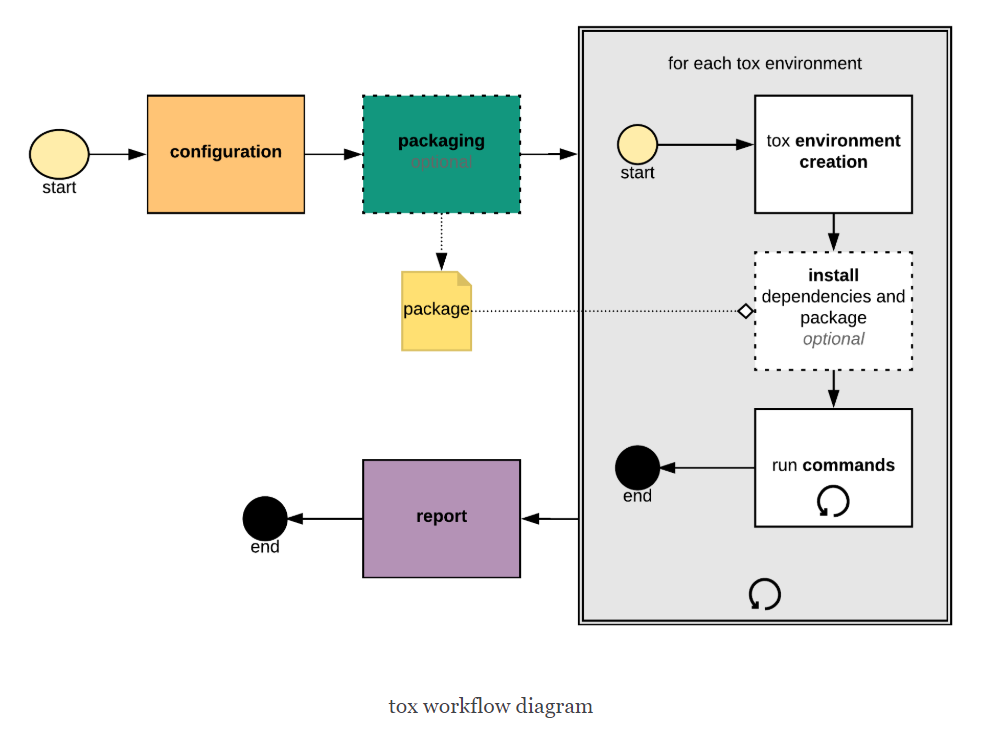

# python单元测试知识汇总

> 开发人员最讨厌的东西除了编写文档外，估计就是写测试用例了。
> 由于任务需求，需要搭建python的单元测试框架，并编写测试用例。但之前几乎没有接触过，所了解的也就只有自带的unittest框架了。
> 经过一段时间的研究，发现python的测试生态挺优秀的，个人记性也不好，因此记录下来，供自己和网友学习回顾。

单元测试，是个老生常谈的问题。我们都知道python自带了unittest框架，支持单元测试的编写。但深入研究发现，python支撑单元测试的东东还是很多的。因为python有多个版本，第三方库包也是有很多版本的，不同的依赖包版本都可能影响自己项目程序的正常运行；同时，一般来说，单元测试可能会依赖外部环境的参数变量，或者涉及到外部系统组件的交互，此时，仅仅只有unittest，是远远不够的。下面，介绍一些单元测试常用的python工具，以满足各种系统项目的测试需求。

## 测试环境管理工具 -- tox
> [点击进入tox官方文档](https://tox.readthedocs.io/en/latest/index.html)
> 基于官档的介绍，tox工具的主要目标是自动化和标准化python测试。

tox是通用的虚拟环境管理和测试命令行工具。配合virtualenv和pip工具，tox能够让我们在同一个Host上自定义出多套相互独立且隔离的python环境，每套虚拟环境中可能使用了不同的 Python 拦截器/环境变量设置/第三方依赖包。所以 tox 最典型的应用就是用于测试 Python 程序的兼容性了。tox 虽然不提供但是可以集成源码发布打包(sdist)、单元测试(UT)、测试覆盖率(coverage)、代码格式检查(pep8，flake) 等功能。说白了，tox就是用于构建测试需要的环境（python版本、第三方依赖、系统环境变量等），使测试用例可以在不同条件下运行。



上述为tox的工作流程示意图。一般的配置运行步骤流程为：

1. 加载配置 tox.ini（放置在setup.py 同级目录），合并cli命令行和系统环境变量参数
2. 打包，一般使用 python setup.py sdist 命令执行，可以在配置中忽略打包操作
3. 配置运行环境，对在tox中配置每一个环境（py27,py36），使用virtualenv创建一个新的虚拟环境，然后在环境中安装依赖package（使用pip），执行（如nose，stestr，pytest等）命令运行测试用例
4. 报告每个环境的输出结果

tox.ini这个配置文件的一个简单编写如下：

```ini
# content of: tox.ini , put in same dir as setup.py
[tox]
# 设置运行的python版本
envlist = py27,py36
skipsdist = True  # 跳过项目打包环节

[testenv]
deps = stestr       # install pytest in the virtualenv where commands will be executed
setenv =
    LANG=en_US.UTF-8

# 白名单，使用到的但没有通过deps安装的，否则会报warning
whitelist_externals = stestr

# 环境部署完毕后执行的命令，因此不一定是测试命令，也可以写pep8/pylint的代码检测或者其它的运行命令
commands =
    # whatever extra steps before testing might be necessary
    stestr          # or any other test runner that you might use

# 测试覆盖率统计
[testenv:cover]
# 配置环境变量参数
setenv =
    {[testenv]setenv}  # 引用[testenv]的环境变量设置
    PYTHON=coverage run --source demo --parallel-mode

commands =
    stestr {postargs}
    coverage combine
    coverage html -d cover
    coverage xml -o cover/coverage.xml
```

配置文件好了后，输入`tox`，就可以运行默认的**[testenv]**区域的配置，如果希望运行代码覆盖率检测，可以执行 `tox -e cover`。

## 测试脚本运行工具 -- Test Runner

当只有一个测试用例时，我们可能只要执行`python -munittest test_module.TestClass`，就能成功地运行测试用例。但是如果是成百上千上万甚至海量的的测试用例，我们将会面临一个问题，如何把这么多的用例自动运行起来。 Test Runner （测试运行工具）就是为了解决这样的事情的。目前市面上比较流行的 runner 有 nose、pytest、testrepository等等。它们各有特色，下面逐一进行介绍。

### nose

> [nose 官方文档](https://nose.readthedocs.io/en/latest/man.html)

nose是一个非常流行的 Test Runner，很多主流的测试应用工具都支持它，比如jenkins、tappy、coverage等。nose安装很方便，好像系统源就有其rpm包，同时其参考文档和应用案例很多，和各种插件（如jenkins）的配置使用等百度一下就有，非常方便。由于nose很通用，支持插件很多，也导致了使用过程中会配置很多，使用起来也较为很复杂，对于一些较为复杂的测试需求可能难以实现。而且，非常不幸的是，nose已经没有开发团队对其进行维护了，官方推荐新的项目使用nose2或者pytest，或者直接使用unittest。而nose2其实也一直没什么发展，所以目前更多的是使用pytest或者testrepository。虽然如此，对于小项目来说，使用nose还是很方便的。下面就简单介绍一下nose的使用方法。

nose工具会在指定目录搜索所有以test_ 开头的文件，然后执行其中所有以 test_开头的函数。nose在搜寻测试用例的时候，会基于`__init__.py`文件层层构建，确保所有测试用例以top-level（根模块）进行导入。我们可以通过配置文件，或者直接使用命令行参数方式，控制测试用例的运行。下面以配置文件方式进行介绍：

```ini
[nosetests]
# 统计测试覆盖率的模块
cover-package=demo
# tests path
tests=demo/tests
# log level
logging-level=WARN
# 统计测试用例的代码覆盖率
with-coverage=1
# 覆盖率输出xml格式
cover-xml=1
# 测试结果以junitxml格式输出
with-xunit=1
```

如上所示，nose是一个标准的配置文件格式，以`[nosetests]`作为section标识，上面的配置了测试用例的搜寻路径、测试结果输出格式、测试代码覆盖率统计和输出格式，以及打印日志的等级过滤等。nose在命令行的执行名称是nosetests，其运行测试用例命令为：`nosetests -c nose.conf`即可，具体参数可以执行 `nosetests --help` 查看说明。

### pytest

> [pytest官方文档手册](https://docs.pytest.org/en/latest/)

pytest也是一个很流行的测试框架，使用也挺简单的，使用其编写小型测试用例特别简单。详细看看官方文档即可。但是基于pytest框架的测试用例与我们往常的unittest编写习惯有些区别，风格迥异，要不要使用pytest主要看个人习惯吧。pytest框架下可以快速写些小型的测试。也是很常用的一种跑测试的runner，应该是在nose不维护后目前使用率较高的一个工具，很多其它工具都支持它。tappy提供pytest的插件支持。

### simple Testrepository / (testrepository的分支)

> [stestr官方文档](https://stestr.readthedocs.io/en/latest/MANUAL.html#)

TestRepository 是一个基于 subunit 测试流的并发执行工具，非常使用于大型应用的测试用例执行。而 Simple Testrepository 工具则是其fork的另一个分支，简化了TestRepository的使用操作。目前openstack组件单元测试基本使用stestr运行。关于stestr的资料几乎找不到，因此只能看官方文档了。而且非常不幸的是，如果需要构建自动化集成CI的话，jenkins不支持subunit格式的输出报告，需要通过命令subunit2junitxml将subunit流转化为junitxml格式的测试报告（subunit流和junitxml的区别，后续给出）。

使用stestr很简单，通过pip安装对应包及依赖后，在执行目录创建一个 `.stestr.conf`配置文件，其内容如下：

```ini
[DEFAULT]
test_path=./project_source_dir/tests
```

如上，`test_path` 指搜寻的测试用例路径，然后执行 `stestr run` 就能够执行测试用例了。它会在当前目录创建一个**.stestr**的目录，用于存放测试结果。其后，可以基于测试结果运行上一次failed的测试用例等操作。


## 测试框架 -- Framework

测试框架影响的是我们如何（编写/组织）测试用例，和上述的Test Runner不冲突。

### unittest
> [unittest 说明文档](https://docs.python.org/2/library/unittest.html)

这个是python标准库的内置框架，其使用如下：

```python
import unittest

class TestStringMethods(unittest.TestCase):

    def test_upper(self):
        self.assertEqual('foo'.upper(), 'FOO')

    def test_isupper(self):
        self.assertTrue('FOO'.isupper())
        self.assertFalse('Foo'.isupper())

    def test_split(self):
        s = 'hello world'
        self.assertEqual(s.split(), ['hello', 'world'])
        # check that s.split fails when the separator is not a string
        with self.assertRaises(TypeError):
            s.split(2)

if __name__ == '__main__':
    unittest.main()
```

### unittest2
python为了使python2.4~2.6版本能够使用2.7及以上的unittest框架新特性而特意增加的模块，一般上用不到。

### testtools
> [testtool官方文档](https://testtools.readthedocs.io/en/latest/overview.html)

其继承uniitest库，扩展了unittest框架功能，增加了一系列业界验证过的极有意义的功能， 其使用如下：

```python
from testtools import TestCase
from testtools.content import Content
from testtools.content_type import UTF8_TEXT
from testtools.matchers import Equals

from myproject import SillySquareServer

class TestSillySquareServer(TestCase):

    def setUp(self):
        super(TestSillySquareServer, self).setUp()
        self.server = self.useFixture(SillySquareServer())
        self.addCleanup(self.attach_log_file)

    def attach_log_file(self):
        self.addDetail(
            'log-file',
            Content(UTF8_TEXT,
                    lambda: open(self.server.logfile, 'r').readlines()))

    def test_server_is_cool(self):
        self.assertThat(self.server.temperature, Equals("cool"))

    def test_square(self):
        self.assertThat(self.server.silly_square_of(7), Equals(49))
```

为什么使用testtools，原因如下：
1. 有更好的assertion方法
2. 更多的debuginfo信息
3. 兼容标准unittest框架
4. 兼容不同python版本，如py27,py36等


### testscenarios
testscenarios是一个场景测试框架，也是unittest的一个扩展。在单元测试种，对某个对象的不同版本运行一组测试用例，或者对一组不同的对象运行同一个错误处理测试，或者对不同的驱动执行测试等，是一种常见的需求，而testscenarios就是基于该需求的扩展unittest的框架。简单地看看用法示例：

```python
import testscenarios
class TestDatabase(testscenarios.TestWithScenarios):
    scenarios = [
        ('MongoDB',dict(connection=connect_to_mongodb())),
        ('MySQL',dict(connection=connect_to_mysql())),
    ]
    def test_connected(self):
        self.assertTrue(self.connection.is_connected())
```

通过这样，我们就可以在一个测试用例里分别测试mongodb和mysql的连接，而不需要分别写它们的测试用例。


### oslotest

openstack针对其项目开发的测试框架，其继承了testtools框架。它可以支持环境变量的参数设定，如 `OS_TEST_TIMEOUT | OS_STDOUT_CAPTURE | OS_DEBUG | OS_LOG_CAPTURE` 等等，其使用如下：

```python
import oslotest

class TestStringMethods(oslotest.TestCase):

    def test_upper(self):
        self.assertEqual('foo'.upper(), 'FOO')

    def test_isupper(self):
        self.assertTrue('FOO'.isupper())
        self.assertFalse('Foo'.isupper())

    def test_split(self):
        s = 'hello world'
        self.assertEqual(s.split(), ['hello', 'world'])
        # check that s.split fails when the separator is not a string
        with self.assertRaises(TypeError):
            s.split(2)

if __name__ == '__main__':
    unittest.main()
```


### doctest

基于document的测试用例编写形式，将测试用例写在 docstring 上，其使用示例如下：

```python
def factorial(n):
    """Return the factorial of n, an exact integer >= 0.

    >>> [factorial(n) for n in range(6)]
    [1, 1, 2, 6, 24, 120]
    >>> [factorial(long(n)) for n in range(6)]
    [1, 1, 2, 6, 24, 120]
    >>> factorial(30)
    265252859812191058636308480000000L
    >>> factorial(30L)
    265252859812191058636308480000000L
    >>> factorial(-1)
    Traceback (most recent call last):
        ...
    ValueError: n must be >= 0

    Factorials of floats are OK, but the float must be an exact integer:
    >>> factorial(30.1)
    Traceback (most recent call last):
        ...
    ValueError: n must be exact integer
    >>> factorial(30.0)
    265252859812191058636308480000000L

    It must also not be ridiculously large:
    >>> factorial(1e100)
    Traceback (most recent call last):
        ...
    """

    import math
    if not n >= 0:
        raise ValueError("n must be >= 0")
    if math.floor(n) != n:
        raise ValueError("n must be exact integer")
    if n+1 == n:  # catch a value like 1e300
        raise OverflowError("n too large")
    result = 1
    factor = 2
    while factor <= n:
        result *= factor
        factor += 1
    return result

if __name__ == "__main__":
    import doctest
    doctest.testmod()
```


## 代码覆盖率统计 -- coverage
> [coverage官方文档](https://coverage.readthedocs.io/en/latest/)

代码覆盖率统计工具主要是统计测试用例是否100%覆盖了代码运行的所有分支。而coverage好像是唯一的一个python统计代码覆盖率的工具。coverage如果不指定配置文件，就使用 当前目录下的 `.coveragerc`。其统计结果会放在 `.coverage` 文件内，然后基于文件支持生成html 或者 xml格式的报告。但有一点需要注意的是，coverage只是基于代码运行行数进行统计，就算其输出是100%覆盖了，也不代表测试用例真正地覆盖了所有运行条件。如下所示：

```python

def fun(a, b):
    if a:
        print 'aaa'
        if b:
            print 'bbb'
        else:
            print 'not bbb'
    else:
        print 'not aaaa'
```

如果我们的测试用例只包含了 `fun(True,True)` 和 `fun(False,True)` 两个用例，coverage表示已经100%覆盖了所有代码行，但是很明显的，我们还有`fun(True,False)`和`fun(False,False)`这两个条件没有运行测试。因此，coverage的结果只能作为参考，可以告诉我们那些代码没有编写测试用例，我们可以进行补充。


## 测试结果格式
基于 Test Runner 运行测试用例不是目的，我们需要的是测试结果。一般地测试结果可能仅是单纯的 "OK" 或者 "FAILED"。因为我们是需要对测试结果进行分析的，而选用的分析工具或者展示工具各异，不一定能够识别Runner的输出结果。因此，业界对测试结果输出集合进行协议规范。这样我们就可以选择自己喜欢的分析工具和runner进行自由组合，不必要限定的太死了。

### TAP（test anything protocol）
Tappy是python的TAP实现，是一种测试结果输出规范或协议。目的是为了统一所有程序语言、不同测试框架下的测试输出结果。TAP目前支持C++、nodejs、python等等多种语言。其每个测试文件结果存储在以tap结尾的文件。很不幸，stestr目前好像还不支持输出tap格式。

### subunit
一种为测试结果提供流协议的python模块，可以提供二进制数据流。在执行大量测试用例时很有用。stestr就是使用subunit测试流的工具之一，但是nose不支持该种格式。

### junitxml
较为古老的一种输出格式，xunit和subunit/tap就相当于xml和json的那种关系吧。但目前仍然被许多工具所支持着。如jenkins的插件只支持junitxml的格式。


## 其它好用的工具

### fixture
用于测试用例测试前创建、测试后销魂的辅助行组件，看起来和使用unittest的`Setup()/tearDown()`功能一致，事实上也是这样的，但fixtures更加灵活好用，对于不使用unittest的测试用例也可以使用。有时候，在`Setup`方法内也会用到fixture。比如，需要配置应用程序的系统环境变量，可以这么使用：

```python
import fixtures
import os

class MyTestCase(fixtures.TestWithFixtures):

    def test_environ(self):
        fixture = self.useFixture(
            fixturex.EnvironmentVariable("FOO", "42"))
        self.assertEqual(os.environ.get("FOO"), "42")

    def test_environ_no_fixture(self):
        self.assertEqual(os.environ.get("FOO"), None)
```

fixtures.TestWithFixtures 也是继承于unittest.TestCase， 或者直接使用 testtool.TestCase 或者 oslotest.TestCase 也可以。当发现类似上面的通用模式时，最好创建一个fixture，以便它可以被你所有其它测试用例重用。这极大地简化逻辑，并且能够准确体现你在测试什么以及以何种方式进行测试。

### faker
> [faker使用介绍](http://www.hjqjk.com/2017/Python-moudle-Faker.html)

faker是python的第三方库，是一个伪造数据生成器，使可以使用假数据进行测试。faker使用很简单，还支持本地化，即中文就生成中文的字符串，英文就生成英文的（如人物名字）。使用方式也很简单，示意如下：

```python
from faker import Factory
fake1 = Factory.create()

name = fake1.name()
```


### mock && monkey patch

> [mock详细介绍，基本看完90%的mock用法都会了](https://medium.com/@yeraydiazdiaz/what-the-mock-cheatsheet-mocking-in-python-6a71db997832)

mock 和 monkey patch 都是常用的替换实际方法的常用手段，具体可以自行百度学习脑补一下啊，这里不多介绍。 Mock 的简单用法也不详细介绍，只记录一些常用的。
Mock是Python中一个用于支持单元测试的库，它的主要功能是使用mock对象替代掉指定的Python对象，以达到模拟对象的行为。一般用于模拟数据库连接执行，api请求操作等测试环境中不存在的组件时情况。其结果就是函数替换，返回一个虚假的值。

基本用法如下：

```python
# client.py

import requests

def send_request(url):
    r = requests.get(url)
    return r.status_code

def visit_baidu():
    return send_request('http://www.baidu.com')

# test_client.py
import mock
import unittest
import client

class TestClient(unittest.TestCase):

    def test_success_request(self):
        success_send = mock.Mock(return_value='200')
        client.send_request = success_send
        self.assertEqual(client.visit_baidu(), '200')

    def test_fail_request(self):
        fail_send = mock.Mock(return_value='404')
        client.send_request = fail_send
        self.assertEqual(client.visit_baidu(), '404')
```

如上所示，单元测试主要测试的是程序的逻辑处理是否符合预期，对于被测试方法的内部调用的其它函数，比如数据库连接、http request等等，不需要真的执行，因此就可以向上述这样mock掉，让函数直接返回固定值。当然，向上述这样mock掉的话，它的影响是全局的，即如果其它测试用例也调用了`send_request`方法但是没有mock的话，那么就会返回前一个测试用例mock的值，比如'404'。`mock.patch`就是专门针对这种情况处理的，通过使用patch，对每个测试用例进行有效隔离，可以将mock的作用范围限定在patch之下。

一些常用的mock操作：

- 函数可能需要执行多次，每次返回值不一样

```python
m = mock.Mock(side_effect=['a', 'b', 'c'])
m()  # print a
m()  # print b
m()  # print c
```

- 模拟函数抛出异常

```python
m.side_effect = RuntimeError('Boom')
self.assertRaises(RuntimeError, m)  # pass
```

- mock context manager，将打开文件替换成字符流输入

```python
with mock.patch("demo.open") as m_open:
	m_open.return_value.__enter__.return_value = StringIO('testing')
```

- mock builtins 和 环境变量

```python
# src file
import os

def work_on():
    path = os.path.join(os.getcwd(), os.environ['MY_VAR'])
    print(f'Working on {path}')
    return path

# test file
from unittest import TestCase, mock
from worker import work_on_env

class TestBuiltin(TestCase):

    def test_patch_dict(self):
        with mock.patch('worker.print') as mock_print:
            with mock.patch('os.getcwd', return_value='/home/'):
                with mock.patch.dict('os.environ', {'MY_VAR': 'testing'}):
                    self.assertEqual(work_on_env(), '/home/testing')
                    mock_print.assert_called_once_with('Working on /home/testing')
```

- mock 类的某个方法，保持其它方法不变（不被mock）

```python
with mock.patch.object(cls, 'get_path', return_value='testing'):
    worker = Worker()
    self.assertEqual(worker.work(), 'testing')
```


# 总结

python有一整套完善的单元测试编程套件，可以自由组合使用，非常方便，希望这篇文章能帮助到有需要的人。写的较为仓促，有部分内容可能没有斟酌仔细考察，如果发现错误，请及时提出，谢谢。


