# 密码安全基础理论

> 病毒横行，百般无聊，重新阅读了密码学相关的科普读物。对此进行笔记总结，以加深理解和记忆。
>
> 主要参考书籍：《图解密码技术》 - 结城浩（日），这本书讲解深入浅出，特别适合刚入门想了解密码技术相关知识的读者，个人强烈推荐。


我们在日常生活中，经常会使用到密码，比如手机密码、银行卡密码、支付密码等。这种“密码”更多地被称为口令（password），或者理解为获取某种重要东西的关键钥匙。而下面我们提到的密码，则是另一种维度的东西。文中涉及到密码技术，英文叫`cryptography`，是指通过数据加密的手段，以保证网络数据传输的机密性、完整性、认证等。这是一个非常庞大而复杂的信息安全体系，其衍生出的技术无时无刻在保护这我们生活中的各种信息的安全。

随着网络的普及，很多数据信息的传输离不开网络，而信息安全则是网络数据传输中面临的关键难题。毕竟，稍微懂点技术的人，应该都听过类似**`网络抓包`**等术语。网络在给与人们便利的同时，也带来新的安全问题。不管使用的是什么协议，通常，数据从一个计算机传输到网络位置上的另一个计算机上，在网络世界上的传输途径如下所示：

```txt
Sender(data:IP报文s) <--> Router1 <--> ... <--> RouterN <--> Receiver(data:IP报文s)

- Sender(发送者) 将待传输的data分割成一个个的IP报文，然后按顺序通过网卡将IP报文发送出去
- IP报文根据IP地址，在经过零个（局域网）或多个路由后，被目标接收
- Receiver（接收者）将获取到的一个个IP报文按顺序重新组织，还原成data
```

从上述过程可以知道，如果我们不对传输的数据采取任意保护措施，那么，有心人就可以截取网络上的 IP 报文，达到窃取、篡改数据等目的。信息安全是那么的重要，又是那么的脆弱，除了常见的抓包技术，黑客手段之多，是我们想象不到的，犹如冰山一角，管中窥豹。我们能够做的，是依赖现有的经过长时间验证的密码技术体系，以保障信息系统数据传输的安全。


## 涉及的人物角色以及术语

为了更好地进行密码技术重要性，以及针对特定技术进行说明，很多时候会引用生动有趣的例子，例子中会涉及多种角色，在这里统一进行说明。

| 名称    | 说明                                              |
| ------- | ------------------------------------------------- |
| Alice   | 一般角色                                          |
| Bob     | 一般角色                                          |
| Eve     | 窃听者，可窃听通信内容（eavesdropper，eve取谐音） |
| Mallory | 主动攻击者，可妨碍通信，伪造消息等                |
| Trent   | 可信的第三方                                      |
| Victor  | 验证者                                            |

一般地，我们将Alice作为**发送者**（Sender），Bob作为**接收者**（Receiver)，发送的数据我们统一称为**消息**（message）。虽然Bob为接收者，但不表示他不能发送消息，只是说Alice是首次主动发送消息的人，后续就是相互发送消息。发送消息的就是发送者，接收消息的就是接收者。

如果Alice发送消息时不希望别人看到，将消息内容进行**加密**（encrypt）后进行发送。那么，加密前的消息我们称之为**明文**（plaintext），加密后的消息我们称之为**密文**（ciphertext)。接收者对加密消息进行处理，以获取原消息的过程，我们称之为**解密**（decrypt）。


如上所示，密文是明文进行加密后的消息，密文在传输过程中即使被捕获到，窃听者Eve也完全无法理解其中的涵义，只有接收者通过特定的算法进行解密后，才能还原为明文。

基于上述场景，如果Eve在获取到密文之后，试图将密文还原，我们称这一行为叫做**密码破译**（cryptanalysis），或者密码分析。进行破译的人称为**破译者**（cryptanalyst)。不过要知道的是，破译者并非都是坏人，很多致力于研究密码技术强度的研究者，也经常需要对密码进行破译。

将明文加密为密文或将密文解密，用到的算法统称为**密码算法**。密码算法基本上都会使用**密钥**。一种密码所能够使用的“所有密钥的集合”称为**密钥空间**（可以space）。密钥就像现实中的钥匙一样，是数字信息加密和解密的关键。一般来说，算法是公开且固定的，其变量就是密钥，掌握在加密人手中。密钥丢了或被窃，以往通信的消息就不再保密了，就能够被窃取密钥的人轻而易举地获取。


## 密码学简史

> 一切不仅仅是机器的对抗，更是人的对抗。聪明人制造了密码，等待更聪明的人去毁灭它。


密码史是一段可歌可泣的保密与破译的攻防战，每一次破译，都对人类进程产生极大的影响。密码技术是如此的重要，涉及到人类生活的方方面面。除了保存自己的小秘密外，密码学应用最广泛的地方就是信息战争。一旦使用的密码算法遭到识别或破译，秘密将不复存在，这无疑是一场大灾难。历史上也不乏由于加密算法或密钥被窃取或破译导致情报泄露，战争失败的例子。

密码历史源远流长，几乎和使用文字的时间一样长久，早在公元前400多年就已经产生了。密码学一般分为三个阶段：`古典密码`、`近代密码`和`现代密码`。

古典密码主要的手段是代换和置换。代换指将明文中的字符使用另外一种约定的字符进行替换，接收者只需要对密文进行反向替换就可以恢复明文；置换指明文和密文相同，但是字母的顺序按照某种规律打乱。电视上常看的谍战片，电报人员拿着一个小本本进行密文翻译，就是经典密码一种。

近代密码主要由于计算机技术的蓬勃发展推动，快速的电子计算和数学算法的发展，一方面为加密技术提供了新的思路，另一方面给破译提供了强大的武器，由此而发展出来的新型学科。近代密码学的标记是抛弃手工或者机械式（如Enigma机械密码机）的设计方式，转为电子计算与数学结合的方式，而其中的代表为数据加密标准（DES）的出现，也就是对称加密（加密和解密使用相同的密钥）的黄金年代。

现代密码学基于公钥密码的概念，即加密和解密使用不同的密钥。其主要标记为 RSA 算法、ElGamal、椭圆曲线、双线性对等公钥密码相继提出。公钥密码的安全性由相应数学问题在计算机中的难解性来保证，比如 RSA 算法采用大整数的质因数分解在现阶段计算机难以计算的特质。正因为现代密码学的基础是复杂的数学计算问题，所以在出现计算力超强的计算机的时候，现代密码学就会崩塌，如未来的量子计算，可以在短时间内破解任意现实的算法等。新技术的出现总是会伴随着旧事物的消亡。我们不需要过多的担心，密码学、密码技术会在对抗中不断发展，有攻就有守，相生相克，永不消亡。

密码学的发展历程并不是本文的核心，因此，不会做太多的说明，有兴趣的自己可以在网上进行了解。下面，主要介绍密码发展历程中比较著名的古典加密算法（近现代密码技术是本文重点，将在后续章节中介绍），以此使读者对整个密码技术及其演进有更加清晰的理解。


### 凯撒密码

凯撒密码是古代罗马一个军事家用于军事密码传输的一种加密方式。它采取的是字母平移的方式。为了简化理解，我们仅使用小写字母代表明文，大写字母代表密文。

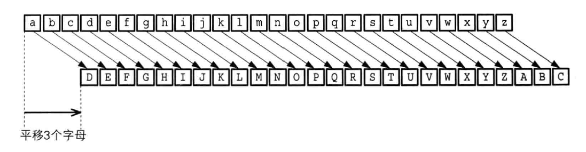

如上图所示，明文的所有字母往后平移 `N` 位所对应的就是加密后显示的字母。如下：

```txt
算法：凯撒密码
密钥： 3

明文： i love you
密文： L ORYH BRX
```

通过平移转换，密文就成了看不懂的一串字符。如果需要解密，只需要往左平移密钥位数即可。只要通信双方确定使用凯撒密码算法，然后协定好密钥（即字母平移的位数），就可以顺利地进行加解密。

如果攻击者知道通信双方使用凯撒密码算法，那么破解起来就很简单，只要**``暴力破解``**(brute-force attack)就可以了。因为字母表是有限的，也就是说，攻击者只需要将密文字母依次反向平移，最多尝试25次，然后选取解密后有意义的字符串，就能够确定通信使用的密钥和明文。


### 简单替换密码

上面所说的凯撒密码算法是将字母进行平移进行加解密，只需要尝试有限次数（26次）就可以暴力破解，这对于仅仅使用人力破解的古代来说，也是非常不安全的。简单替换密码算法就是凯撒密码的演化版本。简单替换密码不采用平移的约定方式，而是建立一个明文和密文的字母对照表，通过对照表进行加解密，如下图所示：

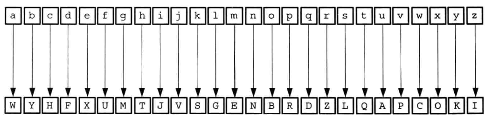

通过简单的数学计算，我们可以发现，对于26个英文字母来说，对照表总数（即密钥可取值）为
$$
26！ = 26 \times 25 \times ... \times 2 \times 1 = 403,291,461,126,605,635,584,000,000
$$
也就是说，即使每秒钟能够遍历10亿个密钥，也需要花费超过120亿年的时间，才能够暴力破解。基于平均值计算，简单替换密码算法平均需要花费约60亿年的时间，才能找到正确的密钥。

这听起来好像很安全，但也并非没有破译的可能。使用基于频率分析的密码破译方法，就能够快速的破译此类算法。频率分析利用了明文中的字母出现频率与密文中字母出现频率一致的这种特性。

|        |       |       | 字母频率表 |       |       |       |
| :----: | :---: | :---: | :--------: | :---: | :---: | :---: |
|   e    |   t   |   a   |     o      |   i   |   n   |   s   |
| 12.70% | 9.06% | 8.17% |   7.51%    | 6.97% | 6.75% | 6.33% |
|   h    |   r   |   d   |     l      |   c   |   u   |   m   |
| 6.09%  | 5.99% | 4.25% |   4.03%    | 2.78% | 2.76% | 2.41% |
|   w    |   f   |   g   |     y      |   p   |   b   |   v   |
| 2.36%  | 2.23% | 2.02% |   1.97%    | 1.93% | 1.49% | 0.98% |
|   k    |   j   |   x   |     q      |   z   |       |       |
| 0.77%  | 0.15% | 0.15% |   0.10%    | 0.07% |       |       |

我们知道，任何一种语言文字，每个字或者字母出现在一篇文章中的概率不是一样的，例如我们写一篇文章，出现最多的字母可能是`e|a|t`等。那么，我们只需要统计密文中出现所有字母的概率，然后和字母频率表进行对比，然后与密文进行替换。虽然密文的基数较小，不可能与上述的英文字母频率表完全对应，但在经过多次尝试比较替换，以及根据文本的上下文表达的含义猜测，我们总是可以找出某些字母的对应关系，然后再逐个进行尝试破译，还原出一份加密使用的字母对照表。

一般来说，使用频率分析的方法，一开始会比较慢，但是随着破译的进行，进度会越来越快。这就好比拼图一样，一开始毫无头绪，但随着拼接的图块越来越少，拼图的速度越来越快。


### Enigma密码机

基于大数定律，使用简单替换密码算法的密文越长，就越容易破译，因为密文越长，就越容易匹配字母频率表。Enigma是德国在二战时由德国人`阿瑟-谢尔比乌斯`发明使用的一种能够进行加密与解密操作的机器。Enigma通过转动的圆盘和电路，创造出人类手工所无法实现的高强度密码。Enigma也是人类第一次由手工加密跨入到机械加密的标志性产物。

Enigma是一种由键盘、齿轮、电池和灯泡等组成的加解密机器。发送者和接收者各拥有一台Enigma，使用相同的密钥。发送者和接收者事先收到一本叫做**国防军密码本**的小册子。国防军密码本记录了发送者和接收者所使用的**每日密码**，发送者和接收者分别按照册子的指示来设置Enigma机器。

Enigma密码机的加解密工作流程示例如下：

| 步骤 | 加密                       | 解密                       |
| ---- | -------------------------- | -------------------------- |
| 1    | 使用每日密码设置Enigma     | 分解密文                   |
| 2    | 加密通信密码               | 使用每日密码设置Enigma     |
| 3    | 基于通信密码重新设置Enigma | 解密通信密码               |
| 4    | 加密消息                   | 基于通信密码重新设置Enigma |
| 5    | 拼接消息                   | 解密消息                   |

Enigma在本质上仍然是使用字母替换方式，但并不是简单的字母替换方案，因此其不能简单地通过频率分析进行破译。简单点描述，Enigma通过国防军密码本上的每日密码来加密通信密码（这种方式被称为**密钥加密密钥**，即**KEK -- key encrypting key**），然后通过通信密码加密传输的消息，最后将加密后的通信密码+加密消息一并发给接收者；接收者先分离加密的通信密码和密文，然后同样基于每日密码解密通信密码，再通过通信密码解密密文。

因为Enigma的通信密码是可以随意变更的，即每次通信密码都可以不同，从而增加了破译的难度，在当时被认为是不可破解的密码机。同时，Enigma机器的设计不依赖于“**隐蔽式安全**”（security by obscurity），即使破译者知道Enigma的内部设计，只要不知道每日密码（即密钥），就无法破译密码。

当然，只要是人造的东西，肯定是有其缺点的。Enigma的弱点有三：

- 通信密码必须输入两遍并加密，也就是能够清晰地知道密文开头的字母被破译后一定是两遍重复的密码
- 通信密码是人为选定的，不是随机数，而人为选定就会有弱点，即密码很有可能是有意义的或者很好记忆的
- 必须派发国防军密码本，只要密码本落入到敌人手里，也必须重新制作新的密码本并且全军替换

正因为Enigma有弱点，所以Enigma最终还是被破解了。这导致的结果就是德军在二战使用Enigma进行军事通信，被反法西斯联盟破译了军事情报，最终战败。


## 密码与信息安全常识

通过阅读密码简史，我们可以发现，一般密码算法和密钥是分开的。将算法和密钥分开的意义在于，密码算法是需要重复使用的。为什么呢？我们可以很容易想到，如果算法和密钥不分离，那么要么每次都设计新的加密算法，要么算法在多次重复使用的过程中，被破译的可能性也逐渐增大。如果在一开始设计算法时，就将密码算法重复使用这一条件加入到考虑中，并在算法中加入可变的部分，通过密钥进行变化控制，那么密码算法就会更加的健壮。

在刚开始学习密码的时候，我们会对下面的一些常识感到难以理解，有悖常理。

- 不要使用任何保密的密码算法
- 使用低强度的密码比不进行任何加密更加危险
- 任何密码都会有破解的一天
- 密码只是信息安全的一部分


**不要使用任何保密的密码算法**

很多人可能回想，我们使用自己研制的加密算法，就能保证安全。然而这时大错特错的做法，使用保密的密码算法不会提高安全性。我们应该使用那些已经公开的，被公认地密码强度高的密码算法。这是因为，密码算法迟早都会公诸于世（可以是特务谍报、匿名人士发表、内部人员泄露等），而一旦这些保密的密码算法被暴露，那么构筑的整个保密体系将土崩瓦解。同时，开发高强度的密码算法是一件非常困难的事情，这其中需要高端的严密的数学证明。在自己看来貌似牢不可破的密码系统，在专业的破译者眼里可能来去自如。

试图通过对密码算法本身进行保密来确保安全性的行为，一般称为“**隐蔽式安全**性”（security by obscurity），这种行为是非常危险的。而公开的密码算法在使用前已经经过大规模专业人员的验证，在这样的情况下如果仍然需要花费相当长时间破译，就说明是高强度的密码算法。


**使用低强度的密码比不使用任何加密更危险**

这是因为低强度的密码一来很容易破解，二是容易使人掉以轻心。用户很容易通过密码感受到一种错误的安全感。对于用户来说，安全感与密码强度无关，而是由“信息已经被加密了”这一事实产生的。而这通常会导致用户在处理一些机密信息时麻痹大意。


**任何密码都会被破解**

这是因为，只要暴力破解，把所有密码都尝试一遍，那么总有一天会破解成功的。因此，破译密文所花费的时间，与要保密的明文价值之间的权衡就显得非常重要。

严格意义来说，是存在一种绝对不会被破解的密码算法的，它是**一次性密码本**（one-time pad），但是这不实用，无法应用于各种环境。一次性密码本会在介绍对称密钥算法时再详细说明。


**密码只是信息安全的一部分**

即使我们设置的密码强度很高，攻击者仍然可以通过别的途径获取到明文信息。比如攻击收发者的电脑，获取加密前的明文；又或者假装技术维护人员，发短信要求你修改电脑密码为“WTY456”，假装进行例行安全检查；又或者通过微信陌陌等好友聊天方式刺探窃取有用信息。而这些，都与密码强度毫无关系。

要保证良好的安全性，就需要理解“系统”这一概念本身的性质。复杂的系统就像一根由无数个环节想连成的链条，如果用力拉，链条就会从其中最脆弱的环节断开。而最脆弱的环节并不是密码，而是人类自己。


## 近现代密码技术

近现代密码技术是建立再计算机与数学的基础之上的。这是因为现代密码所处理的数据量非常的大，而且密码算法也很复杂，不借助计算机无法完成加解密的操作。而计算机有一个特点，就是所有消息数据（文字、图像、视频还等）都是通过0和1的比特进行存储和计算的。因此，依赖计算机的所有密码技术和算法，本质上是对计算机上的二进制比特流消息进行计算处理。


### 对称密码

对称密码算法指加密和解密使用同一个密钥的算法，一般是基于比特异或（XOR）的特性实现。异或运算符针对位运算，即两数相同为0，不同为1。在数学中使用 `⊕` 或者 `xor` 表示，在程序设计中一般使用 `^` 表示。

```txt
0 ⊕ 0 = 0
1 ⊕ 1 = 0
0 ⊕ 1 = 1
1 ⊕ 0 = 1
```

前面我们说过，在近代密码技术，所有基于计算机的消息都是以比特进行存储和计算的。因此，对数据的加密和解密实际上就是一系列的比特运算过程。

在对称密码算法中，假设明文为`T`，密文为`S`，密钥为`K`，那么其基于异或运算可如下表示：

```txt
S = T ⊕ K
T = S ⊕ K
可推导 ==> T = S ⊕ K = T ⊕ K ⊕ K = T ⊕ (K ⊕ K) = T ⊕ 0
由 0 ⊕ 0 = 0， 0 ⊕ 1 = 1 可得： T ⊕ 0 = T
```

当然，对称加密算法不是单纯的进行异或运算，但是其本质就是利用了异或的特性，使用同一个密钥实现消息的加密和解密。

下面，将会介绍几种常见的对称密钥算法。


#### 一次性密码本

只要通过暴力破解的方式，任何密文总有一天会被破译。但是，一次性密码本却是一个例外，它是绝对无法破译的。它的不可破译性，表现为即使密文被恢复成明文，破译者也不知道其破译的结果是否正确。一次性密码本是由维纳于1917年提出的，并获得了专利，因此又称为为维纳密码。一次性密码本无法破译这一特性是由香农于1949年通过数学方法加以证明。

一次性密码本是一种非常简单的密码，它的原理是“将明文与一串随机的比特序列进行异或运算”。如果将硬币的正面设为0，反面设为1，那么通过不断地抛掷硬币就能够产生这样的一串随机的比特序列。如下：

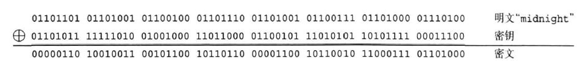


通过反向运算，就能将密文还原为明文。一次性密码本为什么无法破译，其关键在于密钥是随机生成的。如果对一次性密码本进行暴力破解，那么所有的比特位排列组合都会出现，这破解的密文不仅包括类似`aaaaaaaa`、`onenight`、`midnight`、`AB#_45HT`等多种文本。这对于破译者来说，由于他并不知道实际密钥是什么，所以即使破译获取到`midnight`字符，也无法确定它是否是正确的明文。


竟然一次性密码本理论上无法破译，为什么在现实中很少被使用呢？这是因为以下原因导致的：

- **密钥的配送**：密钥和明文长度相同，如果有方法可以安全将密钥发送出去，那么直接发送明文即可，根本无需发送密钥；
- **密钥的保存**：基于加密是为了保护明文不被窃取的原因，那么我们需要保存与明文一样长的密钥。如果有方法能够保护密钥不被窃取，那么直接保护明文即可；
- **密钥的重用**：密钥无法重用，每次发消息都需要新的随机密钥，这也是“一次性”的由来；
- **密钥的同步**：在通信过程中，发送者和接收者的密钥比特位不能错位，否则错位后面的所有信息都无法解密。如果在密钥特别长的情况下，发送者和接收者在处理密钥时很有可能一不小心就发生错位了；
- **密钥的生成**：使用的是真正意义上的无重现性的随机数，而不是通过伪随机代码生成的伪随机数。


虽然一次性密码本几乎没有实用性，但是人们基于这种加密思路，提出了**流密码**（stream cipher）的概念。流密码不是使用真正的随机比特序列，而是伪随机数生成的密钥序列。虽然流密码不是无法破译，但是它的强度很高，也很具有实用价值。


#### DES密码标准

**DES**（Data Encryption Standard）是1977年美国联邦信息处理标准采用的一种对称密码标准（FIPS 46-3）。随着计算机的进步，DES在1999年的DES破译大赛中只用了22小时就被成功破解了。由于DES能够被短时间内破译，不建议再使用，而且已被更加先进的 **AES** 取代，作为新一代对称密码的标准。关于AES，会在后续章节进行介绍。

DES的密钥长度固定为64位，而且一次只能对64位的数据进行加密。密钥中每8位（即7+1校验）有一个校验位，实际参与加密计算的有效密钥长度只有56位。DES是以64比特为一单元进行明文加密的，这样的一个单位我们一般称为一个分组。这种以分组进行处理的密码算法称为**分组密码**（block cipher）。分组密码一次加密的数据是固定的，如果明文很长，就需要对数据迭代使用分组密码算法，而迭代的具体方式，称之为**模式**（mode）。不同的模式具有不同的优缺点，其使用场景和安全性也有所区别，后续进行详细介绍。

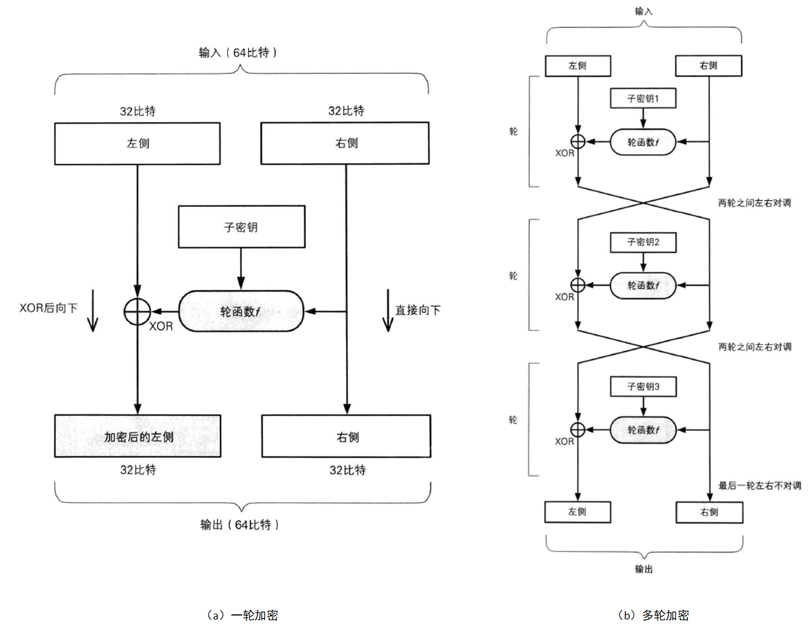

DES的加密使用了 **Feistel 网络结构**。在Feistel网络中，加密的各个步骤称为一轮（round），整个加密过程就 是进行若干次轮的循环，如上图的（a）和（b）所示。在执行的每一轮加密中，需要用到一个轮函数 F 和每一轮的子密钥 SK （注S：每一轮的子密钥都是不同的）。设64比特位的数据为 D，那么执行算法可描述如下：

```txt
假设 D 为待加密数据比特， SK为该轮使用的密钥，L、R为32比特的数据，LE、RE为加密后的32比特数据，那么有：

L = D 位于 0 ~31 位比特值
R = D 位于 32~63 位比特值
===> 推导出
LE = L ⊕ F(R, SK)
RE = R
```

在一轮的加密中我们可以发现，数据 D 只加密了一半，还有一半原封不动地输出。所以仅通过一轮加密，明文是不完全加密的。我们需要将一轮加密后的输出结果进行对调，即 `L=R, R=LE`，然后进行多轮重复加密，如上图的（b）所示。DES就是一种16轮循环的Feistel网络的。

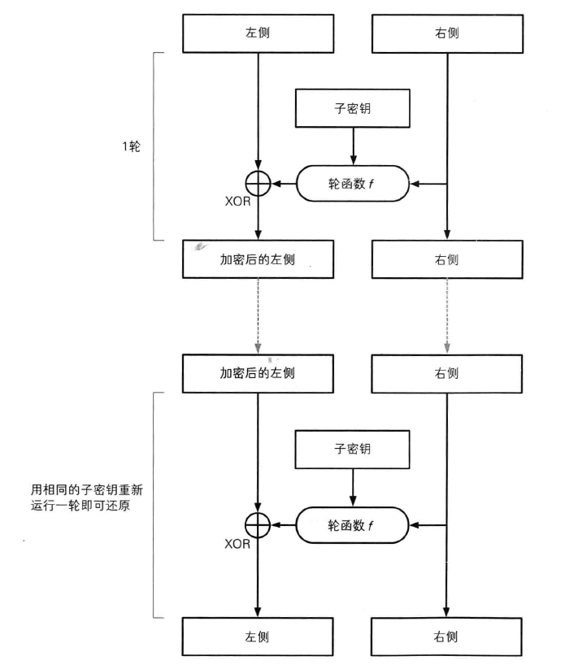

基于Feistel的加密和解密，使用同样的逻辑结构，如上图所示。因为加密后右侧的数据的不变性，因此`F(R, SK)`的值是不变的。通过`LE ⊕ F(R, SK) = L`就一定可以正确的进行解密。Feistel网络能够保证使用相同的结构实现加密和解密，且加密的结果必定能够正确解密。这是由于这种方便的特性，这中结构也被应用在除DES外的其他多种分组密码算法。

通过公式 `LE = L ⊕ F(R, SK)`可知，L 数据的加密与轮函数 F、子密钥 SK 和右侧的数据 R 有关。数据 R 我们很容易就可以得到，接下来我们简单描述下轮函数 F 以及 子密钥 SK 的实现。

> 注：如果觉得复杂，那么也可以跳过下面部分，只需要清楚其大致的计算逻辑：子密钥 SK 是通过 56 位密钥 K 基于数学方法计算得到48比特位的一共16个不同的子密钥。轮函数 F 将48比特的密钥与扩展为48位的数据 R 进行异或后，由置换表转换输出一个32比特位的数据，最后通过轮函数的输出结果与数据 L 进行异或，完成一轮加密。

子密钥 SK 不是凭空产生的，它是通过我们手中的密钥 K 计算得到的。前面说过，密钥 K 除了奇偶检验位外，一共有56位长度的有效密钥。在计算过程中，会使用到一些置换矩阵，如下：

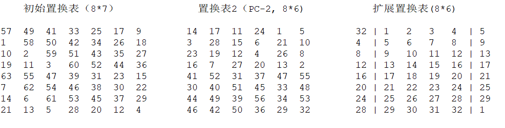

> 备注：简单说明置换表的用法
>
> 置换表中的数值，表示输入比特序列的序号，比如初始置换表中的第一个元素57，表明是密钥K中的第57位的比特值。如果以程序来表示，其伪代码则相当于这样：
>
> ```c
> T[8][7] = [xxx] // 初始置换表值
> K[64] = "0001001100110100010101110111100110011011101111001101111111110001" // 密钥K
> for(int i=0, i<56, i++)
>     R[i] = K[T[i/7][i%7]] // 转换后的结果
> ```


在子密钥生成过程中，也会使用如下的位移表：

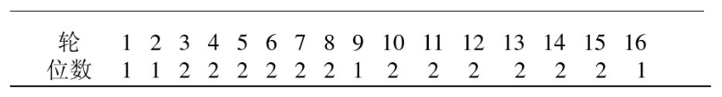

那么，子密钥生成如下步骤所示：

```txt
设 K(64) = 0x133457799BBCDFF1 （hex）
即 K(64) = 00010011 00110100 01010111 01111001 10011011 10111100 11011111 11110001 （bin）

1. 除去校验位并通过初始置换后，K为：
K(56) = 1111000 0110011 0010101 0101111 0101010 1011001 1001111 0001111

2. 将56位的密钥K分成两部分：
C(28) = 1111000 0110011 0010101 0101111
D(28) = 0101010 1011001 1001111 0001111

3. 将 C 和 D 合并，使用置换表PC-2，得到一个48位的密钥SK
SK(48) = PC-2(C+D)

4. 依次将C和D分别按照位移表所示进行循环左移，再通过PC-2置换表可得到所有的16个子密钥，即
C = C << r(n)
D = D << r(n)
其中， r(n)表示位移表中第n轮对应的位移值。要注意的是，C和D的值是上一轮的C、D值，不是第一轮的C、D值。
```

至此，我们生成了16个48比特位的子密钥。

从前面一轮加密的结构图中可以发现，左侧数据 L 是需要和轮函数的输出结果进行异或运算的。这表示，轮函数的输出必须是32比特位的数据。而子密钥的长度是48比特位，也就是说，轮函数在运算过程中肯定要将48比特的计算结果转换为32比特位的输出。

轮函数的处理逻辑大致如下：

```txt
设当前轮子密钥为K，右侧32位数据为R，则

1. 使用扩展置位表将数据 R 转换为 48 比特位（扩展置换改变了数据R的比特次序，并且重复了某些位）
2. 将扩展后的R(48)与子密钥进行异或运算，或者其他复杂的逻辑运算
3. 将得到的结果使用功能表S-盒替换（S-盒作用是将48位的结果转换成32比特位的数据）
4. 将32比特位数据通过P-盒置换后，作为轮函数结果输出
```

S-盒替换表一共有8个，也是类似前面的4*16的置换矩阵。为什么要8个S-盒？S-盒逻辑是接收一个6比特的输入，然后输出一个4比特位的数值。而我们有48比特数据需要转换，所以S-盒一共有8个。不用一个S-盒的原因是为了增加破解的难度。因此，我们在轮函数的步骤三时，需要将48比特的数据分成8部分，每部分含有6比特数据，分别传入到不同的S-盒中，然后将得到的结果进行拼接，就是一个32位的数。

下面以一个S-盒为例，介绍S-盒的应用。

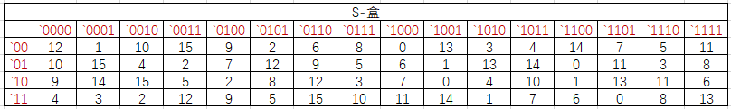

如上所示，是S-盒的一个置换矩阵，如果输入为：`100100`，那么可得输出为`1111`，如下所示：

```c
input = “100100”
row = "10"    // 取输入的第一位 + 最后一位   
col = "0010"  // 剩余的中间4位值
result = S[row][col] // 对照S-盒替换表，得到result=15，15的二进制为 1111
```

需要注意的是，4比特位的取值范围为 0~15，因此构造S-盒的置换矩阵的取值范围为 0~15。前面我们还说了，在使用S-盒将48比特转换为32比特后，还需要P-盒进行置换。这里P-盒和前面说的初始置换表功能是一样的，主要是将比特位打乱而已，就不多说了。

> 在正常情况下，初始置换表和P-盒置换表的功能仅仅是将数据的比特进行打乱，并不会改变数据的比特值。即使不进行置换，对DES算法结果也是没有太大的影响的。这仅仅是为了增加硬件的破解难度而已。在软件实现中可以去掉，以增加加解密的速度。


前面我们介绍了很多矩阵，包括`初始置换矩阵`、`PC-2`、`扩展置换矩阵`、`S-盒置换`、`P-盒置换`以及`移位表`等等。这些都是实现DES算法是为了进行数学计算设置的。这些矩阵根据实现，所取的值可能有所不同，只有通信双方使用的的DES算法一致即可。而且，也没有隐秘这些置换矩阵的必要，因为我们默认所有的密码算法都是公开的（非隐蔽安全性）。同时，也不建议使用小聪明，通过修改这些置换矩阵数值来保密所使用的密码算法。

另外需要清楚的是，其实子密钥的生成也是在轮函数内部实现的，本文只是为了描述清晰，将两部分分开描述罢了。


看了上述DES的加密过程，可能有些人会有疑问，既然DES算法是公开的，而且每次子密钥的运算仅仅是通过母密钥生成的。换句话说，只要知道任意一个密钥，母密钥和子密钥都是可以通过逆运算推导。那么我们为什么要这么复杂地计算使用子密钥呢，直接使用母密钥不是更方便快捷吗？至少这个问题在我了解DES算法后曾经有过疑惑的。经过一阵思考后，我觉得还是为了增加破解的难度吧。如果我们直接使用母密钥进行加密，比如待加密的明文`Text1`和`Text2`，为了突出区别，仅仅最后一个比特不同。同时，简化一下轮函数，即它不修改直接输出母密钥：

```c
Text1 = "11111111 11111111 11111111 11111111 11111111 11111111 11111111 11111111"
Text2 = "11111111 11111111 11111111 11111111 11111111 11111111 11111111 11111110"  
Key   = "00010011 00110100 01010111 01111001 10011011 10111100 11011111 11110001"
    
// 多轮加密后
S_Text1 = "******** ******** ******** *******1 ******** ******** ******** *******0"
S_Text2 = "******** ******** ******** *******0 ******** ******** ******** *******1"
```

可以发现，极为相似的两个数据在加密后，密文也是非常相似的，只有特定比特位受到影响（*表示任意相同值）。而如果通过DES算法得到的密文，即使明文数据非常相似，但是计算得到的密文已经南辕北辙，毫无对比性。至少，DES算法隔绝了密文的关联性，增加了破解的数学难度。


DES算法在实践应用中已经做出验证，它具有极高的安全性，除了用暴力破解的方法外，还没有发现更为有效的方法。但是因为DES只使用56位有效密钥，其密钥空间只有2的56次方。这意味着如果一台计算机的速度是每一秒钟检测一百万个密钥，则穷举所有密钥就需要将近2285年的时间。随着硬件技术和并行计算的发展，破解所需要的时间越来越少，使用经过特殊设计的硬件并行处理仅需要几个小时。

由于DES算法已经可以被暴力破解，因此需要开发一种更加安全的密码算法，而它就是三重DES。


#### 三重DES

顾名思义，三重DES就是使用三次DES算法进行加密和解密。由于明文需要经过三次不同密钥的DES算法，才能够生成密文，因此，三重DES的密钥长度为`56 * 3 = 168`比特。

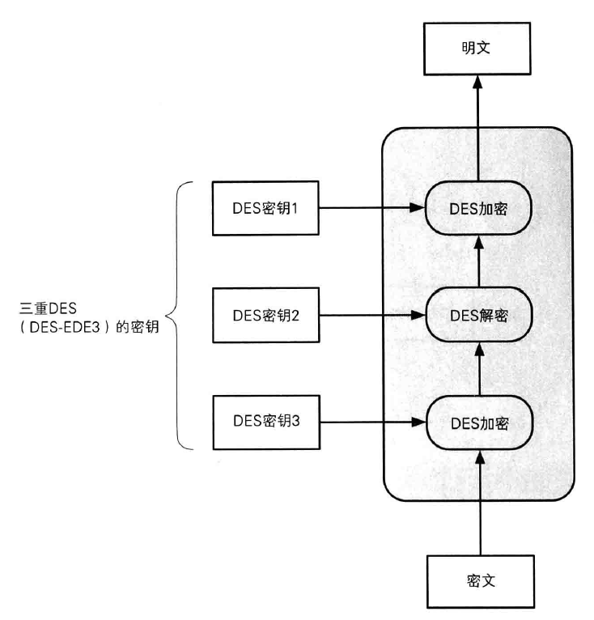

三重DES的加密解密过程如上图所示。值得注意的是，三重DES并不是执行三次加密操作，而是**`加密->解密->加密`**的过程。之所以这么设计，主要是为了兼容DES算法。当三个密钥均相同时，三重DES的就相当于DES算法了。基于密钥的选择，三重DES可以区分为（EDE表示加密->解密->加密的过程）：

- DES-EDE1：三个密钥完全相同，即普通的DES算法；
- DES-EDE2：第一个和第三个密钥相同，第二个密钥不同，即仅使用两个不同的密钥；
- DES-EDE3：三个密钥完全不同

三重DES的速度不快，而且安全性方面也逐渐显现一些问题，因此，后续被AES密码算法取代。


#### AES密码标准

AES（Advance Encrpytion Standard）是取代前任DES而称为新标准的一种对称加密算法。全世界的企业和密码科学家提交多个密码算法作为AES的候选，在经过严格的测试，并且考虑了算法的速度、实现的容易性等因素，最终选定了**Rijndael**算法作为AES的密码算法。

Rijndael算法是由比利时密码学家 Joan Daemen 和 Vincent Rijmen 设计的分组密码算法，于2000年被选为新一代的标准密码算法。与DES类似，Rijndael算法也是由多轮加密运算构成，但是Rijndael没有使用Feistel网络，而是使用了SPN结构。

AES密码的加密分组长度固定为128比特，即一次可加密128比特的明文，但是它支持的密钥长度可在128~256范围内，以128为底，步长32。在AES中，一般只存在下列表格的三种规格。

|      | 密钥长度 | 推荐轮数 |
| ---- | -------- | -------- |
| 1    | 128      | 10       |
| 2    | 192      | 12       |
| 3    | 256      | 14       |

AES密码算法背后由严谨的数学支撑，从明文到密文的计算过程可以完全通过公式表达，这是以前任何的密码算法所不具备的性质。那就表示，AES可以通过数学运算方式进行破译。不过，至今为止还没有出现对AES算法的有效攻击。

对于AES算法，要完全理解它非常困难，需要有深厚的数学知识背景，其中涉及了矩阵运算以及伽罗瓦域中的乘法运算。反正我个人尝试了一下，没有看懂。但是发现一篇非常不错的博文，里面介绍AES非常的清晰，忍不住点赞，相关读者可以参考阅读。 链接 --- [AES算法详解](https://www.cnblogs.com/chenshikun/p/11667438.html)

AES算法一次支持128比特的明文数据加密，也叫是16个字节（后续运算都是以字节为单位进行描述）。将明文和密钥（16字节，192、256密钥长度暂不考虑）分别构造成一个4*4的矩阵，其顺序如下所示：

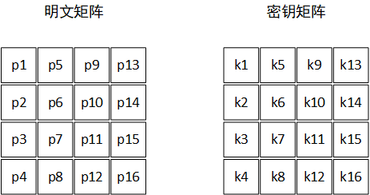

然后，基于明文和密钥矩阵，开始每轮的计算。一轮的AES算法主要有四种操作处理，分别是**密钥加法层**(也叫轮密钥加，英文Add Round Key)、**字节代换层**(SubByte)、**行位移层**(Shift Rows)、**列混淆层**(Mix Column)。AES算法在处理的轮数上只有最后一轮操作与前面的轮处理上有些许不同(最后一轮只是少了**列混淆**处理)，在轮处理开始前还单独进行了一次轮密钥加的处理。其执行示意如下所示：

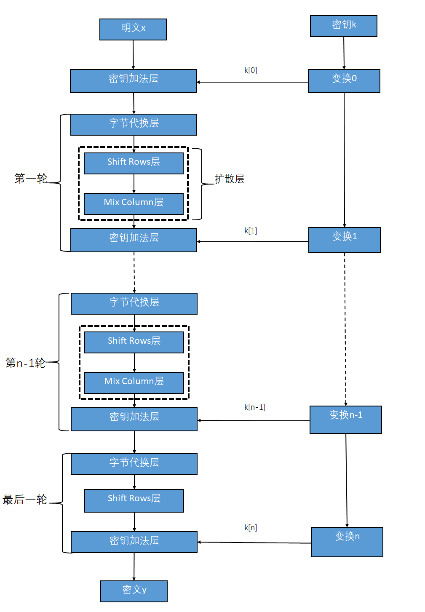

因为每一轮我们都对这些比特进行混淆和扩散，而且每轮计算都融合了密钥，轮数越多就会越安全。而决定采用多少轮，则需要在安全性和效率之间进行权衡。一般地采取上面表格的轮数即可。


**密钥加法层**

这一层其实就是将一轮的输入矩阵（第一轮即明文矩阵）与每轮的子密钥矩阵进行异或运算，然后生成一个异或运算后的矩阵。与DES一样，每轮的子密钥均不相同，其构造算法后续介绍。其运算逻辑大致如下

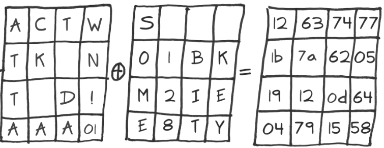

> 我们发现分组密码很喜欢用异或运算。这是因为异或运算运行速度很快且开销很小，符合加密要求。异或运算只需要简单的硬件逻辑，同时运算非常独立，能够支持并行计算。


**字节替换层**

所谓字节替换，就是以每个字节的值（0~255）为索引，从16*16的二维S-盒替换表中查找出对应值进行替换，这个和之前介绍DES时的S-盒是一致的，只不过变成了16**16的替换表。具体操作如下：

```c
S-Table[16][16] = {{xxx}, {xxx},...} 
byte = "11111000"
row = 0x1111   // 0x1111 = 15
col = 0x1000   // 0x1000 = 8
result = S-Table[row][col]
```

如上，就是一个字节的高四位和低四位分别作为索引的行和列，并将S-盒中的值替换原值。与S-盒相对的是逆S-盒，在解密时用到。这个简单来说就相当于简单密码替换的256个字母的版本吧。


**行位移层**

行位移层很容易理解，就是按照某种规律对每轮的输入矩阵数据的字节位置进行交换。行位移属于AES手动的扩散层，目的是将单个位上的变换扩散到影响整个状态矩阵，从而达到雪崩效应。其具体的行平移操作如下所示：

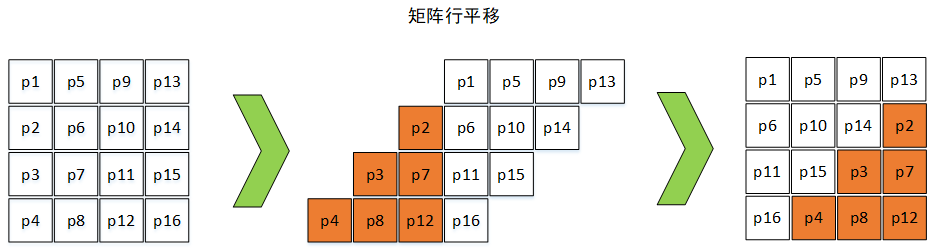

在解密时行位移处理与加密时的处理相反，解密时的处理称作逆行位移。


**列混淆**

列混淆操作是AES算法中主要的扩散元素。通俗地理解，列混淆是指在矩阵中以列为单位，在一列内将字节进行重新组合，重组后的每个字节均包含原列中的4个字节元素的部分比特值。如下所示：

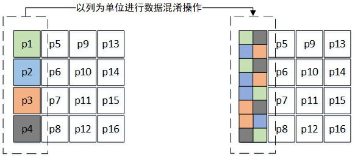

重复上图操作，将整个输入矩阵都进行列混淆。列混淆的加密和解密操作，用到了矩阵逆运算的知识，大致如下（设P为明文矩阵，A是混淆矩阵，R为混淆后的结果矩阵）：
$$
AA^{-1} = E\\
PA = R\\ 
RA^{-1} = PAA^{-1} = PE = P
$$
因此，只需要左乘混淆矩阵A的逆矩阵，就可以还原原矩阵。混淆矩阵A是一个可逆矩阵，而它们之间的加法、乘法都在扩展域GF(2<sup>8</sup>)中进行，这涉及到矩阵乘法、伽罗瓦域内加法和乘法的相关知识，在这不在细说。

行位移子层和列混淆子层的组合使得经过三轮处理以后，矩阵的每个字节都依赖于16个明文字节成可能。列混淆在最后一轮不需要运行，是由于最后一轮执行不会提高任何安全性，相应地会降低加密速度。


**扩展密钥生成**

前面所描述的就是AES算法大致的运行逻辑，我们还剩最后一步，即了解下每轮密钥的产生过程。

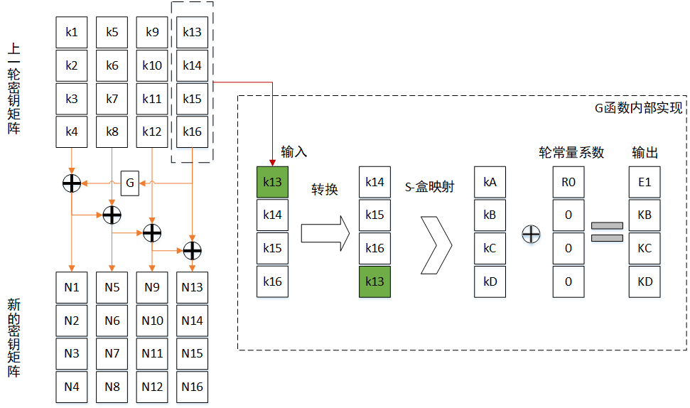

```txt
step1： 将用户手中的原始密钥矩阵或者上一轮使用的子密钥矩阵作为输入矩阵，
step2： 将矩阵最后一列作为 G 函数的输入，产生新的一列元素值
--------G-1： 将输入列看成数组的话，将第一个元素移到放置到最后位置，得到一个新的列
--------G-2： 将该列通过 S-盒 映射为全新的一列数据
--------G-3： 将映射得到的列与轮常量系数（Round Constant，每轮不同）进行异或操作
step3： 将 G 函数得到的值和输入矩阵的第一列进行异或操作，得到新密钥矩阵的第一列
step4： 将新密钥矩阵的第一列与输入矩阵的第二列进行异或，得到新密钥矩阵的第二列
step5： 将新密钥矩阵的第二列与输入矩阵的第三列进行异或，得到新密钥矩阵的第三列，依此继续得到第四列
```

S-盒我们前面已经提了很多遍了，这里就不再描述了。轮常量系数（Round Constant）是一个一维数组，一般称为Rcon，每个元素是一个字（4字节，后三个字节总是0）。每轮 `Rcon[i]` 的计算一般如下所示：
$$
Rcon[i] = x * Rcon[i-1] = x^{i-1}
$$
其中，i为当前轮数，x一般为取值2，即Rcon每轮为2的次方值。


#### 分组密码的模式

前面介绍的DES算法和AES算法，都是属于分组密码。因为它们一次只能对固定长度的明文进行加密，如果要加密任意长度的明文，就需要对分组密码进行迭代，而迭代方式，我们称之为模式。

> 密码算法一般可分为分组密码和流密码两种。
>
> 分组密码在处理完一个分组就结束，不需要保存内部处理状态；流密码是对数据流进行连续处理，因此需要保存内部状态。在前面介绍的密码算法中，只有一次性密码本属于流密码。可回顾下之前看的内容，体会下流密码的概念。

分组密码为什么需要模式，明文很长的话，直接分割成多个分组逐个加密不行吗？事实上，这样的方式加密有很大的弱点，后续会提及。

在继续说明分组密码的模式前，先将各种模式的总结放出，对于不想深入了解模式的读者，可直接阅读总结表格，选择合适场景的加密迭代模式。

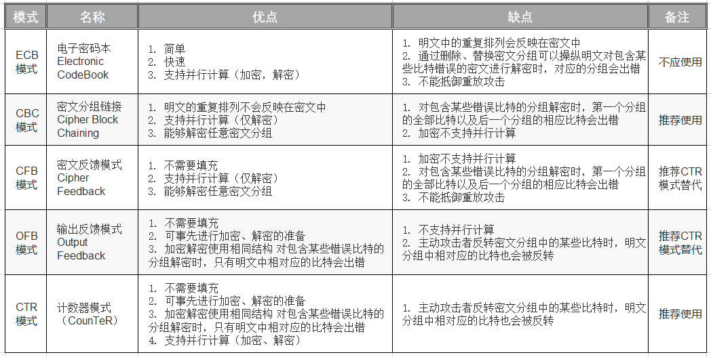


**ECB 电子密码本模式**

ECB模式就是直接将明文加密分组之后的结果作为密文，当最后一个明文分组的内容小于分组长度时，需要使用一些特定的数据位进行填充。如下所示：

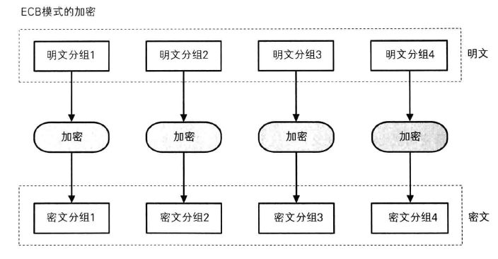

ECB模式中，明文和密文分组一一对应。因此，如果有多个相同的明文分组，会转化位相同的密文分组。这样，只要仔细观察密文，就能从中发现明文存在的重复组合，以此为线索来破译密码。

同时，ECB模式下，有一个很大的弱点，就是**不需要破译即可操纵明文**。如下：

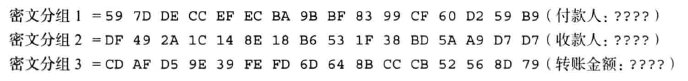

假设 Alice 通过银行转账给 Bob ，主动攻击者 Mallory 获取了这样的一段密文，然后通过调换密文分组1和2的顺序。那么银行将密文解密后，就以为是 Bob 转账特顶金额给 Alice 。虽然 Mallory 没有破译密文，但是只要知道特定的密文数据组织格式，就有可能进行如上的攻击。不止如此，Mallory 可以通过随意增加、删除、替换等方式对密文发起攻击。


**CBC密文分组链接模式**

在CBC模式中，，将明文分组和前一个密文分组进行异或运算，然后再加密。如下所示：

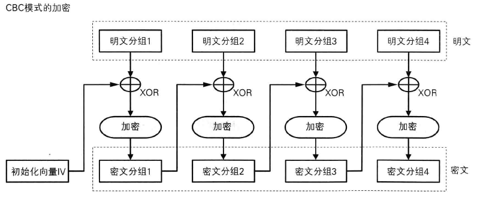

当加密第一个明文分组时，由于不存在前一个“密文分组”，因此需要准备一个与密文分组等长的比特序列，一般称为**初始化向量**（Initialization Vector， IV），一般来说，每次加密时都会随机产生一个不同的比特序列来作为初始化向量。这个初始化向量会通过某种方式发送给接收者。

CBC模式解决了ECB模式中相同明文分组加密得到的密文分组相同的缺陷。同时，如果某些密文分组损坏了（如比特翻转，攻击者故意修改数据等），也仅影响两个明文分组，如下：

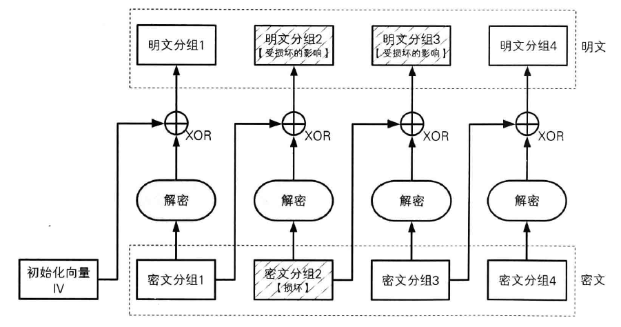

主动攻击者 Mallory 针对CBC模式，可以有一下攻击手段：

- 攻击初始化向量，如比特位反转。因为初始化向量会和第一个明文分组进行异或操作，所以对 IV 进行比特位反转，可以有效控制明文特定比特的反转，从而控制第一个明文分组。而这对于密文来说就不好控制了。攻击者很难通过修改密文的比特来影响明文分组的特定比特反转。
- 填充提示攻击，是一种利用分组密码中填充部分来进行攻击的方法。攻击者会反复发送一段密文，每次发送时都对填充数据进行少许改变。由于接收者（服务器）在无法正确解密时会返回一个错误消息，攻击者通过这一错误消息就可以获得一部分与明文相关的信息。填充提示攻击不仅针对CBC模式，是对于所有需要填充的密码算法都适用。


**CFB 密文反馈模式**

在 CFB 模式中，前一个密文分组作为密码算法的输入数据，将其所得结果与明文分组进行异或运算。

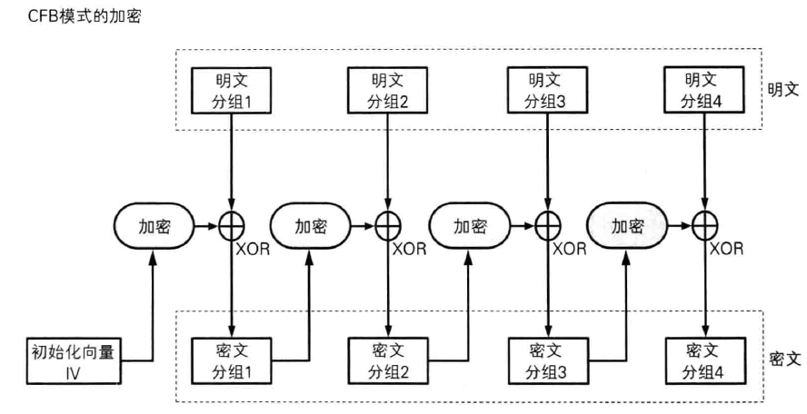

在前面的 ECB 模式和 CBC 模式中，明文分组都是通过密码算法进行加密的，而 CFB 模式并没有这么做。同样的，CFB 模式也需要初始化向量。

CFB 模式与流密码很相似，密码算法的输出相当于一次性密码本中的随机比特序列。但由于 CFB 模式的输出（即密文分组）是通过计算得出的，不具有随机性，所以不具备一次性密码本那样的不可破译性。CFB模式下由密码算法产生的密钥，称为**密钥流**（key stream）。

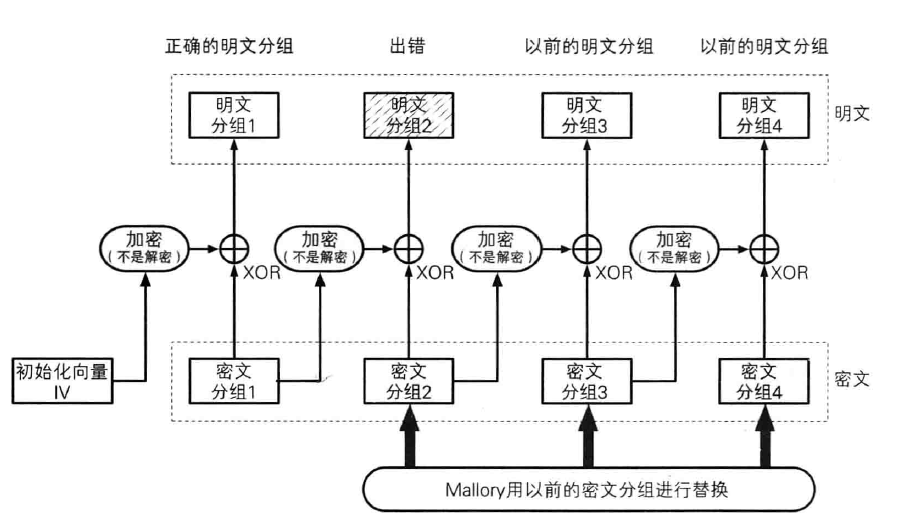

针对 CFB ，可实施**重放攻击**（replay attack）。如 Alice 向 Bob 发送一条消息，由4个密文分组组成。主动攻击者Mallory 将该消息中的后3个密文分组保存了下来。等下次 Alice 又向 Bob 发送了内容不同的4个密文分组（假设Alice使用了相同的密钥）。攻击者用昨天保存下来的3个密文分别将今天发送的后3个密文分组进行了替换。这样，Bob 解密时，4个分组中只有第1个可以解密成正确的明文分组，第2个会出错，而第3个和第4个则变成了被攻击者替换的内容。攻击者没有破解密码，就成功地将以前的电文混入了新电文中。而第2个分组出错到底是通信错误呢，还是被人攻击所造成的呢？Bob是无法做出判断的。


**OFB输出反馈模式**

在 OFB 模式中，密码算法的输出会反馈到密码算法的输入中。OFB不是对明文进行加密，与CFB类似。其迭代加密模式如下：

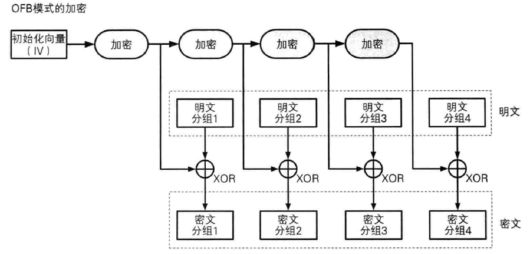


与CBC、CFB相同，OFB也需要初始化向量。OFB与CFB差异主要在密码算法的输入上。CFB的输入是上一密文分组，而OFB的输入是对初始化向量的加密过程的输出。


**CTR计数器模式**

CTR 是一种通过将逐次累加的计数器进行加密来生成密钥流的流密码。在 CTR 模式中，每个分组对应一个逐次累加的计数器，并通过对计数器进行加密来生成密钥流。也就是说，密码算法加密的是计数器，将算出的序列与明文分组进行异或得到密文。

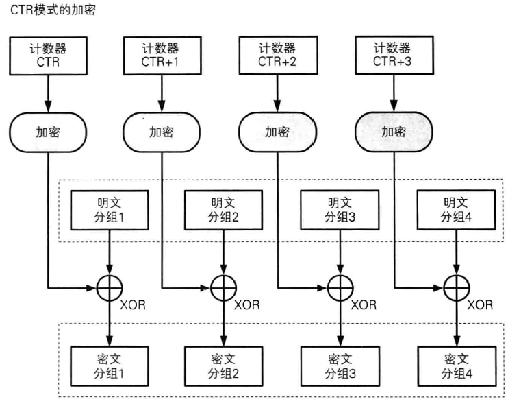


在一次通信加密中，会产生一个随机的不同的值（nonce）作为计数器的初始值，然后每个明文分组在使用后将计数器累加。一个计数器的初始值可能如下所示：

```txt
初始值：
|-------- nonce---------|---------deta----------|
17 AF 44 20 33 88 A1 FF | 00 00 00 00 00 00 00 01

加密计数器值：
17 AF 44 20 33 88 A1 FF | 00 00 00 00 00 00 00 01  // 明文分组 1 的计数器值
17 AF 44 20 33 88 A1 FF | 00 00 00 00 00 00 00 02  // 明文分组 2 的计数器值
17 AF 44 20 33 88 A1 FF | 00 00 00 00 00 00 00 03  // 明文分组 3 的计数器值
......
```

如上，nonce对应高八位值，在一次加密中这是不变的，低八位值逐次累加。虽然 CTR 理论上不需要使用初始化向量，只要能够保证产生nonce值即可。但在实践中还是使用 IV 较多。CTR的计数器之间实际上没有关联，即每个明文分组对应的计数器值都是可以通过计算得到的（只需要知道nonce和明文分组的序号），就能够对任意顺序的明文分组进行加密，这意味着能够实现并行计算。

对CTR的攻击，可表现在：

- 密文比特位反转，导致明文对应的比特位反转


**小结**

上面介绍了5中常见的分组密码模式，在《实用密码学》一书中指出，不应使用ECB模式，推荐使用CBC和CTR模式。虽然如此，但不同模式都有自己的优缺点，在选用时，应该根据实际应用场景对安全、速度、时效性、易用性等多种需求的综合考虑。

其次，我们发现，除ECB模式外，其他几乎所有的模式都需要用到初始化向量（IV），且加密端和解密端使用同一个 IV 才能正确解密。IV 可以在分组加密的一次通信中进行传递给接收方。IV 原则上不需要加密，但是如果可以通过隐秘的方式进行传递（毕竟解密过程中密钥才是关键，破译者仅知道 IV 也是不能解密的），可以增加破译的难度。


### 公钥密码

在使用对称密钥时，必须发送者和接收者都拥有相同的密钥，才能完成加密和解密的整个过程。那么，我们会遇到**密钥配送**的问题。密钥不能随密文一起发送，现实中解决密钥配送的解决方法一般有：

- **通过事先共享密钥**：通信双方约定一个事先知道的密钥。这种方式有一个缺点，如果有`N*N个`人需要通信，那么需要`N*(N-1)/2`个不同的约定密钥。
- **通过密钥分配中心**（key Distribution Center，KDC）：由KDC临时生成并分配对称密钥。具体做法是KDC保存通信双方如 Alice 和 Bob 的事先约定的共享密钥，当 Alice 和 Bob需要通信时，KDC 临时产生一个通信密钥，分别使用 Alice 和 Bob 的约定密钥对通信密钥进行加密，然后发送给 Alice 和 Bob。Alice 和 Bob 使用自己的密钥解密获取临时通信密钥，最后使用临时通信密钥进行通信。通过赭红方式，KDC只需要知道N个人的共享密钥即可。常用的基于KDC的加密应用工具有MIT 研发的 Kerberos。
- **通过 Diffie-Hellman 密钥交换**：Diffie-Hellman密钥交换中，通信双方需要交换一些信息（这些信息即使被窃取也没关系），然后根据交换的信息，通信双方各自生成相同的密钥。具体描述在后续介绍。
- **通过公钥密码**：在公钥加密中，加密和解密使用两个不同的密钥对，称为公钥和私钥。发送者使用公钥加密，消息接收者使用私钥解密。公钥是公开的，私钥只有密钥持有者才有。


那么，我们来简单了解一下公钥密码。

**公钥密码**（public-key cryptography）中（也称**非对称密钥**），加密和解密使用不同的密钥，分别为**公钥**（public key）和**私钥**（private key）。使用公钥加密的信息，只有私钥可以解密；同样地，使用私钥加密的信息，只有公钥可以解密。生成**密钥对**（key pair）的持有人员自己保留私钥，将公钥公开给全世界的人们。这样，所有人都可以使用公开的公钥对消息进行加密，发送给持有私钥的人员。因为公钥是公开的，所以不存在对称密钥中密钥配送的问题。

公钥密码有很多算法，其中比较著名的有RSA算法。RSA算法已经成为公钥密码在事实上的标准。其他的公钥密码算法有：`EIGamal方式`、`Rabin方式`、`椭圆曲线密码`等。


#### RSA

**RSA** 是一种公钥密码算法，它以三个开发者（Ron Rivest、Adi Shamir 和 Leonard Adleman）取姓氏首字母命名。它的加密和解密基于 mod（模，即求余）计算，如下：

```txt
公钥： {E, N}
私钥： {D, N}

密文 = 明文^E mod N  (RSA加密)
明文 = 密文^D mod N  (RSA解密)
```

嗯，是的，没有看错，就是这么简单（字越少，事越大！）。由上面的公式知道，RSA是一种分组密码，其一次加密支持的明文长度取决于`N`的大小。由加密和解密的计算方式，我们可以知道这实际上求离散对数的算法。至今为止，还没有能够快速计算离散对数的方法。

RSA 算法的核心就是通过数学方法生成公钥和私钥。取步骤如下：

```txt
step1： 令 N = p x q, 其中 p、q 为两个质数。p、q的选取一般通过伪随机数+数学判断的方法判断是否质数；
step2： 令 L = lcm(p-1, q-1), L 是 (p-1, q-1) 的最小公倍数（Least common multiple）；
step3： 令 gcd(E, L) = 1, 求 E 的值。其中 1 < E < L, 且 E,L 的最大公约数为 1 ，即 E、L 互质；
step4： 令 E x D mod L = 1, 求 D 的值。其中 1 < D < L。
```

通过上述计算，我们就可以计算出加密和解密所需要的 E、D、N 的值。在上述步骤中可以发现，只要知道 p 、q 的值，同样也就能够算出 E、D、N的值。因此，p、q 的值也是需要保密的。而且，p、q 长度的选择也是很重要的，如果选取的值太小，则很容易被破解，值太大计算时间会很长。


> **判断一个数是否为质数，可通过费马测试和拉宾米勒测试等数学方式。**
>
> > 费马小定理：如果 P 是质数，那么对于比 P 小的正整数 N ，有 N^(P-1) mod P = 1。这是充分不必要条件。也就是说，通过该公式计算判断 P 为质数有判断错误的可能性。通常测试次数越多，正确性越高。
>
> **求解最大公约数，可通过欧几里得的辗转相除法**
>
> > 当求大数的最大公约数时，以较大的数减去减小的数，接着把所得的差与较小的数比较，再以大数减小数，重复这个步骤，直到两个数相等为止，这个数就是最大公约数。
>
> **求解最小公倍数，可通过质因数分解和公式法**
>
> > 质因数分解：最小公倍数等于两个数的所有质因数的乘积
> >
> > 公式法：基于公式 `a x b = lcm(a, b) x gcd(a, b)`，其中，lcm为a、b的最小公倍数，gcd为a、b最大公约数。由此可计算 lcm(a, b) 的值。


针对 RSA 算法的攻击手段，有如下方式：

- **通过密文求明文**：相当于求解离散对数，这至今无有效求解方法；
- **暴力破解**：难度会随着 D 的长度增加而变大，当 D 足够长时，在现阶段无法在有效时间内破解。一般地，我们会把 D 设置为 1024 或者 2048 长度。
- **通过公钥中的 {E, N} 求解 D**：由于 E 是通过 p、q 计算得到的，这相当于需要通过已知的 N 进行质因数分解求出 p、q。这样就能成功求解 D。但是大整数的质因数分解是非常困难的。换句话说，如果存在求解大整数的质因数的高效算法，则 RSA 理论上就能够被破译（还没有经过数学验证）。
- **中间人攻击**：这种攻击手段可针对任意的公钥密码。虽然公钥没有被破译，但是机密性遭到了破坏。如下所示：

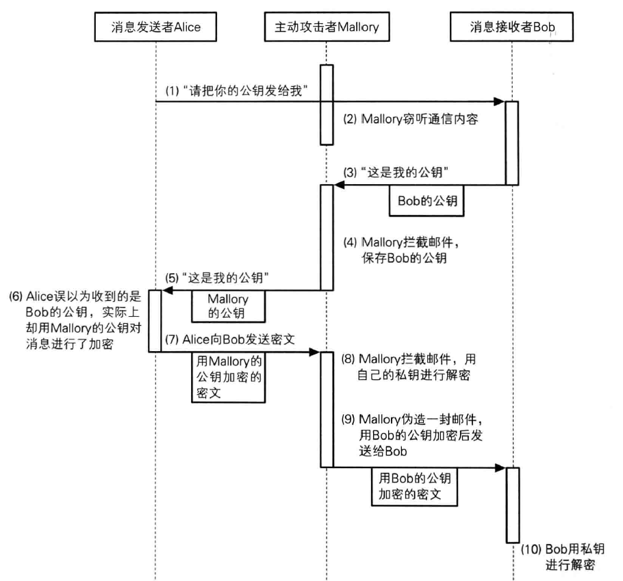


### 混合密码系统

前面介绍了对称密码和公钥密码算法。首先需要知道的时，公钥密码并不是优于对称密码，它们的强度是基于密码长度的，密钥长度强度的对应关系大致如下（摘自《应用密码学》）：

| 对称密码的密钥长度 | 公钥密码的密钥长度 |
| :----------------: | :----------------: |
|      128 bit       |      2304 bit      |
|      112 bit       |      1792 bit      |
|       80 bit       |      768 bit       |
|       64 bit       |      512 bit       |
|       56 bit       |      384 bit       |

对称密码算法可以解决通信的机密性的问题，但是不能解决密钥配送的问题。而公钥密码虽然可以解决密钥配送的问题，但是它的计算速度很慢（加密时间大概是对称密码百倍以上）。那么，将对称密码算法和公钥密码算法结合起来，就能够得到一种既不用配送密钥，加密速度又快的系统。其应用例子有 HTTPS 应用的 SSL/TLS 协议。其混合密码系统大致如下：

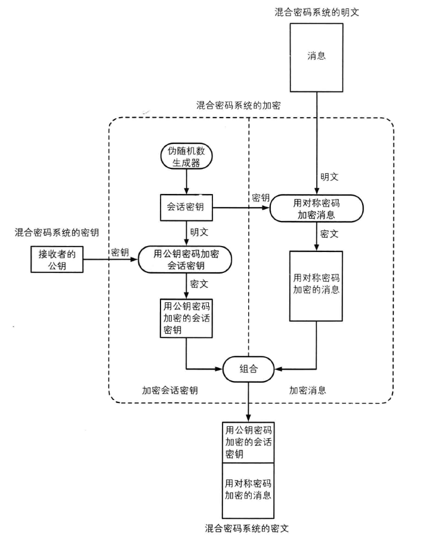

每次通信时会产生一个临时的**会话密钥**，该密钥一般由伪随机数生成器产生。会话密钥是对称密码的密钥，同时也是公钥密码的明文。如果伪随机数生成器的实现算法很差，就有可能被攻击者推测出会话密钥。同时，因为组合使用了对称密码和公钥密码算法，因此，需要保证两个算法的强度保持一致，不要出现短板。

注意，混合密码系统仍然是不能防止中间人攻击的，但它解决了密钥配送以及性能的问题。


## 认证技术手段

前面我们简单介绍了密码算法技术。但是密码算法只能保证消息的**机密性**，难以抵御诸如密文重放、比特位翻转、中间人攻击等手段。而认证技术主要是为了解决诸如此类的问题，保证消息的**完整性**（也叫一致性）以及通信双方进行身份权限**认证**等功能。具体的技术手段有：

- 单向散列函数，即哈希散列；主要用于防止消息被篡改；
- 消息认证码，是一种确认消息完整性并进行认证的技术，主要用于防止消息被篡改和伪装；
- 数字签名，类似于实际生活中的签名，主要用于确认发送者的身份，防止发送者否认抵赖；同时也能用于防篡改和伪装；
- 公钥证书体系，主要用于确认公钥的正确性，防止中间人攻击等手段。


### 单向散列函数

单向散列函数指将消息（任意大小，任意类型）输入到散列函数内，然后输出一个固定大小的散列值。单向的意思指这个计算过程的不能逆运算的，也就是说，通过散列值不能够恢复散列前的消息明文。而且，即使计算散列的消息仅存在一个比特的差异，得到的散列值也是不同的。如下所示：

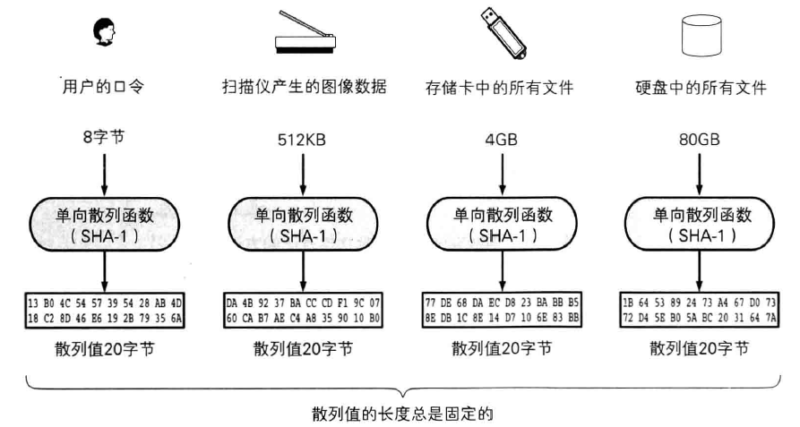

比较著名的散列算法包括：

- SHA系列： SHA-1为第一代算法，生成160比特散列值；SHA-2 包括 SHA-256、SHA-384、SHA-512等，其后面接的数字表示生成的散列长度；SHA-3为最新一代标准（也称AHS，Advance Hash Standard），选用keccak 作为 SHA-3 的标准算法；
- MD（Message Digest）算法：如 MD4、MD5等；
- RIPEMD-160


单向散列的实际应用场景有：

- 检测软件是否被篡改；很多软件可能会同时发布到多个平台上（减轻服务器下载压力），同时在官网上公布散列值。这样，用户可以根据散列值+算法计算比较，就能够知道软件有没有被篡改；
- 基于口令的加密（Password Based Encrpytion， PBE），将口令和盐（salt）混合计算散列值，将这个散列值用作加密的密钥，可预防针对口令的字典攻击；
- 消息认证码，可使用单向散列函数构造消息认证码；
- 数字签名，数字签名使用了单向散列；
- 伪随机数生成器，可通过单向散列构造伪随机数；
- 一次性口令（也称动态密码）也可通过单向散列进行构造；


对单向散列的攻击手段：

- 利用文档表达的冗余性进行弱抗碰撞性的攻击。比如`“支付 1 亿元”`这个描述可以有很多种说法，但是表达的含义理解是相同的。因此可以通过每次稍微变换文字的表达方式，利用文档的冗余性生成具有一样散列值的内容不同的另一份文件，就是一种攻击手段，相当于密码的暴力破解；
- 利用散列的强碰撞性进行攻击，也称生日悖论攻击。比如攻击者事先准备 `支付100万`和`支付1亿`的合同，这两份合同具有相同的散列值。被攻击者看的是`支付100万`的合同，然后在签署时被掉包为`支付1亿`的合同。如果此时仅通过散列值进行判断，不能发现合同被修改了。

> 生日者悖论攻击
>
> 利用高中时期的概率论知识，比如在一个N人的班级内找出两个同一天生日的同学的概率时非常高的。当N为23时，就有二分之一的概率。其近似的计算公式为（不需要特别正确），Y 为取值范围，生日即取值365天：
> $$
> N = \sqrt{Y}
> $$
> 当满足上面公式时，就有二分之一的概率匹配成功。对于如 SHA-1 的散列算法，其散列长度为160比特，因此可计算 N 的值为：
> $$
> N = \sqrt{Y} = \sqrt{2^{160}} = 2^{80}
> $$
> 也就是说，只要我们生成 N 个`支付100万`和`支付1亿`的合同，然后进行比较，就有很大的概率找到两个相同散列值而内容不同的合同。


单向散列只能保证消息不被篡改，但是无法识别发送者的身份，即不能识别伪装消息。


以 SHA-1 算法为例，简单描述下单向散列如何构造消息散列值。

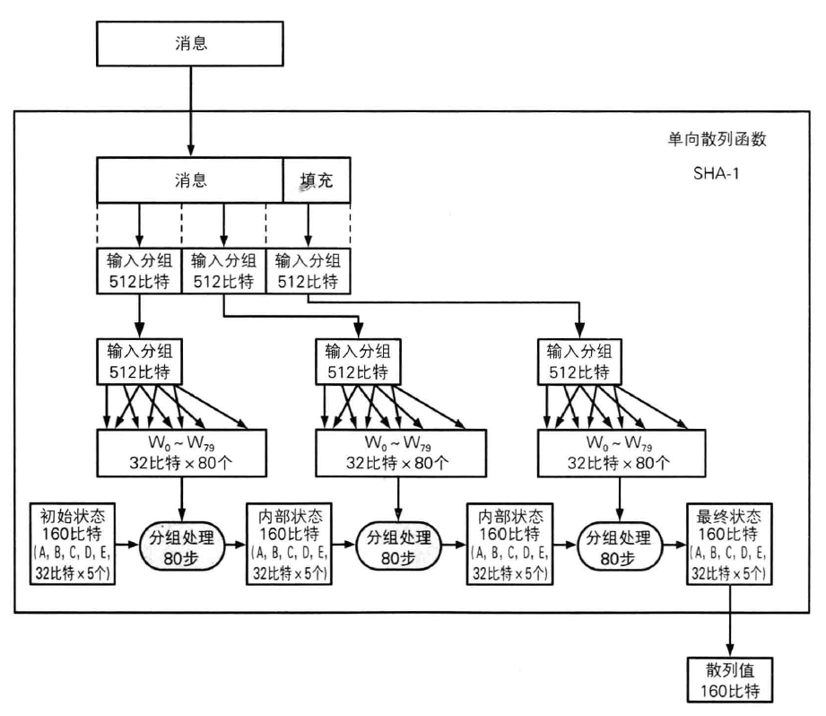

```txt
step1： 进行数据填充，使消息变为512比特的整数倍
step2： 以512比特作为一个分组，通过分组生成80个32比特的值
step3： 依次对每个分组的 80 个步骤处理，最终计算出5个32比特的值作为分组的内部状态值
step4： 最终状态值作为输出的散列值。
```


### 消息认证码

**消息认证码**（Message Authentication code）是一种与密钥相关联的单向散列函数，简称为 MAC。它在进行散列计算时加入了双方协定的密钥。使用消息认证码可以确认自己收到的消息是否真的是发送者的本意，还是有人伪装成发送者发送了该消息。

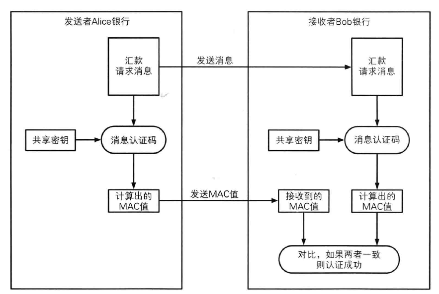

消息认证码的应用过程如上所示。将消息认证码的共享密钥加上消息计算出 MAC 值，连同消息一并发给接收者。接收者使用共享密钥，将接收到的消息一起计算出 MAC 值，与发送者的 MAC 值进行对比，如果完全相同，表明认证成功。同时，计算 MAC 值时通信消息是参与计算的，因此消息也是防篡改的。

消息认证码的密钥配送问题也是存在的。与对称密钥一样，需要使用诸如公钥密码、Diffie-Hellman、KDC密钥中心分配等方式进行配送交换。


消息认证码的应用例子有：

- SWIFT -- 环球银行金融电信协会，用于国际银行间的交易。公钥密码出现之前，共享密钥都是通过人来配送；
- IPsec是互联网基本通信协议（IP协议）增加安全性的一种方式。在 IPsec 中，对通信内容的认证和完整性校验都是通过消息认证码实现的；
- SSL/TLS协议，也是使用了消息认证码。


消息认证码的攻击手段有：

- 重放攻击，攻击者 Mallory 将 HMAC 的值和密文保存下来，然后不断重复利用。比如通信消息为`转账100万`,不断进行重放请求，如100次，则账户就变成 1 亿元了；
- 密钥推测攻击，与单向散列函数一样，可以通过暴力破解以及生日攻击，同时应保证不能根据 HMAC 的值推测出通信双方使用的密钥


消息认证码无法解决的问题：

- 防止否认及第三方的证明，如 Alice 和 Bob 通信，Bob 收到 Alice 的消息（比如勒索），但是 Bob 不能向第三方 Victor 证明这消息是出自 Alice 的，因为这也可能是 Bob 自导自演伪造的消息；而 Alice 也可以否认自己向 Bob 发送过这条消息，认为是 Bob 将共享密钥泄露出去导致的。总之，消息认证码无法防止否认。


消息认证码可以通过单向散列函数如 SHA-1、MD5 等算法实现。HMAC 是一种使用单向散列函数来构造消息认证码的方法。使用 SHA-1、MD5、RIPEMD-160 所构造的 HMAC， 分别称为 HMAC-SHA-1、HMAC-MD5、HMAC-RIPEMD。

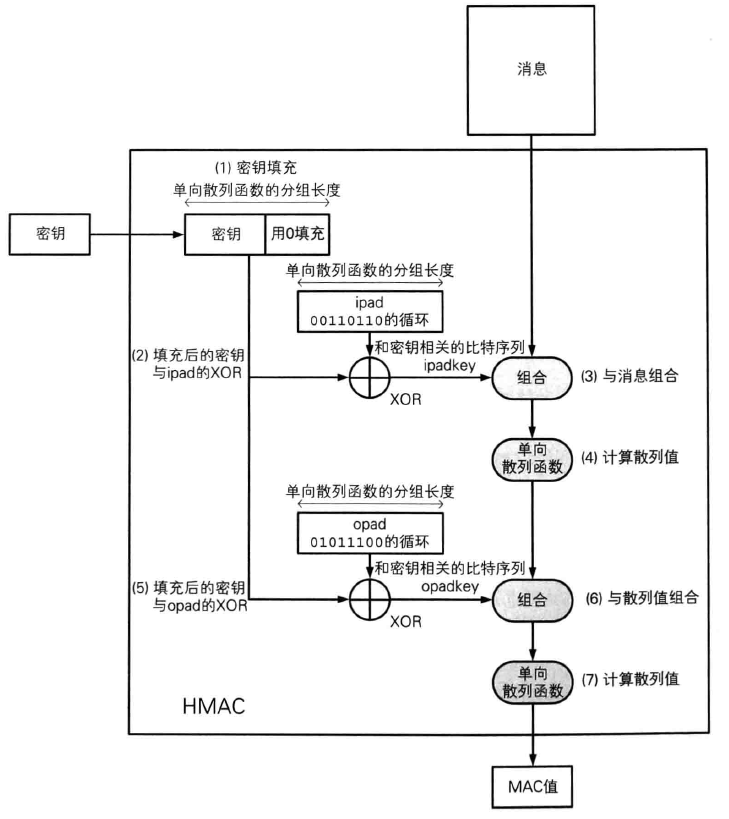

如上，是 HMAC 计算消息认证码的大致操作。其流程如下：

```txt
step1： 对共享密钥进行填充，末尾填0，具体长度以消息散列函数的分组长度为准；
step2： 将填充后的密钥与ipad进行异或。ipad是一串"00110110"不断循坏达到分组长度的比特流，得到的比特序列称         为ipadkey；
step3： 将ipadkey附在消息头部，然后计算散列值，为 h1；
step4： 填充后的密钥与opad进行异或计算，与ipad一眼，opad是一串"01011100"的循坏比特流。计算得到的比特序列         结果称为opadkey。
step5： 将上一步计算的散列值拼在opadkey后面，即 opadkey+h1，然后计算散列值，为最后的 MAC 值。
```


### 数字签名

**数字签名**（又称公钥数字签名）是只有信息的发送者才能产生的别人无法伪造的一段数字串，这段数字串同时也是对信息的发送者发送信息真实性的一个有效证明。它是一种类似写在纸上的普通的物理签名，但是使用了公钥密码技术来实现的。

前面介绍公钥密码的时候，我们说过，密钥对的私钥只有产生密钥的持有人专有的。换句话说，通过私钥加密的信息之能够被对应的公钥解密。而私钥是专属密钥，因此就能确定消息的发送者就是私钥的持有人。这是将公钥密码反着用的示例。基于公钥密码的特殊性，签名密钥只能由签名的人持有，而验证密钥则是任何需要验证签名的人都可以持有。如下是公钥密码和数字签名的区别：

|          | 私钥                 | 公钥                 |
| -------- | -------------------- | -------------------- |
| 公钥密码 | 接收者解密使用       | 发送者加密使用       |
| 数字签名 | 签名者生成签名时使用 | 验证者验证签名时使用 |
| 持有人   | 个人持有             | 需要的任意人员       |


数字签名的生成方式，常用的有：

- 对消息本身进行签名：即用私钥对消息进行加密，接收者通过解密签名与接收到的消息进行对比，一致则表明消息没有篡改，且认证成功。是发送者本人；
- 对消息的散列值进行签名：即通过单向散列函数先计算消息的散列值，然后对散列值进行加密。由于公钥密码算法性能很差，对消息本身进行加密会很慢，而对固定长度的散列值加密可以提高性能；如下所示（对消息本身加密类似）：

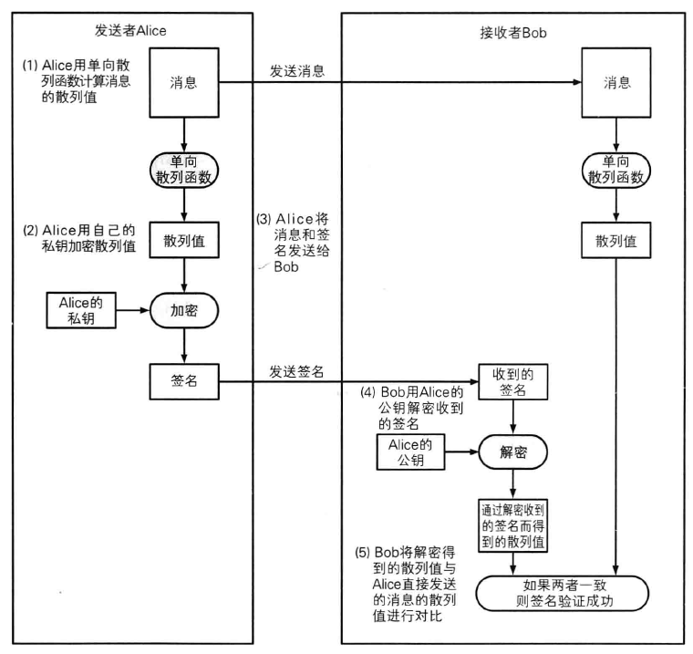


与现实生活中的签名不同的是，数字签名是将特定的消息与签名者绑定在一起，是签名者表明消息的所有权的一种手段。数字签名不保证消息的机密性，如果需要机密性，则需要将消息通过加密手段加密后传输。因此，针对数字签名的复制操作并不会带来任何影响。无论将签名复制多少份，“是谁对这条消息进行签名”这一事实是不会有任何改变的。

也正因为数字签名是可以随意复制的，所以如果要将某个签名作废，不能仅仅依靠删除操作。比如借据上有数字签名，则需要对方提供的收据数字签名，并妥善保存；或者创建一份签名作废的声明，并附上数字签名的方式。


数字签名的应用场景：

- 安全信息公告，比如一些组织或网站上发布安全漏洞，通过明文加数字签名的方式进行发布。这样，大家可以通过它们的公钥都消息进行验证，以防止不法分子恶意伪装发布不实消息；
- 软件下载，数字签名只能够软件是否被篡改，以及证明软件的开发人员，但不能保证软件本身不会做出恶意的行为；如果软件开发者本身就有恶意的话，数字签名也无法防范这种风险；
- 公钥证书，用于验证公钥的合法性
- SSL/TLS，在认证服务器身份时会使用服务器证书，即加上数字签名的公钥证书；相对的，服务器为了对客户端进行认证也会使用客户端证书。


对数字签名的攻击手段：

- 中间人攻击，攻击者位于发送者和接收者之间，对发送者伪装成接收者，对接收者伪装成发送者；要防止中间人攻击，需要接收者对获取到的公钥进行有效验证，比如打电话（通过生物单词识别表）、公钥证书等方式。

- 对单向散列函数的攻击

- 利用数字签名攻击公钥密码：如果数字签名和公钥密码通信使用同一对密钥，那么可能攻击者会将密文附带发送给私钥持有人，要求他对这段随机数据（密文）进行数字签名实验；大意的人可能就会在无意中将密文解开了。防范措施是不要对来路不明的消息进行签名，同时，数字签名和公钥通信使用不同的密钥对。

  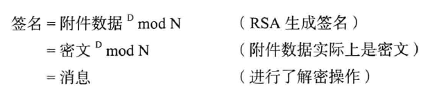

  

### 公钥证书及PKI体系

在前面的介绍，公钥密码算法是密钥配送和数字签名的实现基础。但是，公钥密码不能解决中间人攻击问题。这个问题，单纯地从密码学的角度可能无法解决。这需要多方面协作下，在全社会上构建一个健全的社会信用体系。这就是我们常说常用的公钥证书、公钥传输的PKI（公钥基础设施）和认证机构。


#### 公钥证书

**公钥证书**（public-key certificate）和身份证或者户口本十分类似，里面记录了姓名、组织、邮箱等个人信息，以及属于此人的公钥，并由权威**认证机构**（Certification Authority， CA）施加数字签名。只要看到公钥证书，就能够知道证书的所有者。认证机构中有国际性组织和政府所设立的组织，也有通过认证服务来盈利的企业；此外，个人也可以成立认证机构。公钥证书的生成及使用如下流程：

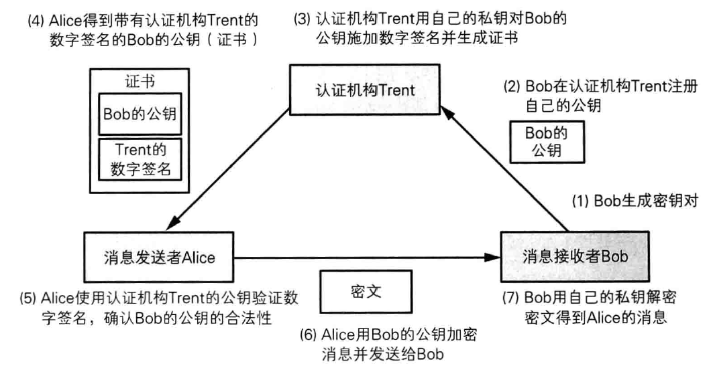

认证机构需要对签名的公钥进行认证，以保证 Bob 提供的公钥确实是 Bob 本人持有，著名的权威认证机构 VeriSign 公司的认证业务准则中将身份验证确认为3个等级（等级越高，身份验证越严格）：

- class 1 ：通过邮件方式确认身份
- class 2 ：通过第三方数据库确认身份
- class 3 ：通过当面认证和身份认证来确认本人身份


一张证书的生成可能需要填写如下信息，然后认证机构基于这些信息，使用自己的私钥对这些信息进行数字签名，然后就产生一张证书：

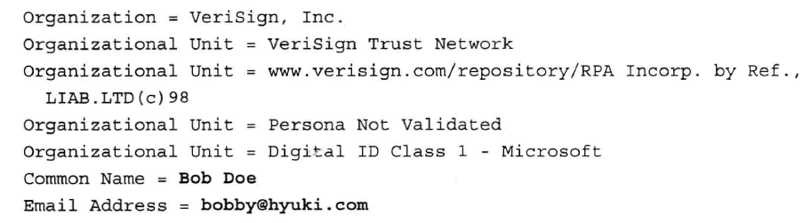

公钥证书是由认证机构颁发的，如果不同的机构产生的证书格式千奇百怪，就难以进行证书验证，也不利于流通。因此，人们制定了证书的标准规范。其中最广泛使用的是由 ITU（国际电信联盟） 和 ISO（国际标准化组织）制定的 `X.509` 规范，很多应用程序均支持该规范。

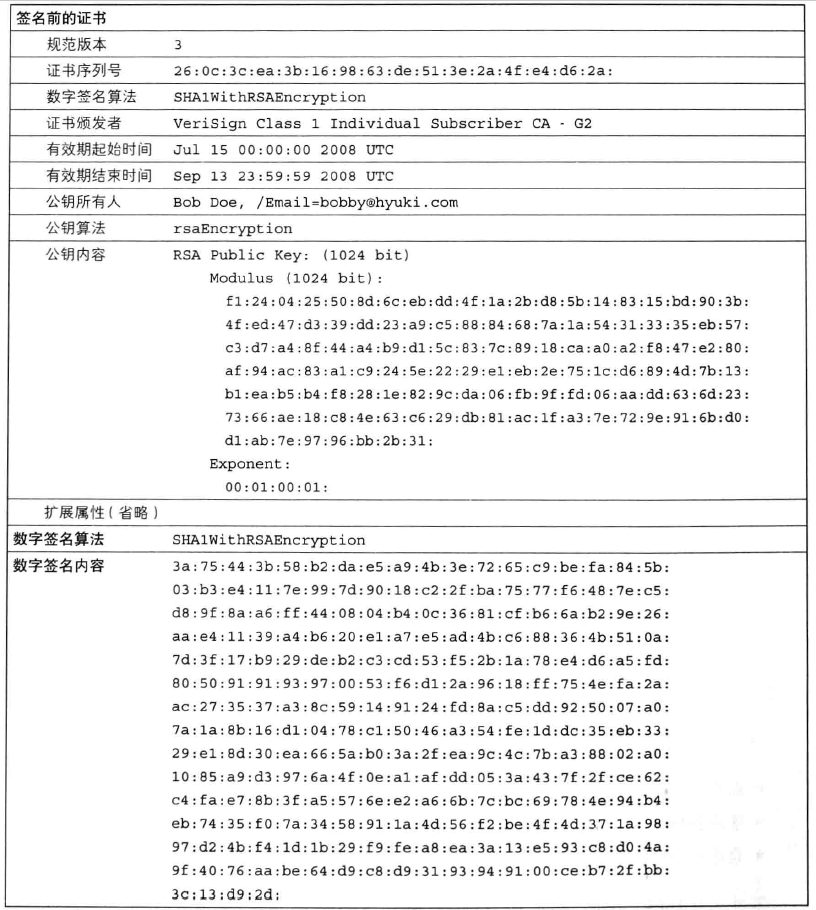

上图为 X.509 证书的规范概要。


#### 公钥基础措施PKI

仅仅只有证书的规范不足以支撑整个信用体系。我们还需要很多其他的规范，例如证书如何颁发、私钥泄露时如何作废证书、计算机之间的通信应采用何种格式等。**公钥基础设施**（Public-Key Infrastructure， PKI）就是为了更有效地使用公钥而制定的一系列规则和规范的总称。PKI 只是一种总称，并不是指某种规范。例如，RSA 公司制定的 PKCS （public-key Cryptograph Standard）系列规范就是 PKI 的一种，而互联网规格 RFC 也有很多 PKI 相关的文档。此外，X.509 也是 PKI 的一种规范。

PKI 的组成要素主要由一下三个：

- 用户  -- 使用 PKI 的实体；主要操作有公钥注册、申请证书、作废公钥证书、通信加密、数字签名等；
- 认证机构 -- 颁发证书的实体；主要操作有生成密钥对、公钥注册时对用户身份进行验证、颁发证书、作废证书等；
- 仓库 -- 保存证书的数据库；PKI用户在需要时从仓库中获取证书，仓库也叫证书目录。

三要素之间的关系如下所示：

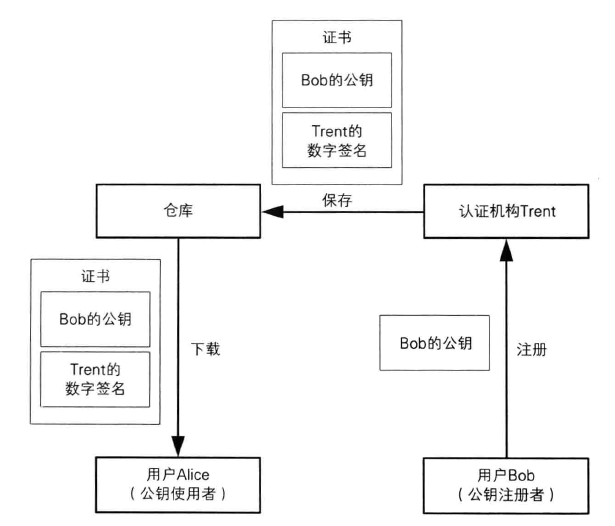


因为颁发证书的除了组织机构外，我们个人其实也是可以生成证书的。下面我们简单了解下认证机构的工作。

1. **生成密钥对**：一是用户自行生成，而是由认证机构生成；在认证机构生成的情况下，需要将私钥发送给认证用户（遵循 `PKCS#12`等规范）；
2. **注册证书**：在用户自行生成密钥对的情况下，用户需要请求认证机构进行证书生成。申请证书的格式规范遵循 `PKCS#10`的定义；认证机构对用户身份进行认证，使用自己的私钥对用户信息进行数字签名。生成的证书格式遵循`PKCS#6`和`X.509`等规范；
3. **作废证书和CRL**：当用户私钥丢失、被盗，或者证书所有者信息发生变化等情况，认证机构需要对原证书进行作废（revoke）处理。因为证书是可以任意复制的，因此单纯地删除是行不通的。要作废证书，认证机构需要制作一张**证书作废清单**（Certificate Revoke List， CRL）。PKI 用户需要实时更新 CRL ，以便验证公钥证书是否已作废。

认证机构中有国际性组织和政府所设立的组织，也有通过认证服务来盈利的企业；此外，个人也可以成立认证机构。而这些认证机构，是有严格的等级关系的。正如国家的区域制度由”国--省--市--县“的层级组织形式，认证机构也具有类似的层级制度。低层级的认证机构的来自上层级认证机构的认证。层层追溯，如果不存在更高一层的认证机构的话，那认证机构就称为**根认证机构**（Root CA）。因为没有上层机构对根CA进行认证并颁发证书，所以一般这些根机构都是通过**自签名**（self-signature）的方式为自己颁发证书。

正因为认证机构是有层级关系的，所以当用户拿到一个公钥证书时，为了验证该公钥证书的合法性，用户首先需要验证颁发该证书的认证机构的合法性（或者说权威性）。依次类推，直至根认证机构。

那么，用户如何知道根认证机构的权威性呢？首先，在我们使用的操作系统中，已经存在了许多合法的认证机构的公钥证书。这些证书在安装操作系统时会随系统安装而安装，这些证书的合法性由操作系统的提供商来保证。基本所有权威的根认证机构证书都已经安装在系统内。其次，对于个人生成的证书，只要用户能够保证其合法性，也可以手动注册到操作系统当中。而验证公钥证书的合法性的整个链路过程，都是可以通过浏览器等软件程序自动完成的。


对公钥证书的攻击：

- 在公钥注册之前进行攻击，比如用户自己生成密钥对后，在认证机构认证注册前将密钥对中的公钥进行替换。防御方法是用户在发送个人信息和待签名公钥时，使用认证机构的公钥对信息进行加密传送；或者认证机构将用户公钥的散列值发给用户进行确认；
- 注册相似人名进行攻击；基于证书中包含所有者的个人信息，如果两个证书的个人信息类似，虽然计算机可以识别，但是人类却很容易认错。比如姓名为`BOB`和`Bob`的两个人，当发送者 Alice 看到证书上的用户信息时，很可能就误认为 `BOB` 就是自己将要发送信息的对象 Bob。针对这种攻击，需要认证机构对注册用户的身份进行有效识别，当本人身份认证失败时，不允许颁布证书；
- 窃取认证机构的私钥进行攻击；窃取认证机构的私钥，需要入侵认证机构的服务器，或者收买认证机构的相关人员。认证机构是否妥善保护自己的私钥，与该认证机构颁发的证书的可信度密切相关。认证机构一般会花费大量的精力来保证自己的可信度。同时，认证机构会记录自己签发的所有证书序号，以保证在自己私钥泄露时，能够判断非法证书（盗用私钥进行签名的证书），并通过 CRL 通知用户。
- 攻击者伪装成认证机构进行攻击；自己伪装认证机构，对自己的公钥进行认证。所有接收到的公钥证书的人进行验证时也肯定会通过。因此，验证时必须多留一个心眼，要清楚知道认证机构是否可信；
- 利用 CRL 的发布的时间差进行攻击；这是利用公钥失效到证书作废需要一段时间的原理进行攻击，此时， Bob 的私钥被盗，那么攻击者就可以趁着 CRL 还没有更新时（或者 Bob 没有发现私钥被盗）这段时间内假冒 Bob 的身份为所欲为；
- 利用 CRL 发布的时间差实现消息否认；比如 Bob 想骗 Alice 钱，因此可以发一封邮件让 Alice 进行转账；在此同时，Bob 向认证机构发送作废公钥证书的请求；此时，Alice 按照 Bob 的要求完成转账，但是 Bob 否认向Alice 发送过转账消息，并宣称私钥已经被窃取了。这种情况也是利用 CRL 更新时间差的方式进行的。这种情况下，目前密码学范畴不能解决，只能够通过刑事侦查进行调查。


## 其他密码技术

### Diffie Hellman密钥交换算法

前面已经介绍过 RSA 算法，该算法可作为对称密码的密钥配送的一个解决方案。**Diffie Hellman算法**则是另一种密钥交换的解决方法。使用这种算法，通信双方仅仅通过交换一些公开的信息，就能够生成共享的密钥，而且，不会被攻击者知道。下面，是Diffie-Hellman交换算法的流程：

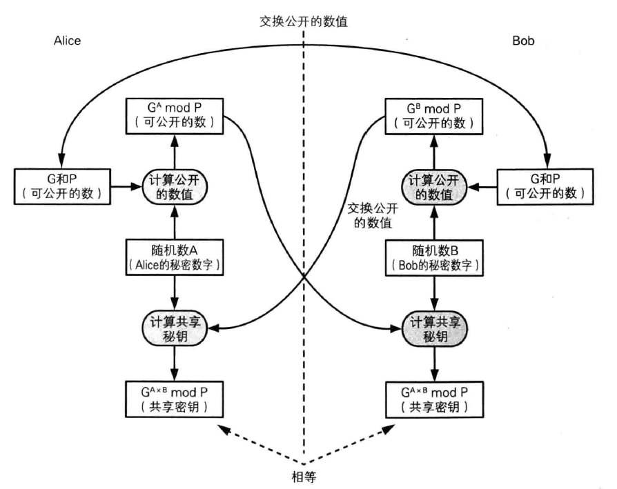

```txt
step1: 公开两个数 G 和 P。 P 是一个很大的质数，而 G 则是 P 的一个生成元；
step2：通信双方在 [1, P-2] 的范围内随机选择一个值，如 A，B。 然后使用公式计算：
       S = G^A mod P， S为发送者计算的值
       R = G^B mod P， R为接收者计算的值
step3: 通信双方交换 S，R 的值，同时根据之前公开的 G 和 P，计算共享密钥。公式如下：
       KEY = (G^A mod P)^B mod P   -----   Alice 的公式
           = (G^B mod P)^A mod P   -----   Bob 的公式
           = (G^A)^B mod P         -----   基于mod的运算公式
           = G^(A*B) mod P
step4： 计算得到的值就是通信双方这次协商的密钥。
```

因此窃取者只知道`G、P、S、R`的值，如果要通过这些值计算 A 或者 B 的值，是非常困难的。根据 `G^A mod P`的值计算 A 的有效算法还没有出现，这个问题称为有限群的离散对数问题。也就是说，理论上目前只能通过暴力破解计算的方式，求出 A 或者 B 的值。有限群的离散对数问题的复杂度是支撑 Diffie-Hellman 算法的基础。

在Diffie-Hellman的交换算法中，数值 P 是质数（前面RSA算法介绍过费马测试可以判定质数）通过算法可以容易得到，G 是 P 的**生成元**（generator）。那什么是生成元呢？如下我们看下当`P=13`时的计算结果：

12 = 2 3

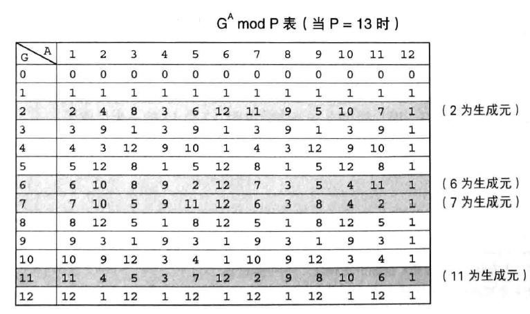

当 `G={2, 6, 7, 11}`时，发现 `G^A mod P`的一行中的任意数值均不同，且一一对应了`[1, P-1]`的所有整数。我们称出现这样的对应关系的所有满足条件的 G 为 P 的生成元。一般地，G 也是一个质数。

> **生成元的数学理论 -- 初等数论**
>
> Diffie-Hellman的数学基础涉及到有限域（也称伽罗瓦域，galois field）。有限域指域中只包含有限个元素，比如 `GF(5) = {0, 1, 2, 3, 4}`，或者计算机的布尔值`[0，1]`等，都属于有限域范畴。有限域一般定义为`GF(p)`，其中p为质数。有限域的四则运算都与模运算有关。其定义如下：
> $$
> GF(p): 给定一个质数p，整数集合\{0,1,...,p-1\}为元素个数为p的有限域；\\
> GF(p^n): 给定一个质数p，整数集合\{0,1,...,p^{n-1}\}为元素个数为n的有限域；
> $$
> 对于生成元，有一下定义和定理：
>
> > 定义： 若 GF(p) 中存在某个元素 g ，对于有限域中任意一个非零的元素 b 满足：`b = g^k mod p`，k 为任意值，那么这个元素 g 就是有限域 GF(p)的生成元。因此，GF(p) 也可以表示为：
> > $$
> > GF(p) : \{0, g^0, g^1, ...,g^{p-2}\}
> > $$
>
> > 定理1： 除有限域GF(2)之外，任意有限域GF(p)的生成元都不会是1，也就是说至少是2，且任意质数都存在生成元；
> >
> > 定理2：任意完全平方数（1², 2², 3², ···）都不会是任意有限域GF(p)（p>2）的生成元；
> >
> > 定理3：根据算数基本定理，GF(p)的阶可分解为质因数的乘积，GF(p) 的阶为 p-1，GF(p^n)阶为p^(n-1)：
> > $$
> > GF(p)的阶 = p_1 * p_i * ... *p_s, 1 \le i \le s
> > $$
> > 那么，有任意的 a^pi = 1 都不会是GF(p)的生成元。
> >
> > 定理4：循环群定义为 GF(p^n) 的形式，即元素为生成元的乘方组成的有限域。对于循环群,有φ(n)个生成元，为a^k且k与n互质，即(k, n)=1。其中φ(n)表示Euler函数。
>
> 
>
> 对于密码应用来说，有限域一般是一个循环群，而组成循环群的质数p可作为这个有限群的生成元。对于一般的有限群，下面给出一种有效的判断生成元的方式（基于概率，《应用密码学》第四章）：
>
> ```txt
> 一个阶为n的GF(p)，阶n的质因数分解为 n = p1< * p2 * pS。
> 
> step1: 随机选择有限域中的一个整数 a；
> step2：对 1<=k<=s的上述阶n的所有质因数pk，计算 b = a^(pk) mod p
> step3：如果有任意的 b=1，则重新执行step1，否则输出的 b 即为一个生成元。
> ```


### 基于口令的密码

**基于口令的密码**（Password Based Encryption，PBE），就是一种根据口令生成密钥并用该密钥进行加密的方法。其加密步骤如下：

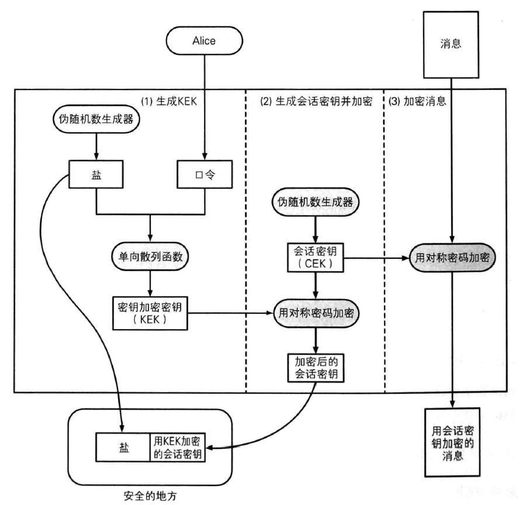

```txt
step1： 生成随机数作为salt（相当于密码的调味作用），计算散列作为KEK；
step2： 生成会话密钥CEK并使用KEK对密钥进行加密后，和salt存放在一起
step3： 使用CEK对消息进行加密
```


盐（salt）的作用是为了预防字典攻击。字典攻击是一种事先进行计算并准备好候选密钥列表的方法。如果在口令加密时，没有使用盐（salt），那么攻击者就可以事先生成大量的KEK，对窃取到的会话密钥进行尝试破解。这是因为一般用户记住的密码都不会太长，组合有限，所以可以事先生成很多的口令字典。在加入盐（salt）后，将口令大大增长，这时候生成候选KEK就会非常困难，因为加盐后导致候选密钥的数量爆炸性增长。因此，只要保存的盐没有被窃取，攻击者就不能事先生成候选KEK，即不能进行字典攻击。


### 随机数算法

在前面的各种算法介绍中，我们常会使用到随机数。随机数在密码应用中充当着关键的角色。比如：

- 生成密钥，用于对称密码和消息认证码
- 生成密钥对，用于公钥密码和数字签名
- 生成初始化向量（IV），用于分组密码的CBC、CFB和OFB模式
- 生成nonce值，用于防御重放攻击和分组密码的CTR模式
- 生成盐（salt），用于基于口令的密码等

应用随机数的目的，主要为了防止攻击者通过心理学以及研究个人爱好习惯等人为因素导致密钥被成功猜测。

随机数基于性质一般分为以下三类：

- 随机性 -- 不存在统计学偏差，完全杂乱无章的数列；
- 不可预测性 -- 不能从过去的数列推测出下一个数列；
- 不可重现性 -- 不能重现相同的数列，即没有方法能够重现特定的数列

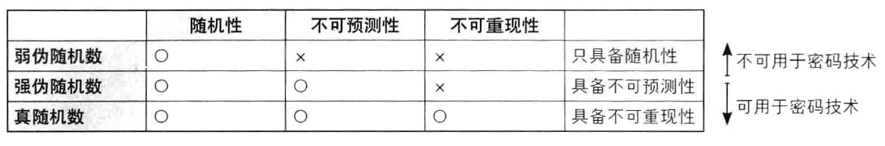

通过软件手段不能完全满足不可重现性的随机数性质，只能生成伪随机数数列。这是因为计算机本身仅具备有限的内部状态，而在内部状态相同的情况下，软件必然只能生成相同的数。

随机数可以通过硬件生成，也可以通过软件生成。通过硬件生成的随机数列，是根据传感器的热量、声音等事实上无法预测和重现的自然现象信息生成而来。像这样的硬件设备就称为**随机数生成器**（Random Number Generator），而通过软件生成的则称为伪随机数生成器（Pseudo Random Number Generator）。

伪随机数生成器具有“内部状态”，并根据外部的输入“seed”（种子）来生成伪随机数，当生成一个随机数后，伪随机数生成器会改变其内部状态，以生成下一个随机数。而种子是用来对伪随机数生成器的内部状态进行初始化所需要的。

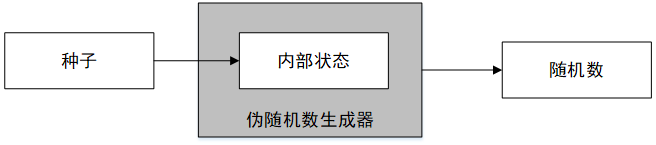

与密码算法一样，伪随机数的实现算法是公开的，因此，只要攻击者知道使用的初始化种子，就能计算所有生成的伪随机数。因此，种子是不能让外人知道的。

下面介绍一些具体的伪随机数生成器算法。


#### 线性同余法

**线性同余法**（linear congruential method）是一种应用广泛的伪随机数生成算法。

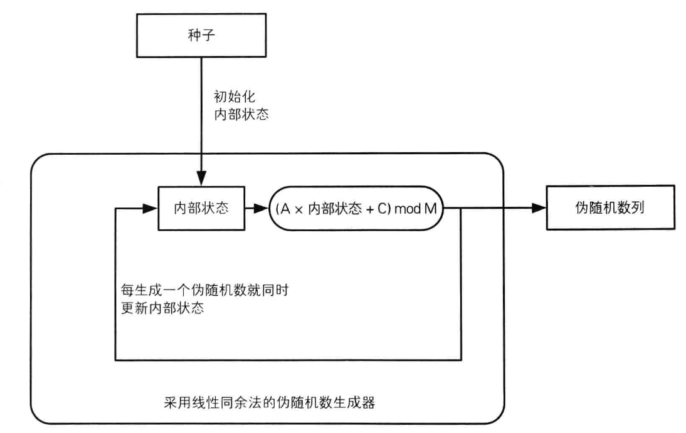

其算法如上所示，公式为：
$$
R_0 = seed\\
R_n = (A * R_{n-1} + C) \mod M
$$
这种算法产生的伪随机数是不具备不可预测性的（根据上一个产生的随机数可计算下一个值），因此不能应用于密码算法，只能用于一般的随机数生成应用。


#### 单向散列函数法

利用单向散列函数可以生成出具有不可预测性的伪随机数数列。散列函数的单向性是支撑伪随机数生成器不可预测的基础，其处理过程如下：

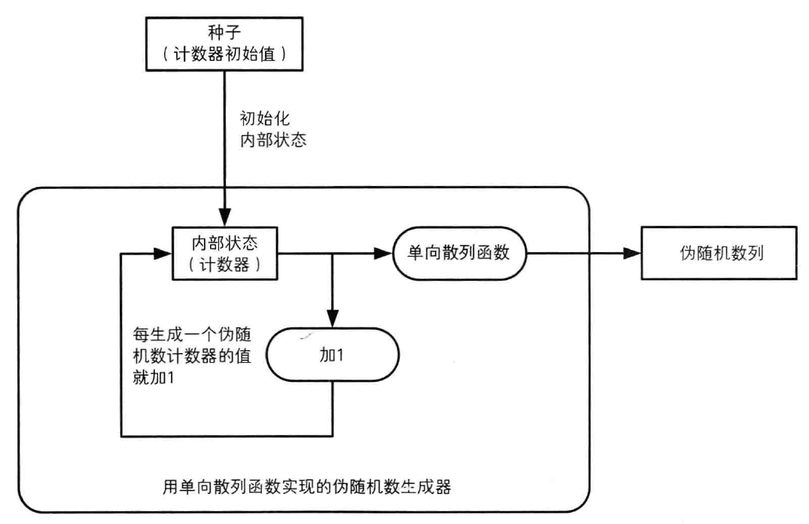


#### 密码法

**密码法**是通过密钥加密的密文作为伪随机数列。密码的机密性是支撑伪随机数生成器不可预测的基础。其执行过程如下。

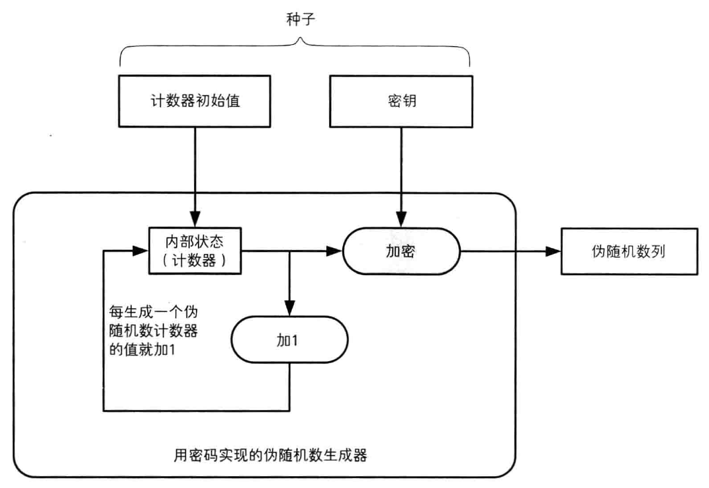


### 隐写术与数字水印

密码技术是一种能够让消息内容变得无法解读的技术，而**隐写术**（steganography）是一门关于信息隐藏的技巧与科学，信息隐藏指的是不让除预期的接收者之外的任何人知晓信息的传递事件或者信息的内容。比如我们经常说的藏头诗，就是隐写术的一种。

在电子计算机时代，常用的隐写术有：

- 图片隐写术，利用图像RGB颜色的最低有效位来储存颜色之外的信息；比如以8比特表示RGB三原色的一种，那么颜色就有256种深浅。使用最低位来存储别的数据，对于人眼来说，临近的两种数值颜色基本无法区别。又或者，基于图片的存储格式的数据结构，在图片后面拼接其他数据内容，如.jpg格式的文件通过修改后缀，变成一个压缩包。
- 数字水印，通过隐写术方式，将著作权所有者及购买者的信息嵌入到文件中的技术。


## 攻击手段


### 暴力破解

暴力破解是指，攻击者采用尝试所有可能的密钥对所获得的密文进行解密，以获取明文；或者用一个确定的密钥对所有可能的明文进行加密，以获得密文。理论上，对于任何实用密码只要有足够的资源，都可以通过暴力破解方式将其攻破。

这种方法的攻击无法防御，但可以通过增加密钥的长度，以提高密钥空间。这样，攻击者就需要花费更多的时间进行破解尝试。只有在安全的时间范围内（机密消息的有效期内），攻击者无法破译密码，那么，就能够称之为高强度的密码算法。


### 数学分析攻击

数学分析攻击是指密码分析者针对加解密算法的数学基础和某些密码学特性,通过数学求解的方法来破译密码。数学分析攻击是对基于数学难题的各种密码的主要威胁。

常见的攻击对象有：

- 简单替换密码的字母频率统计分析进行破译的攻击；
- MD5散列算法的碰撞攻击；（已被山东大学王小云攻破）
- RSA算法进行大质数的质因数分解数学难题的攻克（暂未破解）；
- Diffie-Hellman的有限群的离散对数的问题的攻克（暂未破解）；


### 重放攻击

重放攻击指攻击者收集通信双方的密文，然后在一段时间内重复向接收方发送对应密文请求的手段。常用于金融交易场景等，使相关的金融交易重复执行多次。

相对应的防御措施有：

- **使用序号**：每次发送消息时使用一个约定的递增序号。方式虽然有效，但是对每个通信对象都需要记录最后的序号；
- **时间戳**：在发送时包含一个当前时间戳，实现需要通信双方的时钟必须同步；当然，由于网络通信有延迟，需要时间缓冲，还是有重放攻击的空间；
- **nonce**：接收者先向发送者发送一个一次性的随机数，称为nonce。每次通信 nonce 值会发生变化，会增加通信的数据量。


### 密文攻击

在已知密码算法的基础上或者知道密文大致格式的基础上，攻击者对密文进行拦截、比特位反转、乱序、重放等攻击手段，以达到操纵明文的目的。

- 乱序，如分组密码的 ECB 模式
- 比特位反转，如分组密码的初始化向量的反转；


### 中间人攻击

中间人攻击主要针对任意的公钥密码。虽然公钥没有被破译，但是机密性遭到了破坏。


### 社会工程学攻击

**社会学攻击**指通过人与人之间的社会交往进行套路，利用人的心理特征，骗取用户的信任，获取机密信息、系统设置等不公开的资料，为黑客攻击和病毒感染创造有利条件。常用的攻击套路有：

- 电话或邮件欺诈，即假装是某领域专家，以降低用户的防范心理，套取有价值的内容；
- 伪装合法用户，也就是传说中的“肉鸡”。通过控制没有安全意识的肉鸡计算机，来达到访问内部系统的权限；
- 偷窥方法，当用户输入密码等重要信息时进行偷看；
- 翻垃圾箱，寻找在垃圾箱中记录密码的纸、电脑打印的文件、快递信息等，往往可以找到有用的信息
- 钓鱼网站，钓鱼涉及虚假邮件、聊天记录或网站设计，模拟与捕捉真正目标系统的敏感数据。比如伪造一条上来自银行或其他金融机构的需要“验证”您登陆信息的消息，来冒充一条合法的登陆页面来获取用户和密码；
- 引诱方式，攻击者使用能勾起你欲望的东西引诱你去点击，可能是一场音乐会或一部电影的下载链接


## 密码总结应用

我们介绍了很多密码技术和算法，总结一下应用场景如下：

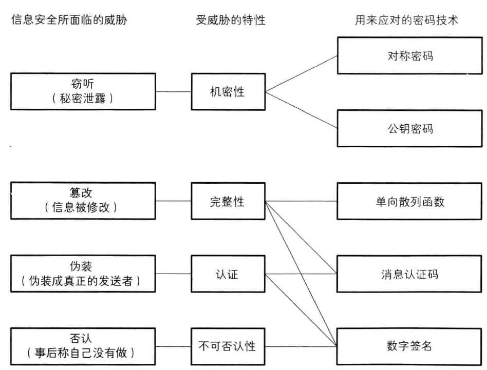


在实际应用中，我们常常使用多种密码算法技术的组合，以解决通信时消息的机密性、完整性以及认证等问题。


### SSL/TLS

SSL/TLS是世界上最广泛使用的的密码通信协议，比如我们浏览网站输入 HTTPS 的网址，其中就使用了SSL/TLS的安全协议。严格地说，**SSL**（Secure Socket Layer）和 **TLS** (Transport Layer Security)是不同的，TLS 相当于是 SSL 的后续版本，但我们习惯上还是连在一起称呼。通过名称就知道，SSL/TLS是位于OSI七层网络模型中的传输层的安全协议。

SSL/TLS不仅仅用在 HTTPS 网站上，还能应用在很多地方，如邮件服务器等。如下所示：

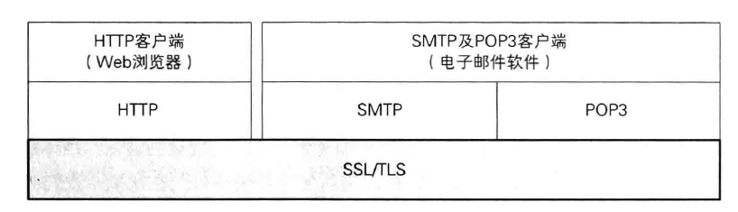

SSL/TLS 提供了密码通信的框架，我们可以根据实际场景选用公钥密码、对称密码、数字签名、单向散列函数等技术的具体实现算法。也就是说，如果发现某种密码算法有弱点，则可以随时用更先进的算法进行替换。

SSL/TLS 1.0 的协议的层次结构如下：

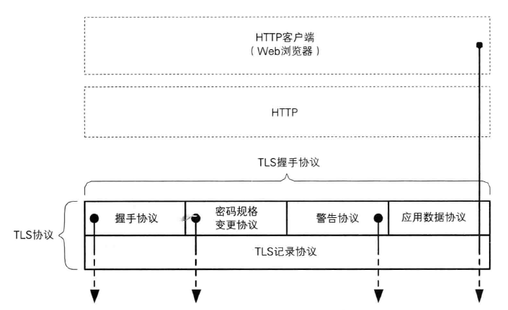

协议一般分为两部分：

- TLS 记录协议，位于握手协议的下层，是负责使用对称密码对消息进行加密通信的部分；
- TLS 握手协议，主要用于通信双方协商使用的具体密码算法、密码变更、错误（解密出错）告警等。


